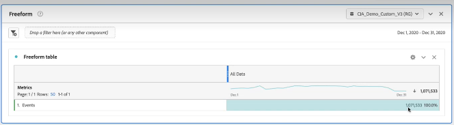

# Ver y administrar el uso de Customer Journey Analytics

Para ver el uso de CJA, puede utilizar varios métodos:

* Agregue las filas de datos de evento para cada conexión. Consulte [Cálculo del tamaño de la conexión](#tamaño calculado) a continuación. Esta es una forma sencilla de ver los datos de fila de evento, por conexión, para una marca de tiempo específica.
* Vea su uso de tres maneras, cada una de las cuales se describe con más detalle a continuación:
   * Utilizar Analysis Workspace para informar sobre los eventos del mes pasado.
   * Utilizar Report Builder para informar sobre los eventos del mes pasado.
   * Utilizar la API de CJA para crear un informe automatizado.

Para administrar el uso de CJA:

* Defina una ventana de datos móviles.

## Cálculo del tamaño de la conexión {#estimate-size}

Es posible que necesite saber cuántas filas de datos de evento tiene actualmente en [!UICONTROL Customer Journey Analytics]. Para obtener una cuenta precisa del uso de los registros de datos de evento (filas de datos) de su organización, haga lo siguiente **para cada una de las conexiones creadas por su organización**.

>[!NOTE]
>
>Hágalo el primer viernes de cada mes, ya que Adobe ejecuta su último informe de uso ese día.

1. En [!UICONTROL Customer Journey Analytics], haga clic en la pestaña **[!UICONTROL Conexiones]**.

   Ahora puede ver una lista de todas sus conexiones actuales.

1. Haga clic en cada nombre de conexión para llegar al Administrador de conexiones.

1. Agregue los **[!UICONTROL Registros de datos de evento disponibles]** para cada conexión que haya creado su organización. (Según el tamaño de la conexión, el número puede tardar un tiempo en aparecer).

   

   >[!CAUTION]
   >
   >   Este recuento se aplica solo a los datos de evento, no a los datos de perfil o búsqueda. Si tiene datos de perfil y búsqueda, el recuento será ligeramente mayor. Sin embargo, actualmente no hay forma de informar sobre el uso de los datos de perfil y búsqueda en la interfaz de usuario. Esta funcionalidad está prevista para 2023.

1. Una vez que tenga una suma de todas las filas de datos de evento, busque la asignación “Filas de datos” en el contrato de Customer Journey Analytics que su empresa firmó con Adobe.

   Esto le proporciona el número máximo de filas de datos autorizadas en el pedido de ventas. Si el número de filas de datos resultantes del paso 3 es mayor que este número, se producirá un exceso.

1. Para solucionar esta situación, tiene varias opciones:

   * Cambie la [configuración de retención de datos](https://experienceleague.adobe.com/docs/analytics-platform/using/cja-connections/manage-connections.html?lang=es#set-rolling-window-for-connection-data-retention).
   * [Elimine conexiones no utilizadas](https://experienceleague.adobe.com/docs/analytics-platform/using/cja-overview/cja-faq.html?lang=es#implications-of-deleting-data-components).
   * [Elimine un conjunto de datos en AEP](https://experienceleague.adobe.com/docs/analytics-platform/using/cja-overview/cja-faq.html?lang=es#implications-of-deleting-data-components).
   * Póngase en contacto con el administrador de cuentas de Adobe para obtener una licencia de capacidad adicional.

## Creación de un proyecto de Workspace con todos los datos de evento {#workspace-event-data}

Este método le permite realizar un análisis más profundo de los datos de uso, así como del historial de su uso.

1. Antes de crear el proyecto en Workspace, [cree una vista de datos](/help/data-views/create-dataview.md) para cada una de las conexiones, sin ningún filtro aplicado.

>[!WARNING]
>
>    No cree una nueva conexión que abarque todos los datos solo para medir el uso, ya que el resultado sería que duplicaría el uso.

1. En Workspace, cree nuevos proyectos basados en cada una de las vistas de datos y extraiga todos los eventos (desde la lista desplegable **[!UICONTROL Métricas]**) llegando hasta el primer viernes del mes, a partir del primer día de su contrato actual de CJA.

   

   Esto le dará una buena idea de la tendencia de su uso mes a mes.

1. Según sus necesidades, puede profundizar por conjunto de datos, etc.

## Crear un bloque de datos en Report Builder {#arb}

En Report Builder, [cree un bloque de datos](/help/report-builder/create-a-data-block.md) para cada vista de datos, y posteriormente sume todos los bloques.

## Crear un informe automatizado en la API de CJA {#api-report}

1. Utilice la [API de informes de CJA](https://developer.adobe.com/cja-apis/docs/api/#tag/Reporting-API) para ejecutar un informe sobre todos los datos de evento, **para cada conexión**. Configúrelo para que el informe se ejecute

   * cada primer viernes de cada mes.
   * volviendo al primer día de su contrato actual de CJA.

   Esto le dará una buena idea de la tendencia de su uso mes a mes. Le proporcionará el número total de filas en todas sus conexiones de CJA.

1. Utilice Excel para personalizar adicionalmente este informe.

## Administre su uso definiendo una ventana de datos móviles {#rolling}

Para administrar el uso, la [IU de conexiones](/help/connections/create-connection.md) le permite definir la retención de datos de CJA como un período de tiempo variable en meses (1 mes, 3 meses, 6 meses, etc.), a nivel de conexión.

La principal ventaja es que solo almacena o genera informes sobre datos que son aplicables y útiles, y elimina los datos más antiguos que ya no son útiles. Le ayuda a mantenerse por debajo de los límites del contrato y reduce el riesgo de costes adicionales.

Si deja el valor predeterminado (sin marcar), el período de retención se sustituirá por la configuración de retención de datos de Adobe Experience Platform. Si tiene datos de 25 meses en Experience Platform, CJA recibirá 25 meses de datos mediante el relleno. Si eliminase 10 de esos meses en Platform, CJA conservaría los 15 meses restantes.

La retención de datos se basa en marcas de hora de conjuntos de datos de evento y se aplica solo a conjuntos de datos de evento. No existe ninguna configuración de ventana de datos móviles para conjuntos de datos de búsqueda o perfil, ya que no hay marcas de tiempo aplicables. Si la conexión incluye cualquier perfil o conjunto de datos de búsqueda, ya que se unen con conjuntos de datos de evento, los datos se retienen en CJA en función de la configuración de retención de datos en las marcas de tiempo del conjunto de datos de evento.

