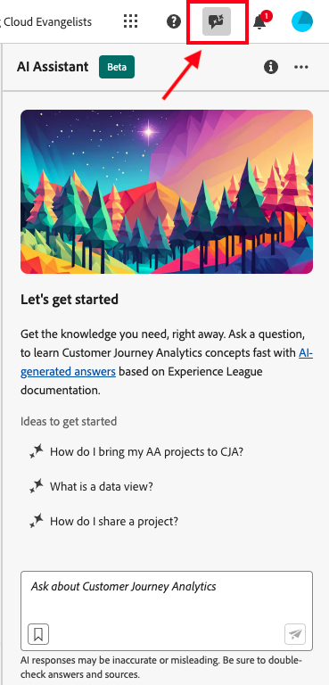
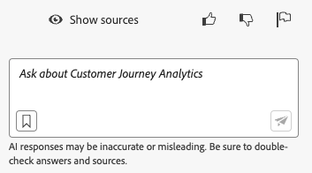

# Asistente de IA para Adobe Customer Journey Analytics

>[!NOTE]
>
>El Asistente de IA para Customer Journey Analytics está actualmente en versión beta. La función y su documentación están sujetas a cambios.

El asistente de IA es una función de la interfaz de usuario que puede utilizar para navegar y comprender los conceptos y la terminología de Adobe Customer Journey Analytics. El asistente de IA en Customer Journey Analytics está formado en su documentación de Adobe Experience League. Cuando se le hace una pregunta, AI Assistant responde con una respuesta útil que permite un aprendizaje rápido.

Como usuario novato, puede utilizar el asistente de IA para aprender conceptos de Customer Journey Analytics e incorporarse a productos y funciones con los que no está familiarizado. Como usuario experimentado, puede utilizar el Asistente de IA para presentar casos de uso o sugerencias y trucos más avanzados.

Algunos ejemplos de preguntas conceptuales son:

* ¿Cuál es la diferencia entre la ingesta por lotes y la transmisión?
* ¿Para qué se utiliza Customer Journey Analytics?
* ¿Cómo configuro una vista de datos?

El modelo de recuperación de documentación está formado en Customer Journey Analytics. Las preguntas que no entran en el ámbito de Customer Journey Analytics, como las preguntas sobre otros productos de Adobe como Adobe Target y Adobe Creative Cloud Suite, no se pueden responder.

El asistente de IA para Customer Journey Analytics está disponible para todos los niveles de productos.

>[!IMPORTANT]
>
>En este punto, el Asistente de IA para Customer Journey Analytics no responde a preguntas de uso sobre los objetos de datos de su organización.

## Acceso a funciones

En esta primera versión, el acceso a la función de asistente de IA se rige por los siguientes parámetros:

* **Acceso a soluciones**: el asistente de IA está disponible en Customer Journey Analytics, pero no en Adobe Analytics. También está disponible en Adobe Experience Platform, Adobe Journey Optimizer, Adobe Real-Time CDP y otras aplicaciones de Experience Platform.

* **Acceso contractual**: el contrato de venta de Adobe debe incluir una cláusula que permita a Adobe utilizar los datos en el desarrollo del modelo AI/ML (cláusula 6.2).

* **Permisos**: La [!UICONTROL Adobe Admin Console] [!UICONTROL Herramientas de informes] El permiso &quot;Documentación del asistente de IA&quot; determina el acceso a esta herramienta. Este permiso se agregará a la sección Herramientas de creación de informes a mediados de mayo. Debe asegurarse de crear un [perfil de producto](https://helpx.adobe.com/es/enterprise/using/manage-product-profiles.html) en Admin Console con este permiso concedido y agregue manualmente usuarios a este perfil.

## Acceso al Asistente de IA en la IU de Customer Journey Analytics

1. Para iniciar el asistente de IA, seleccione el icono Asistente de IA en el encabezado superior de cualquier página de la interfaz de usuario del Customer Journey Analytics.

   

   Al utilizar el Asistente de inteligencia artificial por primera vez, aparece un aviso de exención de responsabilidad con algunos términos y condiciones de uso del Asistente.

1. En el cuadro que se proporciona, haga una pregunta específica en lenguaje natural al asistente de IA.

   

1. (Opcional) Para mostrar los orígenes, haga clic en **[!UICONTROL Mostrar orígenes]**, y se muestran las fuentes de documentación que informaron la respuesta.

1. (Opcional) También puede proporcionar una votación de pulgares hacia arriba o hacia abajo sobre la utilidad de cualquier respuesta dada.
