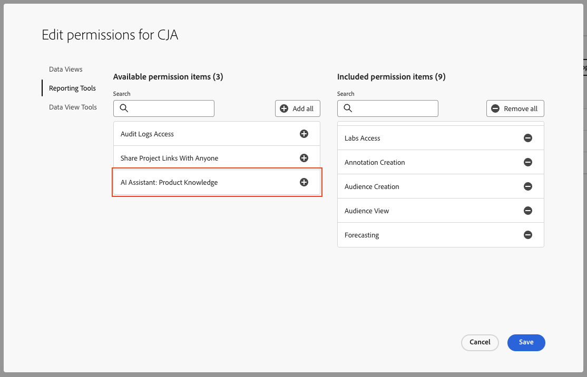

# Asistente de IA para Adobe Customer Journey Analytics

El asistente de IA es una experiencia conversacional que permite a los profesionales realizar tareas a un ritmo rápido, ya sea para comprender conceptos, solucionar problemas o buscar información. También permite a los no expertos realizar tareas de expertos y aumenta la calidad general del trabajo.

El asistente de IA en Customer Journey Analytics está formado en su documentación de Adobe Experience League. Cuando se le hace una pregunta, AI Assistant responde con una respuesta útil que permite un aprendizaje rápido.

Como usuario novato, puede utilizar el asistente de IA para aprender conceptos de Customer Journey Analytics e incorporarse a productos y funciones con los que no está familiarizado. Como usuario experimentado, puede utilizar el Asistente de IA para presentar casos de uso o sugerencias y trucos más avanzados.

Algunos ejemplos de preguntas conceptuales son:

* ¿Cuál es la diferencia entre la ingesta por lotes y la transmisión?
* ¿Para qué se utiliza Customer Journey Analytics?
* ¿Cómo configuro una vista de datos?

Las preguntas que no entran en el ámbito de Customer Journey Analytics, como las preguntas sobre otros productos de Adobe como Adobe Target y Adobe Creative Cloud Suite, no se pueden responder.

El asistente de IA para Customer Journey Analytics está disponible para todos los niveles de productos.

## Conocimiento del producto {#knowledge}

El modelo de recuperación del conocimiento del producto está formado en Customer Journey Analytics. Otras funciones, como el análisis de datos, se implementarán más adelante.

| Conocimiento del producto | Ejemplos |
| --- | --- |
| Aprendizaje puntual | <ul><li>¿Cuál es la diferencia entre Adobe Analytics y Customer Journey Analytics?</li><li>¿Cómo se crea una métrica calculada?</li></ul> |
| Abrir detección | <ul><li>¿Cómo puedo exportar un proyecto de Workspace?</li><li>¿Cómo puedo encontrar componentes duplicados de Workspace?</li></ul> |
| Resolución de problemas | <ul><li>¿Cuánto tiempo tardan los datos en entrar en CJA?</li><li>¿Cuántos campos derivados puedo tener en una conexión de Customer Journey Analytics?</li></ul> |

## Acceso a funciones

En esta primera versión, el acceso a la función de asistente de IA se rige por los siguientes parámetros:

* **Acceso a soluciones**: el asistente de IA está disponible en Customer Journey Analytics, pero no en Adobe Analytics. También está disponible en Adobe Experience Platform, Adobe Journey Optimizer, Adobe Real-Time CDP y otras aplicaciones de Experience Platform.

* **Acceso contractual**: si no puede utilizar el asistente de IA, póngase en contacto con el administrador de su organización o con el representante de cuentas de Adobe de. Antes de que AI Assistant pueda ser utilizado por su organización, su empresa debe aceptar ciertos términos legales relacionados con GenAI.

* **Permisos**: en [!UICONTROL Adobe Admin Console], el [!UICONTROL Herramientas de informes] El permiso &quot;Asistente de IA: conocimiento del producto&quot; determina el acceso a esta herramienta. A [administrador de perfil de producto](https://helpx.adobe.com/es/enterprise/using/manage-product-profiles.html) debe seguir estos pasos en Admin Console:
   1. Vaya a [!UICONTROL Admin Console] > [!UICONTROL Productos y servicios] > [!UICONTROL Customer Journey Analytics] > [!UICONTROL Perfil del producto] > [!UICONTROL Permisos] > [!UICONTROL Editar herramientas de informes].
   1. Añada &quot;Asistente de IA: conocimiento del producto&quot;.
      

## Acceso al Asistente de IA en la IU de Customer Journey Analytics

1. Para iniciar el asistente de IA, seleccione el icono Asistente de IA en el encabezado superior de cualquier página de la interfaz de usuario del Customer Journey Analytics.

   

   Al utilizar el Asistente de inteligencia artificial por primera vez, aparece un aviso de exención de responsabilidad con algunos términos y condiciones de uso del Asistente.

1. En el cuadro que se proporciona, haga una pregunta específica en lenguaje natural al asistente de IA.

   

1. (Opcional) Para mostrar los orígenes, haga clic en **[!UICONTROL Mostrar orígenes]**, y se muestra la fuente o fuentes de documentación que han proporcionado la respuesta.

1. (Opcional) También puede proporcionar una votación de pulgares hacia arriba o hacia abajo sobre la utilidad de cualquier respuesta dada.

1. (Opcional) Puede marcar la respuesta para contenido inapropiado o perjudicial.
