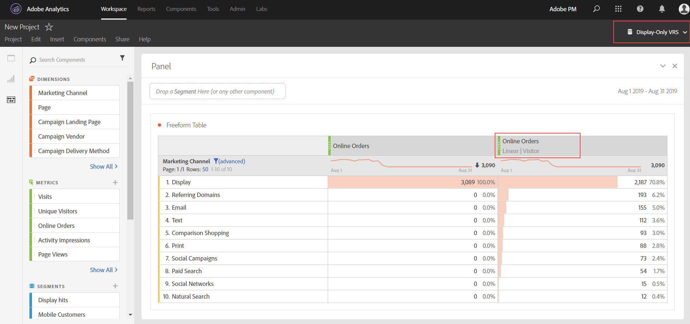

# Preguntas más frecuentes sobre Attribution

>[!NOTE]
>
>Está viendo la documentación de Analysis Workspace en Customer Journey Analytics. Su conjunto de funciones difiere ligeramente del [Analysis Workspace de la versión tradicional de Adobe Analytics](https://docs.adobe.com/content/help/es-ES/analytics/analyze/analysis-workspace/home.html). [Más información...](/help/getting-started/cja-aa.md)

**¿Cuál es el elemento de línea “Ninguno” al utilizar Attribution?**

El elemento de línea “Ninguno” es un captador global que representa todas las conversiones que se produjeron sin ningún punto de contacto dentro de la ventana retrospectiva. Intente incluir un intervalo de tiempo más largo en la ventana de informes.

**¿Por qué a veces veo fechas fuera de la ventana de informes al utilizar modelos de atribución?**

Estas fechas adicionales se deben a la ventana retrospectiva de informes de visitantes. Consulte [Datos que aparecen fuera de la ventana de informes](https://helpx.adobe.com/es/analytics/kb/data-appearing-outside-reporting-window.html) en la BC de Analytics para obtener más información. Adobe filtrará estas filas extra en una próxima versión.

**¿Cuándo debo usar una retrospectiva de atribución de visita o de visitante?**

La elección de la retrospectiva de atribución depende de su caso de uso. Si las conversiones suelen tardar más de una sola visita, se recomienda una retrospectiva del visitante. La creación de un grupo de informes virtuales con una definición de visita más larga también es una posible solución.

**¿Cómo se comparan las props y las eVars al utilizar la atribución?**

La atribución se vuelve a calcular durante el tiempo de ejecución del informe, por lo que no hay diferencia entre una prop o eVar (o cualquier otra dimensión) en cuanto al modelado de atribución. Las props pueden persistir con cualquier ventana retrospectiva o modelo de atribución y se omiten las opciones de asignación/caducidad de eVar.

**¿Los modelos de atribución solo están disponibles si utilizo un Grupo de informes virtuales con el procesamiento de tiempo de informes activado?**

Los modelos de atribución están disponibles fuera de los grupos de informes virtuales. Aunque utilizan el procesamiento de tiempo de los informes en segundo plano, los modelos de atribución están disponibles tanto para los grupos de informes estándar como para los virtuales.

**¿Qué dimensiones y métricas no son compatibles?**

El panel de atribución admite todas las dimensiones. Las métricas no admitidas incluyen:

* Visitantes únicos
* Visitas
* Ocurrencias
* Vistas de páginas
* Métricas de A4T
* Métricas de tiempo empleado
* Devoluciones
* Porcentaje de rebote
* Entradas
* Salidas
* Páginas no encontradas
* Búsquedas
* Visitas a una sola página
* Acceso único

**¿Funciona la atribución con las clasificaciones?**

Sí, las clasificaciones son compatibles.

**¿La atribución funciona con fuentes de datos?**

Sí, la mayoría de las fuentes de datos son compatibles. La atribución no es compatible con fuentes de datos de resumen porque no están vinculadas a un identificador de visitante de Analytics. Los orígenes de datos del ID de transacción también se admiten, excepto si se usan en un grupo de informes virtual con el procesamiento de tiempo de informe habilitado.

**¿Se puede usar la atribución con la integración de Advertising Analytics?**

Las dimensiones de metadatos, como el tipo de coincidencia y la palabra clave, se pueden usar con la atribución. Sin embargo, las métricas (como impresiones, coste, clics, posición promedio y puntuación de calidad promedio) utilizan fuentes de datos de resumen y, por lo tanto, son incompatibles.

**¿Cómo funciona la atribución con los canales de mercadotecnia?**

Cuando se introdujeron los canales de marketing por primera vez, solo incluyeron dimensiones de primer y último contacto. Ya no se necesitan dimensiones explícitas de primer/último toque con la versión actual de atribución. Adobe proporciona dimensiones genéricas de &#39;Canal de mercadotecnia&#39; y &#39;Detalle de Canal de mercadotecnia&#39; para que pueda utilizarlas con el modelo de atribución deseado. Estas dimensiones genéricas se comportan de forma idéntica a las dimensiones de Canal de último toque, pero tienen una etiqueta diferente para evitar confusiones al usar canales de marketing con un modelo de atribución diferente.

Dado que las dimensiones del canal de marketing dependen de una definición de visita tradicional (según lo definen sus reglas de procesamiento), su definición de visita no se puede cambiar mediante grupos de informes virtuales.

**¿Cómo funciona la atribución con variables de varios valores, como las variables de lista?**

Algunas dimensiones en Analytics pueden contener varios valores en una sola visita. Algunos ejemplos comunes son las variables de lista y la variable Products.

Cuando la atribución se aplica a visitas con varios valores, todos los valores de la misma visita obtienen el mismo crédito. Dado que muchos valores pueden recibir este crédito, el total del informe puede ser diferente a la suma de cada elemento de línea individual. El total del informe se anula la duplicación, mientras que cada elemento de dimensión individual recibe el crédito adecuado.

**¿Cómo funciona la atribución con la segmentación?**

La atribución siempre se ejecuta antes de la segmentación y esta se ejecuta antes de que se apliquen los filtros de informe. Este concepto también se aplica a los grupos de informes virtuales que utilizan segmentos.

Por ejemplo, si crea un VRS y le aplica un segmento “Display Hits”, puede ver otros canales en una tabla utilizando algunos modelos de atribución.

>[!NOTE]
>
>Si un segmento suprime las visitas que contengan la métrica, esas instancias de métrica no se atribuirán a ninguna dimensión. Sin embargo, un filtro de informe similar simplemente ocultará algunos elementos de dimensión, sin ningún impacto en las métricas procesadas según el modelo de atribución. Como resultado, un segmento puede devolver valores más bajos que un filtro con una definición comparable.
