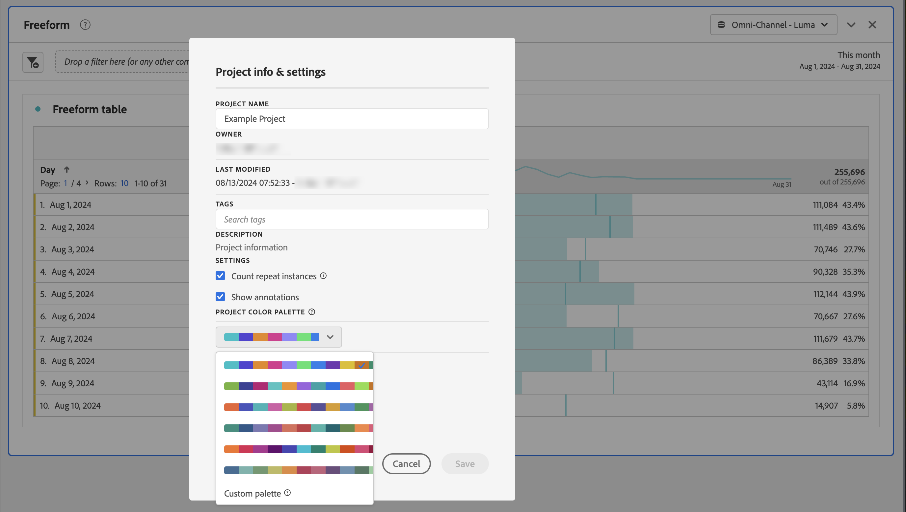

# Paleta de colores de visualización {#visualization-color-palette}

<!-- markdownlint-disable MD034 -->

>[!CONTEXTUALHELP]
>id="workspace_project_colorpalette"
>title="Paleta de colores del proyecto"
>abstract="Cambie la paleta de colores utilizada en este proyecto."

<!-- markdownlint-enable MD034 -->

Puede cambiar la paleta de colores de visualización que se utiliza en Workspace. Puede seleccionar una paleta de colores predefinida o especificar su propia paleta que coincida con los colores de la personalización de marca de su compañía. Esta característica afecta a la mayoría de las visualizaciones de Workspace, pero **no** afecta al Resumen del cambio, al formato condicional en tablas de forma libre ni a la Visualización de mapas.

>[!NOTE]
>
>La compatibilidad con paletas de color no está habilitada para Internet Explorer 11.

Recuerde:

* Hay cinco paletas de colores predefinidas para elegir. La paleta predeterminada y la segunda que aparece listada se han optimizado para lograr un mejor contraste y son más accesibles para los daltónicos.
* Las otras paletas se han optimizado para lograr la armonía de colores.

## Para cambiar la paleta de color:

1. Vaya a **[!UICONTROL Workspace]** > **[!UICONTROL Proyecto]** > **[!UICONTROL Información y configuración del proyecto]**
1. En el menú desplegable **[!UICONTROL Paleta de colores del proyecto]** puede escoger uno de los cinco esquemas de colores preconfigurados.
1. Para crear su propia paleta, seleccione **[!UICONTROL Paleta personalizada]** debajo de las opciones preconfiguradas.
1. Especifique hasta 16 valores hexadecimales delimitados por comas (por ejemplo, `#00a4e4`) para crear su propia paleta de colores. Si especifica, por ejemplo, solo cuatro valores, los colores se repetirán automáticamente en las visualizaciones que contengan más colores.
