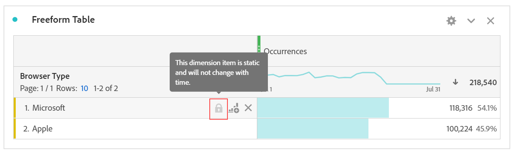

# Elementos de dimensión dinámicos vs. estáticos en tablas improvisadas

>[!NOTE] Está viendo la documentación de Analysis Workspace en Customer Journey Analytics. Su conjunto de funciones difiere ligeramente del [Analysis Workspace de la versión tradicional de Adobe Analytics](https://docs.adobe.com/content/help/es-ES/analytics/analyze/analysis-workspace/home.html). [Más información...](/help/getting-started/cja-aa.md)

En las tablas improvisadas, las filas y columnas pueden contener varios valores de componente. Estos valores pueden ser dinámicos (cambian con el tiempo) o estáticos (no cambian con el tiempo), según la análisis que desee generar.

## Elementos de dimensión dinámica

Los elementos de dimensión dinámica cambian con el tiempo y dependen de la métrica por la que se ordena en la tabla improvisada. Los elementos de dimensión dinámica son preferibles cuando desea analizar los elementos principales de un período de tiempo determinado.

Cuando se coloca una dimensión en una tabla improvisada, se devuelven filas dinámicas. Representan los elementos principales que corresponden a la dimensión de una métrica y un período de tiempo determinados. También puede colocar una dimensión en columnas de tabla improvisada y ésta se expande automáticamente a los 5 elementos de dimensión principales.

Por ejemplo, cuando arrastra la dimensión Tipo de explorador a la tabla, los elementos de dimensión Tipo de explorador principales (por ejemplo, Microsoft, Apple, Google, etc.) volver dinámicamente a las filas de tabla. Si se sueltan en una columna, los 5 elementos de dimensión Tipo de explorador principales se devuelven de forma dinámica.

Los elementos de dimensión dinámica tienen la opción de filtro de fila y **no tienen** iconos de bloqueo y X.

## Elementos de dimensión estáticos

Los elementos de dimensión estáticos no cambian con el tiempo; son componentes fijos que siempre se devuelven en una tabla improvisada. Los elementos de dimensión estáticos son preferibles cuando se desea analizar siempre el mismo elemento, ya sean campañas específicas o días específicos de la semana.

Cada vez que selecciona y suelta manualmente valores de componente específicos (dimensión, métrica, segmento, intervalo de fechas) en una tabla, el resultado es una lista estática de filas o columnas. También se pueden crear elementos de dimensión estáticos si elige:

* En filas, haga clic con el botón derecho > [!UICONTROL Mostrar sólo las filas seleccionadas]
* Desde columnas, haga clic con el botón derecho > [!UICONTROL Convertir el elemento en estático]

Por ejemplo, cuando arrastra elementos específicos del tipo de navegador como Microsoft y Apple, esos dos elementos específicos siempre se arrastran a la tabla.

Los elementos de dimensión estáticos **no tienen** la opción de filtro de fila. En su lugar, los iconos Bloquear y X están presentes en cada elemento. Haga clic en el icono X para eliminar ese elemento de dimensión de la tabla.

## Elementos de dimensión mixtos

Los elementos de dimensión de diferentes dimensiones se pueden agregar a la misma tabla. En estos casos, el encabezado de fila indica &quot;Dimensiones mixtas&quot;. Estos elementos de dimensión son estáticos. Por ejemplo, si agrega elementos de dimensión específicos desde la dimensión Tipo de navegador y otros elementos de dimensión desde la dimensión Explorador.

## Filas totales improvisadas

Las filas dinámicas y estáticas se comportan de forma diferente en la fila total improvisada. De forma predeterminada:

* Las filas dinámicas se suman a las métricas de servidor y de duplicado, como visitas o visitantes
* Las filas estáticas se suman en el lado del cliente y **no eliminan** las métricas de duplicado. Para calcular el total de filas en el servidor, cambie la configuración Fila a **Mostrar total** general. [Más información](https://docs.adobe.com/content/help/es-ES/analytics/analyze/analysis-workspace/build-workspace-project/workspace-totals.html)

