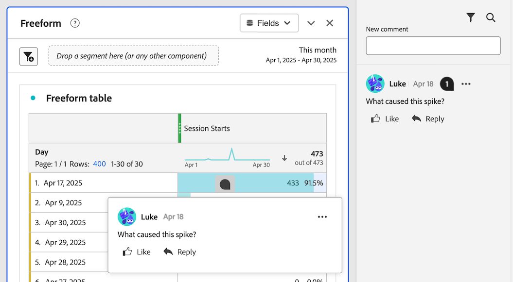
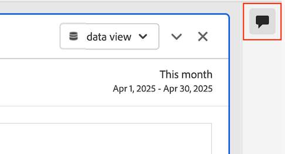
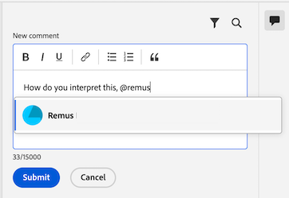

# Agregar y administrar comentarios en proyectos {#comment-on-projects}

{{release-limited-testing}}

Los comentarios en Analysis Workspace le permiten compartir perspectivas y hacer preguntas en el contexto de un proyecto de Analysis Workspace. Esto puede agilizar los debates sobre los datos, manteniendo las conversaciones en el contexto de los datos que se están debatiendo.

>[!NOTE]
>
>La capacidad de agregar y administrar comentarios en un proyecto se puede deshabilitar en el nivel de proyecto o en el nivel de organización. Si no puede agregar ni administrar comentarios como se describe en esta sección, el administrador de Customer Journey Analytics o el propietario del proyecto han deshabilitado esta capacidad.
>
>* **Proyecto:** El propietario del proyecto puede deshabilitar esta funcionalidad para el proyecto, tal como se describe en [Crear proyectos](/help/analysis-workspace/build-workspace-project/create-projects.md).
>* **Organización:** El administrador de Customer Journey Analytics puede deshabilitar esta funcionalidad para la organización, tal como se describe en [Preferencias](/help/analysis-workspace/user-preferences.md).

## Ver comentarios

Puede ver los comentarios desde el área de comentarios en el carril derecho o desde el distintivo de comentario, si existe.

>[!NOTE]
>
>Se debe guardar un proyecto antes de que el área de comentarios sea visible en el carril derecho. Si el proyecto no se ha guardado anteriormente, debe [guardar el proyecto](/help/analysis-workspace/build-workspace-project/save-projects.md) antes de agregar comentarios.

### Ver comentarios en el área de comentarios

Todos los comentarios realizados en un proyecto de Analysis Workspace se pueden ver en el área de comentarios del carril derecho.

1. Con el proyecto abierto en Analysis Workspace, seleccione el icono del área de comentarios en el carril derecho de Analysis Workspace.

   

   Cada comentario muestra una marca de tiempo del día en que se publicó. Si el comentario se publicó el día actual, se muestra la hora del día. Pase el ratón sobre el día o la hora para mostrar la fecha y la hora completas en que se publicó el comentario.

1. (Opcional) Para buscar en el área de comentarios, seleccione el icono de búsqueda  y, a continuación, escriba una palabra o frase. El área de comentarios se filtra para contener sólo los comentarios que incluyen esa palabra o frase.

### Ver distintivos de comentarios en un proyecto

Los comentarios que se realizan [en un área específica del proyecto](#comment-on-a-specific-area-of-the-project) tienen un **distintivo de comentario**  que se muestra en el área del proyecto a la que pertenece el comentario. Seleccione un distintivo para ver el comentario. Después de seleccionar el distintivo, puede seleccionar el comentario en sí para resaltarlo en el área de comentarios en el carril derecho.

Los números se muestran en cada distintivo de un proyecto y se ordenan en el orden en que se crearon. Si se colocan varios comentarios en la misma área de un proyecto, el distintivo muestra 3 puntos . Seleccione el distintivo de 3 puntos para mostrar todos los comentarios de esa área.

<!-- Insert screeshot-->

Para ocultar todas las insignias de comentarios de un proyecto:

1. Con el proyecto abierto en Analysis Workspace, seleccione el icono del área de comentarios  en el carril derecho de Analysis Workspace.

1. En la parte inferior del área de comentarios, habilite la opción **[!UICONTROL Ocultar distintivos colocados]**.

## Añadir comentarios

Puede agregar un comentario que haga referencia a un área específica del proyecto o puede agregar un comentario general.

### Comentario sobre un área específica del proyecto

Para realizar comentarios en un área específica del proyecto (como un valor de métrica en una tabla de forma libre):

1. Con el proyecto abierto en Analysis Workspace, haga clic con el botón derecho en el área del proyecto en la que desee insertar el comentario.

   Todas las visualizaciones admiten insignias de comentario en el encabezado de la visualización, pero solo las siguientes visualizaciones admiten insignias de comentario en puntos de datos específicos dentro de la visualización:

   * Tabla de forma libre
   * Tabla de cohortes
   * Línea

   <!--add screenshot-->

1. Seleccione **[!UICONTROL Agregar comentario]**.

1. En el campo **[!UICONTROL Nuevo comentario]**, especifique el comentario.

   Los comentarios pueden tener hasta 15.000 caracteres e incluir marcado básico, hipervínculos, listas numeradas y con viñetas y emojis.

1. (Opcional) Notifique a otra persona su comentario escribiendo el símbolo @ seguido del nombre. Para obtener más información sobre cómo usar el símbolo @ para notificar a otros usuarios, vea [Incluir a otros en un comentario](#include-others-in-a-comment).

1. Seleccione **[!UICONTROL Enviar]**.

   Se coloca una insignia de **comentario**  en el área del proyecto de Workspace donde agregó el comentario, tal como se describe en [Ver insignias de comentario en un proyecto](#view-comment-badges-in-a-project). El comentario también aparece en la parte superior del área de comentarios en el carril derecho.

### Agregar un comentario general sobre el proyecto

Para agregar comentarios a un proyecto en Analysis Workspace:

1. Con el proyecto abierto en Analysis Workspace, seleccione el icono del área de comentarios  en el carril derecho de Analysis Workspace. <!-- add screen shot -->

1. En el campo **[!UICONTROL Nuevo comentario]**, especifique el comentario.

   Los comentarios pueden tener hasta 15.000 caracteres e incluir marcado básico, hipervínculos, listas numeradas y con viñetas y emojis.

1. (Opcional) Notifique a otra persona su comentario escribiendo el símbolo @ seguido del nombre. Para obtener más información sobre cómo usar el símbolo @ para notificar a otros usuarios, vea [Incluir a otros en un comentario](#include-others-in-a-comment).

1. Seleccione **[!UICONTROL Enviar]**.

   El comentario aparece en la parte superior del área de comentarios, tal como se describe en [Ver comentarios en el área de comentarios](#view-comments-in-the-comments-area).

## Incluir a otras personas en un comentario

La función de comentarios de Analysis Workspace facilita la colaboración con otros usuarios.

Tenga en cuenta lo siguiente al utilizar el símbolo @ para incluir a las personas en un comentario:

* Las personas que incluya recibirán notificaciones en función de su configuración de notificaciones de Adobe Experience Cloud. De forma predeterminada, reciben una notificación en la aplicación, visible desde el icono [Experience Cloud notification](https://experienceleague.adobe.com/es/docs/core-services/interface/features/account-preferences#view-notifications)  en Customer Journey Analytics.

  Además, las personas pueden configurar su configuración de notificaciones de Experience Cloud para recibir notificaciones por correo electrónico y notificaciones de Slack mediante [suscripción a notificaciones por correo electrónico](https://experienceleague.adobe.com/es/docs/core-services/interface/features/account-preferences#subscribe-to-in-app-and-email-notifications) y [suscripción a notificaciones de Slack](https://experienceleague.adobe.com/es/docs/core-services/interface/features/account-preferences#slack).

* Puede incluir a cualquier persona de su organización en un comentario, pero al hacerlo no se les concede automáticamente acceso al proyecto. Solo las personas que ya tienen acceso al proyecto pueden acceder a él.

Para incluir a otra persona en el comentario:

1. Escriba el símbolo @ y, a continuación, empiece a escribir el nombre, los apellidos o la dirección de correo electrónico de la persona que desea incluir.

   

1. Seleccione el nombre de la persona cuando aparezca en el menú desplegable.

## Responder a un comentario

1. Con el proyecto abierto en Analysis Workspace, seleccione el icono del área de comentarios  en el carril derecho de Analysis Workspace.

1. Seleccione **[!UICONTROL Responder]** junto al comentario al que desea responder.

   O bien

   Para incluir el texto del comentario al que está respondiendo, con el texto original dentro de una etiqueta de comillas, seleccione el icono de 3 puntos junto al comentario o la respuesta específicos a los que desea responder y, a continuación, seleccione **[!UICONTROL Respuesta de cita]**. Una respuesta de cita es una buena manera de indicar a qué comentario o respuesta se refiere su comentario.

1. En el campo **[!UICONTROL Nuevo comentario]**, especifique el comentario.

   Los comentarios pueden tener hasta 15.000 caracteres e incluir marcado básico, hipervínculos, listas numeradas y con viñetas y emojis.

1. (Opcional) Notifique a otra persona su comentario escribiendo el símbolo @ seguido del nombre. Para obtener más información sobre cómo usar el símbolo @ para notificar a otros usuarios, vea [Incluir a otros en un comentario](#include-others-in-a-comment).

1. Seleccione **[!UICONTROL Enviar]**.

## Colocar una insignia para un comentario existente

Si un comentario está disponible en el área de comentarios en el carril derecho pero aún no tiene un distintivo en el proyecto, puede añadir el distintivo.

1. Con el proyecto abierto en Analysis Workspace, seleccione el icono del área de comentarios  en el carril derecho de Analysis Workspace.

1. Seleccione el icono de más  junto al comentario para el que desea colocar una insignia y, a continuación, seleccione **[!UICONTROL Colocar insignia]**.

1. Seleccione el área del proyecto en la que desea colocar el distintivo del comentario existente.

   Se ha colocado una insignia de **comentario**  en el área del proyecto de Workspace que seleccionó. El comentario también aparece en la parte superior del área de comentarios en el carril derecho.

   Vea [Ver distintivos de comentarios en un proyecto](#view-comment-badges-in-a-project) para obtener más información.

Para quitar una insignia:

1. Seleccione la insignia que desee quitar y, a continuación, seleccione **[!UICONTROL Quitar insignia]**.

   El distintivo se elimina, pero el comentario sigue estando disponible en el área de comentarios del carril derecho.

## Mover una insignia de un comentario existente

Puede mover un distintivo de comentario que ya se haya colocado para un comentario existente.

1. Con el proyecto abierto en Analysis Workspace, busque el distintivo del comentario que desea mover.

1. Haga clic con el botón derecho en el distintivo y, a continuación, seleccione **[!UICONTROL Mover ubicación]**.

1. Seleccione el área del proyecto en la que desea colocar el distintivo.

<!-- add section about adding images to comments. will be available at GA. Include that "you can have a maximum of 5 images per comment, and each image can be up to 2 MB." -->

## Copiar el vínculo a un comentario

Puede copiar el vínculo a un comentario y compartirlo con otros usuarios. Solo las personas que ya tienen acceso al proyecto pueden acceder a él con el vínculo.

Para copiar el vínculo a un comentario:

1. Con el proyecto abierto en Analysis Workspace, seleccione el icono del área de comentarios  en el carril derecho de Analysis Workspace.

1. Seleccione el icono de más  junto al comentario cuyo vínculo desea copiar y, a continuación, seleccione **[!UICONTROL Copiar vínculo]**.

   El vínculo se copia en el portapapeles del sistema. Puede pegar el vínculo en un correo electrónico u otro tipo de mensaje.

## Copiar el texto de un comentario

Puede copiar el texto independiente de un comentario y compartirlo con otros usuarios.

Para copiar el texto del cuerpo de un comentario:

1. Con el proyecto abierto en Analysis Workspace, seleccione el icono del área de comentarios  en el carril derecho de Analysis Workspace.

1. Seleccione el icono de más  junto al comentario que contiene el texto que desea copiar y, a continuación, seleccione **[!UICONTROL Copiar texto principal]**.

   El texto del cuerpo del comentario se copia en el portapapeles del sistema.

## Me gusta un comentario

1. Con el proyecto abierto en Analysis Workspace, seleccione el icono del área de comentarios  en el carril derecho de Analysis Workspace.

1. Seleccione **[!UICONTROL Me gusta]** debajo del comentario que desea endosar.

## Eliminar un comentario

Al eliminar un comentario, también se eliminan el comentario original y las respuestas o archivos adjuntos.

Los comentarios eliminados no se pueden recuperar.

Para eliminar un comentario:

1. Con el proyecto abierto en Analysis Workspace, seleccione el icono del área de comentarios  en el carril derecho de Analysis Workspace.

1. Seleccione el icono de más  junto al comentario que desea eliminar y, a continuación, seleccione **[!UICONTROL Eliminar]**.

1. Vuelva a seleccionar **[!UICONTROL Eliminar]** para confirmar la eliminación.

## Resolver un comentario

Cuando resuelve un comentario, el comentario se marca como resuelto y se oculta en el área de comentarios. Si el comentario tiene un distintivo asociado, este se elimina del proyecto.

Para resolver un comentario:

1. Con el proyecto abierto en Analysis Workspace, seleccione el icono del área de comentarios  en el carril derecho de Analysis Workspace.

1. Seleccione el icono de más  junto al comentario que desea resolver y, a continuación, seleccione **[!UICONTROL Resolver]**.

1. Seleccione **[!UICONTROL Resolver]** de nuevo para confirmar.

De forma predeterminada, los comentarios resueltos se ocultan en el área de comentarios. Para mostrar los comentarios resueltos:

1. Seleccione el icono de filtro en el área de comentarios y, a continuación, deseleccione la opción **[!UICONTROL Ocultar comentarios resueltos]**.
