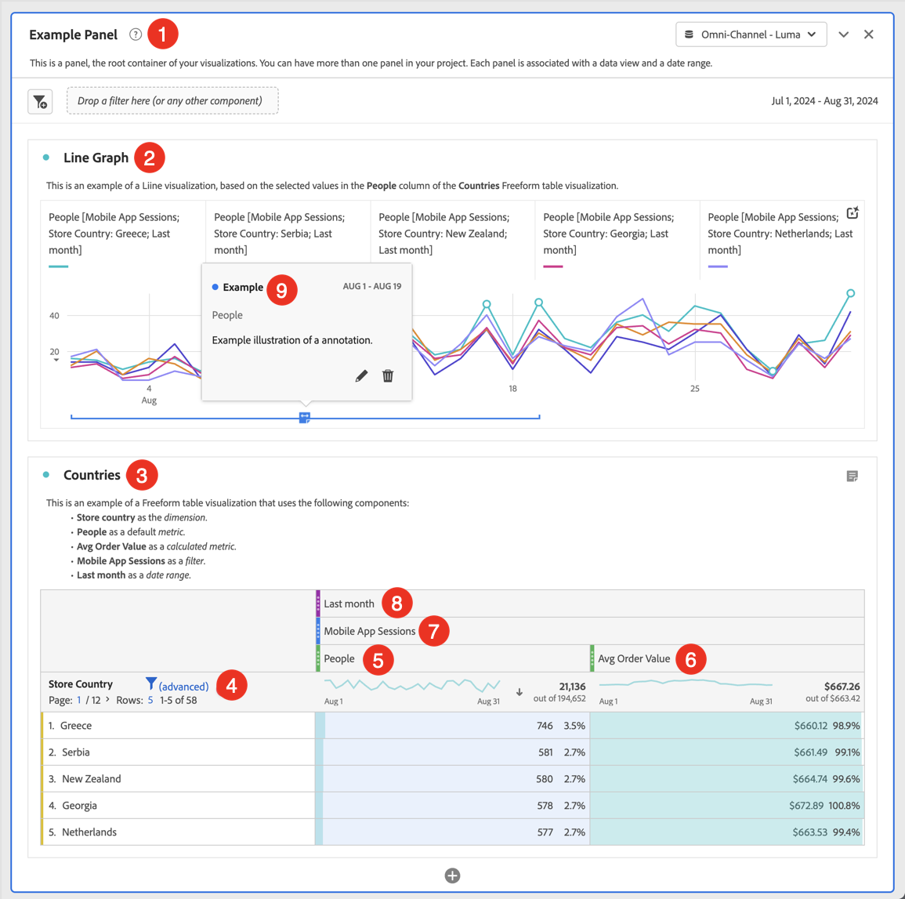

# Creación de proyectos {#create-projects}

<!-- markdownlint-disable MD034 -->

>[!CONTEXTUALHELP]
>id="cja_workspace_project_countrepeatinstances"
>title="Contar instancias repetidas"
>abstract="Especifica si las instancias repetidas se cuentan en los informes.  Nota: esta configuración no se aplica a las visualizaciones de flujo o visitas en el orden previsto."

<!-- markdownlint-enable MD034 -->

Los [proyectos](/help/analysis-workspace/build-workspace-project/freeform-overview.md) de Analysis Workspace le permiten crear y ver análisis críticos para la empresa.  Estos análisis se pueden compartir con las partes interesadas dentro o fuera de la organización.

1. En Customer Journey Analytics, seleccione **[!UICONTROL Workspace]**.

1. Seleccione **[!UICONTROL Proyectos]** en el panel izquierdo y luego seleccione **[!UICONTROL Crear proyecto]**.

1. Seleccione **Proyecto de Workspace en blanco** para crear su proyecto de Workspace con un explorador.

   Consulte [Cuadro de resultados móvil en blanco](/help/mobile-app/curator.md) para obtener más información sobre cómo crear un proyecto de cuadro de resultados móvil que pueda compartir con otras partes interesadas mediante una aplicación móvil. Y vea [Análisis guiado](/help/guided-analysis/overview.md) para obtener más información sobre las diversas opciones disponibles para crear su proyecto de análisis guiado.

1. Seleccione [!UICONTROL **Crear**].

Ahora que ha creado un proyecto de Workspace en blanco, asegúrese de estar familiarizado con la interfaz de usuario de [Analysis Workspace](/help/analysis-workspace/home.md). Una vez finalizado, puede generar el proyecto. Para ello:

* Agregue [paneles](/help/analysis-workspace/c-panels/panels.md) a su proyecto. Por ejemplo, el ➊ **[!DNL Example Panel]**.

* Agregue [visualizaciones](/help/analysis-workspace/visualizations/freeform-analysis-visualizations.md) a sus paneles. Por ejemplo:
   * **[!DNL Line Graph]** [➋ de visualización de línea](/help/analysis-workspace/visualizations/line.md)
   * **[!DNL Countries]** [➌ de visualización de tabla de forma libre](/help/analysis-workspace/visualizations/freeform-table/freeform-table.md)
* Agregue [componentes](/help/components/overview.md) a sus visualizaciones. Por ejemplo:
   * **[!DNL Store Country]** [dimensión](/help/components/dimensions/overview.md) ➍
   * **[!DNL People]** [métrica](/help/components/apply-create-metrics.md) ➎
   * **[!DNL Avg Order Value]** [métrica calculada](/help/components/calc-metrics/calc-metr-overview.md) ➏
   * **[!DNL Mobile App Sessions]** [filtro](/help/components/filters/filters-overview.md) ➐
   * **[!DNL Last Month]** [intervalo de fecha](/help/components/date-ranges/overview.md) ➑
   * **[!DNL Example]** [anotación](/help/components/annotations/overview.md) ➒

## Info y configuración del proyecto {#project-info-settings}

<!-- markdownlint-disable MD034 -->

>[!CONTEXTUALHELP]
>id="cja_workspace_project_repeatinstances"
>title="Contar instancias repetidas"
>abstract="Especifica si las instancias repetidas se cuentan en los informes. Nota: esta configuración no se aplica a las visualizaciones de flujo o visitas en el orden previsto."

<!-- markdownlint-enable MD034 -->

La configuración del proyecto proporciona información a nivel de proyecto sobre el proyecto activo actualmente.

La configuración incluye lo siguiente:

| Configuración | Descripción |
|---|---|
| Nombre del proyecto | Nombre proporcionado al proyecto. Puede hacer doble clic en el nombre para editarlo. |
| Propietario | Nombre del propietario del proyecto. |
| Última modificación | Fecha de la última modificación del proyecto. |
| Etiquetas | Enumera cualquier etiqueta aplicada a un proyecto para una ordenación por categorías más sencilla. |
| Descripción | Una descripción es útil para aclarar el propósito de un proyecto. Puede hacer doble clic en la descripción para editarla. |
| Contar instancias repetidas | Especifique si las instancias repetidas se cuentan en los informes. Nota: Esta configuración no se aplica a las visualizaciones de flujo o visitas en el orden previsto. |
| Mostrar anotaciones | Especifique si las anotaciones se muestran para este proyecto o no. |
| [Paleta de colores del proyecto](/help/analysis-workspace/build-workspace-project/color-palettes.md) | Puede cambiar la paleta de colores categórica que se utiliza en Workspace eligiendo una de las paletas integradas que se han optimizado para casos de daltonismo o especificando la paleta personalizada. Esta función afecta a muchos elementos del Workspace, incluidas la mayoría de visualizaciones. |
| [Ver densidad](/help/analysis-workspace/build-workspace-project/view-density.md) | Le permite ver más datos en la pantalla al reducir el margen vertical del panel izquierdo, las tablas de forma libre y las tablas de cohorte. |

