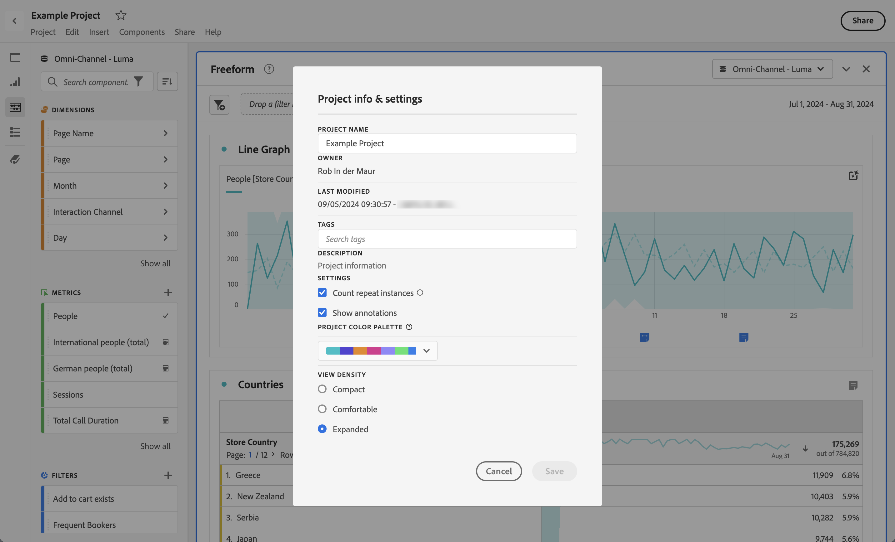

# Crear proyectos {#create-projects}

Los [proyectos](/help/analysis-workspace/build-workspace-project/freeform-overview.md) de Analysis Workspace le permiten crear y ver análisis críticos para la empresa.  Estos análisis se pueden compartir con las partes interesadas dentro o fuera de la organización.

1. En Customer Journey Analytics, seleccione **[!UICONTROL Workspace]**.

1. Seleccione **[!UICONTROL Proyectos]** en el panel izquierdo y, a continuación, **[!UICONTROL Crear proyecto]**.

1. Seleccione **Proyecto de Workspace en blanco** para crear su proyecto de Workspace con un explorador.

   Consulte [Cuadro de resultados móvil en blanco](/help/mobile-app/curator.md) para obtener más información sobre cómo crear un proyecto de cuadro de resultados móvil que pueda compartir con otras partes interesadas mediante una aplicación móvil. Y consulte [Análisis guiado](/help/guided-analysis/overview.md) para obtener más información sobre las diversas opciones disponibles para crear su proyecto de análisis guiado.

1. Seleccione [!UICONTROL **Crear**].

Ahora que ha creado un proyecto de Workspace en blanco, asegúrese de estar familiarizado con la interfaz de usuario de [Analysis Workspace](/help/analysis-workspace/home.md). Una vez finalizado, puede generar el proyecto. Para ello, haga lo siguiente:

* Añadir [paneles](/help/analysis-workspace/c-panels/panels.md) a su proyecto Por ejemplo, la **[!DNL Example Panel]** ➊.

* Añada [visualizaciones](/help/analysis-workspace/visualizations/freeform-analysis-visualizations.md) a sus paneles. Por ejemplo:
   * **[!DNL Line Graph]** Visualización de [líneas](/help/analysis-workspace/visualizations/line.md) ➋
   * **[!DNL Countries]** Visualización de [tabla de forma libre](/help/analysis-workspace/visualizations/freeform-table/freeform-table.md) ➌
* Añada [componentes](/help/components/overview.md) a sus visualizaciones. Por ejemplo:
   * **[!DNL Store Country]** [dimensión](/help/components/dimensions/overview.md) ➍
   * **[!DNL People]** [métrica](/help/components/apply-create-metrics.md) ➎
   * **[!DNL Avg Order Value]** [métrica calculada](/help/components/calc-metrics/calc-metr-overview.md) ➏
   * **[!DNL Mobile App Sessions]** [segmento](/help/components/segments/seg-overview.md) ➐
   * **[!DNL Last Month]** [intervalo de fechas](/help/components/date-ranges/overview.md) ➑
   * **[!DNL Example]** [anotación](/help/components/annotations/overview.md) ➒

## Info y configuración del proyecto {#project-info-settings}

>[!CONTEXTUALHELP]
>id="workspace_project_countrepeatinstances"
>title="Contar instancias repetidas"
>abstract="Especifica si las instancias repetidas se cuentan en los informes.  Nota: Esta configuración no se aplica a las visualizaciones de flujo o visitas en el orden previsto."

>[!CONTEXTUALHELP]
>id="workspace_project_repeatinstances"
>title="Contar instancias repetidas"
>abstract="Especifica si las instancias repetidas se cuentan en los informes. Nota: Esta configuración no se aplica a las visualizaciones de flujo o visitas en el orden previsto."

>[!CONTEXTUALHELP]
>id="workspace_project_commenting"
>title="Permitir comentarios"
>abstract="Cuando se habilita, hay un área de comentarios disponible en el carril derecho del proyecto en Analysis Workspace."

La configuración del proyecto proporciona información del proyecto activo actualmente.

La configuración incluye lo siguiente:

| Configuración | Descripción |
|---|---|
| Nombre del proyecto | Nombre proporcionado al proyecto. Puede hacer doble clic en el nombre para editarlo. |
| Propietario | Nombre del propietario del proyecto. |
| Última modificación | Fecha de la última modificación del proyecto. |
| Etiquetas | Enumera cualquier etiqueta aplicada a un proyecto para una ordenación por categorías más sencilla. |
| Descripción | Una descripción es útil para aclarar el propósito de un proyecto. Puede hacer doble clic en la descripción para editarla. |
| Contar instancias repetidas | Especifica si las instancias repetidas se cuentan en los informes. Nota: Esta configuración no se aplica a las visualizaciones de flujo o visitas en el orden previsto. |
| Mostrar anotaciones | Especifica si las anotaciones se muestran para este proyecto o no. |
| [Paleta de colores del proyecto](/help/analysis-workspace/build-workspace-project/color-palettes.md) | Puede cambiar la paleta de colores categórica que se utiliza en Workspace eligiendo una de las paletas integradas que se han optimizado para casos de daltonismo o especificando la paleta personalizada. Esta función afecta a muchos elementos del Workspace, incluidas la mayoría de visualizaciones. |
| [Ver densidad](/help/analysis-workspace/build-workspace-project/view-density.md) | Le permite ver más datos en la pantalla al reducir el margen vertical del carril izquierdo, las tablas de forma libre y las tablas de cohorte. |
| Permitir comentarios | Cuando esta opción está habilitada, hay un área de comentarios disponible en el carril derecho del proyecto en Analysis Workspace. Para obtener más información, consulte [Añadir y administrar comentarios en proyectos](/help/analysis-workspace/build-workspace-project/comment-projects.md). |

