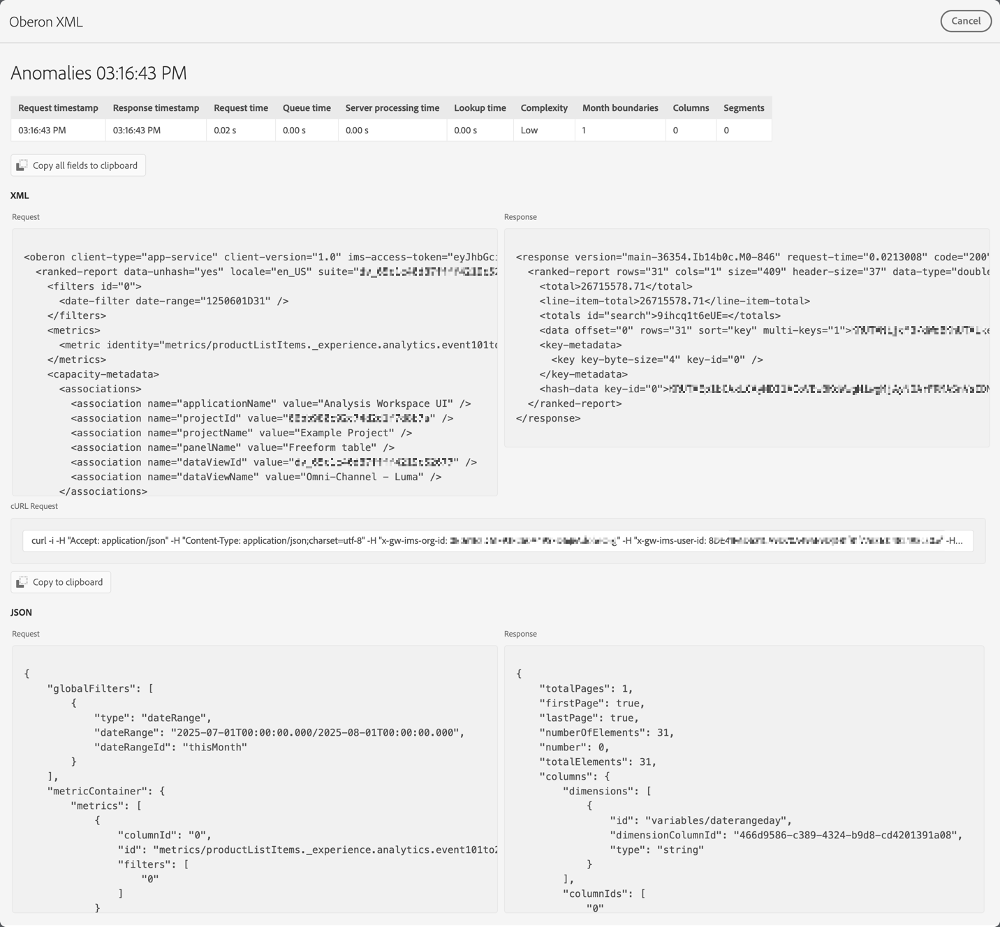

# Depurador de proyectos

El depurador de proyectos ayuda al usuario y al Soporte técnico de Adobe a solucionar problemas con sus proyectos en Analysis Workspace. Es posible que el Soporte de Adobe le pida que habilite Debugger para solucionar problemas de los vales que ha creado con el Soporte de Adobe. Algunos ejemplos de problemas son el tiempo de carga de las visualizaciones o los componentes dañados en las visualizaciones.

>[!NOTE]
>
>Para usar el depurador, debes tener acceso de **Editar** o **Copiar** [al proyecto](https://experienceleague.adobe.com/es/docs/experience-cloud-kcs/kbarticles/ka-25744).
>

## Habilitar depurador

>[!IMPORTANT]
>
>Guarde el proyecto antes de habilitar el depurador.
>

Para habilitar el depurador:

1. Seleccione **[!UICONTROL Ayuda]** > **[!UICONTROL Habilitar depurador]** en el menú del proyecto de Analysis Workspace.
1. Seleccione **[!UICONTROL Aceptar]** en el cuadro de diálogo **[!UICONTROL Habilitar depurador]**.
1. Confirme cuando el explorador le pida que vuelva a cargar la página o el sitio.

## Usar depurador

Cuando haya habilitado Debugger, todas las visualizaciones del proyecto no tendrán un icono  adicional.

Para utilizar el depurador para una visualización específica:

1. Seleccione  en la parte superior de la visualización.

   

1. Seleccione la acción adecuada en el menú contextual. Las acciones disponibles dependen de la visualización e indican el tipo de depuración que desea realizar. Por ejemplo, si selecciona **[!UICONTROL Anomalías]**, desea depurar la funcionalidad de anomalías en la visualización.
1. En el submenú, seleccione una marca de tiempo.
1. Se abre una ventana de depuración de **[!UICONTROL Oberon XML]** con detalles de la funcionalidad específica realizada por la visualización. Consulte a continuación un ejemplo del resultado de una solicitud de anomalía.

   

   Los detalles son:

   * **[!UICONTROL Solicitar marca de tiempo]**
   * **[!UICONTROL Marca de tiempo de respuesta]**
   * **[!UICONTROL tiempo de solicitud]**
   * **[!UICONTROL Tiempo de cola]**
   * **[!UICONTROL Tiempo de procesamiento del servidor]**
   * **[!UICONTROL Tiempo de búsqueda]**
   * **[!UICONTROL Complejidad]**
   * **[!UICONTROL Límites mensuales]**
   * **[!UICONTROL Columnas]**
   * **[!UICONTROL Segmentos]**
   * **[!UICONTROL XML]** **[!UICONTROL Solicitud]** y **[!UICONTROL Respuesta]**
   * **[!UICONTROL Solicitud cURL]**
   * **[!UICONTROL JSON]** **[!UICONTROL Solicitud]** y **[!UICONTROL Respuesta]**

1. Use  **[!UICONTROL Copiar todo el campo en el portapapeles]** para copiar toda la información de depuración en el portapapeles. Pegue la información en el editor o la herramienta que prefiera. La información consta de:

   * XML (solicitud)
   * XML (respuesta)
   * JSON (solicitud)
   * JSON (respuesta)
   * Solicitud cURL

1. Use  **[!UICONTROL Copiar al portapapeles]**&#x200B;d debajo de **[!UICONTROL Solicitud cURL]** para copiar la solicitud en el portapapeles.
1. Pase el ratón sobre cualquiera de las áreas de texto de **[!UICONTROL Solicitud]** o **[!UICONTROL Respuesta]** para mostrar y seleccionar  **[!UICONTROL Copiar al portapapeles]** para copiar el contenido de ese área de texto (XML o JSON) en el portapapeles.

1. Intercambie cualquier información que haya copiado y que el Soporte de Adobe haya solicitado para solucionar los problemas de las visualizaciones en su proyecto de Analysis Workspace.

1. Seleccione **[!UICONTROL Cancelar]** para cerrar la ventana de depuración de **[!UICONTROL Oberon XML]** y volver al proyecto.

Repita los pasos anteriores para cualquier otra visualización que desee solucionar.

## Deshabilitar depurador

>[!IMPORTANT]
>
>Antes de deshabilitar el depurador, guarde los cambios realizados en el proyecto y los que desee conservar como parte del ejercicio de depuración.
>

Para deshabilitar el depurador:

1. Seleccione **[!UICONTROL Ayuda]** > **[!UICONTROL Deshabilitar depurador]** en el menú del proyecto de Analysis Workspace.
1. Seleccione **[!UICONTROL Aceptar]** en el diálogo **[!UICONTROL Deshabilitar depurador]**.
1. Confirme cuando el explorador le pida que vuelva a cargar la página o el sitio.

