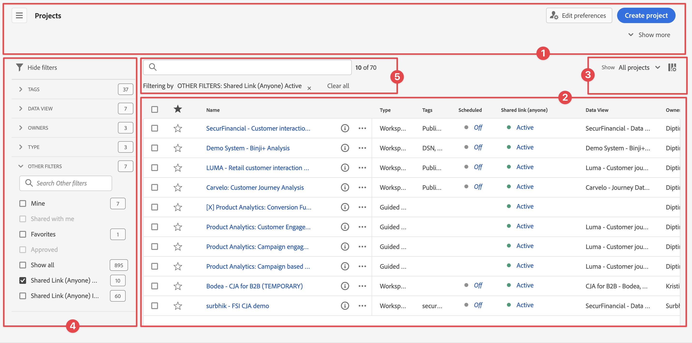

# Información general sobre Proyectos

Los proyectos de Workspace le permiten paneles, tablas y visualizaciones de datos para crear un análisis y compartirlo con cualquier persona de su organización. Antes de iniciar el primer proyecto, aprenda a acceder a sus proyectos, así como a navegar por ellos y a gestionarlos.

Para acceder a los proyectos en Customer Journey Analytics, seleccione **[!UICONTROL Workspace]**.  El administrador de **[!UICONTROL proyectos]** enumera todos los proyectos que posee o que han compartido con usted. El administrador de proyectos con la lista de proyectos también es la página de destino predeterminada para Customer Journey Analytics, a menos que haya configurado lo contrario en Preferencias.

## Área de título

Desde el área de título ➊ puede crear un proyecto, crear una carpeta, editar sus preferencias y mostrar u ocultar un panel con mosaicos adicionales.

* Para mostrar u ocultar un panel izquierdo que le permita seleccionar entre **[!UICONTROL Proyectos]** y **[!UICONTROL Aprendizaje]**, seleccione .
* El título muestra Proyectos que, opcionalmente, se añadirán con una ruta a la carpeta seleccionada. Por ejemplo [!UICONTROL Proyectos] > **[!UICONTROL Carpeta de la compañía]**. Puede seleccionar elementos de subcarpeta individuales para ir directamente a la carpeta específica.
* Para mostrar los mosaicos de un [**[!UICONTROL proyecto en blanco]**](create-projects.md), [**[!UICONTROL cuadro de resultados móvil en blanco]**](/help/mobile-app/create-scorecard.md), [**[!UICONTROL análisis guiado]**](/help/guided-analysis/overview.md), **[!UICONTROL Abrir la documentación]** y **[!UICONTROL Abrir notas de la versión]**, seleccione  **[!UICONTROL Mostrar más]**. Para ocultar el área con mosaicos, seleccione  **[!UICONTROL Mostrar menos]**.
* En función de lo que selecciones mostrar, con el [selector Mostrar](#show-selector), puedes editar las preferencias y realizar acciones en la carpeta actual visible en **[!UICONTROL Proyectos]**:

  | Acción | Descripción |
  |---|---|
  | **[!UICONTROL Crear proyecto]** | Seleccione para [crear un nuevo proyecto](create-projects.md): |
  | **[!UICONTROL Crear carpeta]** | Seleccione para [crear una nueva carpeta](workspace-folders/create-folders.md) |
  |  **[!UICONTROL Editar preferencias]** | [Editar preferencias](/help/analysis-workspace/user-preferences.md) para todos sus proyectos. Cuando la ruta de exploración reduce el espacio, esta acción forma parte del submenú . |
  | **[!UICONTROL Agregar proyectos]** | Seleccione para [añadir proyectos](workspace-folders/add-projects.md) a la carpeta actual. Cuando la ruta de exploración reduce el espacio, esta acción forma parte del submenú . |
  | **[!UICONTROL Cambiar el nombre de la carpeta]** | [Cambia el nombre](workspace-folders/manage-folders.md#rename-folders) de la carpeta actual. |
  | **[!UICONTROL Mover carpeta]** | [Mueve](workspace-folders/manage-folders.md#move-folders) la carpeta actual. |
  | **[!UICONTROL Eliminar carpeta]** | [Elimina](workspace-folders/manage-folders.md#delete-folders) la carpeta actual. |

## Lista de proyectos

La lista del proyecto ➋ muestra todos los proyectos que posee y que han compartido con usted. La lista tiene las siguientes columnas:

| Columna | Descripción |
| --- | --- | 
|  | Cuando se seleccionan uno o más proyectos, aparece una barra de acciones azul en la parte inferior de la interfaz de proyecto. Consulte las [acciones](#actions) para obtener más información.  |
|  | Selecciona para favorecer a  o para desfavorecer a  un proyecto. |
| **[!UICONTROL Título y descripción]** | Para editar el proyecto, seleccione el vínculo del título, que abre el [proyecto de Workspace](/help/analysis-workspace/home.md). Los proyectos compartidos con usted se indican con . Seleccione  para mostrar una ventana emergente con más detalles para el conjunto de datos. Seleccione  para abrir un menú contextual con acciones. Consulte las [Acciones](#actions) para obtener más información.  |
| **[!UICONTROL Tipo]** | Un proyecto de Workspace, una carpeta  o un [Cuadro de resultados móvil](/help/mobile-app/home.md). |
| **[!UICONTROL Etiquetas]** | Las etiquetas aplicadas al proyecto.  |
| **[!UICONTROL Programado]** | Si un proyecto está programado para enviarse por correo electrónico a los destinatarios. Las opciones son  **[!UICONTROL On]** o  **[!UICONTROL Off]**. Ver [Enviar datos de proyecto a otras personas](/help/analysis-workspace/export/t-schedule-report.md). |
| **[!UICONTROL Vínculo compartido (cualquiera)]** | Si un proyecto se comparte con alguien, incluso con personas que no tienen acceso a Analysis Workspace. Las opciones son  **[!UICONTROL Activo]** o  **[!UICONTROL Inactivo]**. Vea [Compartir un proyecto con alguien (no se requiere inicio de sesión)](/help/analysis-workspace/curate-share/share-projects.md#share-a-project-with-anyone-no-login-required) en [Compartir proyectos](/help/analysis-workspace/curate-share/share-projects.md) para obtener más información. |
| **[!UICONTROL Función del proyecto]** | Su función en el proyecto. Las opciones son: Editar, Duplicar y Ver. Consulte las [funciones del proyecto](/help/analysis-workspace/curate-share/curate.md) para obtener más información. |
| **[!UICONTROL Vista de datos]** | La vista de datos a la que está asociado el proyecto. |
| **[!UICONTROL Propietario]** | Persona que ha creado el proyecto (usted mismo o alguien que haya compartido su proyecto). |
| **[!UICONTROL Compartido con]** | Usuarios con los que se ha compartido el proyecto. |
| **[!UICONTROL Última modificación]** | Fecha y hora de última modificación del proyecto. |
| **[!UICONTROL Última apertura]** | Fecha y hora de última modificación del proyecto. |
| **[!UICONTROL ID del proyecto]** | El ID del proyecto. |
| **[!UICONTROL El intervalo de fecha más largo]** | El intervalo de fecha más largo de cualquiera de los paneles o visualizaciones del proyecto. |
| **[!UICONTROL Cantidad de consultas]** | Cantidad total de consultas contenidas en el proyecto.  |
| **[!UICONTROL Ubicación]** | Carpeta en la que reside el proyecto. |

Pase el puntero por encima de cualquier encabezado de columna para ver  y seleccione en el menú contextual:

* **[!UICONTROL Orden ascendente]**
* **[!UICONTROL Orden descendente]**
* **[!UICONTROL Cambiar tamaño de columna]**. Aparecerá una línea azul para ayudarle a cambiar el tamaño de la columna.

### Acciones

Puede realizar acciones en uno o más proyectos mediante el menú contextual  o la barra de acciones azul.

| Icono | Acción | Descripción |
|:---:| ---|---|
|  | **[!UICONTROL *x *seleccionado]** | Anule la selección de los proyectos y carpetas seleccionados y elimine la barra de acciones azul. |
|  | **[!UICONTROL Eliminar]** | Elimine uno o varios proyectos o carpetas. Se le pedirá una confirmación.
Proyectos que se eliminan:
<ul><li>No se puede recuperar</li><li>Se eliminan de la lista de proyectos</li><li>Ya no se puede acceder a con su dirección URL</li><li>Ya no se incluyen en los envíos programados (en los casos en que estaban configurados previamente para envíos programados) Para obtener información acerca de los envíos programados, consulte [Proyectos programados](/help/components/scheduled-projects-manager.md).  
 |
|  | **[!UICONTROL Compartir]** | Uso compartido de un proyecto. Consulte [Compartir un proyecto](/help/analysis-workspace/curate-share/share-projects.md) para obtener más información. |
|  | **[!UICONTROL Cambiar el nombre]** | Cambiar nombre a un proyecto. Abre un cuadro de diálogo **[!UICONTROL Cambiar nombre: *nombre de proyecto *]**. Escriba un nombre nuevo y seleccione**[!UICONTROL Guardar ]**. |
|  | **[!UICONTROL Copiar]** | Copie uno o varios proyectos. Proyecto no obtiene el mismo nombre y sufijo `(Copy)`. |
|  | **[!UICONTROL Anclar]** o **[!UICONTROL Desanclar]** | Anclar o desanclar uno o más proyectos o carpetas. Los proyectos y carpetas anclados aparecen en la parte superior de la lista e ignoran el orden de clasificación especificado. |
|  | **[!UICONTROL Subir]** | Mueva un proyecto o una carpeta anclados hacia arriba en la lista de proyectos. |
|  | **[!UICONTROL Bajar]** | Mueva un proyecto o una carpeta anclados hacia abajo en la lista de proyectos. |
|  | **[!UICONTROL Etiqueta]** | Etiquete uno o varios proyectos o carpetas. Se muestra el cuadro de diálogo **[!UICONTROL Componentes de etiqueta]** para seleccionar una o más etiquetas. Selecciona **[!UICONTROL Guardar]** para guardar las etiquetas de los proyectos o carpetas seleccionadas. |
|  | **[!UICONTROL Aprobar]** o **[!UICONTROL Desaprobar]** | Aprobar o desaprobar un proyecto. Solo los administradores pueden aprobar proyectos. |
|  | **[!UICONTROL Exportar CSV]** | Exportar los proyectos seleccionados a un archivo CSV con el nombre `Project List.csv`. |
|  | **[!UICONTROL Añadir proyectos]** | Añada uno o más proyectos a una carpeta seleccionada. En **[!UICONTROL Añadir proyectos]** puede seleccionar uno o más proyectos. Seleccione **[!UICONTROL Añadir]** para añadir los proyectos a la carpeta. Consulte [Añadir proyectos a carpetas](workspace-folders/add-projects.md#from-inside-a-folder) para obtener más información. |
|  | **[!UICONTROL Mover a]** | Mueva uno o más proyectos seleccionados a una carpeta. En **[!UICONTROL Seleccionar carpeta]**, seleccione la carpeta a la que desea mover el proyecto seleccionado y seleccione **[!UICONTROL Mover]**. Consulte [Añadir proyectos a carpetas](workspace-folders/add-projects.md#from-the-project-list) para obtener más información. |

## Mostrar selector

Puede cambiar la apariencia de la interfaz de Proyectos mediante los selectores de **[!UICONTROL Mostrar]** ➌. El selector **[!UICONTROL Mostrar]** define qué opciones están disponibles en el [Área de título](#title-area) y qué columnas se muestran en la [Lista de proyectos](#project-list).

* Para cambiar las opciones disponibles para el [Área de título](#title-area), seleccione **[!UICONTROL Mostrar]** **[!UICONTROL Todos los proyectos]** o **[!UICONTROL Mostrar]** **[!UICONTROL Carpetas y proyectos]**.

* Para definir qué columnas desea mostrar en la [Lista de proyectos](#project-list), seleccione  y en el cuadro de diálogo **[!UICONTROL Personalizar tabla]**, seleccione o anule la selección de columnas. Seleccione **[!UICONTROL Aplicar]** para aplicar la personalización. Consulte [Lista de proyectos](#project-list) para obtener más información sobre las columnas.

## Panel Filtro

Puede filtrar los proyectos y las carpetas de la [Lista de proyectos](#project-list) mediante el panel de filtro ➍. Para mostrar u ocultar el panel de filtro, utilice .

El panel de filtro consta de las siguientes secciones.

### Etiquetas

| Etiquetas | Descripción |
|---|---|
| {width="300"} | La sección **[!UICONTROL Etiquetas]** le permite filtrar las etiquetas. <ul><li>Utilice  *Búsqueda de etiquetas* para buscar las etiquetas que desea utilizar para filtrar.</li><li>Puede seleccionar más de una etiqueta. Las etiquetas disponibles dependen de las selecciones realizadas en otras secciones del panel de filtro.</li><li>Los números indican lo siguiente:<ul><li>**2︎⃣**: el número de etiquetas disponibles para los proyectos resultantes del filtro actual.</li><li>7︎⃣: el número de proyectos asociados a la etiqueta específica.</li></ul></li></ul> |

### Vista de datos

| Vista de datos | Descripción |
|---|---|
| {width="300"} | La sección **[!UICONTROL Vista de datos]** le permite filtrar las vistas de datos. <ul><li>Utilice  *Búsqueda vistas de datos* para buscar las vistas de datos que desea usar para filtrar.</li><li>Puede seleccionar más de una vista de datos. Las vistas de datos disponibles dependen de las selecciones realizadas en otras secciones del panel de filtro.</li><li>Los números indican lo siguiente:<ul><li>**3︎⃣**: El número de vistas de datos disponibles para los proyectos resultantes del filtro actual.</li><li>4︎⃣: número de proyectos asociados a la vista de datos específica.</li></ul></li></ul> |

### Propietarios

| Propietario | Descripción |
|---|---|
| {width="300"} | La sección **[!UICONTROL Propietario]** le permite filtrar por los propietarios. <ul><li>Utilice  *Búsqueda de propietarios* para buscar los propietarios que desea usar para filtrar.</li><li>Puede seleccionar más de un propietario. Los propietarios disponibles dependen de las selecciones realizadas en otras secciones del panel de filtros.</li><li>Los números indican lo siguiente:<ul><li>**3︎⃣**: el número de propietarios disponibles para los proyectos resultantes del filtro actual.</li><li>4︎⃣: el número de proyectos asociados al propietario específico.</li></ul></li></ul> |

### Tipo

| Tipo | Descripción |
|---|---|
| {width="300"} | La sección **[!UICONTROL Tipo]** le permite filtrar el tipo de proyectos o carpetas.<ul><li>Puede seleccionar una o varias de las siguientes opciones:<ul><li> **[!UICONTROL carpeta]**</li><li>**[!UICONTROL Proyecto del Espacio de trabajo]**</li><li>**[!UICONTROL Informe de valoración móvil]**</li></ul> <li>Puede seleccionar más de un otro filtro. Los otros filtros disponibles dependen de las selecciones realizadas en otras secciones del panel de filtros.</li><li>Los números indican lo siguiente:<ul><li>**5︎⃣**: el número de otros filtros disponibles para los proyectos resultantes del filtro actual.</li><li>4︎⃣: el número de proyectos asociados al otro filtro específico.</li></ul></li></ul> |

### Otros filtros

| Otros filtros | Descripción |
|---|---|
| {width="300"} | La sección **[!UICONTROL Otros filtros]** le permite filtrar otros filtros predefinidos.<ul><li>Puede seleccionar una o varias de las siguientes opciones:<ul><li> **[!UICONTROL Mostrar todo]**</li><li>**[!UICONTROL Compartidos conmigo]**</li><li>**[!UICONTROL Míos]**</li><li>**[!UICONTROL Aprobado]**</li><li>**[!UICONTROL Favoritos]**</li></ul> Lo que puede seleccionar depende de la función y los permisos.</li><li>Puede seleccionar más de un otro filtro. Los otros filtros disponibles dependen de las selecciones realizadas en otras secciones del panel de filtros.</li><li>Los números indican lo siguiente:<ul><li>**5︎⃣**: el número de otros filtros disponibles para los proyectos resultantes del filtro actual.</li><li>4︎⃣: el número de proyectos asociados al otro filtro específico.</li></ul></li></ul> |

## Buscar

Utilice el área de búsqueda ➎ para buscar proyectos y carpetas mediante el campo . Empiece a escribir y la [lista de proyectos](#project-list) se filtrará automáticamente en la entrada de la búsqueda.

El área Búsqueda también muestra los filtros aplicados desde el panel Filtro.

* Para quitar un filtro, seleccione  en el filtro.
* Para quitar todos los filtros, seleccione Borrar todo.

Si el espacio es limitado para mostrar los filtros individuales, verá **[!UICONTROL Segmentado por *x* filtros]**.

* Para quitar un filtro:

   1. Utilice **[!UICONTROL *x *filtros]** en la parte superior para abrir un menú contextual que enumere los tipos de filtros y los filtros individuales.
   1. Seleccione  para quitar un filtro.

<!--

The Projects page contains the following information: 

>[!NOTE]
>
>Some columns are not displayed by default. To customize the columns you see, click the **Customize table** icon .

|  Element  | Description  |
|---|---|
| [Edit preferences](/help/analysis-workspace/user-preferences.md) | Manage settings for Analysis Workspace and its related components for all new projects or panels that you create.  |
| [Create folder](/help/analysis-workspace/build-workspace-project/workspace-folders/create-folders.md)  | Add a new folder or subfolder to the list of projects and folders. |
| [Create project](/help/analysis-workspace/build-workspace-project/create-projects.md)  | Start a new project from scratch.  |
|  Show more  |Reveals options for creating a blank project or mobile scorecard, [viewing training tutorials](https://experienceleague.adobe.com/docs/analytics-learn/tutorials/analysis-workspace/analysis-workspace-basics/analysis-workspace-introduction.html?lang=es), or [viewing release notes](/help/release-notes/latest.md).  |
| Show Folders & Projects| Choose whether to show the folder structure of projects. For more information, see [About Folders in Analytics](/help/analysis-workspace/build-workspace-project/workspace-folders/about-folders.md). |
|  Customize table (icon)  | Allows you to customize the information that shows for each project on the Projects page.  |
|  Name  | Name of the Workspace project.  |
| Type | Indicates whether this is a Workspace Project, a folder, or a [Mobile Scorecard](https://experienceleague.adobe.com/docs/analytics/analyze/mobapp/home.html?lang=es). |
|  Tags  |Tags that were applied to the project.  |
| Scheduled | Indicates whether projects are scheduled to be emailed to recipients on a schedule. See [Send project data to others](/help/analysis-workspace/export/t-schedule-report.md). |
| Shared link (anyone) | Projects can be shared with anyone--even with people who don't have access to Analysis Workspace. This column shows whether projects have been shared in this way. See [Share a project with anyone (no login required)](/help/analysis-workspace/curate-share/share-projects.md#share-public-link) in [Share projects](/help/analysis-workspace/curate-share/share-projects.md) for more information. |
| Data view | The data view that the project is associated with. |
| [Project Role](https://experienceleague.adobe.com/docs/analytics/analyze/analysis-workspace/curate-share/share-projects.html?lang=es) | Indicates your role for the project - owners, edit, duplicate, view. |
|  Owner  | The person who created this project (either you or someone who shared the project with you.)  |
|  Shared with  | Users that the project has been shared with.  |
|  Last Modified  | Date and time when the project was last modified.  |
|  Last Opened  | Date and time when the project was last opened.  |
|  Project ID  | The ID of the project.  |
|  Longest Date Range  | The longest date range of the project.  |
|  Number of Queries  | The total number of queries contained in the project.  |
|  Location  | The folder where the project resides.  |

## Menu bar {#menu-bar}

Within a project, the menu provides options for managing your project, adding components, finding help, and more. Each menu option can also be accessed by keyboard [shortcuts](/help/analysis-workspace/build-workspace-project/fa-shortcut-keys.md).

|  Menu item  | Description  |
|---|---|
|  Project  | Includes common actions for project management, including New, Open, Save, and Save As. You can also refresh the entire project to retrieve the most recent data and definitions by clicking Refresh Project. [Download project data](/help/analysis-workspace/export/download-send.md) options enable you to export data from Workspace. **Project Info & Settings** (see below) offers many options for managing your project.  |
|  Edit  | Undo or redo your last action. Clear All will reset your project to a blank starting point. |
|  Insert  | Insert new panels or visualizations from this menu. You can also insert new panels and visualizations from the left panel.  |
|  [Components](/help/components/overview.md)  | Create new segments, calculated metric, date range, or alert components from your project. You can also create new components from the left panel. If your component definitions have recently changed, Refresh Components will retrieve the latest definitions. |
|  [Share](/help/analysis-workspace/curate-share/send-schedule-files.md)  | Curate, share and schedule PDF/CSV projects to recipients in your organization.  |
|  Help  | Access help documentation, videos, and the Analytics [Experience League community](https://experienceleaguecommunities.adobe.com/t5/adobe-analytics/ct-p/adobe-analytics-community?profile.language=es). Manage the visibility of Workspace tips as well as the [debugger](https://experienceleague.adobe.com/es/docs/analytics-learn/tutorials/apis/using-analysis-workspace-to-build-api-2-requests). Find details about Workspace and factors that impact project [performance](/help/technotes/optimizing-performance.md).  |
|  Share button or Owner  | If you are in an Own or Edit for the project, the Share button in the top-right gives you one-click access to manage your project recipients. If you are in a Duplicate or View role for the project, you will see the project owner's name. |

### Project Info & Settings {#info-settings}

**[!UICONTROL Workspace]** > **[!UICONTROL Project]** > **[!UICONTROL Project info & settings]** provides project-level information on the currently active project.

Settings include:

|  Setting  | Description  |
|---|---|
|  Project Name  | The name given to the project. You can double-click the name to edit it.  |
|  Created By  | Project owner name  |
|  Last Modified  | Date of last modification to the project.  |
|  Tags  |Lists any tags applied to a project for easier categorization.  |
|  Description  | A description is useful for clarifying the purpose of a project. You can double-click the description to edit it.  |
|  Count repeat instances in project  | Specifies whether repeat instances are counted in reports. Note: this setting does not apply to Flow or Fallout visualizations.  |
|  [Project color palette](/help/analysis-workspace/build-workspace-project/color-palettes.md)  | You can change the categorical color palette used in Workspace, by choosing from out-of-the-box palettes that have been optimized for color blindness, or by specifying your custom palette. This feature affects many things in Workspace, including most visualizations.  |
| [View Density](/help/analysis-workspace/build-workspace-project/view-density.md) | Lets you see more data on the screen by reducing the vertical padding of the left panel, freeform tables and cohort tables. |

## Left panel

Within a project, various icons are available in the left panel, and each represents important parts of a project:

* [Panels](/help/analysis-workspace/c-panels/panels.md) 

* [Visualizations](/help/analysis-workspace/visualizations/freeform-analysis-visualizations.md)

* [Components](/help/components/overview.md)

* [Data dictionary](/help/components/data-dictionary/data-dictionary-overview.md)

* [Table of contents](/help/analysis-workspace/build-workspace-project/project-table-of-contents.md) 

Components (Dimensions, Metrics, Segments, Date Ranges) in the left panel relate to the active panel data view. The active panel is identified by the blue border that surrounds it, and the active data view is listed at the top of the component panel.

## Project canvas {#canvas}

The project canvas is where you bring together panels, tables, visualizations, and components to build your analysis. A project can contain many panels, and each panel can contain many tables and visualizations.

Panels are helpful when you want to organize your projects according to time periods, data views, or analysis use case. The active panel will have a blue border around it, and determines what components are available in the left panel.

Depending on the starting point you chose for your projects, you will either have a [freeform table](/help/analysis-workspace/visualizations/freeform-table/freeform-table.md) or a [blank panel](/help/analysis-workspace/c-panels/blank-panel.md) in the canvas to begin with. The quickest way to start analyzing is to select one or many components and simply drag & drop them into the project canvas. A table of data will automatically be rendered for you. [Learn more](/help/analysis-workspace/visualizations/freeform-table/freeform-table.md) about the different options for building a table, or leverage our [training tutorial](/help/analysis-workspace/home.md) for more guidance on building your first project.

## Project Manager {#manager}

Analysis Workspace projects can be managed under **Analytics > Components >  Projects**. The Project Manager shows the projects that a specific user created. You can transfer project ownership to a new user under Admin > Analytics Users & Assets > Transfer Assets.

In Projects Manager, you can add, tag, share, duplicate/copy, and more. Search for a project in the search bar or by using the filter options in the left panel. You can filter by tag, owners, project type and more.

The following are common actions in the Projects manager, and can be taken on one or many projects at once:

|  Action  | Description  |
|---|---|
|  Add  | Create a new project from scratch.  |
|  Tag or Approve  | Choose "Tag" or "Approve" to organize your projects and make them easier to search for.  |
|  [Share](/help/analysis-workspace/curate-share/share-projects.md)  | Make a project available to other Analysis Workspace users in your organization.  |
|  Delete  | Delete your project.  |
|  Rename  | Edit the name of your project.  |
|  Copy  | Create a duplicate copy of your project. This creates a new project and project ID. Any shares or schedules tied to the original project will not be copied. |
|  Export to CSV  | Download your project as a CSV file, which includes plain-text data.  |

-->

