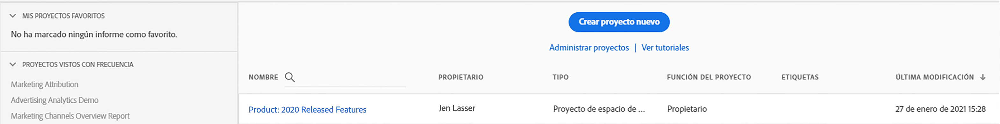
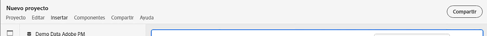
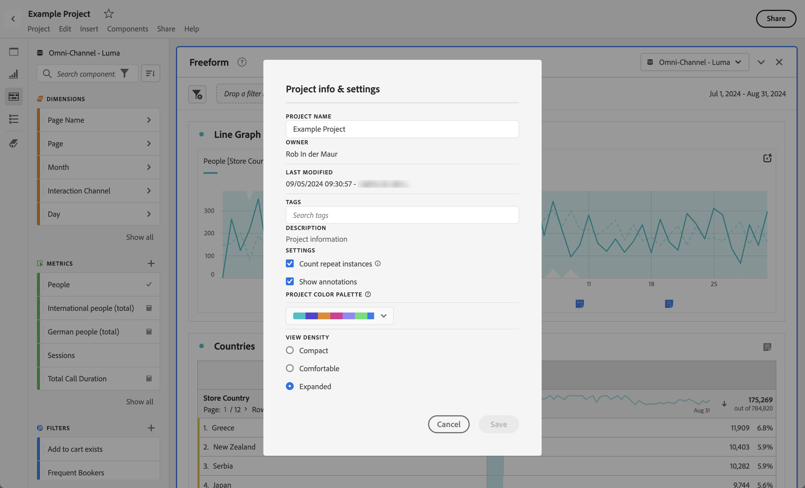
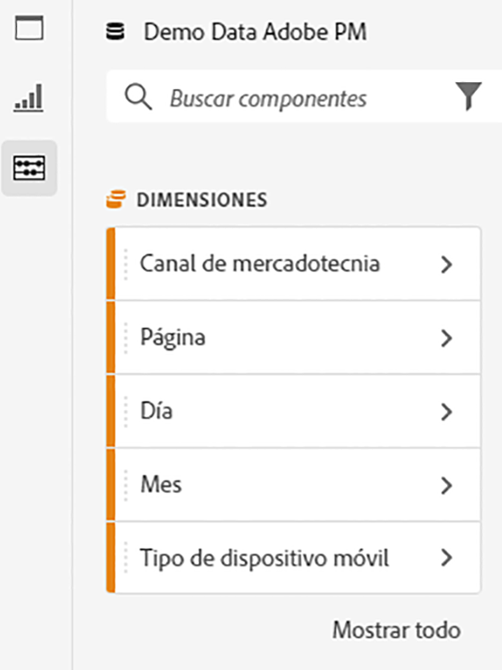
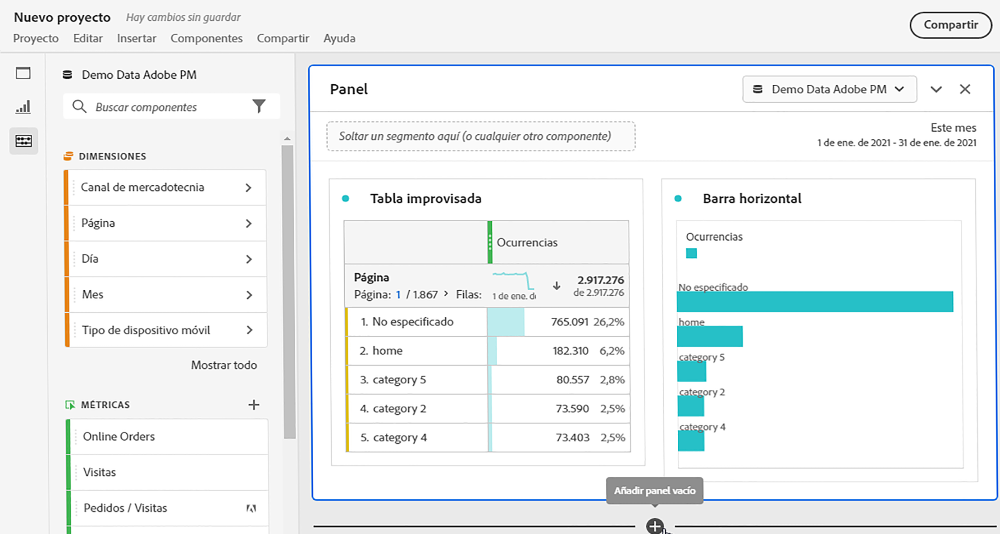
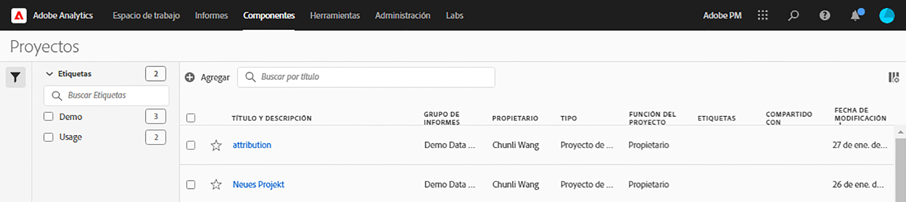

# Información general sobre Proyectos

Los proyectos de Workspace le permiten combinar componentes, tablas y visualizaciones de datos para crear un análisis y compartirlo con cualquier persona de su organización. Antes de iniciar el primer proyecto, aprenda a acceder a sus proyectos, así como a navegar por ellos y a gestionarlos.

## Lista de proyectos {#project-list}

La primera vez que acceda a **[!UICONTROL Analytics]** > **[!UICONTROL Workspace]**, la página muestra todos los proyectos que posee o a los que se le ha otorgado acceso. También es la página de aterrizaje de Adobe Analytics, a menos que haya establecido previamente una página de aterrizaje personalizada.

La página Proyectos contiene la siguiente información:

>[!NOTE]
>
>Algunas columnas no se muestran de forma predeterminada. Para personalizar las columnas que ve, haga clic en el botón **Personalizar tabla** icono .

| Elemento | Descripción |
|---|---|
| [Editar preferencias](/help/analysis-workspace/user-preferences.md) | Administre la configuración de Analysis Workspace y sus componentes relacionados para todos los proyectos o paneles nuevos que cree. |
| [Crear carpeta](/help/analysis-workspace/build-workspace-project/workspace-folders/create-folders.md) | Agregue una nueva carpeta o subcarpeta a la lista de proyectos y carpetas. |
| [Crear proyecto](/help/analysis-workspace/home.md) | Inicio de un nuevo proyecto desde cero o desde un [plantilla](https://experienceleague.adobe.com/docs/analytics/analyze/analysis-workspace/build-workspace-project/starter-projects.html?lang=es#analysis-workspace). |
| Mostrar más | Muestra las opciones para crear un proyecto en blanco o un informe de valoración móvil, [visualización de tutoriales de formación](https://experienceleague.adobe.com/docs/analytics-learn/tutorials/analysis-workspace/analysis-workspace-basics/analysis-workspace-introduction.html?lang=es)o [ver notas de la versión](/help/release-notes/latest.md). |
| Mostrar carpetas y proyectos | Elija si desea mostrar la estructura de carpetas de los proyectos. Para obtener más información, consulte [Acerca de las carpetas en Analytics](/help/analysis-workspace/build-workspace-project/workspace-folders/about-folders.md). |
| Personalizar tabla (icono) | Permite personalizar la información que se muestra para cada proyecto en la página Proyectos . |
| Nombre | Nombre del proyecto de Workspace. |
| Tipo | Indica si se trata de un proyecto de Workspace, una carpeta o un [Informe de valoración móvil](https://experienceleague.adobe.com/docs/analytics/analyze/mobapp/home.html?lang=es). |
| Etiquetas | Etiquetas aplicadas al proyecto. |
| Programado | Indica si los proyectos están programados para enviarse por correo electrónico a los destinatarios según una programación. Consulte [Programar proyectos](/help/analysis-workspace/curate-share/t-schedule-report.md). |
| Vínculo compartido (cualquier persona) | Los proyectos se pueden compartir con cualquier persona, incluso con personas que no tengan acceso a Analysis Workspace. Esta columna muestra si los proyectos se han compartido de esta manera. Consulte [Compartir un proyecto con cualquier persona (no se requiere inicio de sesión)](/help/analysis-workspace/curate-share/share-projects.md#share-public-link) en [Compartir proyectos](/help/analysis-workspace/curate-share/share-projects.md) para obtener más información. |
| Grupo de informes | Grupo de informes al que está asociado el proyecto. |
| [Función del proyecto](https://experienceleague.adobe.com/docs/analytics/analyze/analysis-workspace/curate-share/share-projects.html?lang=es) | Indica la función en el proyecto: propietarios, edición, duplicado o vista. |
| Propietario | Persona que ha creado el proyecto (usted mismo o alguien que haya compartido su proyecto). |
| Compartido con | Usuarios con los que se ha compartido el proyecto. |
| Última modificación | Fecha y hora de última modificación del proyecto. |
| Última apertura | Fecha y hora en que se abrió el proyecto por última vez. |
| ID del proyecto | ID del proyecto. |
| El intervalo de fecha más largo | Intervalo de fechas más largo del proyecto. |
| Cantidad de consultas | Número total de consultas contenidas en el proyecto. |
| Ubicación | Carpeta donde reside el proyecto. |

## Barra de menú {#menu-bar}

En un proyecto, el menú proporciona opciones para administrar el proyecto, agregar componentes, buscar ayuda, etc. También se puede acceder a cada opción de menú mediante [métodos abreviados](/help/analysis-workspace/build-workspace-project/fa-shortcut-keys.md) del teclado.

| Elemento del menú | Descripción |
|---|---|
| Proyecto  | Incluye acciones comunes para la administración de proyectos, como Nuevo, Abrir, Guardar, Guardar como y Guardar como plantilla. También puede actualizar todo el proyecto para recuperar los datos y las definiciones más recientes haciendo clic en Actualizar proyecto. Las opciones [Descargar CSV y PDF](/help/analysis-workspace/curate-share/download-send.md) permiten exportar datos desde Workspace. **Información y configuración del proyecto** (ver más abajo) ofrece muchas opciones para administrar el proyecto. |
| Editar | Deshacer o volver a hacer la última acción. Borrar todo restablecerá el proyecto a un punto de partida en blanco. |
| Insertar | Inserte nuevos paneles o visualizaciones desde este menú. También puede insertar nuevos paneles y visualizaciones desde el carril izquierdo. |
| [Componentes](/help/components/overview.md) | Cree nuevos componentes de filtro, métrica calculada, intervalo de fecha o alerta a partir del proyecto. También puede crear nuevos componentes desde el carril izquierdo. Si las definiciones de los componentes han cambiado recientemente, Actualizar componentes recuperará las definiciones más recientes. |
| [Compartir](/help/analysis-workspace/curate-share/send-schedule-files.md) | Puede revisar, compartir y programar proyectos en PDF/CSV para destinatarios de su organización. |
| Ayuda | Acceda a la documentación de ayuda, los vídeos y la [comunidad de Experience League](https://experienceleaguecommunities.adobe.com/t5/adobe-analytics/ct-p/adobe-analytics-community?profile.language=es) de Analytics. Administre la visibilidad de las sugerencias de Workspace, así como el [depurador](https://www.adobe.io/apis/experiencecloud/analytics/docs.html#!AdobeDocs/analytics-2.0-apis/master/reporting-tricks.md). Descubra información acerca de Workspace y factores que afectan al [rendimiento](/help/analysis-workspace/workspace-faq/optimizing-performance.md) del proyecto. |
| Botón Compartir o Propietario | Si se encuentra en Propio o Editar en el proyecto, el botón Compartir situado en la parte superior derecha le permite administrar los destinatarios del proyecto con un solo clic. Si tiene la función Duplicar o Ver en el proyecto, verá el nombre del propietario del proyecto. |

### Info y configuración del proyecto {#info-settings}

**[!UICONTROL Workspace]** > **[!UICONTROL Proyecto]** > **[!UICONTROL Información y configuración del proyecto]**  proporciona información a nivel de proyecto sobre el proyecto activo.

La configuración incluye lo siguiente:

| Configuración | Descripción |
|---|---|
| Proyecto  Nombre | Nombre proporcionado al proyecto. Puede hacer doble clic en el nombre para editarlo. |
| Creado por | Nombre del propietario del proyecto. |
| Última modificación | Fecha de la última modificación del proyecto. |
| Etiquetas | Enumera cualquier etiqueta aplicada a un proyecto para una ordenación por categorías más sencilla. |
| Descripción | Una descripción es útil para aclarar el propósito de un proyecto. Puede hacer doble clic en la descripción para editarla. |
| Contar instancias repetidas en el proyecto | Especifica si las instancias repetidas se cuentan en los informes. Nota: Esta configuración no se aplica a las visualizaciones de flujo o visitas en el orden previsto. |
| [Paleta de colores del proyecto](/help/analysis-workspace/build-workspace-project/color-palettes.md) | Puede cambiar la paleta de colores categórica que se utiliza en Workspace eligiendo una de las paletas integradas que se han optimizado para casos de daltonismo o especificando la paleta personalizada. Esta función afecta a muchos elementos del Workspace, incluidas la mayoría de visualizaciones. |
| [Ver densidad](/help/analysis-workspace/build-workspace-project/view-density.md) | Le permite ver más datos en la pantalla al reducir el margen vertical del carril izquierdo, las tablas de forma libre y las tablas de cohorte. |

## Carril izquierdo {#left-rail}

En un proyecto, se accede a [paneles](/help/analysis-workspace/c-panels/panels.md), tablas, [visualizaciones](/help/analysis-workspace/visualizations/freeform-analysis-visualizations.md) y [componentes] desde el carril izquierdo. Estos son los componentes básicos del proyecto.

También puede acceder a las visualizaciones y los paneles desde el [Panel en blanco](/help/analysis-workspace/c-panels/blank-panel.md).

Los componentes (dimensiones, métricas, filtros e intervalos de fechas) del carril izquierdo están relacionados con la vista de datos del panel activo. El panel principal tiene un borde azul alrededor y el grupo de vistas de datos activo se mostrará en la parte superior del carril del componente.

## Lienzo del proyecto {#canvas}

En el lienzo del proyecto se reúnen los paneles, las tablas, las visualizaciones y los componentes para generar el análisis. Un proyecto puede contener muchos paneles, y cada panel puede contener muchas tablas y visualizaciones.

Los paneles son útiles cuando desea organizar sus proyectos según períodos de tiempo, vistas de datos o casos de uso de análisis. El panel principal tiene un borde azul alrededor y determina qué componentes están disponibles en el carril izquierdo.

Según el punto de partida que haya elegido para sus proyectos, tendrá una [tabla de forma libre](/help/analysis-workspace/visualizations/freeform-table/freeform-table.md) o un [panel en blanco](/help/analysis-workspace/c-panels/blank-panel.md) en el lienzo para empezar. La forma más rápida de empezar a analizar es seleccionar uno o varios componentes y simplemente arrastrarlos y soltarlos en el lienzo del proyecto. Automáticamente, se mostrará una tabla de datos. [Obtenga más información](/help/analysis-workspace/visualizations/freeform-table/freeform-table.md) acerca de las diferentes opciones para crear una tabla o aproveche nuestros [tutoriales de aprendizaje](/help/analysis-workspace/home.md) para obtener más información acerca de cómo crear su primer proyecto.

## Gestor de proyecto {#manager}

Los proyectos de Analysis Workspace se pueden administrar en **Analytics > Componentes > Proyectos**. El administrador de proyectos muestra los elementos que ha creado un usuario en particular. La propiedad del proyecto se puede transferir a un nuevo usuario en Administración > Usuarios y activos de Analytics > Transferir activos.

En el administrador de proyectos, puede agregar, etiquetar, compartir, duplicar/copiar, etc. Busque un proyecto en la barra de búsqueda o utilizando las opciones de filtro del carril izquierdo. Puede filtrar por etiqueta, propietarios, tipo de proyecto y más.

Las siguientes acciones comunes del administrador de proyectos se pueden llevar a cabo en uno o varios proyectos a la vez:

| Acción | Descripción |
|---|---|
| Agregar | Cree un nuevo proyecto desde cero. |
| Etiquetar o Aprobar | Elija &quot;Etiqueta&quot; o &quot;Aprobar&quot; para organizar sus proyectos y facilitar su búsqueda. |
| [Compartir](/help/analysis-workspace/curate-share/share-projects.md) | Hace que este proyecto esté disponible para otros usuarios de Analysis Workspace de su organización. |
| Eliminar | Elimine el proyecto. |
| Cambiar nombre | Edite el nombre del proyecto. |
| Copiar | Cree un duplicado del proyecto. Esto crea un nuevo proyecto y un ID de proyecto. No se copiará ningún recurso compartido o programación vinculados al proyecto original. |
| Exportar a CSV | Descargue el proyecto como archivo CSV, que incluye datos de texto sin formato. |
