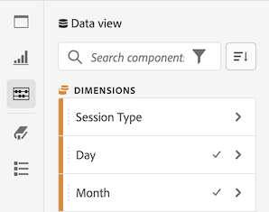

# Información general sobre Proyectos

Los proyectos de Workspace le permiten combinar componentes de datos, tablas y visualizaciones para diseñar su análisis y compartirla con cualquier persona de su organización. Antes de iniciar el primer proyecto, descubra cómo acceder, navegar y administrar los proyectos.

## Lista del proyecto {#project-list}

Cuando vaya por primera vez a **[!UICONTROL Analytics]** > **[!UICONTROL Workspace]**, la página lista todos los proyectos que posee o que ha compartido con usted. Esta es también la página de aterrizaje para Adobe Analytics, a menos que haya establecido previamente una página de aterrizaje personalizada.

La lista de proyectos de Workspace contiene la siguiente información:

| Elemento | Descripción |
|---|---|
| [Crear nuevo proyecto](/help/analysis-workspace/home.md) | Haga clic en este vínculo para inicio de un nuevo proyecto desde cero o desde una [plantilla](https://experienceleague.adobe.com/docs/analytics/analyze/analysis-workspace/build-workspace-project/starter-projects.html?lang=en#analysis-workspace) creada para usted. |
| Administrar proyectos | Al hacer clic en este vínculo, accederá al administrador de componentes de proyectos (**[!UICONTROL Analytics]** > **[!UICONTROL Componentes]** > **[!UICONTROL Proyectos]**), que muestra todos sus proyectos y le permite etiquetar, compartir, eliminar, cambiar el nombre, aprobar, copiar y exportar proyectos a CSV. |
| Establecer como página de aterrizaje | Convierte esta página en su página de aterrizaje de Workspace. |
| [Ver tutoriales](https://docs.adobe.com/content/help/en/analytics-learn/tutorials/analysis-workspace/analysis-workspace-basics/analysis-workspace-introduction.html) | Le permite acceder a los tutoriales en vídeo de Analysis Workspace. |
| Nombre | Nombre del proyecto de Workspace. |
| Propietario | Persona que ha creado el proyecto (usted mismo o alguien que haya compartido su proyecto). |
| Tipo | Indica si se trata de un proyecto de Workspace o de un cuadro de mandos [móvil](https://docs.adobe.com/content/help/es-ES/analytics/analyze/mobapp/home.html). |
| [Función del proyecto](https://experienceleague.adobe.com/docs/analytics/analyze/analysis-workspace/curate-share/share-projects.html) | Indica la función del proyecto: propietarios, edición, duplicado, vista. |
| Etiquetas | Etiquetas que se aplicaron al proyecto. |
| Última modificación | Fecha y hora de última modificación del proyecto. |
| Mis proyectos favoritos | Para marcar un proyecto como favorito, abra el proyecto y haga clic en la estrella junto a su nombre. Aparecerá en esta lista la próxima vez que abra Workspace. |
| Proyectos vistos con frecuencia | Lista todos los proyectos que abre con frecuencia para facilitar el acceso. |

## Barra de menús {#menu-bar}

Dentro de un proyecto, el menú proporciona opciones para administrar el proyecto, agregar componentes, buscar ayuda, etc. También se puede acceder a cada opción de menú mediante los [accesos directos](https://experienceleague.adobe.com/docs/analytics/analyze/analysis-workspace/build-workspace-project/fa-shortcut-keys.html) del teclado.

| Elemento de menú | Descripción |
|---|---|
| Proyecto  | Incluye acciones comunes para la administración de proyectos, incluidas Nueva, Abrir, Guardar, Guardar como y [Guardar como plantilla](https://experienceleague.adobe.com/docs/analytics/analyze/analysis-workspace/build-workspace-project/starter-projects.html). También puede actualizar todo el proyecto para recuperar los datos y las definiciones más recientes haciendo clic en Actualizar proyecto. [Las opciones de descarga de CSV y ](https://experienceleague.adobe.com/docs/analytics/analyze/analysis-workspace/curate-share/download-send.html) PDF le permiten exportar datos desde Workspace. [Información y ](https://experienceleague.adobe.com/docs/analytics/analyze/analysis-workspace/build-workspace-project/freeform-overview.html?#info-settings) configuración del proyecto ofrece muchas opciones para administrar el proyecto. |
| Editar  | Deshacer o rehacer la última acción. Borrar todo restablecerá el proyecto a un punto de partida en blanco. |
| Insertar | Inserte nuevos paneles o visualizaciones desde este menú. También puede insertar nuevos paneles y visualizaciones desde el carril izquierdo. |
| [Componentes](https://experienceleague.adobe.com/docs/analytics/analyze/analysis-workspace/components/analysis-workspace-components.html) | Cree nuevos componentes de segmento, métrica calculada, intervalo de fechas o alerta a partir de su proyecto. También puede crear nuevos componentes desde el carril izquierdo. Si las definiciones de componentes han cambiado recientemente, Actualizar componentes recuperará las definiciones más recientes. |
| [Compartir](https://experienceleague.adobe.com/docs/analytics/analyze/analysis-workspace/curate-share/send-schedule-files.html) | Depure, comparta y programe proyectos PDF/CSV para destinatarios de su organización. |
| Ayuda | Acceda a documentación de ayuda, vídeos y a la comunidad de Experience League [Analytics](https://experienceleaguecommunities.adobe.com/t5/adobe-analytics/ct-p/adobe-analytics-community). Administre la visibilidad de las sugerencias de Workspace así como el [depurador](https://www.adobe.io/apis/experiencecloud/analytics/docs.html#!AdobeDocs/analytics-2.0-apis/master/reporting-tricks.md). Obtenga detalles sobre Workspace y los factores que afectan al [rendimiento](https://experienceleague.adobe.com/docs/analytics/analyze/analysis-workspace/workspace-faq/optimizing-performance.html) del proyecto. |
| Botón Compartir o Propietario | Si está en un proyecto propio o editado, el botón Compartir de la parte superior derecha le proporciona acceso con un solo clic para administrar sus destinatarios de proyecto. Si está en una función de Duplicado o Vista para el proyecto, verá el nombre del propietario del proyecto. |

### Info y configuración del proyecto {#info-settings}

**[!UICONTROL Workspace]** > **[!UICONTROL Proyecto]** > **[!UICONTROL Información y configuración del proyecto]** proporciona información a nivel de proyecto sobre el proyecto activo.

La configuración incluye:

| Configuración | Descripción |
|---|---|
| Proyecto  Nombre | Nombre proporcionado al proyecto. Puede hacer doble clic en el nombre para editarlo. |
| Creado por | Nombre del propietario del proyecto. |
| Última modificación | Fecha de la última modificación del proyecto. |
| Etiquetas | Enumera cualquier etiqueta aplicada a un proyecto para una ordenación por categorías más sencilla. |
| Descripción | Una descripción es útil para aclarar el propósito de un proyecto. Puede hacer doble clic en la descripción para editarla. |
| Contar instancias repetidas en el proyecto | Especifica si las instancias repetidas se cuentan en los informes. Nota: esta configuración no se aplica a las visualizaciones de flujo o visitas en el orden previsto. |
| [Paleta de colores del proyecto](https://experienceleague.adobe.com/docs/analytics/analyze/analysis-workspace/build-workspace-project/color-palettes.html) | Puede cambiar la paleta de colores categórica utilizada en Workspace seleccionando entre las paletas integradas que se han optimizado para la ceguera del color o especificando la paleta personalizada. Esta función afecta a muchos elementos del Workspace, incluidas la mayoría de visualizaciones. |
| [Ver densidad](https://experienceleague.adobe.com/docs/analytics/analyze/analysis-workspace/build-workspace-project/view-density.html) | Le permite ver más datos en la pantalla al reducir el margen vertical del carril izquierdo, las tablas improvisada y las tablas de cohorte. |

## Carril izquierdo {#left-rail}

Dentro de un proyecto, se accede a [paneles](https://experienceleague.adobe.com/docs/analytics/analyze/analysis-workspace/panels/panels.html), tablas, [visualizaciones](https://experienceleague.adobe.com/docs/analytics/analyze/analysis-workspace/visualizations/freeform-analysis-visualizations.html) y [componentes](https://experienceleague.adobe.com/docs/analytics/analyze/analysis-workspace/components/analysis-workspace-components.html) desde el carril izquierdo. Estos son los componentes básicos del proyecto.

También puede acceder a visualizaciones y paneles desde el [Panel en blanco](https://experienceleague.adobe.com/docs/analytics/analyze/analysis-workspace/panels/blank-panel.html).

Los componentes (Dimension, Métricas, Segmentos e Intervalos de fechas) del carril izquierdo se relacionan con el grupo de informes del panel activo. El panel activo tendrá un borde azul alrededor y el grupo de informes activo se mostrará en la parte superior del carril del componente.

## Lienzo del proyecto {#canvas}

El lienzo del proyecto es donde se reúnen paneles, tablas, visualizaciones y componentes para crear la análisis. Un proyecto puede contener muchos paneles y cada uno de ellos puede contener muchas tablas y visualizaciones.

Los paneles son útiles cuando desea organizar sus proyectos según períodos de tiempo, grupos de informes o casos de uso de análisis. El panel activo tendrá un borde azul alrededor y determina qué componentes están disponibles en el carril izquierdo.

Según el punto de partida que elija para sus proyectos, para empezar tendrá una [tabla improvisada](https://experienceleague.adobe.com/docs/analytics/analyze/analysis-workspace/visualizations/freeform-table/freeform-table.html) o un [panel en blanco](https://experienceleague.adobe.com/docs/analytics/analyze/analysis-workspace/panels/blank-panel.html) en el lienzo. La forma más rápida de analizar los inicios es seleccionar uno o varios componentes y simplemente arrastrarlos y colocarlos en el lienzo del proyecto. Se mostrará automáticamente una tabla de datos. [Obtenga ](https://experienceleague.adobe.com/docs/analytics/analyze/analysis-workspace/visualizations/freeform-table/freeform-table.html) más información sobre las distintas opciones para crear una tabla o aproveche nuestro  [tutorial de ](https://experienceleague.adobe.com/docs/analytics/analyze/analysis-workspace/home.html?#training-tutorial) formación para obtener más información sobre cómo crear su primer proyecto.

## Gestor de proyecto {#manager}

Los proyectos de Analysis Workspace se pueden administrar en **Analytics > Componentes > Proyectos**. El Administrador de proyectos muestra los elementos que ha creado un usuario específico. La propiedad del proyecto se puede transferir a un nuevo usuario en Administración > Usuarios y recursos de Analytics > Transferir recursos.

En el Administrador de proyectos, puede agregar, etiquetar, compartir, duplicado/copiar, etc. Busque un proyecto en la barra de búsqueda o utilizando las opciones de filtro del carril izquierdo. Puede filtrar por etiqueta, propietarios, tipo de proyecto y más.

Las siguientes son acciones comunes en el administrador de proyectos y se pueden realizar en uno o varios proyectos a la vez:

| Acción | Descripción |
|---|---|
| Agregue | Cree un nuevo proyecto desde cero o desde un inicio a partir de una [plantilla](https://experienceleague.adobe.com/docs/analytics/analyze/analysis-workspace/build-workspace-project/starter-projects.html). |
| Etiquetar o aprobar | Elija &quot;Etiqueta&quot; o &quot;Aprobar&quot; para organizar sus proyectos y facilitar su búsqueda. |
| [Compartir](https://experienceleague.adobe.com/docs/analytics/analyze/analysis-workspace/curate-share/share-projects.html) | Hace que este proyecto esté disponible para otros usuarios de Analysis Workspace de su organización. |
| Eliminar | Elimine el proyecto. |
| Cambiar nombre | Edite el nombre del proyecto. |
| Copy | Cree una copia de duplicado del proyecto. Esto crea un nuevo ID de proyecto y proyecto. No se copiará ningún recurso compartido o programa vinculado al proyecto original. |
| Exportar a CSV | Descargue el proyecto como archivo CSV, que incluye datos de texto sin formato. |
