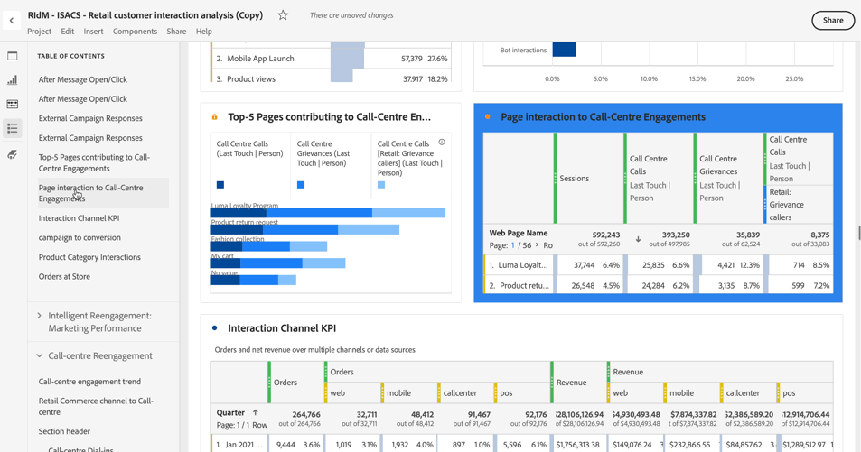

# Tabla de contenido

Puede ver una tabla de contenido de un proyecto en Analysis Workspace, lo que le permite moverse rápidamente entre cualquier panel y visualización que exista en el proyecto. La tabla de contenido es especialmente útil cuando se ven proyectos de mayor tamaño que contienen muchos paneles y visualizaciones.

>[!BEGINSHADEBOX]

Consulte  [Crear y editar una tabla de contenido](https://experienceleague.adobe.com/es/docs/analytics-learn/tutorials/analysis-workspace/navigating-workspace-projects/create-a-toc-in-analysis-workspace){target="_blank"} para ver un vídeo de demostración.

>[!ENDSHADEBOX]

>[!TIP]
>
>Puede utilizar la visualización del encabezado de sección para identificar y articular una sección dentro de un panel que contenga muchas visualizaciones. Estos encabezados de sección también se muestran como entradas en la tabla de contenido.
>

Para ver la tabla de contenido de un proyecto:

1. En Analysis Workspace, vaya al proyecto en el que desea ver la tabla de contenido.

1. En el panel de botones, seleccione  **[!UICONTROL Tabla de contenido]**. Consulte [Información general de Analysis Workspace](/help/analysis-workspace/home.md) para obtener más información. 

   Se muestra la **[!UICONTROL tabla de contenido]** del proyecto y de manera predeterminada se expande cada panel.

1. En la **[!UICONTROL tabla de contenido]**, seleccione una visualización. 

   La visualización seleccionada se desplaza automáticamente y se resalta brevemente.

   

>[!MORELIKETHIS]
>
>* [Simplificar la navegación del panel de control con la nueva función de tabla de contenido en Adobe Analytics](https://experienceleaguecommunities.adobe.com/t5/adobe-analytics-blogs/simplify-dashboard-navigation-with-the-new-table-of-contents/ba-p/731284)
