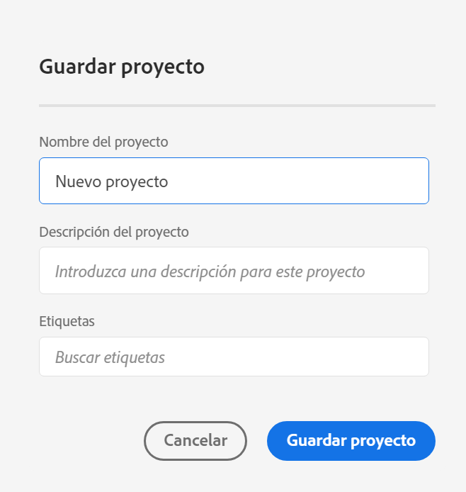
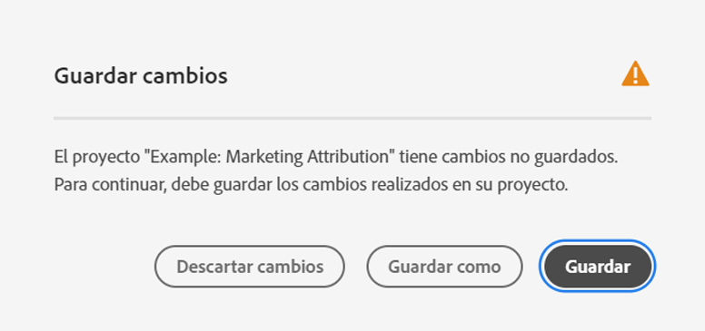

# Guardar proyectos

Para guardar los cambios en un proyecto, vaya al menú **[!UICONTROL Proyecto]** de Workspace. Workspace también guarda automáticamente proyectos en determinados casos.

## Guardar opciones de proyecto {#Save}

Hay diferentes acciones de guardado que puede realizar en el menú **[!UICONTROL Proyecto]**, según cómo desee acceder a su análisis en el futuro.

| Acción | Descripción |
|---|---| 
| **[!UICONTROL Guardar]** | Guardar cambios en el proyecto. Si se comparte el proyecto, los destinatarios del proyecto también verán los cambios. Cuando guarde el proyecto por primera vez, se le pedirá que indique un nombre y una descripción (opcional), y que agregue etiquetas (opcional). |
| **[!UICONTROL Guardar con notas]** | Antes de guardar el proyecto, agregue notas sobre los cambios realizados en el proyecto. Las notas se almacenan con la versión del proyecto y están disponibles para todos los editores en [!UICONTROL Proyecto] > [!UICONTROL Abrir versión anterior]. |
| **[!UICONTROL Guardar como]** | Cree un duplicado del proyecto. El proyecto original no se verá afectado. |
| **[!UICONTROL Guardar como plantilla]** | Guarde el proyecto como una [plantilla personalizada](https://experienceleague.adobe.com/docs/analytics/analyze/analysis-workspace/build-workspace-project/starter-projects.html?lang=es) que esté disponible para su organización en **[!UICONTROL Proyecto > Nuevo]** |

## Guardar automáticamente {#Autosave}

Los proyectos existentes, es decir, los que se han guardado al menos una vez antes, se guardan automáticamente cada dos minutos en el equipo local. Los nuevos proyectos que nunca se han guardado no se guardan automáticamente.

Hay algunas opciones, como las siguientes, que pueden evitar dejar cambios no guardados en un proyecto.

### Abrir otro proyecto de Workspace

Adobe proporciona la opción de guardar antes de salir de la página. Después de abandonar un proyecto existente, se elimina la copia local guardada automáticamente.

### Salir o cerrar una pestaña

El explorador advierte que se perderán los cambios no guardados. Puede elegir entre salir o cancelar.

### El explorador se bloquea o se agota el tiempo de espera de la sesión

Para los **proyectos** existentes, al volver a Workspace, el usuario verá un modo de **recuperación del proyecto**. Si selecciona Sí, se restaurará el proyecto a partir de la copia local guardada automáticamente. “No” elimina la copia local guardada automáticamente y abre la última versión guardada por el usuario del proyecto.

Para **nuevos** proyectos que nunca se han guardado, los cambios sin guardar no se pueden recuperar.

## Abrir la versión anterior {#previous-version}

>[!NOTE]
>
>Las versiones anteriores del proyecto están actualmente en versión limitada.

Para abrir una versión anterior de un proyecto:

1. Vaya a **[!UICONTROL Proyecto]** > **[!UICONTROL Abrir versión anterior]**

   

1. Revise la lista de versiones anteriores disponibles.
   Se muestran la [!UICONTROL Marca de tiempo] y el [!UICONTROL Editor], así como las [!UICONTROL Notas] si es que se añadieron cuando el [!UICONTROL Editor] guardó. Las versiones sin notas se almacenan durante 90 días; las versiones con notas se almacenan durante 1 año.
1. Seleccione una versión anterior y haga clic en **[!UICONTROL Cargar]**.
A continuación, la versión anterior se carga con una notificación. La versión anterior no se convierte en la versión guardada actual del proyecto hasta que no haga clic en **[!UICONTROL Guardar]**. Si abandona la versión cargada, al volver, verá la última versión guardada del proyecto.
