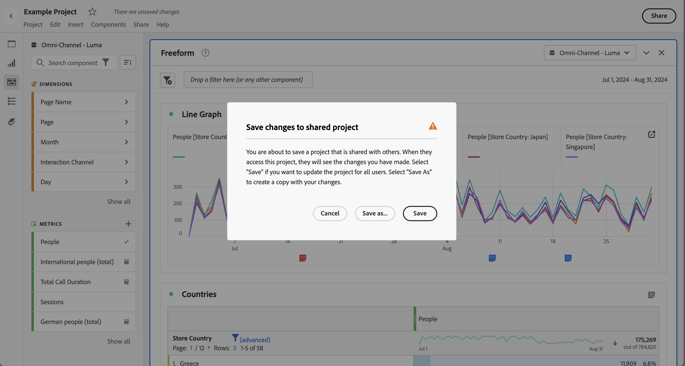
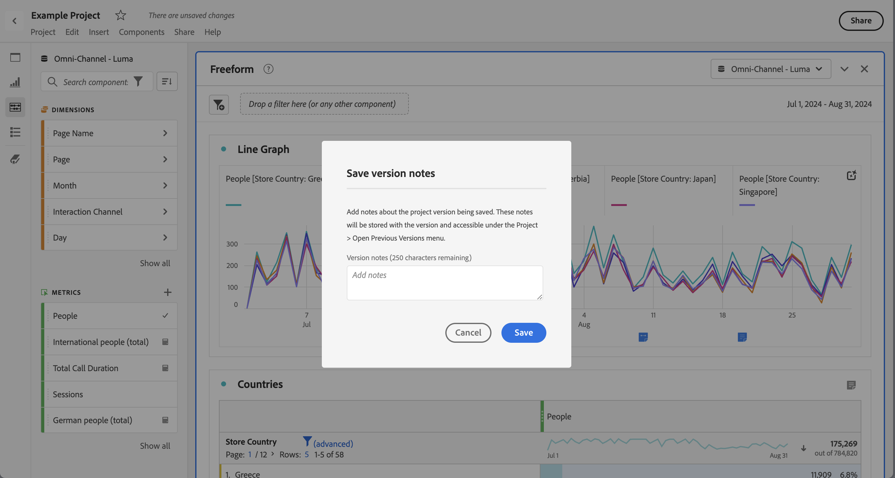
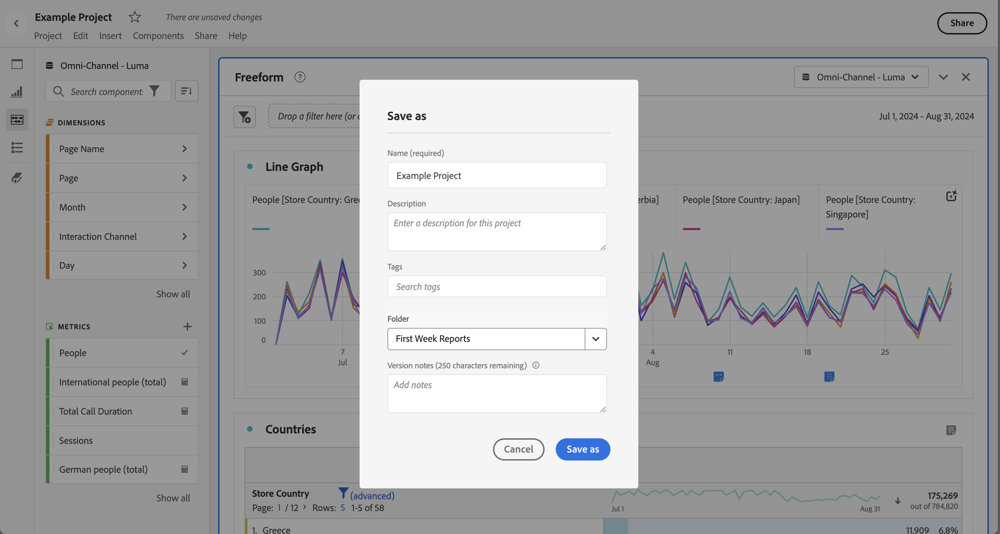
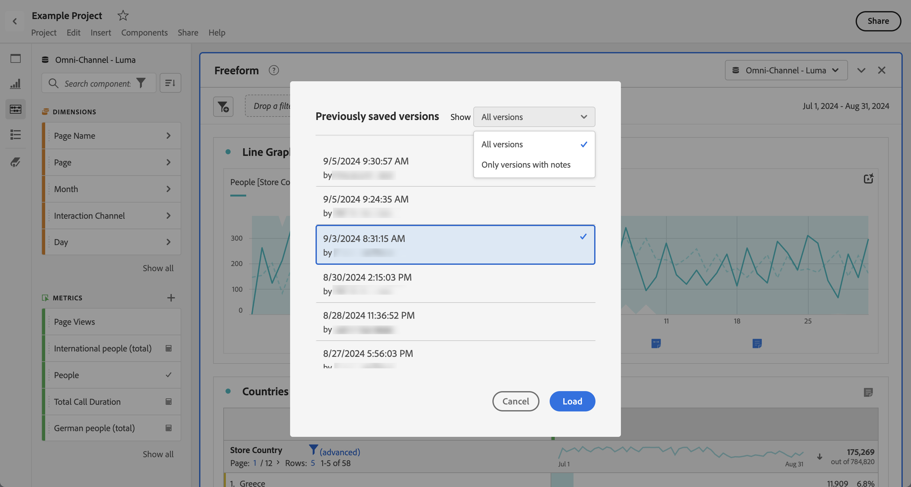

# Guardar proyectos {#save-projects}

<!-- markdownlint-disable MD034 -->

>[!CONTEXTUALHELP]
>id="workspace_project_addnotes"
>title="Adición de notas"
>abstract="Añada notas sobre la versión del proyecto que guarda. Estas notas se almacenarán con la versión y se podrá acceder a ellas desde el menú **[!UICONTROL Proyecto]** > **[!UICONTROL Abrir versión anterior]**."

<!-- markdownlint-enable MD034 -->

Los proyectos de Analysis Workspace se guardan automáticamente cada 2 minutos. También puede guardar proyectos usted mismo, guardarlos como un duplicado o guardar un proyecto con notas de la versión.

## Guardar

Para guardar un proyecto manualmente, con su proyecto abierto en Analysis Workspace, seleccione **[!UICONTROL Proyecto]** y a continuación, elija entre las siguientes opciones:

* **[!UICONTROL Guardar]**

  Guardar cambios en el proyecto. Si se comparte el proyecto, sus destinatarios también verán los cambios. 

  Cuando guarda el proyecto por primera vez, aparece el cuadro de diálogo **[!UICONTROL Guardar]**.

  

   1. Especifique lo siguiente:

      * **[!UICONTROL Nombre]** (obligatorio).  nombre del proyecto.
      * **[!UICONTROL Descripción]** Descripción del proyecto.
      * **[!UICONTROL Etiquetas]** Busque etiquetas en el campo [!UICONTROL *Buscar etiquetas*] o añada nuevas etiquetas usando **[!UICONTROL ENTRAR]**.
      * **[!UICONTROL Carpeta]** Seleccione una carpeta en el menú desplegable [!UICONTROL *Seleccionar una carpeta*]. Si no especifica una carpeta, el proyecto se guardará en la carpeta actual desde la que creó un nuevo proyecto.
      * **[!UICONTROL Notas de la versión]**. Añada notas de la versión en el área de texto *Añadir notas*.

   1. Seleccione **[!UICONTROL Guardar]** para guardar el proyecto.

  Al guardar el proyecto, se guardará una versión del proyecto que se almacena durante 90 días.

  Si guarda un proyecto que ha compartido, un cuadro de diálogo de advertencia **[!UICONTROL Guardar cambios en el proyecto compartido]** le solicitará confirmación.

  

   * Seleccione **[!UICONTROL Guardar]** para guardar el proyecto.
   * Seleccione **[!UICONTROL Guardar como]** para guardar el proyecto como un proyecto duplicado con un nombre nuevo.

* **[!UICONTROL Guardar con notas]**

  

  Al guardar el proyecto, añada notas sobre los cambios realizados. En el cuadro de diálogo Guardar notas de la versión:

   1. Escriba sus **[!UICONTROL notas de la versión]** en el área de texto **[!UICONTROL Aañadir notas]**.
   1. Seleccione **[!UICONTROL Guardar]**.

  Las notas se almacenan con la versión del proyecto y están disponibles al [abrir una versión anterior](open-projects.md#open-previous-version) del proyecto. Las versiones guardadas con notas se almacenarán automáticamente durante un año.

* **[!UICONTROL Guardar como]**

  

  Cree un duplicado del proyecto con un nombre nuevo. Se muestra el cuadro de diálogo Guardar como.

   1. Especifique lo siguiente:

      * **[!UICONTROL Nombre]** (obligatorio).  nombre del proyecto.
      * **[!UICONTROL Descripción]** Descripción del proyecto.
      * **[!UICONTROL Etiquetas]** Busque etiquetas en el campo [!UICONTROL *Buscar etiquetas*] o añada nuevas etiquetas usando **[!UICONTROL ENTRAR]**.
      * **[!UICONTROL Carpeta]** Seleccione una carpeta en el menú desplegable [!UICONTROL *Seleccionar una carpeta*]. Si no especifica una carpeta, el proyecto se guardará en la carpeta actual desde la que creó un nuevo proyecto.
      * **[!UICONTROL Notas de la versión]**. Añada notas de la versión en el área de texto *Añadir notas*.

   1. Seleccione **[!UICONTROL Guardar]** para guardar el esquema.

  Puede guardar el proyecto en una carpeta diferente. El proyecto original no se verá afectado.

<!-- Cannot find this option in CJA 
| **[!UICONTROL Save as template]** | Save your project as a [custom template](https://experienceleague.adobe.com/docs/analytics/analyze/analysis-workspace/build-workspace-project/starter-projects.html?lang=es) that becomes available to your organization under **[!UICONTROL Project > New]** |
-->

## Guardar automáticamente

>[!IMPORTANT]
>
>Aunque los nuevos proyectos se guardan automáticamente, debe guardar cada nuevo proyecto manualmente la **primera** vez. 
>

Todos los proyectos de Analysis Workspace se guardan automáticamente cada 2 minutos en el equipo local. Esto incluye los proyectos recién creados que aún no se han guardado manualmente.

### Nuevos proyectos

Analysis Workspace solicita guardar los nuevos proyectos manualmente al cambiar a otro proyecto, cerrar la pestaña del explorador, etc.

Si, por cualquier motivo, pierde de forma inesperada el acceso a un proyecto recién creado antes de guardarlo manualmente, se guardará una versión de recuperación del proyecto en la página de destino de Analysis Workspace en una carpeta denominada **[!UICONTROL Proyectos recuperados (últimos 7 días)]**.  Debe restaurar el proyecto recuperado y guardarlo manualmente en una ubicación deseada.

Para restaurar un proyecto recuperado:

1. Vaya a la carpeta **[!UICONTROL Proyectos recuperados (últimos 7 días)]** en la página de destino de Analysis Workspace.

<!-- 
     
  -->

1. Abra el proyecto y guárdelo en la ubicación que desee.

### Proyectos existentes

Si, por cualquier motivo, abandona un proyecto con cambios que aún no se han guardado automáticamente, Analysis Workspace le indicará que guarde los cambios o le enviará un mensaje de advertencia.

Algunos escenarios comunes:

#### Abrir otro proyecto

Si abre otro proyecto mientras trabaja en un proyecto que contiene cambios que aún no se han guardado automáticamente, Analysis Workspace le indicará que guarde el proyecto actual.

Las opciones disponibles son las siguientes:

* **[!UICONTROL Guardar:]** sustituye la copia local guardada automáticamente más reciente del proyecto con los cambios más recientes.
* **[!UICONTROL Descartar cambios:]** descarta los cambios más recientes. El proyecto conserva la copia local guardada automáticamente más reciente.
* **[!UICONTROL Cancelar]**: cancela la acción para abrir otro proyecto y mantener abierto el proyecto existente.

<!--  -->

#### Salir o cerrar una pestaña

Si sale de la página o cierra la pestaña del explorador mientras visualiza un proyecto con cambios que aún no se han guardado automáticamente, el explorador le advertirá de que se perderán los cambios no guardados. Puede elegir entre salir o cancelar. El modo en que el explorador le advierte depende del explorador que utilice.

### El explorador se bloquea o se agota el tiempo de espera de la sesión

Si el explorador se bloquea o si se agota el tiempo de espera de la sesión, la próxima vez que acceda a Analysis Workspace se le pedirá que recupere los cambios del proyecto que aún no se han guardado automáticamente.

* Seleccione **[!UICONTROL Sí]** para restaurar el proyecto a partir de la copia más reciente guardada automáticamente.

* Seleccione **[!UICONTROL No]** para eliminar la copia guardada automáticamente y abrir la última versión guardada por el usuario del proyecto.

<!---->

Para **nuevos** proyectos que nunca se han guardado, los cambios no guardados no se pueden recuperar.

<!-- Shouldn't this belong to another page?  Moved it to a new open projects page

## Open previously saved version

To open a previously saved version of a project:

1. Select **[!UICONTROL Open previous version]** from the **[!UICONTROL Project]** menu.

   

1. Review the list of previous versions available. You can switch between **[!UICONTROL All versions]** and **[!UICONTROL Only versions with notes]**.

   For each version, the list shows a timestamp
   [!UICONTROL Timestamp] and [!UICONTROL Editor] are shown, in addition to [!UICONTROL Notes] if they were added when the [!UICONTROL Editor] saved. Versions without notes are stored for 90 days; versions with notes are stored for 1 year.
1. Select a previous version and click **[!UICONTROL Load]**.
   The previous version then loads with a notification. The previous version does not become the current saved version of your project until you click **[!UICONTROL Save]**. If you navigate away from the loaded version, when you return, you will see the last saved version of the project.

-->
