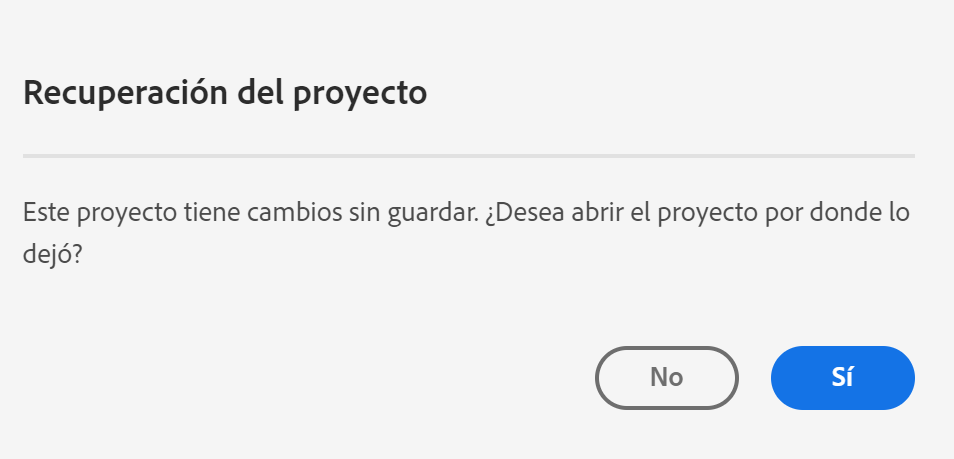

# Guardar proyectos

Los proyectos de Analysis Workspace se guardan automáticamente cada 2 minutos.

También puede guardar proyectos manualmente. Las opciones adicionales, como agregar etiquetas o notas, están disponibles cuando guarda manualmente un proyecto.

## Guardar opciones de proyecto {#Save}

Hay varias opciones disponibles al guardar manualmente un proyecto en Analysis Workspace.

Para guardar manualmente un proyecto:

1. Con el proyecto abierto en Analysis Workspace, seleccione **[!UICONTROL Proyecto]**, elija entre las siguientes opciones:

   | Acción | Descripción |
   |---|---| 
   | **[!UICONTROL Guardar]** | Guardar cambios en el proyecto. Si se comparte el proyecto, los destinatarios del proyecto también verán los cambios. Cuando guarde el proyecto por primera vez, se le pedirá que indique un nombre y una descripción (opcional), y que agregue etiquetas (opcional). |
   | **[!UICONTROL Guardar con notas]** | Antes de guardar el proyecto, agregue notas sobre los cambios realizados en el proyecto. Las notas se almacenan con la versión del proyecto y están disponibles para todos los editores en [!UICONTROL Proyecto] > [!UICONTROL Abrir versión anterior]. |
   | **[!UICONTROL Guardar como]** | Cree un duplicado del proyecto. El proyecto original no se verá afectado. |
   | **[!UICONTROL Guardar como plantilla]** | Guarde el proyecto como una [plantilla personalizada](https://experienceleague.adobe.com/docs/analytics/analyze/analysis-workspace/build-workspace-project/starter-projects.html?lang=es) que esté disponible para su organización en **[!UICONTROL Proyecto > Nuevo]** |

## Guardar automáticamente {#Autosave}

Todos los proyectos de Analysis Workspace se guardan automáticamente cada 2 minutos en el equipo local. Esto incluye los proyectos recién creados que aún no se han guardado manualmente.

* **Nuevos proyectos:** Aunque los nuevos proyectos se guardan automáticamente, debe guardar cada nuevo proyecto manualmente la primera vez. Analysis Workspace le solicita que guarde los nuevos proyectos manualmente al cambiar a otro proyecto, cerrar la pestaña del explorador, etc.

   Si, por cualquier motivo, pierde de forma inesperada el acceso a un proyecto recién creado antes de guardarlo manualmente, se guarda una versión de recuperación del proyecto en la página de aterrizaje de Analysis Workspace en una carpeta denominada `Recovered Projects (Last 7 Days)`. Debe restaurar el proyecto recuperado y guardarlo manualmente en una ubicación deseada.

   Para restaurar un proyecto recuperado:

   1. Vaya a la [!UICONTROL **Proyectos recuperados**] en la página de aterrizaje de Analysis Workspace.

      

   1. Abra el proyecto y guárdelo en la ubicación que desee.

* **Proyectos existentes:** Si, por cualquier motivo, abandona un proyecto con cambios que aún no se han guardado automáticamente, Analysis Workspace le indicará que guarde los cambios o le enviará un mensaje de advertencia.

   A continuación se presentan algunos escenarios comunes:

### Abrir otro proyecto

Si abre un proyecto adicional mientras trabaja en un proyecto que contiene cambios que aún no se han guardado automáticamente, Analysis Workspace le indicará que guarde el proyecto actual antes de retirarlo.

Las opciones disponibles son las siguientes:

* **Guardar:** Reemplaza la copia local guardada automáticamente más reciente del proyecto con los cambios más recientes.
* **Guardar como:** Guarda los cambios más recientes como un nuevo proyecto. El proyecto original solo se guarda con los cambios guardados automáticamente más recientes.
* **Descartar cambios:** Descarta los cambios más recientes. El proyecto conserva los cambios guardados automáticamente más recientes.

### Salir o cerrar una pestaña

Si sale de la página o cierra la pestaña del explorador mientras ve un proyecto con cambios que aún no se han guardado automáticamente, el explorador advierte que se perderán los cambios sin guardar. Puede elegir entre salir o cancelar.

### El explorador se bloquea o se agota el tiempo de espera de la sesión

Si el explorador se bloquea o si se agota el tiempo de espera de la sesión, la próxima vez que acceda a Analysis Workspace se le pedirá que recupere los cambios del proyecto que aún no se hayan guardado automáticamente.

A continuación se muestra el cuadro de diálogo Recuperación del proyecto que aparece la primera vez que accede a Analysis Workspace después de un bloqueo o de un tiempo de espera.

Select **Sí** para restaurar el proyecto a partir de la copia guardada automáticamente más reciente.

Select **No** para eliminar la copia guardada automáticamente y abrir la última versión guardada por el usuario del proyecto.

Para **nuevos** proyectos que nunca se han guardado, los cambios sin guardar no se pueden recuperar.

## Abrir la versión anterior {#previous-version}

Para abrir una versión anterior de un proyecto:

1. Vaya a **[!UICONTROL Proyecto]** > **[!UICONTROL Abrir versión anterior]**

   

1. Revise la lista de versiones anteriores disponibles.
   Se muestran la [!UICONTROL Marca de tiempo] y el [!UICONTROL Editor], así como las [!UICONTROL Notas] si es que se añadieron cuando el [!UICONTROL Editor] guardó. Las versiones sin notas se almacenan durante 90 días; las versiones con notas se almacenan durante 1 año.
1. Seleccione una versión anterior y haga clic en **[!UICONTROL Cargar]**.
A continuación, la versión anterior se carga con una notificación. La versión anterior no se convierte en la versión guardada actual del proyecto hasta que no haga clic en **[!UICONTROL Guardar]**. Si abandona la versión cargada, al volver, verá la última versión guardada del proyecto.
