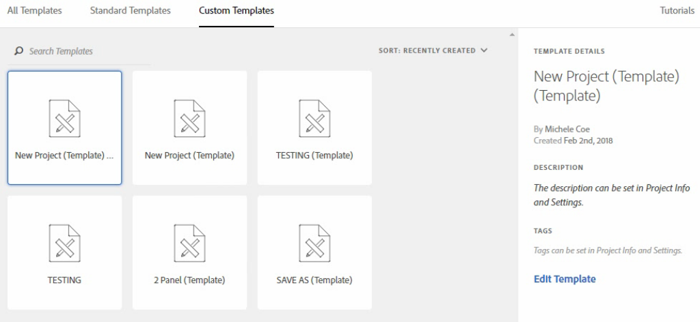

# Plantillas

>[!NOTE]
>
>Está viendo la documentación de Analysis Workspace en Customer Journey Analytics. Su conjunto de funciones difiere ligeramente del [Analysis Workspace de la versión tradicional de Adobe Analytics](https://docs.adobe.com/content/help/es-ES/analytics/analyze/analysis-workspace/home.html). [Más información...](/help/getting-started/cja-aa.md)

Puede elegir crear un proyecto a partir de:

* **Proyecto en blanco (predeterminado)**: para obtener instrucciones, consulte [Creación de un proyecto de Analysis Workspace](/help/analysis-workspace/home.md).
* **Plantilla estándar**: estas plantillas son creadas por Adobe y se envían con el producto.
* **Plantilla personalizada**: estas plantillas pueden ser creadas, compartidas o eliminadas por usuarios con derechos de administrador o por usuarios que no sean administradores, siempre que se les haya otorgado el permiso [!UICONTROL Analysis Workspace: Guardar como plantilla] en Admin Console. [Más información...](https://docs.adobe.com/content/help/es-ES/analytics/admin/admin-console/permissions/product-profile.html)

## Creación de una plantilla personalizada {#create-custom-template}

Los usuarios que tengan derechos de administrador pueden convertir cualquier proyecto que creen en una plantilla personalizada. A continuación se muestra cómo:

1. Abra el proyecto.
1. Vaya a **[!UICONTROL Proyecto]** > **[!UICONTROL Guardar como plantilla]**.

   

   El proyecto se guardará con el nombre del proyecto actual, seguido de la palabra “plantilla” entre paréntesis. Los administradores pueden cambiar este nombre editando la plantilla.

   >[!NOTE]
   >
   >De forma predeterminada, las plantillas de proyecto son visibles para todos los miembros de su organización. Puede ordenarlas mediante etiquetas. (Vaya a **[!UICONTROL Proyecto]** > **[!UICONTROL Información y configuración del proyecto]** para editar las etiquetas y las descripciones).

### Acciones que se pueden llevar a cabo en las plantillas personalizadas

| Acción | Descripción |
|--- |--- |
| Editar plantilla | Permite que el administrador edite la plantilla cambiando la fuente de datos, los componentes, las visualizaciones, los intervalos de fechas, etc.  Para editar una plantilla personalizada, puede:<ul><li>Buscar la lista de plantillas personalizadas en Analysis Workspace, seleccionar una y hacer clic en Editar plantilla.</li><li>En Analytics, ir a Componentes > Proyectos y filtrar por Plantillas. Acto seguido, puede hacer clic en el nombre de la plantilla que quiera editar.</li></ul>**Nota:** Tras editar una plantilla, y según la situación, tiene dos opciones: Guardar o Guardar como. A continuación se indican las diferencias entre ambas opciones.<ul><li>**Guardar:** actualiza la plantilla personalizada para todos los usuarios. Cuando otra persona cree un proyecto a partir de esta plantilla personalizada, verá los cambios que ha hecho usted.</li><li>**Guardar como:** crea una copia de la plantilla personalizada con sus cambios. (Sabrá que está en el modo de edición cuando el elemento de menú Compartir > Compartir proyecto esté desactivado).</li></ul> |
| Buscar en plantillas | En el cuadro de diálogo Plantillas personalizadas, haga clic en Buscar plantillas. |
| Ordenar plantillas | Puede ordenar las plantillas alfabéticamente, por su relevancia o por la fecha de creación.  En el cuadro de diálogo Plantillas personalizadas, haga clic en Ordenar. |
| Aplicar etiquetas a una plantilla | Abra la plantilla y vaya a Proyecto > Información y configuración del proyecto. Haga clic en Añadir etiquetas. |
| Modificar la descripción de la plantilla | Abra la plantilla y vaya a Proyecto > Información y configuración del proyecto. Haga doble clic en la descripción y edítela. |

## Plantillas estándar

Al abrir un Workspace por primera vez, las plantillas aparecen en el panel izquierdo. Las plantillas de Analysis Workspace cubren casos de uso comunes. Se agrupan por la vertical a la que pertenecen y se rellenan con diferentes dimensiones, filtros, métricas y visualizaciones, según la vista de datos seleccionada.

Puede utilizar estas plantillas rellenadas previamente tal cual, o puede adaptarlas a sus necesidades (mediante la adición o sustitución de métricas o visualizaciones, por ejemplo) y guardarlas con un nuevo nombre.

>[!VIDEO](https://video.tv.adobe.com/v/23960)

*(2:46)*

Estas son las plantillas disponibles y las preguntas que cada plantilla ayuda a responder.

### Capacitación

Estas plantillas estándar le guían a través de la terminología común y de los pasos para crear su primer análisis en Workspace. Está disponible como plantilla estándar en el modo Nuevo proyecto y reemplaza el proyecto de muestra actual para los usuarios nuevos que no tienen otros proyectos en su lista.

* **Tutorial de capacitación - Análisis de búsqueda interna**: el tutorial de búsqueda interna ayuda a comprender qué buscan los visitantes en el sitio web o la aplicación, pero no qué encuentran. Analizar este tipo de datos puede brindar oportunidades de optimización de contenido.

* **Tutorial de capacitación - Análisis de marketing**: este tutorial muestra cómo crear un análisis de marketing para los ejecutivos, incluidas las dimensiones y métricas personalizadas que son importantes.

### Medios

* **Consumo de audio**: ¿Qué contenido se consume más y resulta más atractivo para los usuarios?
* **Actualización, Frecuencia, Lealtad**: ¿Quiénes son mis lectores más fieles?

### Comercial

* **Rendimiento de la campaña:** ¿Qué campañas consiguen el máximo de ingresos?
* **Productos:** ¿Qué productos tienen el mejor rendimiento?

### Web

* **Adquisición:** ¿Cuáles son los principales impulsores de tráfico a mi sitio web?
* **Consumo de contenido:** ¿Cuáles son los principales lugares que visitan los usuarios en mi sitio web?
* **Retención:** ¿Qué tipo de usuarios es más probable que sea leal a mi sitio?
* **Tecnología:** ¿Qué tecnología utilizan los usuarios para acceder a mi sitio?

