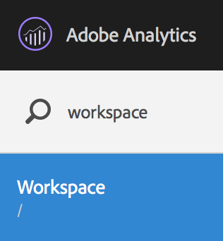
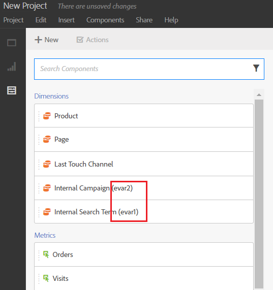
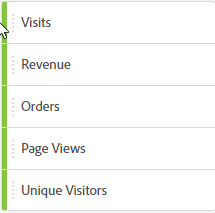

# Creación de un proyecto de Workspace

Cree un proyecto y añada componentes (dimensiones, métricas, segmentos e intervalos de fechas) al panel improvisada.

Gracias a este artículo, podrá familiarizarse con los elementos de la interfaz de Analysis Workspace y verá cómo se crea un proyecto.

## Crear un proyecto

1. Especifique el permiso del usuario para crear y depurar proyectos.

   Antes de crear o depurar un proyecto de Analysis Workspace, los administradores deben agregarlo a usted a un grupo con el permiso **[!UICONTROL Crear/Depurar proyectos en Analysis Workspace]** habilitado, o al grupo de usuarios **[!UICONTROL Acceso a todos los informes]**. (**[!UICONTROL Administración]** > **[!UICONTROL Administración de usuarios]** > [Grupos](https://docs.adobe.com/content/help/es-ES/analytics/admin/user-product-management/user-groups/groups.html)).

1. En [!DNL Experience Cloud], haga clic en **[!UICONTROL Analytics]** > **[!UICONTROL Workspace]**.

   

   También puede introducir una barra diagonal (/) para abrir la barra de búsqueda de informes y escribir *`workspace`*.

   

1. Haga clic en **[!UICONTROL Crear nuevo proyecto]**.

   Puede elegir crear un proyecto a partir de

* Un proyecto en blanco (opción predeterminada). Consulte las instrucciones más abajo.
* Una plantilla estándar. Adobe se encarga de crear estas plantillas, que están listas para usarse. Para obtener instrucciones, consulte [Plantillas](/help/analyze/analysis-workspace/build-workspace-project/starter-projects.md).
* Una plantilla personalizada. Estas plantillas las crean los usuarios que tienen derechos de administrador. Para obtener instrucciones, consulte [Plantillas](/help/analyze/analysis-workspace/build-workspace-project/starter-projects.md).

   

1. Para crear un proyecto a partir de un proyecto en blanco, haga clic en **[!UICONTROL Proyecto en blanco]**.

   * A continuación, haga clic en **[!UICONTROL Crear]**, o bien
   * pulse **[!UICONTROL Intro]**.

   Aparece un proyecto en blanco, que muestra un panel improvisado y una visualización de tabla de datos.

   

   >[!NOTE]
   >
   >En ocasiones, aparece el mensaje “Grupo de informes incompatible” al cargar un proyecto (o cambiar a un grupo de informes) en el que no todos los componentes (métricas/dimensiones) contenidos en él están incluidos en el grupo de informes. Se puede ver una lista de los componentes que no son compatibles. De este modo, podrá saber por qué aparece el mensaje.

<table id="table_3989E45D9D4241CBB2E58B29DA257B2F"> 
 <thead> 
  <tr> 
   <th colname="col1" class="entry"> Elemento </th> 
   <th colname="col2" class="entry"> Descripción </th> 
  </tr> 
 </thead>
 <tbody> 
  <tr> 
   <td colname="col1"><a href="/help/analyze/analysis-workspace/components/analysis-workspace-components.md"  > Componentes</a> </td> 
   <td colname="col2"> 
Dimensiones, métricas, segmentos e intervalos de fechas que puede arrastrar hasta los proyectos. 
 </td> 
  </tr> 
  <tr> 
   <td colname="col1"><a href="/help/analyze/analysis-workspace/visualizations/freeform-analysis-visualizations.md"  > Visualizaciones</a> </td> 
   <td colname="col2"> 
Elementos que puede arrastrar a las áreas de panel o proyecto de la interfaz. 
 </td> 
  </tr> 
  <tr> 
   <td colname="col1"><a href="/help/analyze/analysis-workspace/visualizations/freeform-table/freeform-table.md"  >Panel improvisado</a> </td> 
   <td colname="col2"> 
El lienzo o Workspace con que interactúa en Analysis Workspace. 
 </td> 
  </tr> 
 </tbody> 
</table>

1. Guarde el proyecto. Asigne un nombre al proyecto, proporcione una descripción (es opcional, pero resulta útil) y etiquete el proyecto (opcional). A continuación, haga clic en **[!UICONTROL Guardar proyecto]**.

   

1. Ahora puede hacer clic con el botón derecho, copiar una visualización o panel y, a continuación, pegar (“insertar”) el elemento copiado en otro sitio dentro del mismo proyecto o en un proyecto distinto.

   Puede utilizar esta capacidad para crear “bloques de construcción” (visualizaciones/paneles predefinidos) que es posible copiar en otros proyectos para ponerse en marcha más rápido y con datos específicos de su negocio.

   >[!NOTE]
   >
   >Tras copiar/guardar como, los intravínculos ahora son relativos al proyecto en el que existen, no al proyecto original desde el cual se copiaron.

## Añadir componentes y visualizaciones {#task_CDAC9B3007BE4A3790AFAD3746D669B1}

1. Cree el proyecto arrastrando *`components`* y *`visualizations`* hasta él.

   **Componentes**

   La barra de herramientas Componente muestra dimensiones, métricas, segmentos e intervalos de fechas que permiten búsqueda y que puede usar habitualmente.

<table id="table_4626163E26DE46CB86391868BBA3AD32"> 
 <thead> 
  <tr> 
   <th colname="col1" class="entry"> Componente </th> 
   <th colname="col2" class="entry"> Descripción </th> 
  </tr> 
 </thead>
 <tbody> 
  <tr> 
   <td colname="col1"> Dimensiones (naranja) </td> 
   <td colname="col2"> 
Se aplican en el nivel de proyecto 
 
 
 
Prop#, eVar# y event# se añaden al nombre de las dimensiones y es posible buscar esos números. Ejemplo: “Campaña interna” aparece en el carril izquierdo como “Campaña interna (evar2)”. 
 
 Tenga en cuenta que los números de prop, eVar y event no se muestran en la tabla (para reducir su longitud). 
 
Algunas dimensiones integradas adoptan un criterio de ordenación predeterminado al arrastrarlas a una tabla improvisada o al verlas en el carril izquierdo. Por ejemplo, al soltar “Hora del día” en una tabla o al verla en el carril izquierdo, se ordenará de 00 a 23. Sigue existiendo la opción de ordenar por cualquier columna de métrica. 
 </td> 
  </tr> 
  <tr> 
   <td colname="col1"> Métricas (verde) </td> 
   <td colname="col2"> 
Se aplican en el nivel de proyecto. 
 
 
 
  Ocurrencias es la métrica predeterminada para la tabla de datos. 
 </td> 
  </tr> 
  <tr> 
   <td colname="col1"> Segmentos (azul) </td> 
   <td colname="col2"> 
Se pueden arrastrar solamente en el nivel de panel, pero puede crear segmentos en línea en la tabla de datos. 
 
 
 
Consulte <a href="/help/analyze/analysis-workspace/components/t-freeform-project-segment.md"  > Segmentos </a> para obtener más información. 
 </td> 
  </tr> 
  <tr> 
   <td colname="col1"> Intervalos de fechas y granularidades (violeta) </td> 
   <td colname="col2"> 
Se pueden arrastrar solamente en el nivel de panel. Puede crear un proyecto desde el Calendario, al configurar un intervalo de fechas. 
 
 
 </td> 
  </tr> 
 </tbody> 
</table>

**[Visualizaciones](/help/analysis-workspace/visualizations/freeform-analysis-visualizations.md)**

El panel [!UICONTROL Visualizaciones] incluye gráficos, diagramas circulares, tablas de datos, tablas de [cohorte](/help/analysis-workspace/visualizations/cohort-table/cohort-analysis.md), diagramas Venn y otros elementos estándar de Analytics. Puede arrastrar y colocar varias visualizaciones en su proyecto.

1. Paso

## Use el menú que se abre al hacer clic con el botón derecho para personalizar sus datos. {#concept_8117C300F21843B99F4E1B9AB7B11B6F}

El menú del botón secundario le permite realizar las siguientes acciones, según en qué celda de una tabla haga clic con el botón secundario.

<table id="table_0F84CC5B604D4D41BD0C9668DF525929"> 
 <thead> 
  <tr> 
   <th colname="col1" class="entry"> Acción </th> 
   <th colname="col2" class="entry"> Descripción </th> 
  </tr>
 </thead>
 <tbody> 
  <tr> 
   <td colname="col1"><a href="/help/analysis-workspace/components/calendar-date-ranges/time-comparison.md"  > Añadir columna de periodo de tiempo</a> </td> 
   <td colname="col2"> </td> 
  </tr> 
  <tr> 
   <td colname="col1"><a href="/help/analysis-workspace/components/calendar-date-ranges/time-comparison.md"  > Comparar periodos de tiempo</a> </td> 
   <td colname="col2"> </td> 
  </tr> 
  <tr> 
   <td colname="col1"> 
Copiar al portapapeles 
 </td> 
   <td colname="col2"> </td> 
  </tr> 
  <tr> 
   <td colname="col1"> 
Eliminar selección 
 </td> 
   <td colname="col2"> </td> 
  </tr> 
  <tr> 
   <td colname="col1"><a href="/help/components/c-alerts/intellligent-alerts.md"  > Crear alertas a partir de la selección</a> </td> 
   <td colname="col2"> </td> 
  </tr> 
  <tr> 
   <td colname="col1"><a href="/help/analysis-workspace/components/dimensions/t-breakdown-fa.md"  > Desglosar</a> 
    <ul id="ul_18C83B8514AD4C1C86C071AA8402CB5C"> 
     <li id="li_6CA84ED293EA4940A7495DA9D9121264">Dimensiones </li> 
     <li id="li_EA16EE017B2E4A6998918706938A21BF">Métricas </li> 
     <li id="li_0405D339CD01405DB508A7D8D1A976B4">Segmentos </li> 
     <li id="li_819CE81C552F49BB9C1B83ED3B42C5F7">Fecha </li> 
    </ul> </td> 
   <td colname="col2"> </td> 
  </tr> 
  <tr> 
   <td colname="col1"><a href="/help/analysis-workspace/visualizations/freeform-analysis-visualizations.md"  > Visualizar</a> </td> 
   <td colname="col2"> </td> 
  </tr> 
  <tr> 
   <td colname="col1"><a href="/help/analysis-workspace/curate-share/download-send.md"  > Descargar como CSV</a> </td> 
   <td colname="col2"> </td> 
  </tr> 
  <tr> 
   <td colname="col1"><a href="/help/analysis-workspace/home.md"  > Selección de tendencia</a> </td> 
   <td colname="col2"> </td> 
  </tr> 
  <tr> 
   <td colname="col1"><a href="/help/analysis-workspace/components/t-freeform-project-segment.md"  > Crear segmento de selección</a> </td> 
   <td colname="col2"> </td> 
  </tr> 
  <tr> 
   <td colname="col1"><a href="/help/analysis-workspace/c-panels/c-segment-comparison/segment-comparison.md"  > Ejecutar en comparación de segmentos</a> </td> 
   <td colname="col2"> </td> 
  </tr> 
  <tr> 
   <td colname="col1"> Mostrar solamente las filas seleccionadas </td> 
   <td colname="col2"> </td> 
  </tr> 
  <tr> 
   <td colname="col1"> Mostrar todas las filas </td> 
   <td colname="col2"> </td> 
  </tr> 
 </tbody> 
</table>

Consulte [Interacciones de teclado y ratón disponibles en Analysis Workspace](/help/analysis-workspace/build-workspace-project/fa-shortcut-keys.md) para obtener información sobre cómo copiar y seleccionar filas.
