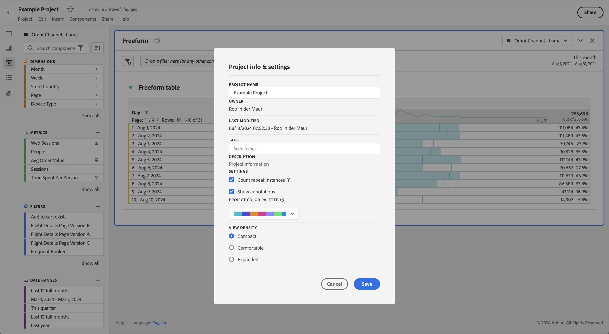
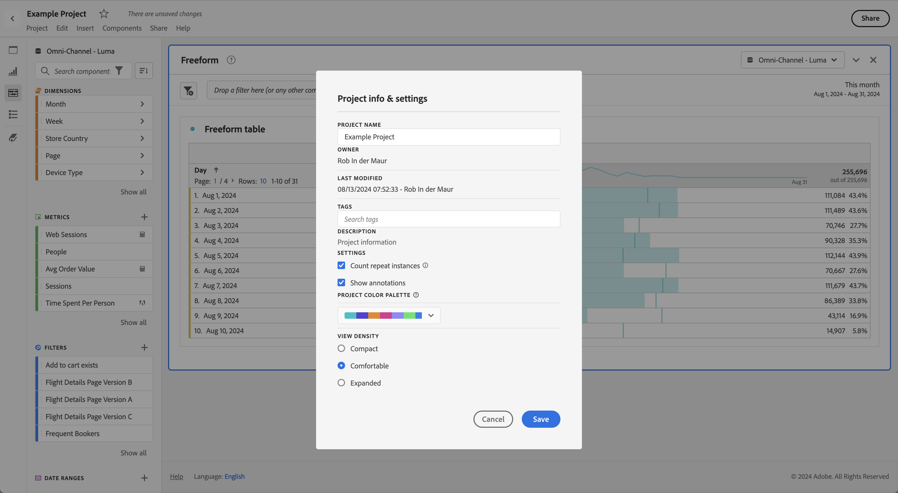
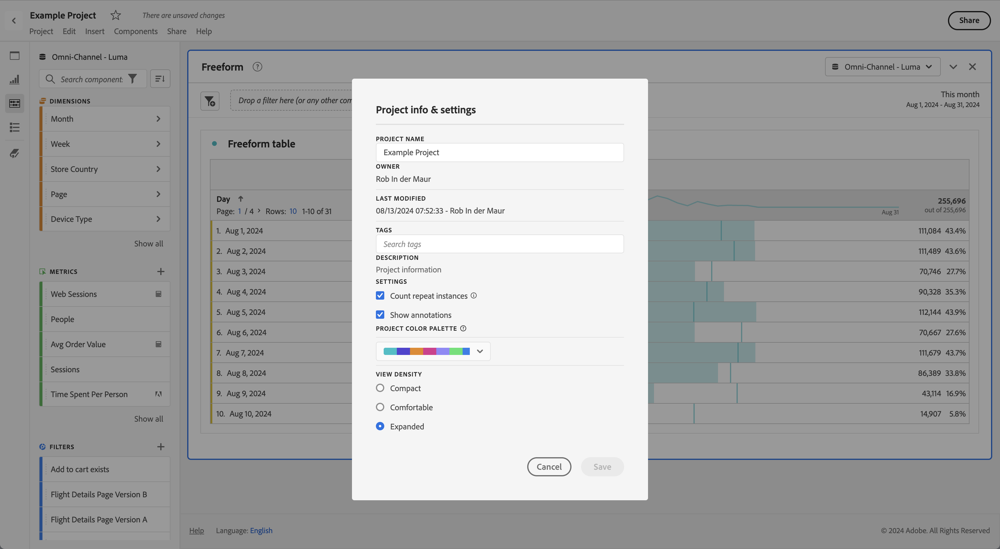

# Ver densidad

Ajustar la densidad de la visualización le permite ver más datos en la pantalla reduciendo el relleno vertical del panel izquierdo, las tablas de forma libre y las tablas de cohortes. Hay tres opciones disponibles:

>[!BEGINTABS]

>[!TAB Compacta]

Es la versión con la vista más condensada.

>[!TAB Cómoda]

Es la vista a la que está acostumbrado en Workspace.

>[!TAB Ampliada]

Es la vista a la que está acostumbrado en Workspace.

>[!ENDTABS]

Para establecer la densidad de la visualización:

1. En Workspace, vaya a **[!UICONTROL Proyectos]** > **[!UICONTROL Info y configuración del proyecto]**.

1. Seleccione una opción **[!UICONTROL Ver densidad]** y seleccione **[!UICONTROL Guardar]**.
