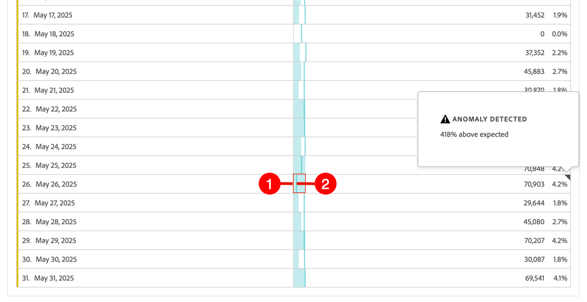
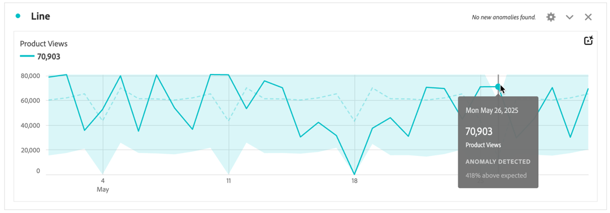

# Ver anomalías

Puede ver anomalías en Analysis Workspace en una tabla o en un gráfico de líneas.

## Ver las anomalías en una tabla {#section_869A87B92B574A38B017A980ED8A29C5}

Puede ver anomalías en una tabla de forma libre de serie temporal.

1. Seleccione  en el encabezado de la columna y asegúrese de que la opción **[!UICONTROL Mostrar anomalías]** esté seleccionada en la lista de opciones. Para obtener más información, consulte [Configuración de columna](/help/analysis-workspace/visualizations/freeform-table/column-row-settings/column-settings.md).

1. Las anomalías se muestran en la tabla de la siguiente manera:

   

   Aparece un(a) ◥ en la esquina superior derecha de cada fila donde se detecta una anomalía de datos.

   La **línea vertical de color** en cada fila ➋ indica el valor esperado. El **área sombreada de color** en cada fila ➊ indica el valor real. El modo en que la línea (valor esperado) se compara con el área sombreada (valor real) determina si hay una anomalía. (Una observación se considera anómala según las técnicas estadísticas avanzadas descritas en [Técnicas estadísticas utilizadas en la detección de anomalías](/help/analysis-workspace/c-anomaly-detection/statistics-anomaly-detection.md)).

1. Seleccione ◥ en la esquina superior derecha de una fila para ver detalles sobre la anomalía. Esto muestra el grado (como porcentaje) en que el valor real difiere por encima o por debajo del valor esperado.

## Ver anomalías en un gráfico de líneas

Los gráficos de líneas son la única visualización que permite ver anomalías.

Para ver anomalías en un gráfico de líneas:

1. Seleccione  en el encabezado de la visualización y, a continuación, asegúrese de que la opción [!UICONTROL **Show anomalies**] esté seleccionada en la lista de opciones. Para obtener más información, consulte [Línea](/help/analysis-workspace/visualizations/line.md).

1. (Opcional) Para permitir que el intervalo de confianza escale el gráfico, seleccione  en el encabezado de visualización y, a continuación, seleccione la opción **[!UICONTROL Permitir que las anomalías escalen el eje Y]**.

   Esta opción no está seleccionada de forma predeterminada porque a veces puede hacer que el gráfico sea menos legible.

   Las anomalías se muestran en el gráfico de líneas de la siguiente manera:

   

   Aparece un **punto blanco** en la línea donde se detecta una anomalía de datos. (Una observación se considera anómala según las técnicas estadísticas avanzadas descritas en [Técnicas estadísticas utilizadas en la detección de anomalías](/help/analysis-workspace/c-anomaly-detection/statistics-anomaly-detection.md)).

   **Área sombreada clara** es la banda de confianza, o intervalo esperado, donde deben producirse valores. Cualquier valor que quede fuera de este intervalo esperado es una anomalía.

   Si cuenta con múltiples métricas en el gráfico de líneas, solo se muestran las anomalías y debe pasar el puntero por encima de cada una de ellas para ver la banda de confianza de dicha métrica.

   La **línea de puntos** es el valor esperado exacto.

1. Seleccione una anomalía (punto blanco) para ver la siguiente información:

   * La fecha en la que se produjo la anomalía.

   * El valor sin procesar de la anomalía.

   * El valor porcentual por encima o por debajo del valor esperado, que se representa mediante la línea verde sólida.

<!--
# View anomalies in Analysis Workspace

You can view anomalies in a table or in a line chart.

## View anomalies in a table {#table}

You can view anomalies in a time-series Freeform Table.

1. Select the column settings icon in the column header, then ensure that the [!UICONTROL **Anomalies**] option is selected in the list of options. For more information, see [Column settings](/help/analysis-workspace/visualizations/freeform-table/column-row-settings/column-settings.md).

1. Click away from the settings menu to view the updated table.

   

1. Anomalies are shown in the table as follows:

   A **dark gray triangle** appears in the upper-right corner of each row where a data anomaly is detected.

   The colored **vertical line** in each row indicates the expected value. The colored **shaded area** in each row indicates the actual value. How the line (expected value) compares with the shaded area (actual value) determines whether there is an anomaly. (An observation is considered anomolous based on the advanced statistical techniques described in [Statistical techniques used in anomaly detection](/help/analysis-workspace/c-anomaly-detection/statistics-anomaly-detection.md).)

1. Select the gray triangle in the upper-right corner of a row to view details about the anomaly. This shows the extent (as a percentage) to which the actual value diverges either above or below the expected value.

## View anomalies in a line chart {#line-chart}

A Line chart is the only visualization that allows you to view anomalies.

To view anomalies in a line chart:

1. Select the settings icon in the visualization header, then ensure that the [!UICONTROL **Show anomalies**] option is selected in the list of options. For more information, see [Line](/help/analysis-workspace/visualizations/line.md).

1. (Optional) To allow the confidence interval to scale the chart, select the settings icon in the visualization header, then select the option, **[!UICONTROL Allow anomalies to Scale Y-axis]**. 

   This option is not selected by default because it can sometimes make the chart less legible.
   
1. Click away from the settings menu to view the updated line chart.

      

   Anomalies are shown in the line chart as follows:
   
   A **white dot** appears on the line wherever a data anomaly is detected. (An observation is considered anomolous based on the advanced statistical techniques described in [Statistical techniques used in anomaly detection](/help/analysis-workspace/c-anomaly-detection/statistics-anomaly-detection.md).)

   The **light shaded area** is the confidence band, or expected range, where values should occur. Any value that falls outside of this expected range is an anomaly. 

   If you have multiple metrics in the line chart, only the anomalies are shown and you have to hover over each anomaly to see the confidence band for that metric. 

   The **dotted line** is the exact expected value.

1. Click an anomaly (white dot) to view the following information:

   * The date the anomaly occurred 
   
   * The raw value of the anomaly 
   
   * The percentage value above or below the expected value, which is represented by the solid green line.
   
-->
