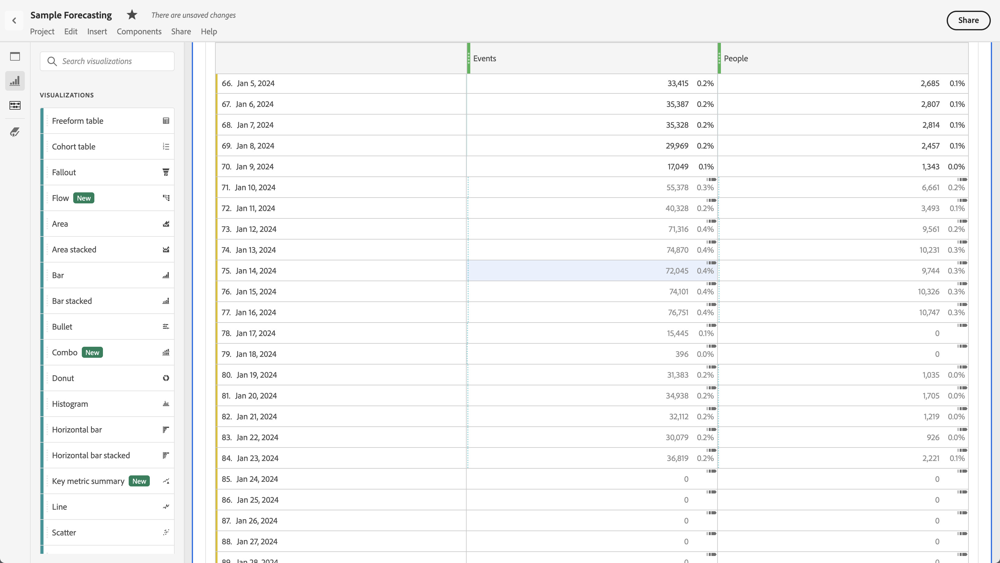
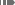
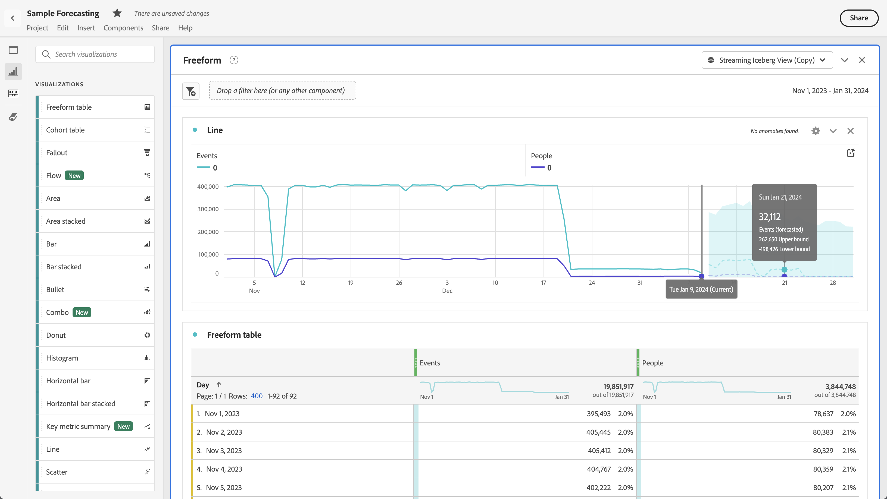

# Visualización de previsiones en Analysis Workspace

Puede ver las previsiones en una tabla de forma libre o en un gráfico de líneas.

## Ver previsiones en una tabla

Puede ver las previsiones en una tabla de forma libre de series temporales. Cuando [!UICONTROL Mostrar previsión] está habilitado para la tabla de forma libre en [preferencias de usuario](../user-preferences.md), la previsión se muestra automáticamente para la primera columna de métrica agregada a la tabla. Para cualquier columna adicional:

1. Seleccione el icono de configuración de columna  en el encabezado de columna y, a continuación, asegúrese de que **[!UICONTROL Mostrar previsión]** está seleccionado en la lista de opciones. Para obtener más información, consulte [Configuración de columna](../visualizations/freeform-table/column-row-settings/column-settings.md).

1. Haga clic fuera del menú **[!UICONTROL Configuración de columna]** para guardar la configuración y ver la tabla actualizada.

Las previsiones se muestran en la tabla de la siguiente manera:

* El valor de previsión y el porcentaje de cada celda se muestran en **gris oscuro**.
* Para indicar un valor de previsión, utilice un símbolo de previsión  se muestra en la esquina superior derecha de la celda.

## Ver previsiones en un gráfico de líneas

Un gráfico de líneas es la única visualización que le permite ver las previsiones.

1. Seleccione el icono de configuración  en el encabezado de visualización y, a continuación, asegúrese de que **[!UICONTROL Mostrar previsión]** está seleccionado en la lista de opciones.

1. (opcional) Para permitir que las previsiones escalen el gráfico correctamente, seleccione **[!UICONTROL Permitir que la previsión escale el eje Y]**. Esta opción no está seleccionada de forma predeterminada porque a veces puede representar un gráfico menos legible.

1. Haga clic fuera del menú **[!UICONTROL Configuración]** para ver el gráfico de líneas actualizado.

Las previsiones se muestran en el gráfico de líneas de la siguiente manera:

* Los valores actuales de las métricas del gráfico de líneas se indican mediante una barra vertical. Si pasa el ratón por encima de esa línea vertical, aparece una ventana emergente con la última fecha actual.
* Los valores pronosticados para una o más métricas se muestran directamente desde la barra vertical con líneas de puntos. Puede pasar el ratón sobre cualquier punto de datos de una métrica. Se mostrará una ventana emergente con:
   * fecha de la previsión
   * valor previsto para la métrica
   * límite superior del valor previsto para la métrica
   * límite inferior del valor previsto para la métrica
* El área sombreada muestra la banda de confianza del pronóstico.
