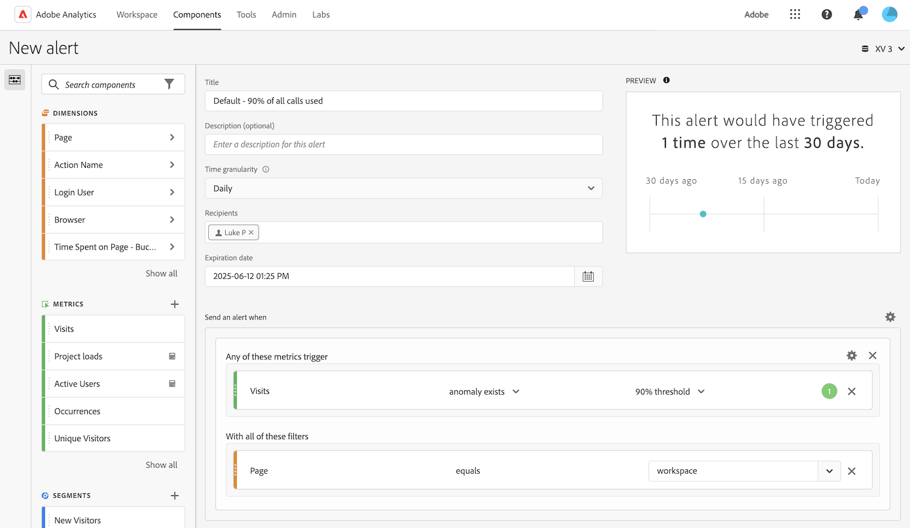

# Creación de alertas

{{release-limited-testing}}

>[!NOTE]
>
>Las alertas inteligentes están disponibles solo para los clientes de Adobe Analytics Prime y Adobe Analytics Ultimate.

Las alertas inteligentes (o simplemente &quot;alertas&quot;) de Customer Journey Analytics le permiten recibir notificaciones inmediatamente cuando se producen eventos anormales en los datos.

Para obtener información general más detallada sobre las alertas inteligentes, consulte [Información general sobre las alertas inteligentes](/help/analysis-workspace/c-intelligent-alerts/intellligent-alerts.md).

Para crear una alerta:

1. Comience a crear una alerta accediendo al generador de alertas. Puede acceder al Generador de alertas de cualquiera de estas formas:

   * Abra un proyecto en Analysis Workspace y seleccione **[!UICONTROL Componentes]** > **[!UICONTROL Crear alerta]**.
   * Abra un proyecto en Analysis Workspace y utilice el siguiente método abreviado:

     `ctrl (or cmd) + shift + a`
   * Abra un proyecto en Analysis Workspace, seleccione uno o más elementos de línea en una tabla de forma libre, haga clic con el botón derecho y seleccione **[!UICONTROL Crear alerta a partir de la selección]**.

     De este modo, se rellena instantáneamente el generador de alertas para crear una alerta con las métricas y los filtros correctos.
   * En el Customer Journey Analytics, seleccione **[!UICONTROL Componentes]** > [!UICONTROL **Alertas**] > **[!UICONTROL Crear nueva alerta]**.

   Aparece el Generador de alertas. Esta interfaz resulta familiar a quienes hayan creado segmentos o calculado métricas en Analytics:

   

1. Especifique las siguientes opciones para configurar la alerta:

   | Opción | Descripción |
   |---------|----------|
   | [!UICONTROL **Título**] | Especifique un nombre para la alerta. El nombre de la alerta puede contener el nombre del umbral de informe o de métricas. |
   | [!UICONTROL **Descripción (opcional)**] | Especifique una descripción para la alerta. |
   | [!UICONTROL **Granularidad de tiempo**] | Seleccione la frecuencia con la que desea que se compruebe la métrica: Diaria, Semanal o Mensual.
<b>Nota:</b>Para las vistas de datos con un calendario personalizado, no se admite la granularidad mensual en el Generador de alertas.<!--true?-->
 |
   | [!UICONTROL **Destinatarios**] | Especifique hacia dónde se puede enviar la alerta. Se puede enviar una alerta a un usuario de Analytics, un grupo de Analytics o a una dirección de correo electrónico sin procesar o a un número de teléfono.
<b>Importante:</b>El número de teléfono debe estar precedido por &quot;+&quot; y [código de país](https://countrycode.org/).

El correo electrónico que un usuario recibe después de activar una alerta tiene un aspecto similar al siguiente:

 |
   | [!UICONTROL **Fecha de caducidad**] | Establezca la fecha y la hora en que desea que la alerta caduque. |
   | [!UICONTROL **Retraso**] | El tiempo necesario antes de que los datos se completen y estén disponibles para su notificación en Customer Journey Analytics varía según la organización, normalmente oscila entre 3 y 9 horas después del evento de datos. Para que las alertas sean precisas, los datos de evento de un intervalo de eventos determinado deben estar completos, lo que significa que el Adobe ya no recibe datos de evento para el intervalo de eventos especificado.
Para tener en cuenta este retraso en el tiempo de ingesta, las alertas tienen un retraso predeterminado de 9 horas antes de enviarse.

Puede ajustar el retraso predeterminado de 9 horas a cualquier valor entre 0 y 24 horas. Sin embargo, si se reduce el retraso por debajo de 9 horas, puede significar que está generando informes con datos incompletos, lo que da como resultado información de alerta inexacta.

Tenga en cuenta lo siguiente al reducir el tiempo de retraso:
<ul><li>**Comprender la disponibilidad de los datos frente a su integridad**: aunque es posible que algunos datos estén disponibles para generar informes antes, todos los datos por lotes se incorporan en un conjunto de datos de Platform solo después de un período de 3 a 9 horas. Para que las alertas sean precisas, la ingesta de datos debe ser completa, con todos los datos por lotes disponibles en el conjunto de datos.</li><li>**Determine cuánto tiempo tardan los datos en estar completos y disponibles en el conjunto de datos**: los tiempos de ingesta de datos difieren según la organización. Asegúrese de que el tiempo de demora que elija para la entrega de alertas sea el mismo o menos frecuente que el tiempo que tardan los datos por lotes en estar disponibles en el conjunto de datos de Platform<!--add link? -->.</li>
**Sugerencia:** La forma más precisa de saber el tiempo necesario para completar e incorporar todos los datos por lotes en el conjunto de datos de Platform es consultar a los ingenieros de datos de su organización.

También puede hacerse una idea general de cuánto tiempo tarda el envío por lotes en su organización en estar disponible en el conjunto de datos de Platform creando la siguiente tabla de forma libre en Analysis Workspace:
<ol><li>En una tabla de forma libre de Analysis Workspace, agregue una métrica de [!UICONTROL **Eventos**] y una dimensión de [!UICONTROL **Día**].</li><li>Desglose la dimensión [!UICONTROL **Día**] con una dimensión [!UICONTROL **Horas**].
Las horas sin datos se mostrarán como 0.
</li></ol><li>**Tener en cuenta los errores en los cálculos**: Si reduce el tiempo de retraso predeterminado, le recomendamos que configure el retraso durante al menos una hora más que el tiempo que tarda su organización en completar la ingesta de datos. Por ejemplo, si hay un retraso de 3 horas antes de que se complete la ingesta de datos, debe establecer el retraso en 4 horas.</li></ul>
Para obtener más información, consulte [Los tiempos de ingesta de datos varían en el Customer Journey Analytics](/help/analysis-workspace/c-intelligent-alerts/alerts-feature-comparison.md#data-ingestion-times-vary-in-customer-journey-analytics) en el artículo [Comparación de características de alertas inteligentes: Customer Journey Analytics y Adobe Analytics](/help/analysis-workspace/c-intelligent-alerts/alerts-feature-comparison.md). |
   | [!UICONTROL **Enviar una alerta cuando**] | [!UICONTROL **déclencheur de cualquiera de estas métricas**]: arrastre y suelte las métricas (incluidas las calculadas) aquí para crear déclencheur para la alerta.
Aparece el mensaje **&quot;componentes incompatibles&quot;** si no todas las métricas, dimensiones o segmentos de la alerta son compatibles con la vista de datos seleccionada actualmente.

Determine el umbral que debe superar la métrica para que se establezca la alerta. Puede ajustar este valor a un umbral y, a continuación, a una de las condiciones siguientes:
<ul><li>existe anomalía</li><li>anomalía por encima de lo esperado</li><li>anomalía por debajo de lo esperado</li><li>mayor o igual que</li><li>menor o igual que</li><li>cambia por un</li><li>Puede establecer el umbral en 90 %, 95 %, 99 %, 99,75 % y 99,9 %.</li></ul>
[!UICONTROL **Con todos estos filtros**]: Arrastre y suelte los segmentos o dimensiones para agregar filtros. Por ejemplo, si agrega un segmento &quot;Solo dispositivos móviles&quot; significará que la regla se aplica únicamente a los déclencheur móviles. Puede agregar filtros adicionales mediante una instrucción AND. Puede añadir las reglas AND u OR si hace clic en el icono de engranaje.

Consulte [Alertas inteligentes: casos de uso](/help/analysis-workspace/c-intelligent-alerts/alerts-use-cases.md) para ver ejemplos de uso.
 |
   | [!UICONTROL **Vista previa**] | La vista previa de alertas interactiva le muestra con qué frecuencia, aproximada, se activará una alerta en función de las experiencias pasadas.
Por ejemplo, si establece la granularidad de tiempo a diario, en la vista previa podrá ver cuántas veces se habrá activado una alerta para una métrica en particular durante los últimos 30 o 31 días.

Si observa que se habían activado demasiadas alertas, puede ajustar el umbral en el [Administrador de alertas](/help/analysis-workspace/c-intelligent-alerts/alert-manager.md).

 |

1. Seleccione [!UICONTROL **Guardar**].

