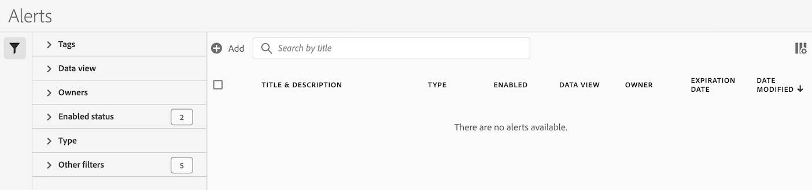

# Administración de alertas

Puede administrar las alertas existentes en el Administrador de alertas. Puede realizar varias tareas de administración en las alertas, como etiquetado, cambio de nombre, eliminación, etc.

El Administrador de alertas tiene una estructura muy similar al [Administrador de filtros](/help/components/filters/manage-filters.md) y al [Administrador de métricas calculadas](/help/components/calc-metrics/cm-workflow/cm-manager.md).

## Creación de alertas

Para crear alertas desde el Administrador de alertas:

1. Seleccione **[!UICONTROL Componentes]** > **[!UICONTROL Alertas]** para acceder al Administrador de alertas en el Customer Journey Analytics.

   

1. Seleccione [!UICONTROL **Agregar**] (o [!UICONTROL **Crear nueva alerta**] si no tiene ninguna alerta existente).

1. Continúe con [Crear alertas](/help/analysis-workspace/c-intelligent-alerts/alert-builder.md) para obtener más información sobre cómo crear alertas.

## Administrar alertas existentes

Para administrar las alertas existentes en el Administrador de alertas:

1. Seleccione **[!UICONTROL Componentes]** > **[!UICONTROL Alertas]** para acceder al Administrador de alertas en el Customer Journey Analytics.

   

1. Seleccione una o varias alertas que desee administrar.

   

1. En la barra de acciones, seleccione cualquiera de las siguientes opciones:

   | Acción | Función |
   |---------|----------|
   | [!UICONTROL **Etiqueta**] | Aplicar una etiqueta a una alerta. Esto le ayuda a organizar las alertas para facilitar su uso. |
   | [!UICONTROL **Eliminar**] | Elimina la alerta. |
   | [!UICONTROL **Cambiar el nombre**] | Cambia el nombre de la alerta. |
   | [!UICONTROL **Aprobar**] | Marcar la alerta como Aprobada. |
   | [!UICONTROL **Copiar**] | Crea una copia (duplicado) de la alerta. |
   | [!UICONTROL **Deshabilitar**] | Deshabilita una alerta que está habilitada actualmente. |
   | [!UICONTROL **Activar**] | Habilita una alerta que está deshabilitada actualmente. |
   | [!UICONTROL **Renovar**] | Renueva la fecha de caducidad de la alerta. Esto amplía la fecha de caducidad a 1 año a partir del día en que seleccionó esta opción, independientemente de la fecha de caducidad original. |
   | [!UICONTROL **Exportar a CSV**] | Exporta la alerta a un archivo .CSV. |

## Editar una alerta

Para editar una alerta existente:

1. Seleccione **[!UICONTROL Componentes]** > **[!UICONTROL Alertas]** para acceder al Administrador de alertas en Adobe Analytics.

   

1. Seleccione el nombre de la alerta en la columna [!UICONTROL **Título y descripción**].

1. Edite la alerta como desee.

   A continuación se indican algunas de las acciones que puede realizar al editar una alerta:

   * Agregar alertas a otros grupos de informes
   * Cambiar el propietario
   * Actualización de los filtros
   * Actualizar la fecha de caducidad

1. Edite la alerta y, a continuación, seleccione [!UICONTROL **Guardar**].

## Configuración de columnas

Puede configurar la información mostrada para cada alerta en el Administrador de alertas configurando las columnas que se muestran.

Para configurar las columnas visibles en el Administrador de alertas:

1. En Adobe Analytics, seleccione la ficha **[!UICONTROL Componentes]** y, a continuación, seleccione **[!UICONTROL Alertas]**.

1. En el Administrador de alertas, seleccione el icono **Personalizar columnas**  y, a continuación, seleccione las columnas que desea que se muestren en el Administrador de alertas.

   Las columnas disponibles son las siguientes:

   | Título de columna | Descripción |
   |---|---|
   | Título y descripción | Estos valores se proporcionan en el Generador de alertas. Para editar el título y la descripción, seleccione el vínculo del título para abrir el Generador de alertas. |
   | Favoritos | Muestra iconos de estrella junto a cada alerta, lo que permite marcar las alertas como favoritas. <!-- For more information, see [Mark calculated metrics as favorites](/help/components/c-calcmetrics/c-workflow/cm-workflow/cm-favorite.md). --> |
   | Tipo | Muestra si la alerta es una alerta de datos de Analytics o una alerta de uso de llamadas al servidor. |
   | Habilitado | Muestra si la alerta está habilitada o deshabilitada actualmente. |
   | Grupo de informes | Indica en qué grupo de informes se guardó por última vez la alerta. |
   | Propietario | Indica a quién pertenece la alerta. Si no es el administrador, solo podrá ver las alertas que le pertenecen o que compartieron con usted. |
   | Etiquetas | Muestra las etiquetas aplicadas a la alerta, tanto por su parte como por parte de las personas que han compartido la alerta con usted. |
   | Fecha de caducidad | Muestra la fecha y la hora en que la alerta está configurada para caducar. |
   | Fecha de modificación | Indica la fecha de la última modificación de la alerta. |

   {style="table-layout:auto"}

   <!-- When "Last used" column is added, add this information as the description: Shows the date when the alert was last used. 
This information can help you determine whether a component is valuable to users in your organization, where it is used, and if it needs to be deleted or modified.

Consider the following when viewing this column:
<ul><li>This information does not include usage from the API, Report Builder, or Data Warehouse.</li><li>For some components, this column might not contain data if the component was last used prior to September 2023.</li></ul> -->

## Solución de problemas de una alerta

Cuando solucione un problema con una alerta, proporcione el número JID (ID de instancia de trabajo) a Asistencia técnica de Adobe. El número JID se encuentra en la parte inferior de la notificación de alerta por correo electrónico que ha recibido.

