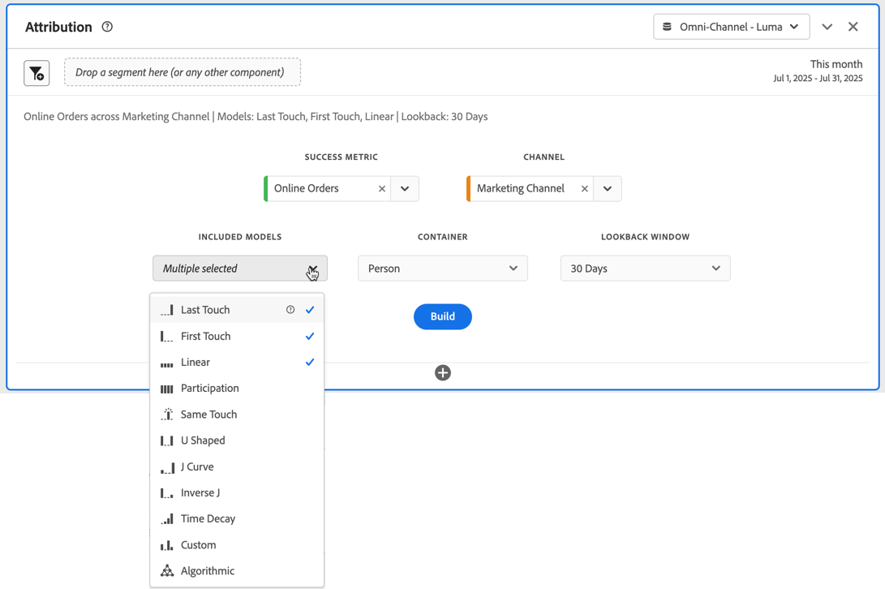

# Panel Atribución {#attribution-panel}

<!-- markdownlint-disable MD034 -->

>[!CONTEXTUALHELP]
>id="workspace_attribution_button"
>title="Atribución"
>abstract="Compare y visualice rápidamente cualquier número de los modelos de atribución utilizando la métrica de éxito, el canal y la ventana retroactiva."
>additional-url="https://www.youtube.com/watch?v=Yu0hy2klzA0" text="Panel de Attribution IQ"

>[!CONTEXTUALHELP]
>id="workspace_attribution_panel"
>title="Panel Atribución"
>abstract="Compare y visualice rápidamente cualquier número de los modelos de atribución de una métrica de éxito. Seleccione el canal (dimensión), los modelos que desea incluir y la ventana retrospectiva."
>additional-url="https://www.youtube.com/watch?v=Yu0hy2klzA0" text="Panel de Attribution IQ"

<!-- markdownlint-enable MD034 -->

>[!BEGINSHADEBOX]

_Este artículo documenta el panel Atribución en_  _**Customer Journey Analytics**_. _Vea [Panel de atribución](https://experienceleague.adobe.com/en/docs/analytics/analyze/analysis-workspace/panels/attribution) para la_  _**Adobe Analytics** de este artículo._

>[!ENDSHADEBOX]

El panel **[!UICONTROL Atribución]** es una forma sencilla de generar un análisis comparando varios modelos de atribución. El panel le proporciona un espacio de trabajo dedicado para utilizar y comparar modelos de atribución.

Customer Journey Analytics mejora la atribución al permitir lo siguiente:

* Definir la atribución más allá del contenido multimedia de pago: cualquier dimensión, métrica, canal o evento puede aplicarse a modelos (por ejemplo, búsqueda interna), no solo campañas de marketing.
* Usar la comparación de modelos de atribución sin límites: compare dinámicamente todos los modelos que desee.
* Evitar cambios de implementación: con el procesamiento de tiempo de informes y las sesiones con reconocimiento de contexto, el contexto del viaje del cliente puede generarse y aplicarse en el tiempo de ejecución.
* Construir la sesión más adecuada para su escenario de atribución.
* Desglose la atribución por segmentos: Compare fácilmente el rendimiento de sus canales de marketing en cualquier segmento importante (por ejemplo, clientes nuevos frente a repetidos, producto X frente a producto Y, nivel de fidelidad o CLV).
* Inspeccionar análisis de canales cruzados y de múltiples contactos mediante Diagramas de Venn e Histogramas, y resultados de atribución de tendencias.
* Analizar visualmente secuencias de marketing clave: explore las rutas que generaron una conversión visualmente con las visualizaciones de visitas en el orden previsto y flujo de varios nodos.
* Generar métricas calculadas: Utilice todos los métodos de asignación de atribuciones que desee.

## Usar

Para usar un panel **[!UICONTROL Atribución]**:

1. Cree un panel **[!UICONTROL Atribución]**. Para obtener información sobre cómo crear un panel, consulte [Crear un panel](panels.md#create-a-panel).

1. Especifica la [entrada](#panel-input) para el panel.

1. Observa la [salida](#panel-output) del panel.

### Entrada de panel

Puede configurar el panel Atribución con esta configuración de entrada:

1. Añade una **[!UICONTROL Métrica de éxito]** y una dimensión del **[!UICONTROL Canal]** al que desee atribuir. Algunos ejemplos son Canales de marketing o dimensiones personalizadas, como las promociones internas.

   

1. Seleccione uno o más [modelos de atribución](#attribution-models) de **[!UICONTROL modelos incluidos]** y una [ventana retrospectiva](#lookback-window) de la **[!UICONTROL ventana retrospectiva]** que desee usar para la comparación.

1. Seleccione **[!UICONTROL Generar]** para generar las visualizaciones en el panel.

### Salida de panel

El panel **[!UICONTROL Atribución]** devuelve un conjunto completo de datos y visualizaciones que comparan la atribución para la dimensión y métrica seleccionadas.

### Visualizaciones de atribución

La siguiente visualización forma parte de la salida del panel.

* **Métrica total**: El número total de conversiones que ocurrieron durante la ventana de tiempo de creación de informes y que se atribuyen a la dimensión seleccionada.
* **Barra comparativa de la atribución**: Compara visualmente las conversiones atribuidas en cada uno de los elementos de dimensión de la dimensión seleccionada. Cada color de barra representa un modelo de atribución distinto.
* **Tabla comparativa de la atribución**: Muestra los mismos datos que el gráfico de barras, representados como una tabla. Al seleccionar diferentes columnas o filas en esta tabla, se segmenta el gráfico de barras, así como varias de las demás visualizaciones del panel. Esta tabla actúa de manera similar a cualquier otra tabla de forma libre en Workspace, lo que le permite añadir componentes como métricas, segmentos o desgloses.
* **Diagrama de superposición**: Un diagrama de Venn que muestra los tres elementos de dimensión principales y la frecuencia con la que participan conjuntamente en una conversión. Por ejemplo, el tamaño de la superposición de burbujas indica con qué frecuencia ocurrieron las conversiones cuando una persona estuvo expuesto a ambos elementos de dimensión. Si se seleccionan otras filas en la Tabla de forma libre, se actualizará la visualización para reflejar su selección.
* **Detalles de rendimiento**: una visualización de dispersión para comparar visualmente hasta tres modelos de atribución.
* **Rendimiento de tendencias**: Muestra la tendencia de las conversiones atribuidas para el elemento de dimensión principal. Si se seleccionan otras filas en la Tabla de forma libre, se actualizará la visualización para reflejar su selección.
* **Flujo**: Permite ver en qué canales hay interacción con más frecuencia y en qué orden a lo largo del recorrido de una persona.

## Modelos de atribución

{{attribution-models-details}}

## Ventana retroactiva

{{attribution-lookback-window}}

>[!MORELIKETHIS]
>
> [Crear un panel](/help/analysis-workspace/c-panels/panels.md#create-a-panel)
>
