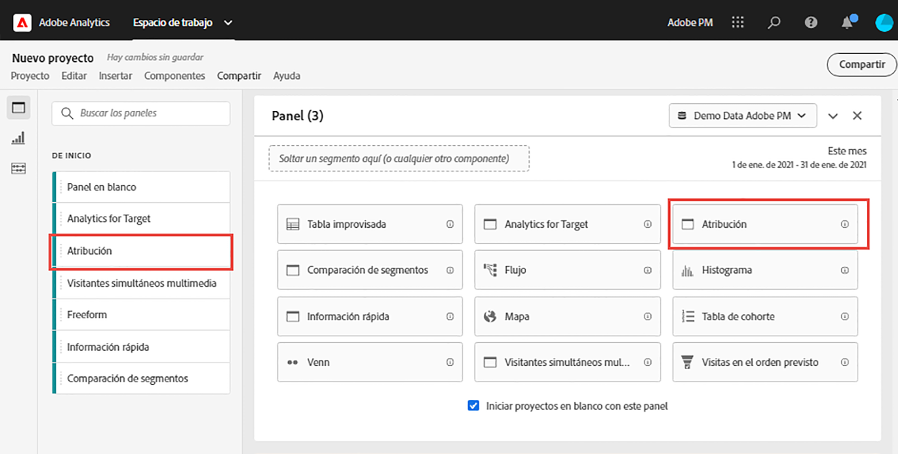
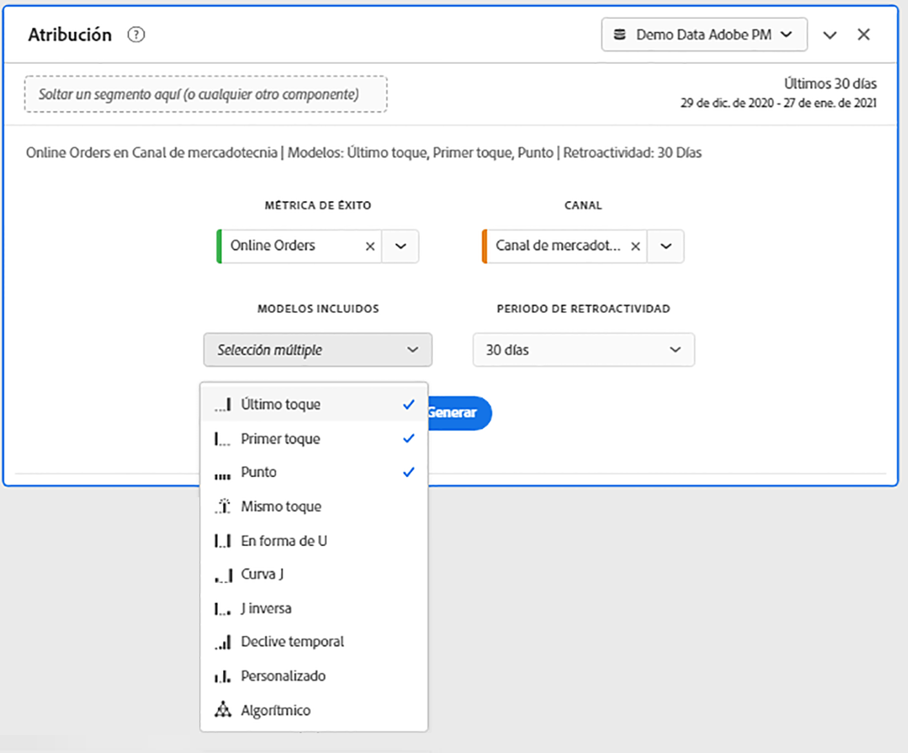
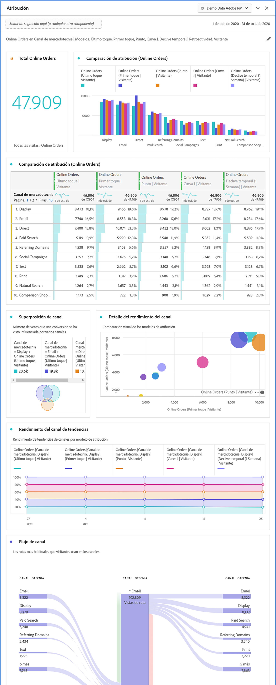

# Panel de Attribution

>[!NOTE]
>
>Está viendo la documentación de Analysis Workspace en Customer Journey Analytics. Su conjunto de funciones difiere ligeramente del [Analysis Workspace de la versión tradicional de Adobe Analytics](https://docs.adobe.com/content/help/es-ES/analytics/analyze/analysis-workspace/home.html). [Más información...](/help/getting-started/cja-aa.md)

El panel Atribución es una forma sencilla de generar un análisis comparando varios modelos de atribución. Es una funcionalidad de [Attribution IQ](../attribution/overview.md) que le proporciona un espacio de trabajo dedicado para usar y comparar modelos de atribución.

## Creación de un panel de atribución

1. Haga clic en el icono de panel situado en la izquierdo.
1. Arrastre el panel Atribución adentro de su Proyecto de Analysis Workspace.

   

1. Añada una métrica a la que desee atribuir y agregue cualquier dimensión para atribuirla. Algunos ejemplos son Canales de marketing o dimensiones personalizadas, como las promociones internas.

   

1. Seleccione los modelos de [atribución y la ventana retrospectiva](../attribution/models.md) que desee comparar.

1. El panel Atribución devuelve un conjunto completo de datos y visualizaciones que comparan la atribución para la dimensión y métrica seleccionadas.

   

## Visualizaciones de atribución

* **Métrica total**: El número total de conversiones que tienen lugar durante el periodo establecido por la ventana de creación de informes. Estas son las conversiones que se atribuyen a través de la dimensión seleccionada.
* **Gráfico de barras comparativo de la atribución de métricas**: Compara visualmente las conversiones atribuidas en cada uno de los elementos de dimensión de la dimensión seleccionada. Cada color de barra representa un modelo de atribución distinto.
* **Tabla improvisada de atribución de métricas**: Muestra los mismos datos que el gráfico de barras, representados como una tabla. Al seleccionar distintas columnas o filas en esta tabla, se filtra el gráfico de barras, así como varias de las demás visualizaciones del panel. Esta tabla actúa de forma similar a cualquier otra tabla improvisada en Workspace, lo que le permite agregar componentes como métricas, segmentos o desgloses.
* **Gráfico superpuesto de Dimension**:: Diagrama de Venn que muestra los tres elementos de dimensión principales y la frecuencia con que participan conjuntamente en una conversión. Por ejemplo, el tamaño de la superposición de burbujas indica la frecuencia con la que se produjeron las conversiones cuando un visitante estuvo expuesto a ambos elementos de dimensión. Si se seleccionan otras filas en la Tabla improvisada, se actualizará la visualización para reflejar su selección.
* **Puntos de contacto de marketing por recorrido**: Un histograma que indica el número de puntos de contacto que un visitante tuvo en la ventana retrospectiva. Esto resulta útil para ver qué impacto tuvo la atribución de múltiples contactos para su conjunto de datos. Si casi todos los visitantes tienen un solo punto de contacto, es probable que distintos modelos de atribución muestren datos similares.
* **Detalles de rendimiento del canal de marketing:** Permite comparar visualmente hasta tres modelos de atribución mediante un diagrama de puntos.
* **Flujo del canal de marketing:** Permite ver en qué canales hay interacción con más frecuencia y en qué orden a lo largo del recorrido de un visitante.
