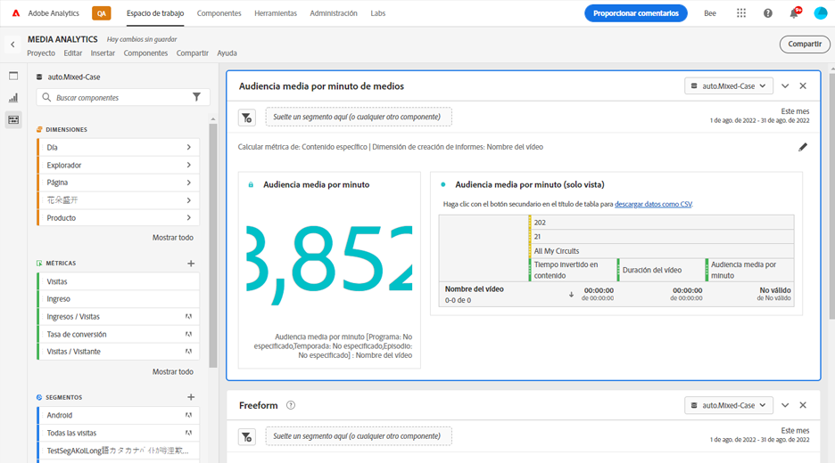
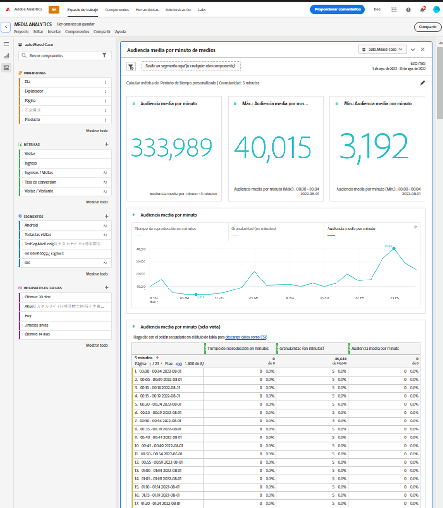

# Panel de audiencia media por minuto de medios

Los clientes de Media Analytics pueden usar el panel Audiencia media por minuto para comprender mejor el consumo promedio de su contenido. La audiencia media por minuto permite comparar la programación de cualquier género o duración. Además, los clientes pueden comparar o anexar esta audiencia media por minuto digital a métricas de minuto promedio de televisión lineal. Este panel proporciona más flexibilidad para medir la audiencia promedio para periodos de tiempo personalizados, así como cuando la clasificación de duración se ha actualizado después del hecho. La métrica de audiencia media por minuto actual solo funciona si la duración está disponible en el tiempo de procesamiento.

En Analysis Workspace, la audiencia media por minuto es el tiempo que se pasa viendo el flujo de medios dividido por la duración del contenido o la selección total del periodo y la granularidad seleccionada.

El panel Audiencia media por minuto de medios proporciona análisis de audiencia de minuto promedio según el contenido específico seleccionado si la duración está disponible mediante clasificaciones.
El panel Audiencia media por minuto también proporciona análisis durante un período de tiempo seleccionado que se puede filtrar por contenido específico, independientemente de si la duración está disponible mediante Clasificaciones. Para acceder al panel Audiencia media por minuto de medios, vaya a un grupo de informes con los componentes de Media Analytics habilitados. A continuación, haga clic en el icono del panel situado en el extremo izquierdo y arrastre el panel a su proyecto de Analysis Workspace.

<!-- For more information, see the Media Average Minute Audience introduction video:
<< replace with AMA video when available >> -->

<!-- >[!VIDEO](https://video.tv.adobe.com/v/330177/?quality=12) -->

## Entradas de panel {#Input}

Puede configurar el panel Audiencia media por minuto de medios con esta configuración de entrada:

| Configuración | Descripción |
|---------|------------|
| Intervalo de fecha del panel | El intervalo de fechas predeterminado del panel es Hoy. Puede editarlo para ver un solo día o varios meses a la vez.    Esta visualización está limitada a 1440 filas de datos (por ejemplo, 24 horas con una granularidad por minuto). Si la combinación de intervalo de fechas y granularidad genera más de 1440 filas, la granularidad se actualiza automáticamente para dar cabida al intervalo de fechas completo. |
| Arrastre un segmento aquí (o cualquier otro componente) | Al igual que otros paneles, esta configuración filtra las selecciones en función de los segmentos que haya creado. Esta es una buena manera de ver plataformas específicas, emisiones en directo u otros segmentos de medios comunes. |
| Calcular métrica para | Esta configuración le permite elegir si desea ver la audiencia media por minuto de un contenido específico, seleccionando *contenido específico*, o si desea ver la audiencia de minuto promedio para un período de tiempo específico, seleccionando *período de tiempo personalizado*.   El contenido específico solo funciona si la duración se ha actualizado mediante Clasificaciones. Si la duración no está disponible, o si desea ver la audiencia de minuto promedio de una serie temporal con varios fragmentos de contenido o contenido sin una duración asignada específica (como durante un flujo o evento en directo), debe seleccionar un período de tiempo personalizado. Esta configuración cambia el flujo de trabajo y el resultado del informe. |

### Contenido específico

| Configuración | Descripción |
|---------|------------|
| Dimensiones de creación de informes | Al elegir contenido específico, puede seleccionar el resultado del informe para utilizar los campos Nombre del vídeo o ID de contenido, y mostrar el contenido y su audiencia de minuto promedio asociada durante el período de tiempo seleccionado. |
| Filtrar contenido por (opcional) | Puede filtrar el contenido específico según la vista que desee o la forma en que se estructuran los datos. |
| Programa, temporada, episodio | Al seleccionar Mostrar, temporada, episodio, se muestran los programas disponibles en la lista desplegable, que puede filtrar con una búsqueda (o arrastrando y soltando el nombre del programa desde la columna izquierda). Puede terminar su selección allí para ver todas las temporadas del programa, o puede filtrar por temporadas individuales y luego por episodios individuales. Esta configuración muestra los datos de los programas, las temporadas o los episodios del período de tiempo seleccionado. |
| Dimensión personalizada | Si el nombre para mostrar se encuentra en una dimensión personalizada, puede encontrarla buscando en la lista desplegable de dimensiones (opcional) o utilizando la búsqueda de la columna izquierda. El elemento de dimensión se rellena automáticamente en función de esa selección y se trata como un episodio. |
| Ninguno | Puede elegir *Ninguno* para mostrar todos los nombres de vídeo que tengan datos de audiencia de minuto promedio para la selección que haya elegido. |

### Configuración avanzada de contenido específico

| Configuración | Descripción |
|---------|------------|
| Configuración de tabla | La configuración predeterminada muestra los valores de cálculo de la tabla, que muestran el numerador y el denominador de la audiencia media por minuto como las columnas anteriores de la tabla. Al anular la selección de esta opción, se eliminan esas dos columnas, por lo que queda solo la audiencia de minuto promedio junto al nombre del vídeo o el ID de contenido. |
| Métrica de tiempo empleado | Puede elegir el tiempo invertido en contenido predeterminado, que incluye solo el tiempo invertido en contenido, o bien puede elegir usar el tiempo invertido en contenido, que incluye el contenido y el tiempo de publicidad juntos como cálculo del numerador para la audiencia media por minuto. |

### Período de tiempo personalizado

| Configuración | Descripción |
|---------|------------|
| Granularidad | La granularidad predeterminada es de 5 minutos, pero puede elegir cualquiera de las granularidades que se utilizan como denominador para la serie temporal dentro de la selección de período de tiempo global realizada en la selección de calendario. Por ejemplo, si se selecciona de 12:00 pm a 12:30 pm con una granularidad de 5 minutos, la audiencia media por minuto devolverá la media de media hora, así como seis filas con la audiencia media por minuto para cada periodo de 5 minutos. Estas filas se utilizan como puntos de datos para el gráfico de series temporales. |
| Filtrar contenido por (opcional) | Puede filtrar el contenido específico según la vista que desee o la forma en que se estructuran los datos. |
| Programa, temporada, episodio | La selección *Programa, temporada, episodio* muestra los programas disponibles en la lista desplegable, que puede filtrar mediante la búsqueda (o arrastrando y soltando el nombre para mostrar de la columna izquierda). Puede terminar su selección allí para ver todas las temporadas del programa, o puede filtrar por temporadas individuales y luego por episodios individuales. Esta configuración muestra los datos de los programas, las temporadas o los episodios del período de tiempo seleccionado. |
| Dimensión personalizada | Si el nombre para mostrar se encuentra en una dimensión personalizada, puede encontrarla buscando en la lista desplegable de dimensiones (opcional) o utilizando la búsqueda de la columna izquierda. El elemento de dimensión se rellena automáticamente en función de esa selección y se trata como un episodio. |
| Ninguna | Puede elegir *Ninguna* para mostrar todos los nombres de vídeo durante el período de tiempo que ha elegido. |

### Configuración avanzada de período de tiempo personalizado

| Configuración | Descripción |
|---------|------------|
| Configuración de tabla | La configuración predeterminada muestra los valores de cálculo de la tabla, que muestra el numerador y el denominador de la audiencia de minuto promedio como las columnas anteriores de la tabla. Al anular la selección de esta opción, se eliminan esas dos columnas, por lo que queda solo la audiencia de minuto promedio junto al período de tiempo. |

## Salida del panel de contenido específico

El panel Audiencia media por minuto de medios devuelve lo siguiente:

* Audiencia media total por minuto de toda la selección
* Filtros y audiencia media por minuto para los vídeos individuales mostrados en una tabla
* Tiempo invertido en contenido y duración del vídeo si se seleccionó esa configuración avanzada

Para editar y reconstruir el panel en cualquier momento, haga clic en el lápiz de edición en la parte superior derecha.

### Fuente de datos de contenido específica

La única métrica que se puede usar en este panel es la Audiencia media por minuto.

| Métrica | Descripción |
|--------|-------------|
| Promedio de audiencia por minuto | El tiempo empleado en ver el flujo de medios dividido por la duración del vídeo proporcionada mediante clasificaciones. |

## Salida del panel de período de tiempo personalizado {#custom-time-period-output}

El panel Audiencia media por minuto de medios devuelve la audiencia media total de minutos de toda la selección, la audiencia de minuto promedio máxima y mínima, y el gráfico de series de líneas que muestra la audiencia media de minutos de toda la selección. La tabla siguiente muestra los filtros y la audiencia media por minuto de la granularidad, así como el tiempo invertido en contenido y la granularidad de cada periodo de tiempo si se seleccionó esa configuración avanzada.

Para editar y reconstruir el panel en cualquier momento, haga clic en el lápiz de edición en la parte superior derecha.

### Fuente de datos de período de tiempo personalizado

La única métrica que se puede usar en este panel es la Audiencia media por minuto:

| Métrica | Descripción |
|---|---|
| Promedio de audiencia por minuto | El tiempo empleado en ver el flujo de medios dividido por la selección total o la granularidad seleccionada en minutos. |

<!-- For more information about Media Average Minute Audience, visit [MA doc page]( https://url). -->
