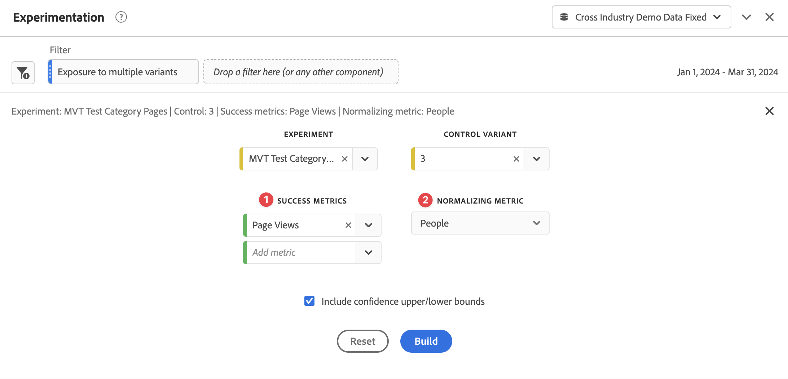
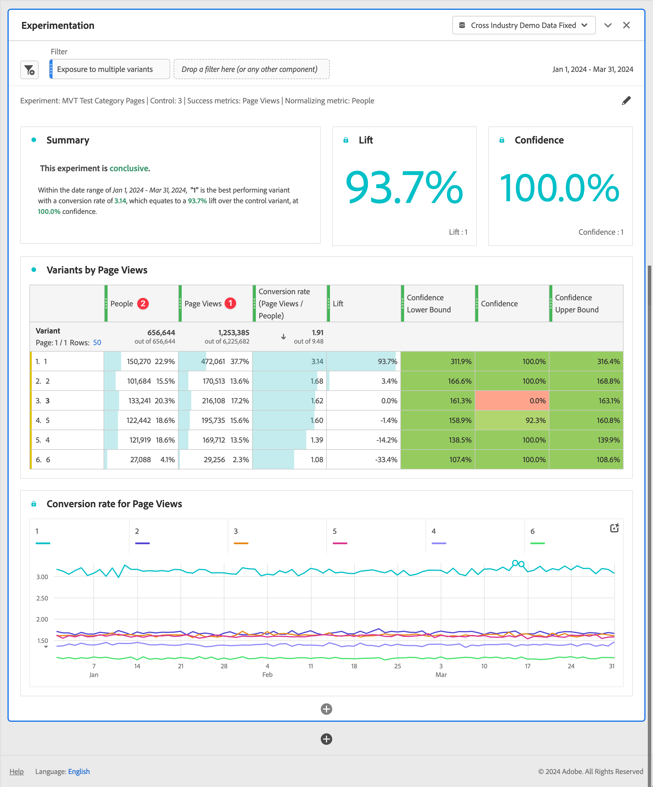

# Panel Experimentación {#experimentation-panel}

<!-- markdownlint-disable MD034 -->

>[!CONTEXTUALHELP]
>id="workspace_experimentation_button"
>title="Experimentación"
>abstract="Cree un panel para comparar diferentes variaciones de experiencias de usuario, marketing o mensajería. Y determinar qué variación es la mejor para lograr un resultado específico."

<!-- markdownlint-enable MD034 -->

<!-- markdownlint-disable MD034 -->

>[!CONTEXTUALHELP]
>id="workspace_experimentation_panel"
>title="Experimentación"
>abstract="Compare diferentes variaciones de experiencias de usuario, marketing o mensajería para determinar cuál es la mejor manera de impulsar un resultado específico.  **Parámetros ** **Experimento**: el experimento que se analiza. **Variante de control**: variante de control del experimento seleccionado. **Métrica de éxito**: hasta 5 métricas de éxito estándar (no calculadas) con las que analizar el experimento. **Métrica de normalización**: personas, sesiones o eventos. Esta métrica (también denominada metodología de contabilización) se convierte en el denominador del cálculo del alza. Esta métrica también afecta a la manera en que se añaden los datos antes de que se calcule la confianza."

<!-- markdownlint-enable MD034 -->

>[!BEGINSHADEBOX]

*Este artículo documenta el panel Experimentación en **Customer Journey Analytics**. Consulte el panel [Analytics for Target](https://experienceleague.adobe.com/en/docs/analytics/analyze/analysis-workspace/panels/a4t-panel) para obtener información sobre cómo analizar las actividades y experiencias de Adobe Target en **Adobe Analytics**.*

>[!ENDSHADEBOX]

El panel **[!UICONTROL Experimentación]** permite que los analistas comparen diferentes variaciones de experiencias de usuario, marketing o mensajería para determinar cuál es la mejor manera de impulsar un resultado específico. Puede evaluar el alza y la confianza de cualquier experimento A/B desde cualquier plataforma de experimentación: en línea, sin conexión, desde soluciones de Adobe como Target o Journey Optimizer, e incluso sus propios datos.

Más información sobre la [integración entre Adobe Customer Journey Analytics y Adobe Target](https://experienceleague.adobe.com/es/docs/target/using/integrate/cja/target-reporting-in-cja).

## Control de acceso {#access}

El panel Experimentación está disponible para su uso por parte de todos los usuarios de Customer Journey Analytics. No se requieren derechos de administrador ni otros permisos. Sin embargo, los requisitos previos requieren acciones que solo los administradores pueden realizar.

## Funciones en métricas calculadas

Hay dos funciones avanzadas disponibles: Alza y Confianza. Para obtener más información, consulte [Referencia: funciones avanzadas](/help/components/calc-metrics/cm-adv-functions.md).

## Requisitos previos

Para utilizar el panel de experimentación, asegúrese de seguir estos requisitos previos:

### Crear conexión con conjuntos de datos del experimento

El esquema de datos recomendado es que los datos de experimentación estén en una [Matriz de objetos](https://experienceleague.adobe.com/en/docs/experience-platform/xdm/ui/fields/array) que contiene el experimento y los datos de variante en dos dimensiones independientes. Ambas dimensiones deben estar en una matriz de objetos **single**. Si tiene los datos de experimentación en una sola dimensión (con datos de experimento y de variante en una cadena delimitada), puede usar la configuración [subcadena](/help/data-views/component-settings/substring.md) en vistas de datos para dividir la dimensión en dos y usarla en el panel.

Después de [ingerir](https://experienceleague.adobe.com/en/docs/experience-platform/ingestion/home) los datos de experimentación en Adobe Experience Platform, [cree una conexión en el Customer Journey Analytics](/help/connections/create-connection.md) a uno o más conjuntos de datos de experimento.

### Agregar etiquetas de contexto en vistas de datos

En la configuración de vistas de datos de Customer Journey Analytics, los administradores pueden agregar [etiquetas de contexto](/help/data-views/component-settings/overview.md) a una dimensión o métrica y los servicios de Customer Journey Analytics como el panel [!UICONTROL Experimentación] pueden usarlas para sus fines. Para el panel Experimentación se utilizan dos etiquetas predefinidas:

* [!UICONTROL Experimento de experimentación]
* [!UICONTROL Variante de experimento]

En la vista de datos que contiene datos de experimentación, elija dos dimensiones, una con los datos de experimentación y otra con los de variante. Luego etiquete esas dimensiones con las etiquetas **[!UICONTROL Experimento de experimentación]** y **[!UICONTROL Variante de experimentación]**.

Sin estas etiquetas presentes, el panel Experimento no funciona, ya que no hay experimentos con los que trabajar.

## Utiliza

Para usar un panel **[!UICONTROL Experimentación]**:

1. Crear un panel de **[!UICONTROL Experimentación]**. Para obtener información sobre cómo crear un panel, consulta [Crear un panel](panels.md#create-a-panel).

1. Especifica la [entrada](#panel-input) para el panel.

1. Observa la [salida](#panel-output) del panel.

   >[!IMPORTANT]
   >
   >Si no se ha completado la configuración necesaria en las vistas de datos del Customer Journey Analytics, recibirá este mensaje antes de continuar: [!UICONTROL Configure el experimento y las dimensiones de variante en las vistas de datos].
   >

### Entrada de panel

Para usar el panel Experimentación:

1. Configure las opciones de entrada del panel:

   

   | Configuración | Definición |
   | --- | --- |
   | **[!UICONTROL Intervalo de fecha]** | El intervalo de fechas del panel Experimentación se establece automáticamente, en función del primer evento recibido en Customer Journey Analytics para el experimento seleccionado. Puede restringir o expandir el intervalo de fecha a un periodo de tiempo más específico si es necesario. |
   | **[!UICONTROL Experimento]** | Un conjunto de variaciones de una experiencia que se expusieron a los usuarios finales para determinar cuál es mejor mantener de forma perpetua. Un experimento está formado por dos o más variantes, una de las cuales se considera la de control. Esta configuración está rellenada previamente con las dimensiones que se han etiquetado con la etiqueta **[!UICONTROL Experimento]** en las vistas de datos y con los datos de experimentación de los últimos tres meses. |
   | **[!UICONTROL Variante de control]** | Una de las dos o más alteraciones en la experiencia de un usuario final que se comparan con el fin de identificar la mejor alternativa. Se debe seleccionar una variante como control, y solo una puede considerarse la de control. Esta configuración se rellena previamente con las dimensiones que se han etiquetado con la etiqueta **[!UICONTROL Variant]** en las vistas de datos. Esta configuración extrae los datos de variante asociados con este experimento. |
   | **[!UICONTROL Métricas de éxito]** ➊ | La métrica o métricas con las que un usuario compara variantes. La variante con el resultado más deseable para la métrica de conversión (ya sea la más alta o la más baja) se declara como la *variante con mejor rendimiento* de un experimento. Se pueden añadir hasta cinco filtros. |
   | **[!UICONTROL Métrica de normalización]** ➋ | La base ([!UICONTROL Personas], [!UICONTROL Sesiones] o [!UICONTROL Eventos]) en la que se ejecuta una prueba. Por ejemplo, una prueba puede comparar las tasas de conversión de varias variaciones en las que **[!UICONTROL Tasa de conversión]** se calcula como Vista de página |
   | **[!UICONTROL Incluir límites superior/inferior de confianza]** | Active esta opción para mostrar los límites superior e inferior de los niveles de confianza. |

1. Seleccione **[!UICONTROL Generar]**.

### Salida de panel

El panel Experimentación devuelve un completo conjunto de datos y visualizaciones para ayudarle a comprender mejor el rendimiento de sus experimentos. En la parte superior del panel, se proporcionan visualizaciones de [cambio de resumen](../visualizations/summary-number-change.md) para recordarle la configuración del panel que ha seleccionado. En cualquier momento, puede editar el panel seleccionando el lápiz de edición en la parte superior derecha.

También se obtiene un resumen de texto que indica si el experimento es concluyente o no y resume el resultado. La conclusión se basa en la relevancia estadística (consulte [Metodología estadística](#adobes-statistical-methodology).) Puede ver los números de resumen de la variante con mejor rendimiento, con el alza y la confianza más altas.

Para cada métrica de éxito seleccionada, se muestra una visualización de [tabla de forma libre](../visualizations/freeform-table/freeform-table.md) y una visualización de tasa de conversión [línea](../visualizations/line.md).

>[!NOTE]
>
>Actualmente, este panel no admite el análisis de pruebas A/A.

#### Interpretación de los resultados

1. **El experimento es concluyente**: cada vez que visualiza el informe de experimentación, se analizan los datos que se han acumulado en el experimento hasta este momento. El análisis declara que un experimento es concluyente cuando la confianza válida de *anytime* supera el umbral del 95 % para *al menos una* de las variantes. Con más de dos brazos, se aplica una corrección de Benjamini-Hochberg para corregir las pruebas de hipótesis múltiples.

2. **Variante con mejor rendimiento**: cuando se declara que un experimento es concluyente, la variante con la tasa de conversión más alta se etiqueta como la variante con mejor rendimiento. Tenga en cuenta que esta variante debe ser la de control o de línea de base, o una de las variantes que cruce el umbral de confianza válida del 95 % *anytime* (con correcciones de Benjamini-Hochberg aplicadas).

3. **Tasa de conversión**: La tasa de conversión que se muestra es una relación entre el valor de la métrica de éxito ➊ el valor de la métrica de normalización ➋. Tenga en cuenta que este valor puede ser mayor que 1, si la métrica no es binaria (1 o 0 para cada unidad en el experimento)

4. **Alza**: el resumen del informe de experimento muestra el alza sobre la línea de base, que es una medida de la mejora porcentual en la tasa de conversión de una variante determinada respecto a la línea de base. Definida con precisión, es la diferencia de rendimiento entre una variante determinada y la línea de base, dividida por el rendimiento de la línea de base, expresada como porcentaje.

5. **Confianza**: La confianza válida en cualquier momento que se muestra es una medida probabilística de cuánta evidencia existe de que una variante determinada es la misma que la de control. Una mayor confianza indica menos evidencia para el supuesto de que la variante de control y la que no es de control tienen un rendimiento igual. La confianza es una probabilidad (expresada como porcentaje) de que habría observado una diferencia menor en las tasas de conversión entre una variante determinada y la de control. Aunque en realidad no hay diferencia en las tasas de conversión subyacentes reales. En términos de valores *p*, la confianza mostrada es 1 - valor *p*.

>[!NOTE]
>
>Una descripción completa de los resultados debe tener en cuenta todas las pruebas disponibles (por ejemplo, el diseño de los experimentos, los tamaños de las muestras, las tasas de conversión, la confianza y otras), y no solo la declaración de concluyente o no. Incluso cuando un resultado aún no es concluyente, puede haber pruebas convincentes de que una variante es diferente de otra (por ejemplo, los intervalos de confianza casi no se superponen). Lo ideal sería que toda la evidencia estadística, interpretada en un espectro continuo, informara la toma de decisiones.

## Metodología estadística de Adobe {#statistics}

A fin de facilitar la interpretación y la seguridad de la inferencia estadística, Adobe ha adoptado una metodología estadística basada en [Secuencias de confianza válidas en cualquier momento](https://arxiv.org/abs/2103.06476).

Una secuencia de confianza es un análogo *secuencial* de un intervalo de confianza. Para entender qué es una secuencia de confianza, imaginemos que repiten sus experimentos cien veces. Y calcule una estimación de la métrica empresarial media (por ejemplo, la tasa de apertura de un correo electrónico) y su secuencia de confianza del 95 % asociada para *cada nuevo usuario* que entre en el experimento.

Una secuencia de confianza del 95 % incluye el valor &quot;verdadero&quot; de la métrica empresarial en 95 de los 100 experimentos que ejecutó. (Un intervalo de confianza del 95 % solo se podía calcular una vez por experimento para dar la misma garantía de cobertura del 95 %; no con cada nuevo usuario). Por lo tanto, las secuencias de confianza le permiten monitorizar los experimentos continuamente, sin aumentar las tasas de error de los falsos positivos, es decir, permiten &quot;asomarse&quot; a los resultados.

## Interpretación de dimensiones no aleatorias {#non-randomized}

El Customer Journey Analytics permite a los analistas seleccionar cualquier dimensión como experimento. Pero, ¿cómo interpreta un análisis en el que la dimensión elegida como experimento no es aquella para la que se aleatorizan las personas?

Por ejemplo, considere un anuncio que vea una persona. Puede que le interese medir el cambio en alguna métrica (por ejemplo, ingresos promedio) si decide mostrar las personas *ad B* en lugar de *ad A*. El efecto causal de mostrar el anuncio B, en lugar del anuncio A, es de importancia central para llegar a la decisión de comercialización. Este efecto causal puede medirse como el ingreso promedio en toda la población, si se sustituye el status quo de mostrar el anuncio A por la estrategia alternativa de mostrar el anuncio B.

Las pruebas A/B son el estándar de oro dentro de la industria para medir de manera objetiva los efectos de este tipo de intervenciones. La razón crítica por la que una prueba A/B da lugar a una estimación causal se debe a la aleatorización de las personas para recibir una de las posibles variantes.

Ahora, consideremos una dimensión que no se logra mediante la aleatorización, por ejemplo, el estado de EE. UU. de la persona. Las personas provienen principalmente de dos estados, Nueva York y California. Los ingresos promedio de las ventas de una marca de ropa de invierno pueden ser diferentes en los dos estados debido a las diferencias en el clima regional. En tal situación, el clima puede ser el verdadero factor causal detrás de las ventas de ropa de invierno, y no el hecho de que los estados geográficos de las personas son diferentes.

El panel de experimentación en Customer Journey Analytics permite analizar los datos como una diferencia de ingresos promedio por estados de las personas. En tal situación, el resultado no tiene una interpretación causal. Sin embargo, dicho análisis puede seguir siendo de interés. Proporciona una estimación (junto con medidas de incertidumbre) de la diferencia en los ingresos medios por estados de las personas.  Este valor también se conoce como *Prueba de hipótesis estadística*. El resultado de este análisis puede ser interesante, pero no necesariamente procesable. Simplemente porque no ha aleatorizado y a veces no puede aleatorizar a las personas a uno de los valores posibles de la dimensión.

La siguiente ilustración contrasta estas situaciones:

Cuando se desea medir el impacto de la intervención X en el resultado Y, es posible que la causa real de ambos sea el factor de confusión C. Si los datos no se consiguen aleatorizando a las personas en X, el impacto es más difícil de medir, y el análisis explícitamente explica C. La aleatorización rompe la dependencia de X en C, lo que nos permite medir el efecto de X en Y sin tener que preocuparnos por otras variables.

## Uso de métricas calculadas en experimentación {#use-in-experimentation}

>[!NOTE]
>
>Para organizaciones que utilizan Customer Journey Analytics y Adobe Journey Optimizer, la información de esta sección también se aplica a las funciones de experimentación de Journey Optimizer.

No todas las métricas calculadas son compatibles con el panel Experimentación.

Las métricas calculadas que incluyen cualquiera de las siguientes métricas o constantes no son compatibles con el panel Experimentación:

* Métricas base de un [conjunto de datos de resumen](https://experienceleague.adobe.com/en/docs/analytics-platform/using/cja-dataviews/summary-data)
* Métricas base divididas entre sí o multiplicadas juntas (por ejemplo, `Revenue`/`Orders`)
* Constantes que se agregan o restan de una métrica base (por ejemplo, `Revenue+50`)
* Cualquiera de las siguientes métricas base:
   * Personas

Las métricas calculadas que no son compatibles con el panel Experimentación tienen el valor [!UICONTROL **En todas partes del Customer Journey Analytics (excluida la experimentación)**] en el campo [!UICONTROL **Compatibilidad del producto**] al crear la métrica calculada. Para obtener información sobre cómo crear una métrica calculada, consulte [Generar métricas](/help/components/calc-metrics/cm-workflow/cm-build-metrics.md).

## Uso de métricas calculadas en el panel Experimentación

Consulte esta publicación de blog para obtener información sobre [usando métricas calculadas en el panel Experimentación](https://experienceleaguecommunities.adobe.com/t5/adobe-analytics-blogs/using-derived-metrics-in-cja-s-experimentation-panel/ba-p/593119).
