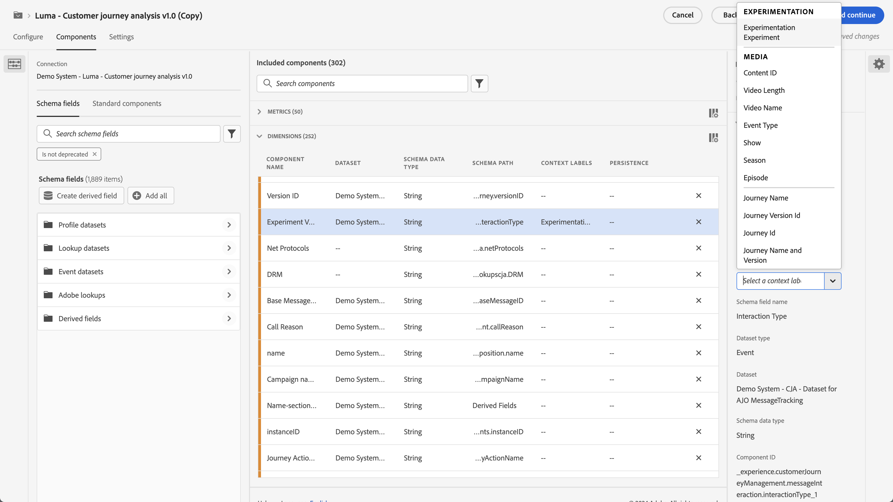
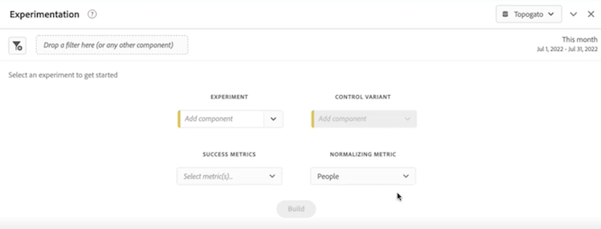
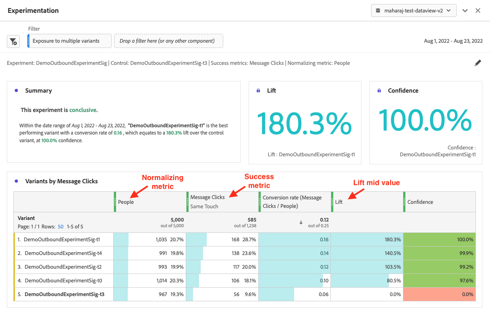
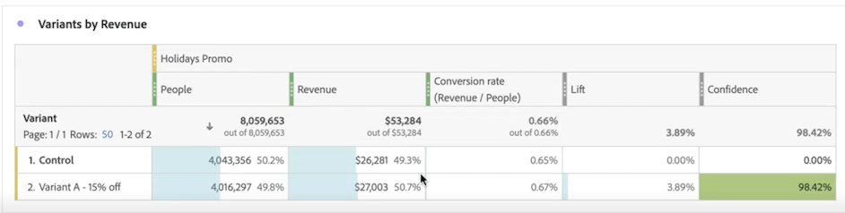
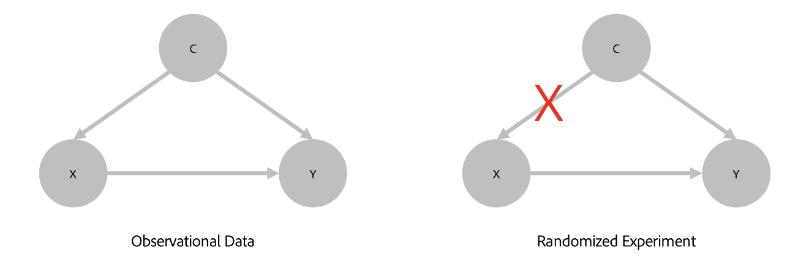

# Panel Experimentación

El panel **[!UICONTROL Experimentación]** permite que los analistas comparen distintas variaciones de experiencia del usuario, marketing o mensajería para determinar cuál es la mejor opción a fin de obtener un resultado específico. Puede evaluar el alza y la confianza de cualquier experimento A/B desde cualquier plataforma de experimentación: en línea, sin conexión, desde soluciones de Adobe, Adobe Journey Optimizer e incluso datos propios.

>[!IMPORTANT]
>
>En este punto, [Adobe Analytics para Target](https://experienceleague.adobe.com/docs/target/using/integrate/a4t/a4t.html?lang=es) Datos de (A4T) *no puede* analizarse en el panel Experimentación.

## Control de acceso {#access}

El panel Experimentación está disponible para su uso por parte de todos los usuarios de Customer Journey Analytics. No se requieren derechos de administrador ni otros permisos. Sin embargo, la configuración (pasos 1 y 2 a continuación) exige acciones que solo los administradores pueden realizar.

## Nuevas funciones en Métricas calculadas {#functions}

Se agregaron dos nuevas funciones avanzadas: [!UICONTROL Alza] y [!UICONTROL Confianza]. Para obtener más información, consulte [Referencia: funciones avanzadas](/help/components/calc-metrics/cm-adv-functions.md).

## Paso 1: Crear una conexión con el conjunto de datos del experimento {#connection}

El esquema de datos recomendado es que los datos del experimento estén en una [Matriz de objetos](https://experienceleague.adobe.com/docs/experience-platform/xdm/ui/fields/array.html?lang=es) que contiene el experimento y los datos de variante en dos dimensiones independientes. Ambas dimensiones deben estar en una **soltero** matriz de objetos. Si tiene los datos del experimento en una sola dimensión con datos de experimento y de variante en una cadena delimitada, puede utilizar la configuración [subcadena](/help/data-views/component-settings/substring.md) en vistas de datos para dividirlas en dos y usarlas en el panel.

Después de añadir los datos del experimento [introducido](https://experienceleague.adobe.com/docs/experience-platform/ingestion/home.html?lang=es) en Adobe Experience Platform, [crear una conexión en el Customer Journey Analytics](/help/connections/create-connection.md) a uno o más conjuntos de datos de experimento.

## Paso 2: Añadir etiquetas de contexto en vistas de datos {#contect-labels}

En la configuración de vistas de datos del Customer Journey Analytics, los administradores pueden agregar lo siguiente [etiquetas de contexto](/help/data-views/component-settings/overview.md) a una dimensión o métrica y servicios de Customer Journey Analytics como [!UICONTROL Experimentación] El panel puede utilizar estas etiquetas para sus fines. Para el panel Experimentación se utilizan dos etiquetas predefinidas:

* [!UICONTROL Experimento de experimentación]
* [!UICONTROL Variante de experimento]

En la vista de datos que contiene datos de experimentación, elija dos dimensiones, una con los datos de experimentación y otra con los de variante. A continuación, etiquete esas dimensiones con **[!UICONTROL Experimento]** y **[!UICONTROL Variante]**.

Sin estas etiquetas presentes, el panel Experimento no funciona, ya que no hay experimentos con los que trabajar.

## Paso 3: Configurar el panel Experimento {#configure}

1. En Customer Journey Analytics Workspace, arrastre el panel Experimentación a un proyecto.

>[!IMPORTANT]
>Si no se ha completado la configuración necesaria en las vistas de datos del Customer Journey Analytics, recibirá este mensaje antes de continuar: &quot;[!UICONTROL Configure el experimento y las dimensiones de la variante en las vistas de datos]&quot;.

1. Ajuste la configuración de entrada del panel.

   | Configuración | Definición |
   | --- | --- |
   | **[!UICONTROL Experimento]** | Un conjunto de variaciones de una experiencia que se expusieron a los usuarios finales para determinar cuál es mejor mantener de forma perpetua. Un experimento está formado por dos o más variantes, una de las cuales se considera la de control. Esta configuración se rellena previamente con las dimensiones que se han etiquetado con **[!UICONTROL Experimento]** en las vistas de datos y con los datos de los últimos tres meses del experimento. |
   | **[!UICONTROL Variante de control]** | Una de las dos o más alteraciones en la experiencia de un usuario final que se comparan con el fin de identificar la mejor alternativa. Se debe seleccionar una variante como control, y solo una puede considerarse la de control. Esta configuración se rellena previamente con las dimensiones que se han etiquetado con **[!UICONTROL Variante]** en las vistas de datos. Esta configuración extrae los datos de variante asociados con este experimento. |
   | **[!UICONTROL Métricas de éxito]** | La métrica o métricas con las que un usuario compara variantes. La variante con el resultado más deseable para las métricas de conversión (ya sea la más alta o la más baja) se declara como la “variante con mejor rendimiento” de un experimento. Se pueden añadir hasta cinco filtros. |
   | **[!UICONTROL Métrica de normalización]** | La base ([!UICONTROL Personas], [!UICONTROL Sesiones] o [!UICONTROL Eventos]) en que se ejecutará una prueba. Por ejemplo, una prueba puede comparar las tasas de conversión de varias variaciones en las que **[!UICONTROL Tasa de conversión]** se calcula como **[!UICONTROL Conversiones por sesión]** o **[!UICONTROL Conversiones por persona]**. |
   | **[!UICONTROL Intervalo de fecha]** | El intervalo de fechas se establece automáticamente, en función del primer evento recibido en Customer Journey Analytics para el experimento seleccionado. Puede restringir o expandir el intervalo de fecha a un periodo de tiempo más específico si es necesario. |

1. Haga clic en **[!UICONTROL Generar]**.

## Paso 4: Ver el resultado del panel {#view}

El panel Experimentación devuelve un completo conjunto de datos y visualizaciones para ayudarle a comprender mejor el rendimiento de sus experimentos. En la parte superior del panel, se proporciona una línea de resumen para recordarle la configuración del panel seleccionada. En cualquier momento, puede editar el panel haciendo clic en el lápiz de edición en la parte superior derecha.

También se obtiene un resumen de texto que indica si el experimento es concluyente o no y resume el resultado. La conclusión se basa en la relevancia estadística. (Consulte Metodología estadística más adelante). Puede ver los números de resúmenes de la variante con mejor rendimiento, con el alza y la confianza más altas.

Para cada métrica de éxito seleccionada, se mostrará una tabla de forma libre y una tendencia de tasa de conversión.

El gráfico de [!UICONTROL líneas] le proporciona el rendimiento de [!UICONTROL Control] frente a [!UICONTROL Variante de control]:

>[!NOTE]
>
>Actualmente, este panel no admite el análisis de pruebas A/A.

## Paso 5: Interpretar los resultados {#interpret}

1. **El experimento es concluyente**: cada vez que visualiza el informe de experimentación, Adobe analiza los datos que se hayan acumulado en el experimento hasta este momento. Luego declara que un experimento es &quot;concluyente&quot; cuando la confianza válida en cualquier momento supere el umbral del 95 % para *al menos uno* de las variantes (con una corrección de Benjamini-Hochberg aplicada cuando hay más de dos brazos, para corregir las pruebas de hipótesis múltiples).

2. **Variante de mejor rendimiento**: cuando se declara que un experimento es concluyente, la variante con la tasa de conversión más alta se identifica como la “variante con mejor rendimiento”. Tenga en cuenta que esta variante debe ser la de control o de línea de base, o una de las variantes que cruce el umbral de confianza válida en cualquier momento del 95 % (con correcciones de Benjamini-Hochberg aplicadas).

3. **Tasa de conversión**: la tasa de conversión que se muestra es una relación entre el valor de la métrica de éxito y el de la métrica de normalización. Tenga en cuenta que a veces puede ser mayor que 1, si la métrica no es binaria (1 o 0 para cada unidad en el experimento)

4. **Alza**: el resumen del informe de experimento muestra el alza sobre la línea de base, que es una medida de la mejora porcentual en la tasa de conversión de una variante determinada respecto a la línea de base. Definida con precisión, es la diferencia de rendimiento entre una variante determinada y la línea de base, dividida por el rendimiento de la línea de base, expresada como porcentaje.

5. **Confianza**: la confianza válida en cualquier momento que se muestra es una medida probabilística de cuánta evidencia existe de que una variante determinada es la misma que la de control. Una mayor confianza indica menos evidencia para el supuesto de que la variante de control y la que no es de control tienen un rendimiento igual. Más precisamente, la confianza que se muestra es una probabilidad (expresada como porcentaje) de que habríamos observado una diferencia menor en las tasas de conversión entre una variante determinada y la de control, si en realidad no hay diferencia en las tasas de conversión subyacentes reales. En términos de valores *p*, la confianza mostrada es 1 - valor *p*.

>[!NOTE]
>
>Una descripción completa de los resultados debe tener en cuenta todas las pruebas disponibles (es decir, el diseño de los experimentos, los tamaños de las muestras, las tasas de conversión, la confianza, etc.), y no solo la declaración de concluyente o no. Incluso cuando un resultado aún no es “concluyente”, puede haber pruebas convincentes de que una variante es diferente de otra (por ejemplo, los intervalos de confianza casi no se superponen). Lo ideal sería que la adopción de decisiones se basara en todas las pruebas estadísticas, interpretadas en un espectro continuo.

## Metodología estadística de Adobe {#statistics}

A fin de facilitar la interpretación y la seguridad de la inferencia estadística, Adobe ha adoptado una metodología estadística basada en [Secuencias de confianza válidas en cualquier momento](https://doi.org/10.48550/arXiv.2103.06476).

Una secuencia de confianza es un análogo “secuencial” de un intervalo de confianza. Para comprender la secuencia de confianza, imagine que repite los experimentos cien veces y calcula una estimación de la métrica empresarial media (por ejemplo, la tasa de apertura de un correo electrónico) y su secuencia de confianza del 95 % asociada para *cada nuevo usuario* que entra en el experimento.

Una secuencia de confianza del 95 % incluirá el valor “verdadero” de la métrica comercial en 95 de los 100 experimentos que ejecutó. (Un intervalo de confianza del 95 % solo se podía calcular una vez por experimento para ofrecer la misma garantía de cobertura del 95 %; no con cada nuevo usuario). Por lo tanto, las secuencias de confianza le permiten monitorizar continuamente los experimentos, sin aumentar las tasas de error de los falsos positivos, es decir, permiten “asomarse” a los resultados.

## Interpretación de dimensiones no aleatorias {#non-randomized}

El Customer Journey Analytics permite a los analistas seleccionar cualquier dimensión como &quot;experimento&quot;. Pero, ¿cómo interpreta un análisis en el que la dimensión elegida como experimento no es aquella para la que se aleatorizan las personas?

Por ejemplo, considere un anuncio que vea una persona. Puede que le interese medir el cambio en alguna métrica (por ejemplo, ingresos promedio) si decide mostrar las personas &quot;anuncio B&quot; en lugar de &quot;anuncio A&quot;. El efecto causal de mostrar el anuncio B en lugar del anuncio A es de importancia fundamental para llegar a la decisión de comercialización. Este efecto causal puede medirse como el ingreso promedio sobre toda la población, si reemplazamos el status quo de mostrar el anuncio A con la estrategia alternativa de mostrar el anuncio B.

Las pruebas A/B son el estándar de oro dentro de la industria para medir de manera objetiva los efectos de este tipo de intervenciones. La razón crítica por la que una prueba A/B da lugar a una estimación causal se debe a la aleatorización de las personas para recibir una de las posibles variantes.

Ahora considere una dimensión que no se logra mediante la aleatorización, por ejemplo, el estado de EE. UU. de la persona. Digamos que nuestras personas provienen principalmente de dos estados, Nueva York y California. Los ingresos promedio de las ventas de una marca de ropa de invierno pueden ser diferentes en los dos estados debido a las diferencias en el clima regional. En tal situación, el clima puede ser el verdadero factor causal detrás de las ventas de ropa de invierno, y no el hecho de que los estados geográficos de las personas son diferentes.

El panel de experimentación en Customer Journey Analytics permite analizar los datos como una diferencia de ingresos promedio por estados de las personas. En tal situación, el resultado no tiene una interpretación causal. Sin embargo, dicho análisis puede seguir siendo de interés. Proporciona una estimación (junto con medidas de incertidumbre) de la diferencia en los ingresos medios por estados de las personas. Esto también se conoce como &quot;Prueba de hipótesis estadística&quot;. El resultado de este análisis puede ser interesante, pero no necesariamente procesable, ya que no hemos y a veces no podemos aleatorizar a las personas a uno de los posibles valores de la dimensión.

La siguiente ilustración contrasta estas situaciones:

Cuando se desea medir el impacto de la intervención X en el resultado Y, es posible que la causa real de ambos sea el factor de confusión C. Si los datos no se consiguen aleatorizando a las personas en X, el impacto es más difícil de medir, y el análisis dará cuenta explícitamente de C. La aleatorización rompe la dependencia de X en C, lo que nos permite medir el efecto de X en Y sin tener que preocuparnos por otras variables.

## Uso de métricas calculadas en el panel Experimentación

Consulte esta publicación de blog para obtener información sobre [uso de métricas derivadas en el panel Experimentación](https://experienceleaguecommunities.adobe.com/t5/adobe-analytics-blogs/using-derived-metrics-in-cja-s-experimentation-panel/ba-p/593119).
