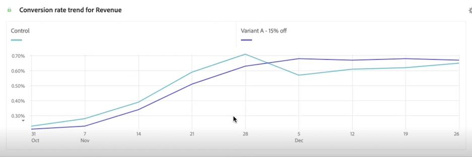

# Panel de experimentación

>[!NOTE]
>
>Actualmente, esta funcionalidad está en [prueba limitada](/help/release-notes/releases.md).

La variable **[!UICONTROL Experimento]** permite que los analistas comparen distintas variaciones de experiencia de usuario, marketing o mensajería para determinar cuál es la mejor opción para obtener un resultado específico. Puede evaluar el alza y la confianza de cualquier experimento A/B desde cualquier plataforma de experimentación: en línea, sin conexión, desde soluciones de Adobe, Adobe Journey Optimizer e incluso datos de BYO (que le aporten sus propios).

>[!IMPORTANT]
>
>En este punto, [Adobe Analytics para Target](https://experienceleague.adobe.com/docs/target/using/integrate/a4t/a4t.html?lang=es) Datos (A4T) introducidos en Adobe Experience Platform mediante el conector de origen de Analytics **cannot** se analizará en la variable [!UICONTROL Experimento] panel. Esperamos una solución a esta cuestión en 2023.

## Control de acceso

El panel Experimento está disponible para su uso por parte de todos los usuarios de Customer Journey Analytics (CJA). No se requieren derechos de administrador ni otros permisos. Sin embargo, la configuración (pasos 1 y 2 a continuación) requiere acciones que solo los administradores pueden realizar.

## Paso 1: Crear conexión para experimentar conjuntos de datos

Una vez que se hayan añadido los datos del experimento [ingested](https://experienceleague.adobe.com/docs/experience-platform/ingestion/home.html?lang=es) en Adobe Experience Platform, [crear una conexión en CJA](/help/connections/create-connection.md) a uno o más conjuntos de datos de experimento.

## Paso 2: Adición de etiquetas de contexto en vistas de datos

En la configuración de vistas de datos de CJA, los administradores pueden agregar [etiquetas de contexto](/help/data-views/component-settings/overview.md) a una dimensión o métrica y servicios de CJA como [!UICONTROL Experimento] puede utilizar estas etiquetas para sus fines. Para el panel Experimento se utilizan dos etiquetas predefinidas:

* [!UICONTROL Experimento]
* [!UICONTROL Variant]

En la vista de datos que contiene datos de experimentación, elija dos dimensiones, una con los datos de experimentación y otra con los datos de variante. A continuación, etiquete esas dimensiones con la etiqueta **[!UICONTROL Experimento]** y **[!UICONTROL Variant]** etiquetas.

Sin estas etiquetas presentes, el panel Experimento no funciona, ya que no habrá experimentos con los que trabajar.

## Paso 3: Configuración del panel Experimento

1. En CJA Workspace, arrastre el panel Experimentación a un proyecto.

>[!IMPORTANT]
>Si no se ha completado la configuración necesaria en las vistas de datos de CJA, recibirá un mensaje a ese efecto antes de continuar.

1. Configure los ajustes de entrada del panel.

   | Configuración | Definición |
   | --- | --- |
   | **[!UICONTROL Experimento]** | Conjunto de variaciones de una experiencia que se han expuesto a los usuarios finales para determinar cuál es mejor mantener a perpetuidad. Un experimento está formado por dos o más variantes, una de las cuales se considera la variante de control. Esta configuración se rellena previamente con las dimensiones que se han etiquetado con la variable  **[!UICONTROL Experimento]** en vistas de datos y el valor de los últimos 3 meses de datos de experimento. |
   | **[!UICONTROL Variante de control]** | Una de las dos o más alteraciones en la experiencia de un usuario final que se están comparando con el fin de identificar la mejor alternativa. Se debe seleccionar una variante como control y solo se puede considerar que una variante es la variante de control. Esta configuración se rellena previamente con las dimensiones que se han etiquetado con la variable  **[!UICONTROL Variant]** en las vistas de datos. Esta configuración extrae los datos de variante asociados con este experimento. |
   | **[!UICONTROL Métricas de éxito]** | La métrica o métricas con las que un usuario compara variantes. La variante con el resultado más deseable para la métrica de conversión (ya sea la más alta o la más baja) se declara como la &quot;variante de mejor rendimiento&quot; de un experimento. Puede agregar hasta 5 métricas. |
   | **[!UICONTROL Métrica de normalización]** | La base ([!UICONTROL People], [!UICONTROL Sesiones]o [!UICONTROL Eventos]) en el que se ejecutará una prueba. Por ejemplo, una prueba puede comparar las tasas de conversión de varias variaciones en las que **[!UICONTROL Tasa de conversión]** se calcula como **[!UICONTROL Conversiones por sesión]** o **[!UICONTROL Conversiones por persona]**. |
   | **[!UICONTROL Intervalo de fechas]** | El intervalo de fechas se establece automáticamente, en función de la primera visita recibida en CJA para el experimento seleccionado. Puede restringir o expandir el intervalo de fechas a un intervalo de tiempo más específico si es necesario. |

1. Haga clic en **[!UICONTROL Generar]**.

## Paso 4: Interpretación de la salida del panel

El panel Experimentación devuelve un completo conjunto de datos y visualizaciones para ayudarle a comprender mejor el rendimiento de sus experimentos. En la parte superior del panel, se proporciona una línea de resumen para recordarle la configuración del panel seleccionada. En cualquier momento, puede editar el panel haciendo clic en el lápiz de edición en la parte superior derecha.

También se obtiene un resumen de texto que indica si el experimento es concluyente o no y resume el resultado. La conclusión se basa en la relevancia estadística. (Consulte &quot;Metodología estadística&quot; más adelante). Puede ver los números de resumen de la variante de mejor rendimiento con el alza y la confianza más altos.

>[!NOTE]
>
>El alza y la confianza también son [funciones de métricas calculadas avanzadas](/help/components/calc-metrics/cm-adv-functions.md) en CJA, para que pueda crear sus propias métricas de alza y confianza.

Para cada métrica de éxito seleccionada, se mostrará una tabla improvisada y una tendencia de tasa de conversión:

La variable [!UICONTROL Línea] El gráfico le proporciona la variable [!UICONTROL Control] versus [!UICONTROL Variante de control] rendimiento:

>[!NOTE]
>
>Actualmente, este panel no admite el análisis de pruebas A/A.

## Metodología estadística del Adobe

A fin de facilitar la interpretación y la seguridad de la inferencia estadística, el Adobe ha adoptado una metodología estadística basada en [Secuencias de confianza válidas en cualquier momento](https://doi.org/10.48550/arXiv.2103.06476).

Una secuencia de confianza es un analógico &quot;secuencial&quot; de un intervalo de confianza. Para comprender la secuencia de confianza, imagine que repite los experimentos cien veces y calcula una estimación de la métrica comercial media (por ejemplo, la tasa de apertura de un correo electrónico) y su secuencia de confianza del 95 % asociada para *cada nuevo usuario* que entra en el experimento. Una secuencia de confianza del 95 % incluirá el valor &quot;verdadero&quot; de la métrica comercial en 95 de los 100 experimentos que ejecutó. (Un intervalo de confianza del 95 % solo se podía calcular una vez por experimento para ofrecer la misma garantía de cobertura del 95 %; no con cada nuevo usuario). Por lo tanto, las secuencias de confianza le permiten supervisar continuamente los experimentos, sin aumentar las tasas de error de False Positive, es decir, permiten &quot;mirar&quot; a los resultados.

### Interpretación de los resultados

1. **El experimento es concluyente**: Cada vez que vea el informe de experimentación, Adobe analiza los datos que se han acumulado en el experimento hasta este punto y declarará que un experimento es &quot;concluyente&quot; cuando la confianza en cualquier momento válida supere el umbral del 95 % para *al menos una* de las variantes (con una corrección de Bonferonni aplicada cuando hay más de dos brazos, para corregir las pruebas de hipótesis múltiples).

2. **Variante de mejor rendimiento**: Cuando se declara que un experimento es concluyente, la variante con la tasa de conversión más alta se etiqueta como la &quot;variante con mejor rendimiento&quot;. Tenga en cuenta que esta variante debe ser el control o la variante de línea de base, o una de las variantes que cruce el umbral de confianza válido del 95 % en cualquier momento (con correcciones de Bonferonni aplicadas).

3. **Tasa de conversión**: La tasa de conversión que se muestra es una relación entre el valor de la métrica de éxito y el valor de la métrica de normalización. Tenga en cuenta que a veces puede ser mayor que 1, si la métrica no es binaria (1 o 0 para cada unidad en el experimento)

4. **Alza**: El resumen del informe de experimento muestra el alza sobre la línea de base, que es una medida de la mejora porcentual en la tasa de conversión de una variante determinada respecto a la línea de base. Definido con precisión, es la diferencia de rendimiento entre una variante determinada y la línea de base, dividida por el rendimiento de la línea de base, expresado como porcentaje.

5. **Confianza**: La confianza válida en cualquier momento que se muestra es una medida probabilística de cuánta evidencia existe de que una variante determinada es la misma que la variante de control. Una mayor confianza indica menos evidencia para el supuesto de que la variante de control y la variante sin control tienen un rendimiento igual. Más precisamente, la confianza que se muestra es una probabilidad (expresada como porcentaje) de que habríamos observado una diferencia menor en las tasas de conversión entre una variante determinada y el control, si en realidad no hay diferencia en las tasas de conversión subyacentes reales. En términos de *p*-values, la confianza mostrada es 1 - *p*-value.

Sin embargo, tenga en cuenta que una descripción completa de los resultados debe tener en cuenta todas las pruebas disponibles (es decir, el diseño de los experimentos, los tamaños de las muestras, las tasas de conversión, la confianza, etc.), y no sólo la declaración de concluyente o no. Incluso cuando un resultado aún no es &quot;concluyente&quot;, puede haber pruebas convincentes de que una variante es diferente de otra (por ejemplo, los intervalos de confianza casi no se superponen). Lo ideal sería que la adopción de decisiones se basara en todas las pruebas estadísticas, interpretadas en un espectro continuo.
