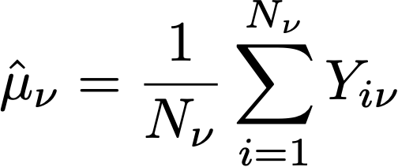
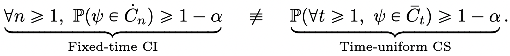
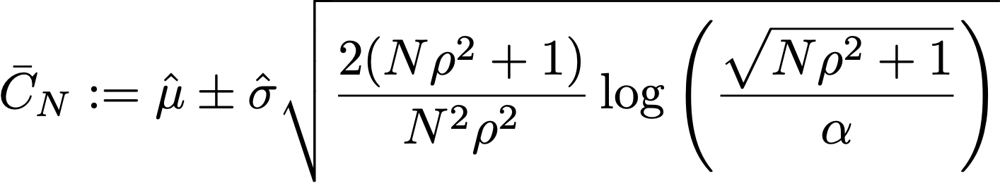
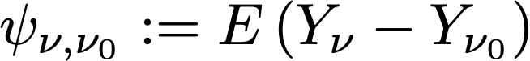
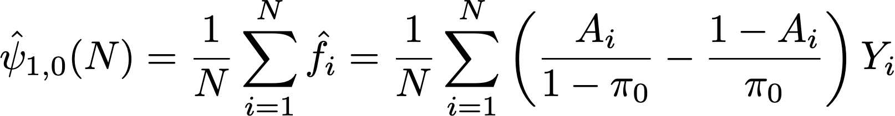
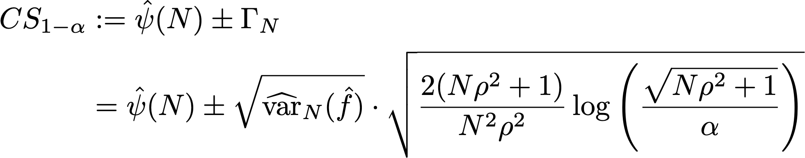
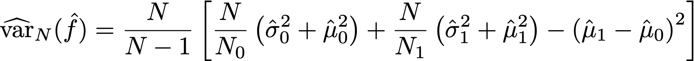
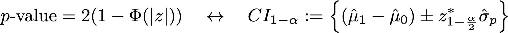
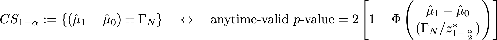

# Cálculos estadísticos en el panel de experimentación de CJA: Detalles

Esta página documenta los cálculos estadísticos detallados utilizados en el panel de experimentación de CJA. Está pensado para usuarios técnicos.

## Tasa de conversión

La tasa de conversión o **medium**, *μν* para cada variante *ν* en un experimento se define como una proporción de la suma de la métrica con respecto al número de unidades asignadas a esa métrica, *Nν*:

Aquí,

- *Yiν* es el valor de la métrica para cada unidad *i*, que se ha asignado a una variante determinada *ν*.
- La suma sobre unidades *i* depende de la elección de la métrica de normalización.
   - If *People* es la métrica de normalización, cada unidad es una persona/perfil único.
   - If *Sesiones* es la métrica de normalización, cada unidad es una sesión única.
   - If *Eventos* es la métrica de normalización, cada unidad es un evento único.

En general, esta métrica de normalización debe elegirse para que sea equivalente a su unidad de independencia, es decir, si el comportamiento de un usuario en una sesión es independiente de su comportamiento en otra sesión, entonces las sesiones son una métrica de normalización razonable.

Donde sea necesario, se utiliza la desviación estándar de ejemplo, con la expresión

## Alza

El alza entre una variante  *ν* y la variante de control  *ν0* es el &quot;delta&quot; relativo en las tasas de conversión, definido como

donde las tasas de conversión individuales son las definidas anteriormente.

## Secuencias de confianza

Aunque no se muestra en el panel Experimentación de CJA, la secuencia de confianza de una variante individual *ν* es fundamental para la metodología estadística utilizada por el Adobe, por lo que se define aquí (reproducido a partir de [Waudby-Smith y otros.](https://doi.org/10.48550/arXiv.2103.06476)).

> Supongamos que le interesa calcular un parámetro de destino *ψ* (como la tasa de conversión de una variante en un experimento). A continuación, la dicotomía entre una secuencia de intervalos de confianza (CI) de &quot;tiempo fijo&quot; y una secuencia de confianza (CS) uniforme en el tiempo se puede resumir de la siguiente manera:

En palabras: para un intervalo de confianza regular , la garantía probabilística de que el parámetro de destino se encuentra dentro del rango de valores *Ċt* solo es válido con un único valor fijo de *n* (donde *n* es el número de muestras). Por el contrario, para una secuencia de confianza, se garantiza que en todo momento/ todos los valores del tamaño de la muestra *t*, el valor &quot;true&quot; del parámetro de interés se encuentra dentro de los límites *Ct*.

Esto tiene algunas implicaciones profundas que son muy importantes para las pruebas en línea:
- El CS se puede actualizar de forma opcional cada vez que haya nuevos datos disponibles.
- Los experimentos se pueden supervisar continuamente, detener adaptativamente o continuar.
- El error de tipo I se controla en todo momento de detención, incluidos los tiempos dependientes de los datos.

El Adobe utiliza secuencias de confianza asintóticas, que para una variante individual con estimación media *μ* tiene el formulario

Donde:
- *N* es el número de unidades para esa variante
- *σ* es una estimación de muestra de la desviación estándar (definida anteriormente)
- *α* es el nivel deseado de error de tipo I (o probabilidad de falta de cobertura)
- *ρ* 2 es una constante que afina el tamaño de la muestra con el que CS es más ajustado. El Adobe ha elegido un valor universal de *ρ* 2 = 10-2,8, que es adecuado para los tipos de tasas de conversión que se ven en los experimentos en línea.

## Confianza

La confianza utilizada por el Adobe es una confianza &quot;válida en cualquier momento&quot;, que se obtiene invirtiendo la secuencia de confianza para el efecto medio del tratamiento.

Para ser precisos, observamos que en dos muestras *t* prueba de la diferencia de medios entre dos variantes, hay una asignación 1:1 entre *p*-valor para esta prueba, y el intervalo de confianza para la diferencia de medios. Por analogía, un valor válido en cualquier momento *p*-value puede obtenerse invirtiendo la secuencia de confianza (en cualquier momento válida) para el estimador del efecto de tratamiento medio:

El estimador que utilizamos es un estimador con ponderación de tendencia inversa (IPW). Tenga en cuenta *N = N0* + *N1* unidades, las asignaciones de variante para cada unidad $i$ etiquetadas por *Ai=0,1* si la unidad está asignada a la variante ν=0,1. Si a los usuarios se les asigna una probabilidad fija (propensión) *π0, (1-π0)* y su métrica de resultados es *Yi*, el estimador de IPW es

Observando que *f* es la función de influencia, Waudby-Smith y otros. se ha demostrado que la secuencia de confianza para este estimador es:

Sustituir la probabilidad de asignación por sus estimaciones empíricas: *π0 = N0/N*, el término de variación puede expresarse en términos de estimaciones medias de muestra individuales  *μ{0,1}* y estimaciones de desviaciones estándar,  *σ{0,1}* como:

Recordando que para una prueba de hipótesis normal con estadística de prueba *z = (μ1 - μ0)/ σp*, hay una correspondencia entre los valores de $p$ y los intervalos de confianza:

donde *Φ* es la distribución acumulativa de la normalidad estándar. Para cualquier momento válido *p*-valores, dada la secuencia de confianza para el efecto de tratamiento promedio definido anteriormente, podemos invertir esta relación:

Por último, la variable **en cualquier momento válido *confianza*** es

## Declarar un experimento concluyente

Para un experimento con dos brazos, el panel Experimento de CJA muestra un mensaje que indica que un experimento es **concluyente** cuando la confianza válida en cualquier momento exceda el 95 % (es decir, el valor válido en cualquier momento *p*-value es inferior al 5 %).

Cuando hay más de dos variantes, se aplica la corrección de Bonferonni. Para un experimento con *K* tratamientos, y un único tratamiento basal (control), *K-1* pruebas de hipótesis independientes. La corrección de Bonferonni significa que rechazamos la hipótesis nula de que el control y una variante determinada tienen los mismos medios, si el valor es válido en cualquier momento *p*-value está por debajo de un umbral de 0,05/(K-1).

## Mejor rendimiento

Cuando se declara concluyente un experimento, se muestra el brazo de mejor rendimiento. Este es el grupo con el mejor rendimiento (media o tasa de conversión más alta), entre el conjunto que incluye el control y todos los brazos que tienen un *p*-valor que está por debajo del umbral de Bonferonni.