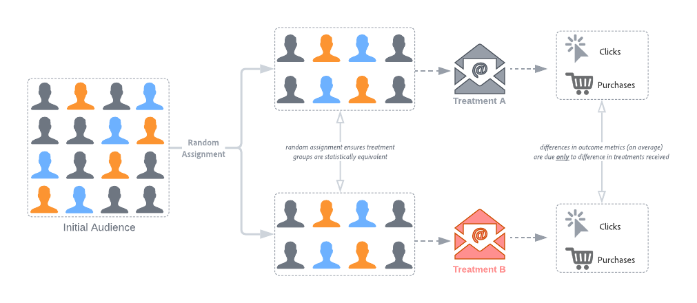
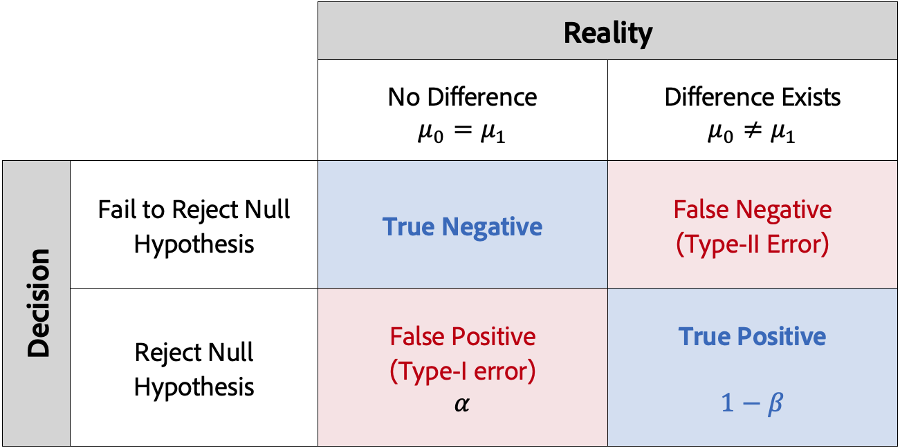
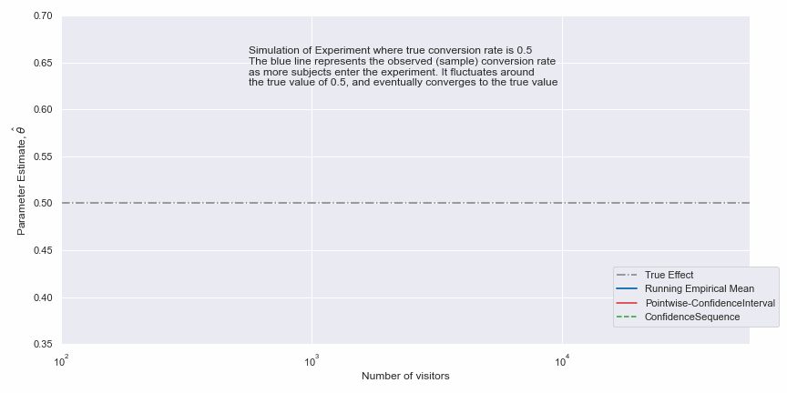

# Introducción a la metodología estadística en el panel de experimentación de CJA

Este artículo describe los cálculos estadísticos utilizados por el panel de experimentación en CJA. CJA utiliza métodos estadísticos avanzados para calcular **confianza** que es válido en cualquier momento, lo que le permite ejecutar sus experimentos durante el tiempo que desee y supervisar sus resultados continuamente.

Este artículo describe cómo funcionan las pruebas A/B y proporciona una introducción intuitiva al Adobe ***Cualquier secuencia de confianza válida por tiempo***. Para los usuarios expertos, los detalles técnicos y las referencias se incluyen al final.

## Pruebas A/B y causalidad

Las pruebas A/B suelen describirse como un &quot;patrón oro&quot; para evaluar el impacto causal de algún tipo de &quot;intervención&quot;. Son pruebas aleatorias, que en el contexto de las pruebas en línea, significa que exponemos a algunos usuarios seleccionados aleatoriamente a una variación determinada de un sitio web, mensaje o correo electrónico, y otro conjunto de usuarios seleccionados aleatoriamente a otros **variante** o **tratamiento**. Después de la exposición, medimos el resultado **métricas** nos interesa (por ejemplo, aperturas de correos electrónicos, suscripciones o compras).

Como se muestra en la imagen siguiente, el hecho de que asignemos usuarios aleatoriamente a cada grupo de variantes significa que, en promedio, los grupos compartirán las mismas características. Por lo tanto, cualquier diferencia en los resultados puede interpretarse como debida a las diferencias en las variantes recibidas, es decir, podemos establecer una **causal** vínculo entre nuestras intervenciones y los resultados que nos interesan. Esto le permite tomar decisiones rigurosas, explicables y basadas en datos al optimizar sus objetivos comerciales, por lo que las pruebas A/B son una parte fundamental del conjunto de herramientas de cualquier profesional moderno de la personalización.

Ahora, una pregunta importante es si las diferencias observadas son &quot;efectos reales&quot; o surgen debido a la aleatoriedad. Intuitivamente, si solo hay una pequeña diferencia en las métricas de resultados entre grupos, esto podría haberse observado por casualidad, mientras que las diferencias más grandes tienen más probabilidades de ser &quot;reales&quot;. El término técnico aquí es que nuestras mediciones son *estimaciones* de los valores reales de la media para cada grupo de variantes. Las técnicas de inferencia estadística nos ofrecen maneras de cuantificar la cantidad de incertidumbre en nuestras estimaciones - aquí es donde los conceptos de **valores p** y **Intervalos de confianza** Pero para entenderlas, primero debemos entender los errores estadísticos.

## Pruebas estadísticas y control de errores

Muchas metodologías de inferencias estadísticas están diseñadas para controlar dos tipos de errores: **Positivos falsos** (errores de tipo I) y **Negativos falsos** (Errores de tipo II). Éstas se ilustran en la tabla siguiente.

Un falso positivo es un rechazo incorrecto de la hipótesis nula, cuando en realidad es verdadero. En el contexto de las pruebas A/B en línea, esto significa que (falsamente) concluimos que la métrica de negocio de los resultados es diferente entre las armas de variante, cuando en realidad era la misma. Antes de ejecutar el experimento, normalmente elegimos un umbral *α*. Una vez ejecutado el experimento, la variable *p*-value se calcula y rechazamos el valor nulo si *p &lt; α*. Un umbral comúnmente utilizado es *α*= 0,05, lo que significa que a largo plazo, se espera que 5 de cada 100 experimentos sean falsos positivos.

Mientras tanto, un falso negativo significa que no rechazamos la hipótesis nula cuando en realidad es falsa. En las pruebas A/B, esto significa que no rechazamos la hipótesis nula (recuerde, la hipótesis nula indica que la métrica comercial de resultados es la misma entre los brazos de variante), cuando en realidad es diferente. Para controlar este tipo de error, generalmente necesitamos tener suficientes usuarios en nuestro experimento para garantizar un **Potencia**, definido como 1-*β* (es decir, una menos la probabilidad de un error de tipo II).

La mayoría de las técnicas de inferenciación estadística requieren que fije el tamaño de la muestra con antelación, en función del tamaño del efecto que desee determinar, así como de la tolerancia a errores (*α* y *β*) con antelación. Sin embargo, la metodología de Adobe está diseñada para permitirle observar continuamente sus resultados, para cualquier tamaño de muestra.

## Metodología estadística del Adobe: _Secuencias de confianza válidas en cualquier momento_

A fin de facilitar la interpretación y la seguridad de la inferencia estadística, el Adobe ha adoptado una metodología estadística basada en [_Secuencias de confianza válidas en cualquier momento_](https://doi.org/10.48550/arXiv.2103.06476).

Una secuencia de confianza es un analógico &quot;secuencial&quot; de un intervalo de confianza. Para comprender la secuencia de confianza, imagine que repite los experimentos cien veces y calcula una estimación de la métrica comercial media (por ejemplo, la tasa de apertura de un correo electrónico) y su secuencia de confianza del 95 % asociada para *cada nuevo usuario* que entra en el experimento. Una secuencia de confianza del 95 % incluirá el valor &quot;verdadero&quot; de la métrica comercial en 95 de los 100 experimentos que ejecutó. (Un intervalo de confianza del 95 % solo se podía calcular una vez por experimento para ofrecer la misma garantía de cobertura del 95 %; no con cada nuevo usuario). Por lo tanto, las secuencias de confianza le permiten supervisar continuamente los experimentos, sin aumentar las tasas de error de False Positive, es decir, permiten &quot;mirar&quot; a los resultados.

La diferencia entre las secuencias de confianza y los intervalos de confianza para un único experimento se muestra en la siguiente animación:

Observamos que las secuencias de confianza desplazan el enfoque de las pruebas A/B a *estimación* en lugar de probar hipótesis, es decir, centrarse en una estimación precisa de la diferencia de medios entre tratamientos, en lugar de rechazar o no una hipótesis nula basada en un umbral de relevancia estadística.

Sin embargo, de forma similar a la relación entre los valores de $p$ (o Confianza) y los intervalos de confianza, también existe una relación entre las secuencias de confianza y cualquier valor de $p$ válido (o en cualquier momento de confianza válida). Dada la familiaridad de cantidades como la Confianza, CJA proporciona la confianza válida en cualquier momento en sus informes.

Los fundamentos teóricos de las secuencias de confianza provienen del estudio de secuencias de variables aleatorias conocidas como martingales. A continuación se incluyen algunos resultados principales para los lectores expertos, pero las vías para los profesionales son claras:

> Las secuencias de confianza se pueden interpretar como análisis secuenciales &quot;seguros&quot; de intervalos de confianza: puede ver e interpretar los datos en su prueba A/B en el momento que desee y detener o continuar los experimentos de forma segura. La confianza válida en cualquier momento (o *p*-value) también es seguro de interpretar.

Es importante señalar que, como la metodología estadística es &quot;válida en cualquier momento&quot;, será más conservadora que una metodología de horizonte fijo aplicada al mismo tamaño de la muestra. Esto significa que el valor &quot;anytime valid&quot; *p*-values serán generalmente mayores que el horizonte fijo correspondiente *p*-values (es decir, la confianza válida en cualquier momento será menor)

## Interpretación de los resultados

1. **El experimento es concluyente**: Cada vez que vea el informe de experimentación, Adobe analiza los datos que se han acumulado en el experimento hasta este punto y declarará que un experimento es &quot;concluyente&quot; cuando la confianza en cualquier momento válida supere el umbral del 95 % para *al menos una* de las variantes (con una corrección de Bonferonni aplicada cuando hay más de dos brazos, para corregir las pruebas de hipótesis múltiples).

2. **Variante de mejor rendimiento**: Cuando se declara que un experimento es concluyente, la variante con la tasa de conversión más alta se etiqueta como la &quot;variante con mejor rendimiento&quot;. Tenga en cuenta que esta variante debe ser el control o la variante de línea de base, o una de las variantes que cruce el umbral de confianza válido del 95 % en cualquier momento (con correcciones de Bonferonni aplicadas).

3. **Tasa de conversión**: La tasa de conversión que se muestra es una relación entre el valor de la métrica de éxito y el valor de la métrica de normalización. Tenga en cuenta que a veces puede ser mayor que 1, si la métrica no es binaria (1 o 0 para cada unidad en el experimento)

4. **Alza**: El resumen del informe de experimento muestra el alza sobre la línea de base, que es una medida de la mejora porcentual en la tasa de conversión de una variante determinada respecto a la línea de base. Definido con precisión, es la diferencia de rendimiento entre una variante determinada y la línea de base, dividida por el rendimiento de la línea de base, expresado como porcentaje.

5. **Confianza**: La confianza válida en cualquier momento que se muestra es una medida probabilística de cuánta evidencia existe de que una variante determinada es la misma que la variante de control. Una mayor confianza indica menos evidencia para el supuesto de que la variante de control y la variante sin control tienen un rendimiento igual. Más precisamente, la confianza que se muestra es una probabilidad (expresada como porcentaje) de que habríamos observado una diferencia menor en las tasas de conversión entre una variante determinada y el control, si en realidad no hay diferencia en las tasas de conversión subyacentes reales. En términos de *p*-values, la confianza mostrada es 1 - *p*-value.

Sin embargo, tenga en cuenta que una descripción completa de los resultados debe tener en cuenta todas las pruebas disponibles (es decir, el diseño de los experimentos, los tamaños de las muestras, las tasas de conversión, la confianza, etc.), y no sólo la declaración de concluyente o no. Incluso cuando un resultado aún no es &quot;concluyente&quot;, puede haber pruebas convincentes de que una variante es diferente de otra (por ejemplo, los intervalos de confianza casi no se superponen). Lo ideal sería que la adopción de decisiones se basara en todas las pruebas estadísticas, interpretadas en un espectro continuo.
