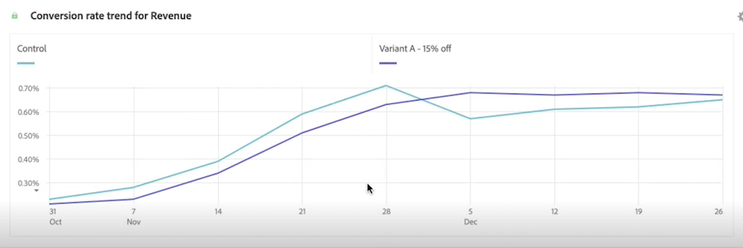

# Panel de experimentación

>[!NOTE]
>
>Actualmente, esta funcionalidad está en [prueba limitada](/help/release-notes/releases.md).

La variable **[!UICONTROL Experimento]** permite que los analistas comparen distintas variaciones de experiencia de usuario, marketing o mensajería para determinar cuál es la mejor opción para obtener un resultado específico. Puede evaluar el alza y la confianza de cualquier experimento A/B desde cualquier plataforma de experimentación: en línea, sin conexión, desde soluciones de Adobe, Adobe Journey Optimizer e incluso datos de BYO (que le aporten sus propios).

>[!IMPORTANT]
>
>En este punto, [Adobe Analytics para Target](https://experienceleague.adobe.com/docs/target/using/integrate/a4t/a4t.html?lang=es) Datos (A4T) introducidos en Adobe Experience Platform mediante el conector de origen de Analytics **cannot** se analizará en la variable [!UICONTROL Experimento] panel. Esperamos una solución a esta cuestión en 2023.

## Control de acceso

El panel Experimento está disponible para su uso por parte de todos los usuarios de Customer Journey Analytics (CJA). No se requieren derechos de administrador ni otros permisos. Sin embargo, la configuración (pasos 1 y 2 a continuación) requiere acciones que solo los administradores pueden realizar.

## Paso 1: Crear conexión para experimentar conjuntos de datos

El esquema de datos recomendado es que los datos del experimento están en una matriz de objetos que contiene el experimento y los datos de variante en dos dimensiones independientes. Si tiene los datos del experimento en una sola dimensión con datos de experimento y variante en una cadena delimitada, puede utilizar la variable [substring](https://experienceleague.adobe.com/docs/analytics-platform/using/cja-dataviews/component-settings/substring.html?lang=en#) configuración en vistas de datos para dividirlas en dos para utilizarlas en el panel.

Una vez que se hayan añadido los datos del experimento [ingested](https://experienceleague.adobe.com/docs/experience-platform/ingestion/home.html?lang=en) en Adobe Experience Platform, [crear una conexión en CJA](/help/connections/create-connection.md) a uno o más conjuntos de datos de experimento.

## Paso 2: Adición de etiquetas de contexto en vistas de datos

En la configuración de vistas de datos de CJA, los administradores pueden agregar [etiquetas de contexto](/help/data-views/component-settings/overview.md) a una dimensión o métrica y servicios de CJA como [!UICONTROL Experimento] puede utilizar estas etiquetas para sus fines. Para el panel Experimento se utilizan dos etiquetas predefinidas:

* [!UICONTROL Experimento]
* [!UICONTROL Variant]

En la vista de datos que contiene datos de experimentación, elija dos dimensiones, una con los datos de experimentación y otra con los datos de variante. A continuación, etiquete esas dimensiones con la etiqueta **[!UICONTROL Experimento]** y **[!UICONTROL Variant]** etiquetas.

Sin estas etiquetas presentes, el panel Experimento no funciona, ya que no habrá experimentos con los que trabajar.

## Paso 3: Configuración del panel Experimento

1. En CJA Workspace, arrastre el panel Experimentación a un proyecto.

>[!IMPORTANT]
>Si no se ha completado la configuración necesaria en las vistas de datos de CJA, recibirá un mensaje a ese efecto antes de continuar.

1. Configure los ajustes de entrada del panel.

   | Configuración | Definición |
   | --- | --- |
   | **[!UICONTROL Experimento]** | Conjunto de variaciones de una experiencia que se han expuesto a los usuarios finales para determinar cuál es mejor mantener a perpetuidad. Un experimento está formado por dos o más variantes, una de las cuales se considera la variante de control. Esta configuración se rellena previamente con las dimensiones que se han etiquetado con la variable  **[!UICONTROL Experimento]** en vistas de datos y el valor de los últimos 3 meses de datos de experimento. |
   | **[!UICONTROL Variante de control]** | Una de las dos o más alteraciones en la experiencia de un usuario final que se están comparando con el fin de identificar la mejor alternativa. Se debe seleccionar una variante como control y solo se puede considerar que una variante es la variante de control. Esta configuración se rellena previamente con las dimensiones que se han etiquetado con la variable  **[!UICONTROL Variant]** en las vistas de datos. Esta configuración extrae los datos de variante asociados con este experimento. |
   | **[!UICONTROL Métricas de éxito]** | La métrica o métricas con las que un usuario compara variantes. La variante con el resultado más deseable para la métrica de conversión (ya sea la más alta o la más baja) se declara como la &quot;variante de mejor rendimiento&quot; de un experimento. Puede agregar hasta 5 métricas. |
   | **[!UICONTROL Métrica de normalización]** | La base ([!UICONTROL People], [!UICONTROL Sesiones]o [!UICONTROL Eventos]) en el que se ejecutará una prueba. Por ejemplo, una prueba puede comparar las tasas de conversión de varias variaciones en las que **[!UICONTROL Tasa de conversión]** se calcula como **[!UICONTROL Conversiones por sesión]** o **[!UICONTROL Conversiones por persona]**. |
   | **[!UICONTROL Intervalo de fechas]** | El intervalo de fechas se establece automáticamente en función de la primera visita recibida en CJA para el experimento seleccionado. Esto se puede modificar para restringir o expandir el intervalo de fechas a un intervalo de tiempo más específico si es necesario. |

1. Haga clic en **[!UICONTROL Generar]**.

## Paso 4: Interpretación de la salida del panel

El panel Experimentación devuelve un completo conjunto de datos y visualizaciones para ayudarle a comprender mejor el rendimiento de sus experimentos. Se agrega un filtro global para tener en cuenta las personas o sesiones que están expuestas a varias variaciones. Este filtro no se puede editar ni eliminar. En la parte superior del panel, se proporciona una línea de resumen para recordarle la configuración del panel seleccionada. En cualquier momento, puede editar el panel haciendo clic en el lápiz de edición en la parte superior derecha.

También se obtiene un resumen de texto que indica si el experimento es concluyente o no y resume el resultado. La conclusión se basa en la relevancia estadística. (Consulte &quot;Metodología estadística&quot; más adelante). La variante de mejor rendimiento solo se proporciona para un experimento que sea concluyente y se selecciona según la tasa de conversión de las variantes significativas. Puede ver los números de resumen de la variante de mejor rendimiento con el alza y la confianza más altos.

Los números de resumen y resumen del texto solo se generan para la primera métrica de éxito seleccionada en la entrada del panel.

>[!NOTE]
>
>El alza y la confianza también son funciones métricas calculadas avanzadas en CJA, por lo que puede crear sus propias métricas de alza y confianza.

Para cada métrica de éxito seleccionada, se mostrará una tabla improvisada y una tendencia de tasa de conversión:

La variable [!UICONTROL Línea] El gráfico le proporciona la variable [!UICONTROL Control] versus [!UICONTROL Variante de control] rendimiento:

>[!NOTE]
>
>Actualmente, este panel no admite el análisis de pruebas A/A.

## Metodología estadística

A seguir.
