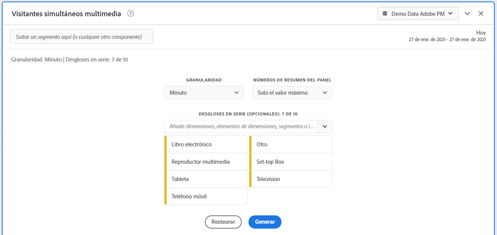
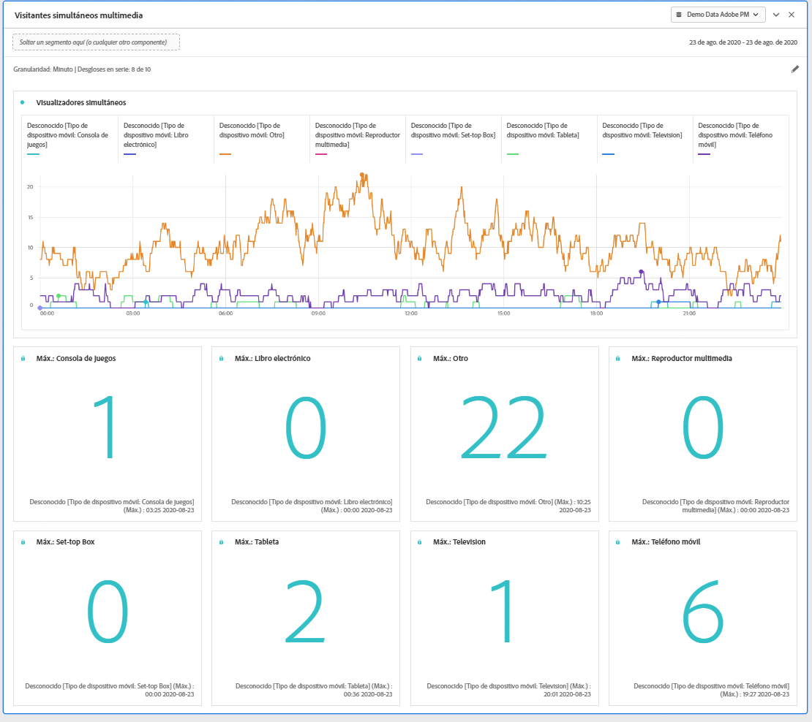
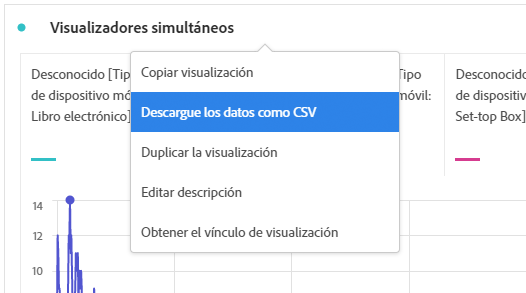

# Panel Visualizadores simultáneos de medios {#media-concurrent-viewers-panel}

<!-- markdownlint-disable MD034 -->

>[!CONTEXTUALHELP]
>id="cja_workspace_mediaconcurrentviewers_button"
>title="Espectadores simultáneos de medios"
>abstract="Cree un panel para analizar el público medio por minuto de contenido específico o durante un período de tiempo específico."

<!-- markdownlint-enable MD034 -->

<!-- markdownlint-disable MD034 -->

>[!CONTEXTUALHELP]
>id="cja_workspace_mediaconcurrentviewers_panel"
>title="Espectadores simultáneos de medios"
>abstract="Analice los visualizadores simultáneos a lo largo del tiempo, vea la concurrencia máxima o desglose y compare.  **Granularidad**: seleccione el período de tiempo en el que desea ver los visualizadores simultáneos. **Números de resumen del panel**: opción para mostrar números de resumen con detalles de fecha u hora para cada línea. Máximo mostrará detalles para la concurrencia máxima. Mínimo mostrará los detalles de la emisión.  **Desglose por serie (opcional)**: desglose la visualización por segmentos, dimensiones, elementos de dimensión o intervalos de fechas. Puede ver hasta 10 líneas a la vez. Los desgloses están limitados a un solo nivel."

<!-- markdownlint-enable MD034 -->

>[!NOTE]
>
>El panel Audiencia media por minuto de medios solo está disponible para los clientes que han adquirido el complemento Colección de medios de streaming para Customer Journey Analytics.
>
>Póngase en contacto con el representante de ventas de Adobe o con el equipo de cuenta de Adobe para obtener más información.
>

El panel **[!UICONTROL Visualizadores simultáneos de medios]** permite el análisis de los visualizadores simultáneos a lo largo del tiempo, con detalles sobre la concurrencia máxima y la capacidad de desglosar y comparar.

Puede analizar los visualizadores simultáneos para comprender dónde se produjo el pico de concurrencia o dónde se produjeron los abandonos para proporcionar un valioso conocimiento de la calidad del contenido y la participación del visualizador. Y para solucionar problemas o planificar el volumen o la escala.

En Analysis Workspace, la métrica Visualizadores simultáneos es la cantidad de personas únicas que visualizan sus flujos de medios en un momento específico, independientemente de la cantidad de sesiones.

+++ Vea un vídeo de demostración de esta funcionalidad.

>[!VIDEO](https://video.tv.adobe.com/v/330177/?quality=12)

{{videoaa}}

+++

## En su lugar, utilice 

Para usar un panel de **[!UICONTROL Espectadores simultáneos de medios]**:

1. Cree un panel de **[!UICONTROL Espectadores simultáneos de medios]**. Para obtener información sobre cómo crear un panel, consulte [Crear un panel](panels.md#create-a-panel).

1. Asegúrese de seleccionar una vista de datos para el panel que tenga componentes configurados del complemento de recopilación de medios de streaming.

1. Especifique [input](#panel-input) para el panel.

1. Observe la [salida](#panel-output) del panel.

### Entrada de panel

Puede configurar el panel Visualizadores simultáneos de medios con esta configuración de entrada:

| Configuración | Descripción |
|---|---|
| **[!UICONTROL Intervalo de fechas del panel]** | El intervalo de fechas predeterminado del panel es Hoy.  Puede editarlo para ver un solo día o varios meses a la vez.    Esta visualización está limitada a 1440 filas de datos (por ejemplo, 24 horas con una granularidad por minuto).  Si la combinación de intervalo de fechas y granularidad genera más de 1440 filas, la granularidad se actualiza automáticamente para dar cabida al intervalo de fechas completo. |
| **[!UICONTROL Granularidad]** | El valor predeterminado de granularidad es Minuto. Esta visualización está limitada a 1440 filas de datos (por ejemplo, 24 horas con una granularidad por minuto).  Si la combinación de intervalo de fechas y granularidad genera más de 1440 filas, la granularidad se actualiza automáticamente para dar cabida al intervalo de fechas completo. |
| **[!UICONTROL Números de resumen del panel]** | Para ver los detalles de fecha y hora de los visualizadores simultáneos, hay disponible un número de resumen. El Máximo muestra detalles para la concurrencia máxima. **[!UICONTROL Mínimo]** muestra detalles de la emisión.  El panel predeterminado muestra Máximo solamente, pero puede cambiarlo para mostrar Mínimo o Máximo y Mínimo.  Si utiliza desgloses, se muestra un número de resumen para cada uno. |
| **[!UICONTROL Desglose de serie]** | De forma opcional, puede desglosar la visualización por filtros, dimensiones, elementos de dimensión o intervalos de fechas. Puede ver hasta 10 líneas a la vez. Los desgloses están limitados a un solo nivel. Al arrastrar una dimensión, los elementos de dimensión principales se seleccionan automáticamente en función del intervalo de fechas del panel seleccionado. Para comparar intervalos de fechas, arrastre 2 o más intervalos de fechas al filtro de desglose de series. |

Este es un ejemplo del panel configurado para la granularidad de **[!UICONTROL Minuto]**, con **[!UICONTROL Máximo solo]** números de resumen. Y desglosado por **[!UICONTROL Otro]**, **[!UICONTROL Tabla]**, **[!UICONTROL Teléfono móvil]**, **[!UICONTROL Consola de juegos]**, **[!UICONTROL Reproductor multimedia]**, **[!UICONTROL Decodificador]**, **[!UICONTROL Televisión]**.

### Salida de panel

El panel Visualizadores simultáneos de medios devuelve un gráfico de líneas y números de resumen para incluir detalles de los visualizadores simultáneos máximos o mínimos.  En la parte superior del panel, se proporciona una línea de resumen para recordarle la configuración del panel seleccionada.

En cualquier momento, seleccione  para editar y reconstruir el panel.

Si selecciona un desglose de series, se mostrará una línea en el gráfico de líneas y un número de resumen para cada uno:

### Fuente de datos

La única métrica que se puede usar en este panel es **[!UICONTROL Visualizadores simultáneos]**:

| Métrica | Descripción |
|---|---|
| **[!UICONTROL Espectadores simultáneos]** | La cantidad de personas únicas que ven sus flujos de medios en un momento específico, independientemente de la cantidad de sesiones. |

No hay ninguna tabla de forma libre disponible en esta vista.  Para ver la fuente de datos, puede descargarla desde el menú contextual de visualización del gráfico de líneas y seleccionar **[!UICONTROL Descargar datos como CSV]**.  Se incluyen los desgloses de serie.

## Preguntas frecuentes

| Pregunta | Respuesta |
|---|---|
| ¿Dónde está la tabla de forma libre? ¿Cómo puedo ver la fuente de datos? | La tabla de forma libre no está disponible en esta vista.  Puede descargar la fuente de datos desde el menú contextual del gráfico de líneas y seleccionar **[!UICONTROL Descargar datos como CSV]**. |
| ¿Por qué ha cambiado la granularidad? | Esta visualización está limitada a 1440 filas de datos (por ejemplo, 24 horas con una granularidad por minuto).  Si la combinación de intervalo de fechas y granularidad genera más de 1440 filas, la granularidad se actualiza automáticamente para dar cabida al intervalo de fechas completo.  Al cambiar de un intervalo de fechas más grande a uno más pequeño, la granularidad se actualiza con el detalle más bajo permitido una vez que se cambia el intervalo de fechas. Para ver una granularidad más alta, edite el panel y vuelva a generar. |
| ¿Cómo comparo nombres de vídeo, filtros, tipos de contenido y otros? | Para comparar estos elementos en una sola visualización, arrastre filtros, dimensiones o elementos de dimensión específicos en el filtro de desglose de series.  La vista está limitada a 10 desgloses.  Para ver más de 10, debe usar varios paneles. |
| ¿Cómo comparo intervalos de fechas? | Para comparar intervalos de fechas en una sola visualización, utilice los desgloses de series arrastrando 2 o más intervalos de fechas.  Los intervalos de fechas anulan el intervalo de fechas del panel. |
| ¿Cómo cambio el tipo de visualización? | Este panel solo permite la visualización de líneas de la serie temporal. |
| ¿Puedo ejecutar la detección de anomalías? | No.  La detección de anomalías no está disponible para este panel. |
| ¿Por qué utilizar personas únicas en lugar de sesiones activas? | El uso de personas únicas permite eliminar los picos no deseados en los límites de los programas (donde las sesiones finalizan y comienzan al mismo tiempo). |
| ¿Qué significa tener visualizadores simultáneos de mayor granularidad que minutos? | Con una granularidad de más de un minuto, los visualizadores simultáneos son la suma de visualizadores simultáneos únicos para todos los minutos dentro de ese intervalo de tiempo.  Por ejemplo, al nivel de granularidad de hora, los visualizadores simultáneos son la suma de los visualizadores simultáneos únicos para todos los minutos dentro de la hora. |
| ¿Muestra el panel del espacio de trabajo la misma información que el informe Visualizadores simultáneos? | No.  En Analysis Workspace, la métrica Visualizadores simultáneos se define como el número de personas únicas que visualizan sus flujos de medios en un momento específico. Independientemente del número de sesiones.  Esta métrica es diferente a los informes de Visualizadores simultáneos de la sección Informes, que usa Sesiones activas concurrentes. El uso de personas únicas permite eliminar los picos no deseados en los límites de los programas (donde las sesiones finalizan y comienzan al mismo tiempo). |

<!-- For more information about Media Concurrent Viewers, visit [MA doc page]( https://url). -->

>[!MORELIKETHIS]
>
>[Crear un panel](/help/analysis-workspace/c-panels/panels.md#create-a-panel)
>[Panel Tiempo invertido en la reproducción de medios](media-playback-time-spent.md)
>[Panel de audiencia media por minuto de medios](average-minute-audience-panel.md)
>