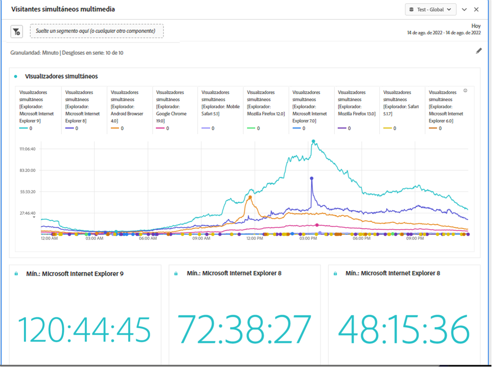

# Panel Tiempo invertido en la reproducción de medios {#media-playback-time-spent-panel}

<!-- markdownlint-disable MD034 -->

>[!CONTEXTUALHELP]
>id="workspace_mediaplaybacktimespent_button"
>title="Tiempo invertido en la reproducción de medios"
>abstract="Cree un panel para analizar el consumo de vídeo a lo largo del tiempo, con varios niveles de granularidad, y la capacidad de realizar desgloses y comparaciones."

<!-- markdownlint-enable MD034 -->

<!-- markdownlint-disable MD034 -->

>[!CONTEXTUALHELP]
>id="workspace_mediaplaybacktimespent_panel"
>title="Tiempo invertido en la reproducción de medios"
>abstract="Analice el consumo de vídeo a lo largo del tiempo, seleccione varias granularidades, desglose y compare.  **Granularidad**: seleccione el período de tiempo en el que desea ver los visualizadores simultáneos. **Números de resumen del panel (opcional)**: opción para mostrar números de resumen con detalles de fecha u hora para cada línea. Máximo mostrará detalles del tiempo máximo de reproducción consumido. Mínimo mostrará los detalles de la emisión. La suma muestra detalles de la suma total de tiempo de reproducción transcurrido. **Desglose por serie (opcional)**: desglose la visualización por segmentos, dimensiones, elementos de dimensión o intervalos de fechas. Puede ver hasta 10 líneas a la vez. Los desgloses están limitados a un solo nivel. **Formato de hora**: opción para mostrar el formato de hora de las visualizaciones en horas o minutos."

<!-- markdownlint-enable MD034 -->

>[!BEGINSHADEBOX]

_Este artículo documenta el panel Tiempo invertido en la reproducción de contenido en_  _**Customer Journey Analytics**_. _Vea el panel [Tiempo invertido en la reproducción de contenido](https://experienceleague.adobe.com/en/docs/analytics/analyze/analysis-workspace/panels/media-playback-time-spent) para la_  _**Adobe Analytics** de este artículo._

>[!ENDSHADEBOX]

>[!NOTE]
>
>El panel Audiencia media por minuto de medios solo está disponible para los clientes que han adquirido el complemento Colección de medios de streaming para Customer Journey Analytics.
>Póngase en contacto con el representante de ventas o con el equipo de cuenta de Adobe de Adobe para obtener más información.
>

El panel **[!UICONTROL Tiempo invertido en la reproducción de contenido]** permite analizar la reproducción a lo largo del tiempo, con detalles sobre los picos de concurrencia y la capacidad de realizar desgloses y comparaciones.

En Analysis Workspace, el tiempo invertido en la reproducción es la cantidad de tiempo que se emplea para ver flujos de medios en un momento específico. Incluye pausa, búfer y tiempo para el inicio.

Los clientes que hayan adquirido el complemento de recopilación de medios de streaming pueden analizar el tiempo invertido en la reproducción para obtener un valioso conocimiento de la calidad del contenido y la participación del visualizador. Y para ayudar a solucionar problemas o a planificar el volumen o la escala.

El tiempo invertido en la reproducción puede ayudarle a comprender lo siguiente:

* Donde se produjo la concurrencia máxima.

* Dónde se produjeron los descensos.

>[!BEGINSHADEBOX]

Vea  [Tiempo invertido en la reproducción de contenido](https://video.tv.adobe.com/v/338699){target="_blank"} para ver un vídeo de demostración.

{{videoaa}}

>[!ENDSHADEBOX]

## Utiliza

Para usar un panel **[!UICONTROL Tiempo invertido en la reproducción de contenido]**:

1. Crear un panel **[!UICONTROL Tiempo invertido en la reproducción de contenido]**. Para obtener información sobre cómo crear un panel, consulta [Crear un panel](panels.md#create-a-panel).

1. Asegúrese de seleccionar una vista de datos para el panel que tenga componentes configurados de la recopilación de medios de streaming.

1. Especifica la [entrada](#panel-input) para el panel.

1. Observa la [salida](#panel-output) del panel.

### Entrada de panel

Puede configurar el panel Tiempo invertido en la reproducción de contenido con esta configuración de entrada:

| Configuración | Descripción |
|---|---|
| Intervalo de fecha del panel | El intervalo de fechas predeterminado del panel es Hoy. Puede editarlo para ver un solo día o varios meses a la vez. Esta visualización está limitada a 1440 filas de datos (por ejemplo, 24 horas con una granularidad por minuto). Si la combinación de intervalo de fechas y granularidad genera más de 1440 filas, la granularidad se actualiza automáticamente para dar cabida al intervalo de fechas completo. |
| Granularidad | El valor predeterminado de granularidad es Minuto. Esta visualización está limitada a 1440 filas de datos (por ejemplo, 24 horas con una granularidad por minuto). Si la combinación de intervalo de fechas y granularidad genera más de 1440 filas, la granularidad se actualiza automáticamente para dar cabida al intervalo de fechas completo. |
| Números de resumen del panel | Para ver los detalles de fecha y hora del tiempo invertido en la reproducción, hay disponible un número de resumen. El Máximo muestra detalles para la concurrencia máxima. El Mínimo muestra los detalles de la emisión. Suma recoge el tiempo total de reproducción invertido para la selección. El panel predeterminado muestra Máximo solamente, pero puede cambiarlo para mostrar Mínimo, Suma o cualquier combinación de los tres. Si utiliza desgloses, se muestra un número de resumen para cada uno. |
| Desglose de serie | De forma opcional, puede desglosar la visualización por filtros, dimensiones, elementos de dimensión o intervalos de fechas.
: Puede ver hasta 10 líneas a la vez. Los desgloses están limitados a un solo nivel.

: Al arrastrar una dimensión, los elementos de dimensión principales se seleccionan automáticamente en función del intervalo de fechas del panel seleccionado.
: Para comparar intervalos de fechas, arrastre 2 o más intervalos de fechas al filtro de desglose de series. |
| Formato de hora | Puede ver el tiempo de reproducción transcurrido en `Hours:Minutes:Seconds` (predeterminado) o en `Minutes` (que se muestra en números enteros redondeados a 0,5). |
| Visualización de la secuencia de fechas | Si ha colocado al menos dos filtros de intervalo de fechas como desgloses de serie, verá la opción para seleccionar superposición (predeterminada) o secuencial. Superposición muestra las líneas con un inicio común del eje x para que se ejecuten en paralelo, mientras que secuencial muestra las líneas con su inicio específico del eje x. Si los datos se alinean (por ejemplo, el filtro 1 termina a las 8:44 p. m. y el filtro 2 comienza a las 8:45 p. m.), las líneas se muestran en secuencia. |

### Salida de panel

El panel Tiempo invertido en la reproducción de contenido devuelve un gráfico de líneas y números de resumen para incluir detalles sobre el tiempo de reproducción máximo, mínimo o total. En la parte superior del panel, se proporciona una línea de resumen para recordarle la configuración del panel seleccionada.

En cualquier momento, seleccione  para editar y reconstruir el panel.

Si selecciona el desglose de series, se mostrará una línea en el gráfico de líneas y un número de resumen para cada uno:

### Fuente de datos

La única métrica que se puede usar en este panel es Tiempo invertido en la reproducción.

| Métrica | Descripción |
|---|---|
| Tiempo invertido en la reproducción | Total `hours:minutes:seconds` (o `minutes`) de contenido visualizado durante la granularidad seleccionada, incluyendo pausa, búfer y tiempo para el inicio. |

## Preguntas frecuentes

| Pregunta | Respuesta |
|---|---|
| ¿Dónde está la tabla de forma libre? ¿Cómo puedo ver la fuente de datos? | 

La tabla de forma libre no está disponible en esta vista. Para descargar la fuente de datos, en el menú contextual del gráfico de líneas, seleccione la opción para descargar el archivo CSV.
 |
| 
¿Por qué ha cambiado la granularidad?
 | 
Esta visualización está limitada a 1440 filas de datos (por ejemplo, 24 horas con una granularidad por minuto). Si la combinación de intervalo de fechas y granularidad genera más de 1440 filas, la granularidad se actualiza automáticamente para dar cabida al intervalo de fechas completo.

Al cambiar de un intervalo de fechas más grande a uno más pequeño, la granularidad se actualiza con el detalle más bajo permitido una vez que se cambia el intervalo de fechas. Para ver una granularidad más alta, edite el panel y vuelva a generar.
 |
| 

¿Cómo comparo nombres de vídeo, filtros, tipos de contenido y mucho más?
 | 
Para compararlos en una sola visualización, arrastre filtros, dimensiones o elementos de dimensión específicos en el filtro de desglose de series.

La vista está limitada a 10 desgloses. Para ver más de 10, debe usar varios paneles.
 |
| ¿Cómo comparo intervalos de fechas? | Para comparar intervalos de fechas en una sola visualización, utilice los desgloses de series arrastrando 2 o más intervalos de fechas. Estos intervalos de fechas anulan el intervalo de fechas del panel. |
| ¿Cómo cambio el tipo de visualización? | 

Este panel solo permite la visualización de líneas de la serie temporal.
 |
| ¿Puedo ejecutar la detección de anomalías? | 

No. La detección de anomalías no está disponible para este panel.
 |

>[!MORELIKETHIS]
>
>[Crear un panel](/help/analysis-workspace/c-panels/panels.md#create-a-panel)
>[Panel de audiencia media por minuto de medios](average-minute-audience-panel.md)
>[Panel de visualizadores simultáneos de medios](media-concurrent-viewers.md)
>
