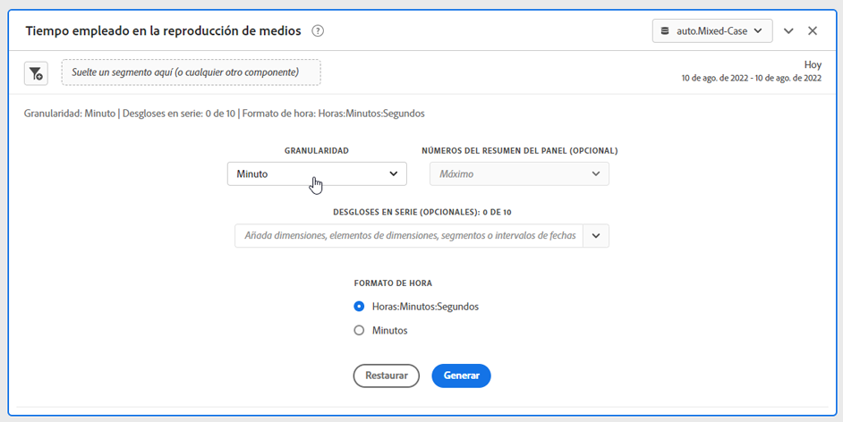
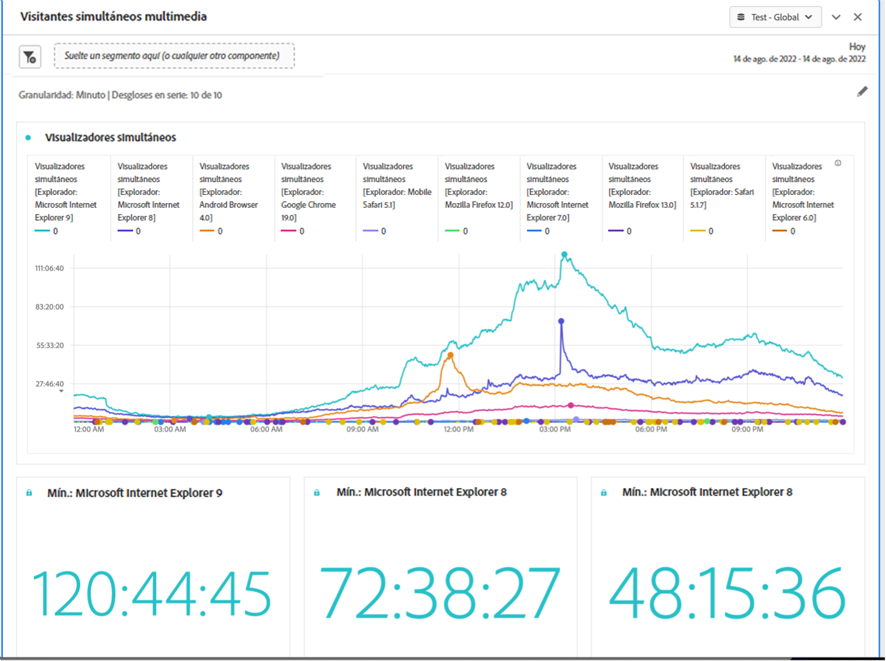

# Entradas y salidas del panel Tiempo invertido en reproducción de medios {#Inputs-and-outputs}

Puede personalizar el panel Tiempo invertido en reproducción de medios mediante los ajustes de entrada y salida siguientes.

## Entradas de panel {#Input}

Puede configurar el panel Tiempo invertido en la reproducción de contenido con esta configuración de entrada:

| Configuración | Descripción |
|---|---|
| Intervalo de fecha del panel | El intervalo de fechas predeterminado del panel es Hoy. Puede editarlo para ver un solo día o varios meses a la vez. Esta visualización está limitada a 1440 filas de datos (por ejemplo, 24 horas con una granularidad por minuto). Si la combinación de intervalo de fechas y granularidad genera más de 1440 filas, la granularidad se actualiza automáticamente para dar cabida al intervalo de fechas completo. |
| Granularidad | El valor predeterminado de granularidad es Minuto. Esta visualización está limitada a 1440 filas de datos (por ejemplo, 24 horas con una granularidad por minuto). Si la combinación de intervalo de fechas y granularidad genera más de 1440 filas, la granularidad se actualiza automáticamente para dar cabida al intervalo de fechas completo. |
| Números de resumen del panel | Para ver los detalles de fecha y hora del tiempo invertido en la reproducción, hay disponible un número de resumen. El Máximo muestra detalles para la concurrencia máxima. El Mínimo muestra los detalles de la emisión. Suma recoge el tiempo total de reproducción invertido para la selección. El panel predeterminado muestra Máximo solamente, pero puede cambiarlo para mostrar Mínimo, Suma o cualquier combinación de los tres. Si utiliza desgloses, se muestra un número de resumen para cada uno. |
| Desglose de serie | De forma opcional, puede desglosar la visualización por segmentos, dimensiones, elementos de dimensión o intervalos de fechas.
: Puede ver hasta 10 líneas a la vez. Los desgloses están limitados a un solo nivel.

: Al arrastrar una dimensión, los elementos de dimensión principales se seleccionarán automáticamente en función del intervalo de fechas del panel seleccionado.
: Para comparar intervalos de fechas, arrastre 2 o más intervalos de fechas al filtro de desglose de series. |
| Formato de hora | Puede ver el tiempo de reproducción transcurrido en horas:Minutes:segundos (predeterminado) o en minutos (que se muestra en números enteros redondeados a 0,5). |
| Visualización de la secuencia de fechas | Si ha colocado al menos dos segmentos de intervalo de fechas como desgloses de serie, verá la opción para seleccionar superposición (predeterminada) o secuencial. La superposición mostrará las líneas con un inicio común del eje x para que se ejecuten en paralelo, mientras que la secuencial mostrará las líneas con su inicio específico del eje x. Si los datos se alinean (por ejemplo, el segmento 1 termina a las 8:44 p. m. y el segmento 2 comienza a las 8:45 p. m.), las líneas se mostrarán en secuencia. |

### Vista predeterminada

## Salida de panel {#Output}

El panel Tiempo invertido en la reproducción de contenido devuelve un gráfico de líneas y números de resumen para incluir detalles sobre el tiempo de reproducción máximo, mínimo o total. En la parte superior del panel, se proporciona una línea de resumen para recordarle la configuración del panel seleccionada.

En cualquier momento, puede editar y rediseñar el panel haciendo clic en el lápiz de edición en la parte superior derecha.

Si seleccionó el desglose de series, se mostrará una línea en el gráfico de líneas y un número de resumen para cada uno:

### Fuente de datos

La única métrica que se puede usar en este panel es Tiempo invertido en la reproducción.

| Métrica | Descripción |
|---|---|
| Tiempo invertido en la reproducción | Total de horas:minutes:segundos (o minutos) de contenido visualizado durante la granularidad seleccionada, incluyendo pausas, búfer y tiempo para el inicio. |
