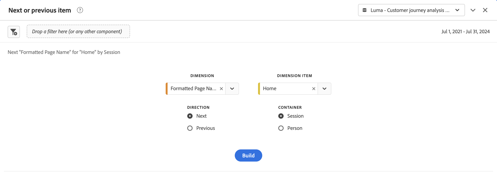
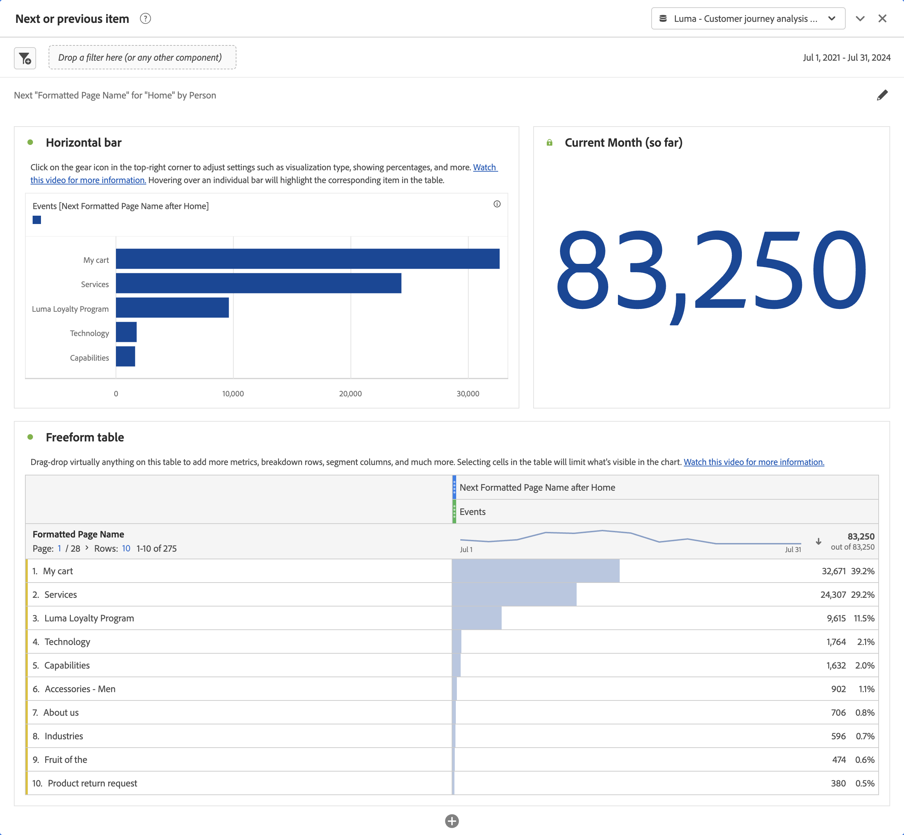

# Panel de elemento siguiente o anterior {#next-or-previous-item-panel}

<!-- markdownlint-disable MD034 -->

>[!CONTEXTUALHELP]
>id="workspace_nextorpreviousitem_button"
>title="Elemento siguiente o anterior"
>abstract="Cree un panel para comprender las dimensiones anteriores de las que provienen las personas o la siguiente dimensión a la que se dirigen."

>[!CONTEXTUALHELP]
>id="workspace_nextorpreviousitem_panel"
>title="Elemento siguiente o anterior"
>abstract="Analice cuáles son los lugares más habituales de los que proceden o a los que se dirigen los visitantes. Especifique la dimensión, el elemento de dimensión, la dirección y el contenedor que se utilizará para la visualización."

<!-- markdownlint-enable MD034 -->

>[!BEGINSHADEBOX]

_En este artículo se describe el panel Elemento siguiente o anterior de_  _&#x200B;**Customer Journey Analytics**&#x200B;_. _Consulte el [panel Elemento siguiente o anterior](https://experienceleague.adobe.com/es/docs/analytics/analyze/analysis-workspace/panels/next-previous) para ver la versión de_  _&#x200B;**Adobe Analytics** de este artículo._

>[!ENDSHADEBOX]

El panel **[!UICONTROL Elemento siguiente o anterior]** contiene varias tablas y visualizaciones para identificar el elemento de dimensión siguiente o anterior de una dimensión específica. Por ejemplo, es posible que desee explorar a qué páginas fueron más a menudo los clientes después de visitar la página de inicio.

## Utiliza {#use}

>[!CONTEXTUALHELP]
>id="workspace_nextorpreviousitem_container"
>title="Contenedor"
>abstract="Seleccione el contenedor para determinar el ámbito de la consulta."

Para usar un panel **[!UICONTROL Elemento siguiente o anterior]**:

1. Cree un panel **[!UICONTROL Elemento siguiente o anterior]**. Para obtener información sobre cómo crear un panel, consulta [Crear un panel](panels.md#create-a-panel).

1. Especifica la [entrada](#panel-input) para el panel.

1. Observa la [salida](#panel-output) del panel.

### Entrada de panel

Puede configurar el panel [!UICONTROL Elemento siguiente anterior] utilizando la siguiente configuración:

| Entrada | Descripción |
| --- | --- |
| **[!UICONTROL Dimensión]** | Seleccione la dimensión para la que desea explorar los elementos siguientes o anteriores. |
| **[!UICONTROL Elemento de dimensión]** | Seleccione el elemento de dimensión específico en el centro de la consulta siguiente/anterior. |
| **[!UICONTROL Dirección]** | Especifique si está buscando el elemento de dimensión [!UICONTROL Siguiente] o el [!UICONTROL Anterior]. |
| **[!UICONTROL Contenedor]** | Seleccione el contenedor, **[!UICONTROL Cuenta global]** [!BADGE B2B edition]{type=Informative url="https://experienceleague.adobe.com/en/docs/analytics-platform/using/cja-overview/cja-b2b/cja-b2b-edition" newtab=true tooltip="Customer Journey Analytics B2B edition"}, **[!UICONTROL Cuenta]** [!BADGE B2B edition]{type=Informative url="https://experienceleague.adobe.com/en/docs/analytics-platform/using/cja-overview/cja-b2b/cja-b2b-edition" newtab=true tooltip="Customer Journey Analytics B2B edition"}, **[!UICONTROL Grupo de compra]** [!BADGE B2B edition]{type=Informative url="https://experienceleague.adobe.com/en/docs/analytics-platform/using/cja-overview/cja-b2b/cja-b2b-edition" newtab=true tooltip="Customer Journey Analytics B2B edition"}, **[!UICONTROL Oportunidad]** [!BADGE B2B edition]{type=Informative url="https://experienceleague.adobe.com/en/docs/analytics-platform/using/cja-overview/cja-b2b/cja-b2b-edition" newtab=true tooltip="Customer Journey Analytics B2B edition"}, **[!UICONTROL Sesión]** o **[!UICONTROL Persona]**, para determinar el ámbito de su consulta. |

{style="table-layout:auto"}

Seleccione **[!UICONTROL Generar]** para generar el panel.

### Salida del panel

El panel [!UICONTROL Elemento siguiente o anterior] devuelve un conjunto completo de datos y visualizaciones para ayudarle a comprender mejor qué ocurrencias siguen o preceden a elementos de dimensión específicos.

| Visualización | Descripción |
| --- | --- |
| **[!UICONTROL Barra horizontal]** | Enumera los elementos siguientes (o anteriores) en función del elemento de dimensión seleccionado. Al pasar el puntero por encima de una barra individual, se resaltará el elemento correspondiente en la tabla de forma libre. |
| **[!UICONTROL Número de resumen]** | Número de resumen de alto nivel de todas las ocurrencias de elementos de dimensión siguientes o anteriores para el mes actual (hasta ahora). |
| **[!UICONTROL Tabla de forma libre]** | Enumera los elementos siguientes (o anteriores) en función del elemento de dimensión seleccionado, en formato de tabla. Por ejemplo, cuáles eran las páginas más populares (por ocurrencias) a las que se dirigían los visitantes después (o antes) de la página principal o de la página de Workspace. |

{style="table-layout:auto"}

>[!MORELIKETHIS]
>
>[Crear un panel](/help/analysis-workspace/c-panels/panels.md#create-a-panel)
>
