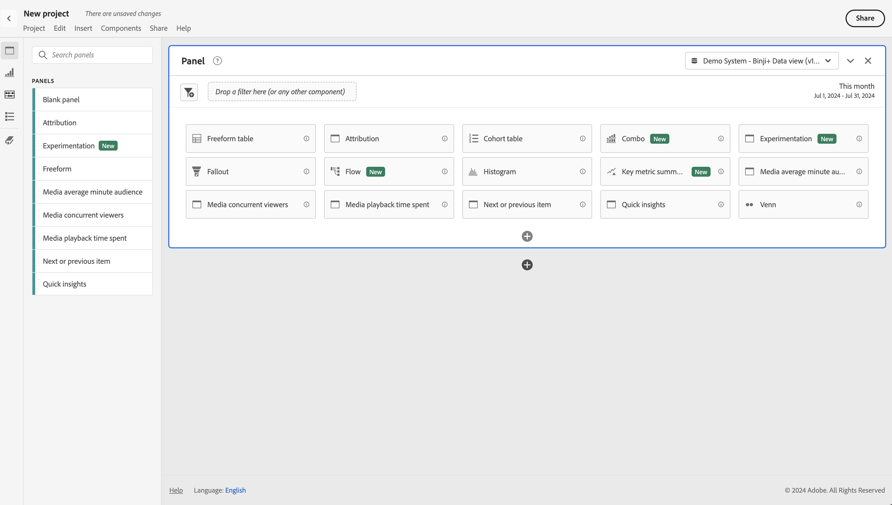
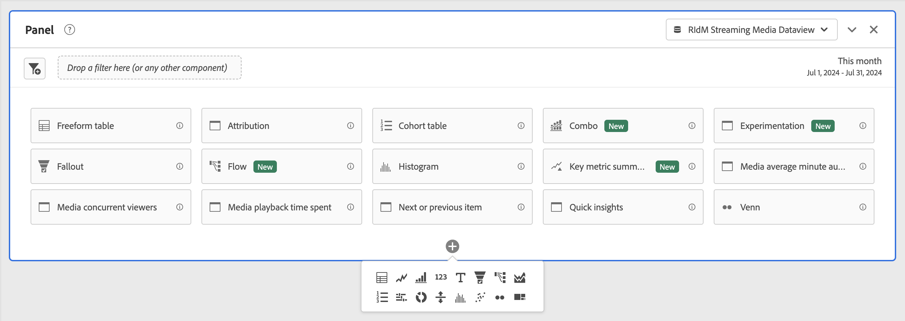
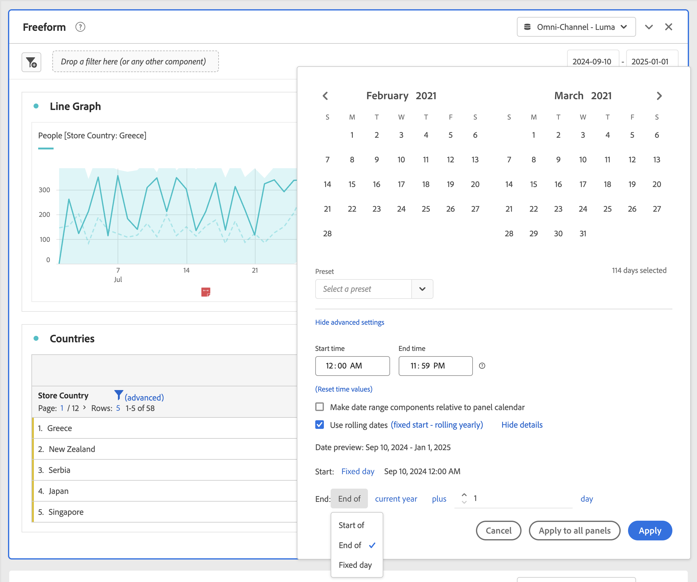

# Resumen de paneles

Un [!UICONTROL panel] es una colección de tablas y visualizaciones. Puede acceder a los paneles en el icono de la parte superior izquierda de Workspace o desde un [panel en blanco](/help/analysis-workspace/c-panels/blank-panel.md). Los paneles son útiles cuando desea organizar sus proyectos según períodos de tiempo, vistas de datos o casos de uso de análisis.

## Tipos de panel

Los siguientes tipos de panel están disponibles en Analysis Workspace para [!UICONTROL Customer Journey Analytics]:

| Nombre del panel | Descripción |
| --- | --- |
| [Panel en blanco](/help/analysis-workspace/c-panels/blank-panel.md) | Elija entre los paneles y las visualizaciones disponibles para iniciar el análisis. |
| [Atribución](attribution.md) | Compare y visualice rápidamente los modelos de atribución utilizando cualquier dimensión y métrica de conversión. |
| [Experimentación](experimentation.md) | Compare diferentes variaciones de experiencias de usuario, marketing o mensajería para determinar cuál es la mejor manera de impulsar un resultado específico. |
| [Freeform](freeform-panel.md) | Realice comparaciones y desgloses ilimitados y, a continuación, añada visualizaciones para contar una historia de datos enriquecida. |
| [Audiencia media por minuto de medios](average-minute-audience-panel.md) | Analizar audiencia media por minuto para un fragmento de contenido específico o durante un período de tiempo personalizado. |
| [Espectadores simultáneos de medios ](media-concurrent-viewers.md) | Analice los visualizadores simultáneos a lo largo del tiempo, con detalles sobre la frecuencia máxima de acceso y la capacidad de desglosar datos y compararlos. |
| [Tiempo invertido en la reproducción de contenido](/help/analysis-workspace/c-panels/media-playback-time-spent.md) | Analiza el tiempo invertido en la reproducción para comprender dónde se produjo el pico de concurrencia o dónde se produjeron los descensos. |
| [Elemento siguiente o anterior](next-previous.md) | Mostrar las páginas siguientes o anteriores a las que se dirigen los usuarios. |
| [Información rápida](quickinsight.md) | Crea rápidamente una tabla de forma libre y una visualización complementaria para analizar y descubrir información de manera más rápida. |

Los paneles [!UICONTROL Información rápida], [!UICONTROL En blanco] y [!UICONTROL Forma libre] son buenos lugares para iniciar el análisis, mientras que[!UICONTROL Atribución] se presta para análisis más avanzados. Hay un  disponible en la parte inferior del lienzo, para que puedas agregar paneles en blanco en cualquier momento.

El panel inicial predeterminado es [!UICONTROL Forma libre], pero también puede convertir el [Panel en blanco](/help/analysis-workspace/c-panels/blank-panel.md) o en [Información rápida](/help/analysis-workspace/c-panels/quickinsight.md) predeterminado. Ver [preferencias de proyectos y análisis](/help/analysis-workspace/user-preferences.md#projects--analyses-preferences).

## Crear un panel

Para crear un panel:

* Arrastra y suelta un panel del panel izquierdo **[!UICONTROL Paneles]** al lienzo.
* Selecciona un panel del [panel en blanco](blank-panel.md).
* Usa el menú **[!UICONTROL Insertar]** en Workspace y selecciona el panel. También puedes usar cualquiera de los [métodos abreviados](../build-workspace-project/fa-shortcut-keys.md) para insertar un panel.

  

Puedes realizar lo siguiente:

* Selecciona  **en** cualquier panel para agregar otra visualización. Aparece una ventana emergente que te permite seleccionar una visualización.

  

  | Seleccionar… | Para crear un filtro: |
  |---|---|
  |  | [Tabla de forma libre](/help/analysis-workspace/visualizations/freeform-table/freeform-table.md) |
  |  | [Líneas](/help/analysis-workspace/visualizations/line.md) |
  |  | [Barra](/help/analysis-workspace/visualizations/bar.md) |
  |  | [Número de resumen](/help/analysis-workspace/visualizations/summary-number-change.md) |
  |  | [Texto](/help/analysis-workspace/visualizations/text.md) |
  |  | [Visita en orden previsto](/help/analysis-workspace/visualizations/fallout/fallout-flow.md) |
  |  | [Flujo](/help/analysis-workspace/visualizations/c-flow/flow.md) |
  |  | [Area stacked](/help/analysis-workspace/visualizations/area.md) |
  |  | [Tabla de cohorte](/help/analysis-workspace/visualizations/cohort-table/t-cohort.md) |
  |  | [Bullet](/help/analysis-workspace/visualizations/bullet-graph.md) |
  |  | [Anillo](/help/analysis-workspace/visualizations/donut.md) |
  |  | [Cambio de resumen](/help/analysis-workspace/visualizations/summary-number-change.md) |
  |  | [Histograma](/help/analysis-workspace/visualizations/histogram.md) |
  |  | [Dispersión](/help/analysis-workspace/visualizations/scatterplot.md) |
  |  | [Venn](/help/analysis-workspace/visualizations/venn.md) |
  |  | [Gráfico de rectángulos](/help/analysis-workspace/visualizations/treemap.md) |

* Selecciona  **fuera** del último panel del área de trabajo para agregar otro [panel en blanco](blank-panel.md).

## Vista de datos

Cada panel está asociado con una [vista de datos](/help/data-views/data-views.md), identificada por  **[!UICONTROL *nombre de la vista de datos *]**en el menú desplegable de la parte superior derecha del panel.

Al crear un proyecto de Workspace en blanco, la vista de datos predeterminada para el panel inicial es la vista de datos en la que trabajaste por última vez en Customer Journey Analytics.

Al crear un panel nuevo, la vista de datos predeterminada se basa en la vista de datos del panel en el que trabajaste por última vez en el proyecto de Workspace.

>[!IMPORTANT]
>
>La vista de datos seleccionada determina qué dimensiones, métricas y filtros están disponibles para crear visualizaciones en un panel.
>
>
>Al cambiar una vista de datos de un panel, es posible que algunos de los componentes no estén disponibles en esa nueva vista de datos. Este cambio puede provocar que la visualización no se represente correctamente. Puedes ver advertencias como las siguientes:
>
>* Este panel contiene componentes que no están habilitados en la vista de datos seleccionada. Cambia la vista de datos o habilita los componentes necesarios en la vista de datos.
>* No se puede procesar la visualización: comprueba las columnas y filas para asegurarte de que contienen componentes válidos.
>

## Calendario

El calendario del panel controla el intervalo de la creación de informes de las tablas y visualizaciones de un panel.

>[!NOTE]
>
>Si se usa un componente de intervalo de fechas  en una visualización o panel (por ejemplo, como filtro), el componente de intervalo de fechas anula el calendario del panel.
>

1. Selecciona un intervalo de fechas seleccionando primero la fecha de inicio y, a continuación, la fecha de finalización.
También puedes seleccionar un **[!UICONTROL ajuste preestablecido]** en el menú desplegable [!UICONTROL *Seleccionar un ajuste preestablecido*].

1. De manera opcional, selecciona **[!UICONTROL Mostrar configuración avanzada]** para:

   * Especifica **[!UICONTROL Hora de inicio]** y **[!UICONTROL Hora de finalización]** distintas de las `12:00 AM` (`0:00`) y `11:59 PM` (`23:59`) predeterminadas. Los tiempos de finalización siempre incluyen 59 segundos. Para un intervalo de fechas que abarca muchos días, la hora de inicio se aplica al primer día del intervalo de fechas y la hora de finalización se aplica al último día del intervalo de fechas. Usa **[!UICONTROL (Restablecer valores de tiempo)]** para restablecer los valores predeterminados de las horas de inicio y finalización.
   * **[!UICONTROL Hacer que los componentes del intervalo de fecha sean relativos al calendario del panel]**. Si está desactivado, los componentes de intervalo de fechas utilizados en el panel son relativos a la hora actual. Si está habilitado, los componentes de intervalo de fechas utilizados en el panel están relacionados con el calendario del panel.
   * **[!UICONTROL Usar fechas móviles]**. Si se habilita, los intervalos de fechas preestablecidos como **[!UICONTROL últimos 7 días completos]** se actualizarán dinámicamente como progreso de fecha y hora actual. Si está desactivado, estos ajustes preestablecidos no se actualizan una vez aplicados.

     

     Puedes seleccionar el texto entre corchetes (por ejemplo **[!UICONTROL inicio fijo - desplazamiento diario]**) para ampliar el panel y especificar detalles para **[!UICONTROL Inicio]** y **[!UICONTROL Fin]**.

      1. Selecciona **[!UICONTROL Inicio de]**, **[!UICONTROL Fin de]** o **[!UICONTROL Día fijo]**.
      1. Cuando hayas seleccionado **[!UICONTROL Inicio de]** o **[!UICONTROL Final de]**, puedes generar una expresión completa. Por ejemplo: **[!UICONTROL Fin de]** **[!UICONTROL año actual]** **[!UICONTROL más]** `1` **[!UICONTROL día]**. Elige el valor apropiado para cada parte individual de la expresión.
         * Selecciona valor para actual. Por ejemplo, **[!UICONTROL año actual]**.
         * Selecciona un valor para realizar cálculos adicionales. Por ejemplo, **[!UICONTROL plus]**.
         * Cuando hayas especificado un cálculo adicional, especifica un valor. Por ejemplo `1`.
         * Cuando hayas especificado un cálculo adicional, selecciona el período de tiempo que deseas utilizar para el cálculo. Por ejemplo, **[!UICONTROL día]**.

     Selecciona **[!UICONTROL Ocultar detalles]** para ocultar los detalles del cálculo de fechas móviles.

1. Selecciona **[!UICONTROL Aplicar]** para aplicar el intervalo de fechas al panel desde el que se invocó el calendario.
Selecciona **[!UICONTROL Aplicar a todos los paneles]** para aplicar el intervalo de fechas a todos los paneles del proyecto de Workspace.

## Zona de colocación {#dropzone}

La zona de colocación del panel permite aplicar filtros de segmentos y desplegables a todas las tablas y visualizaciones dentro de un panel. Puede aplicar uno o varios filtros a un panel. 

### Filtros

Arrastra y suelta cualquier filtro del panel izquierdo en la zona desplegable del panel para empezar a filtrar el panel. Repita este proceso para agregar filtros adicionales al panel. Los filtros aparecen uno al lado del otro en la parte superior del panel.

#### Filtros rápidos

Los componentes que no son filtros también se pueden arrastrar directamente a la zona de colocación para crear filtros específicos, lo que te ahorrará el tiempo y el tener que utilizar el [Generador de filtros](/help/components/filters/filter-builder.md). Los filtros creados de esta manera se definen automáticamente como filtros de nivel de visita individual. Esta definición se puede modificar rápidamente seleccionando  junto al nombre del filtro.

Para obtener más información, consulte [Filtros rápidos](/help/components/filters/quick-filters.md).

### Filtros desplegables

>[!VIDEO](https://video.tv.adobe.com/v/23877?quality=12&learn=on)

Este vídeo muestra la funcionalidad mediante Adobe Analytics. Sin embargo, la funcionalidad también está disponible en Customer Journey Analytics. Tenga en cuenta las siguientes diferencias terminológicas.

| Adobe Analytics | Análisis del Recorrido del cliente |
| --- | --- |
| Segmentos  | Filtros |
| Visitante | Persona |
| Visita | Sesión |
| Visita individual | Evento |

#### Filtros desplegables estáticos

Los filtros desplegables permiten interactuar con los datos de forma controlada. Por ejemplo, puede añadir un filtro desplegable para tipos de dispositivos móviles para poder filtrar el panel por dispositivos de tableta, teléfonos móviles o equipos de escritorio.

Los filtros desplegables estáticos también se pueden utilizar para consolidar muchos proyectos en uno. Por ejemplo, si tiene muchas versiones del mismo proyecto con diferentes filtros de país aplicados, puede consolidar todas las versiones en un único proyecto y añadir un filtro desplegable de país.

##### Creación de filtros desplegables dinámicos

* Para los filtros desplegables que utilizan elementos de dimensión, selecciona una sola dimensión del panel izquierdo y suéltala en la zona desplegable del panel mientras mantiene pulsado ⇧ (*shift*). Esto crea un filtro desplegable con todos los elementos de dimensión asociados a esa dimensión.

  O bien, si deseas que el filtro desplegable incluya solo elementos de dimensión específicos asociados a una dimensión, haz clic en el icono de flecha derecha situado junto a la dimensión deseada en el panel izquierdo. Esta acción expone todos los elementos de dimensión disponibles. Selecciona varios elementos de dimensión de esta lista usando ⇧+ (*shift* + *select*) o ^+ (*control* + *select*) y, a continuación, suéltalos en la zona de colocación del panel **mientras mantienes presionado** ⇧.

* Para los filtros desplegables que utilizan un solo tipo de componente (por ejemplo, solo dimensiones, solo filtros o solo métricas), selecciona varios elementos del mismo tipo en el panel izquierdo utilizando ⇧+ o ^+. A continuación, suelta los elementos en la zona de colocación del panel **mientras mantienes** ⇧.

  Se crea un único filtro desplegable con los componentes seleccionados.

* Para filtros desplegables que utilizan una combinación de tipos de componentes (como 2 métricas y 3 filtros), selecciona varios componentes co n⇧+ o ^+. Coloca la selección en la zona desplegable del panel **mientras mantienes pulsado** ⇧. En este contexto, todos los tipos de componentes se tratan como filtros desplegables independientes. Por ejemplo, si incluye métricas y elementos de dimensión en la selección, se crean dos filtros desplegables independientes: un filtro desplegable incluye elementos de dimensión y el otro métricas.

Un filtro desplegable proporciona las siguientes opciones de menú contextual:

* **[!UICONTROL Eliminar filtro desplegable]**: elimina el filtro desplegable del panel.
* **[!UICONTROL Eliminar etiqueta]**: elimina el texto situado encima de un filtro desplegable. Para modificar la etiqueta, pasa el ratón sobre la etiqueta y selecciona .
* **[!UICONTROL Añadir etiqueta]**: cuando se añade un filtro desplegable a un proyecto, se establece automáticamente una etiqueta en el nombre del componente. Si elimina la etiqueta, puede añadirla de nuevo con esta opción.
* **[!UICONTROL Requerir selección]**: Requiere que se establezca un filtro en el panel.

##### Filtros desplegables estáticos

Los usuarios pueden utilizar el menú de filtro desplegable de cualquiera de las siguientes maneras para filtrar el panel:

* Aplique un solo filtro al panel seleccionando el filtro en el filtro desplegable.

* Aplique varios filtros al panel seleccionando más de un filtro en el filtro desplegable. El panel se filtra para incluir cualquiera de los campos seleccionados.

#### Filtros desplegables dinámicos

Los filtros desplegables dinámicos le permiten determinar los valores disponibles en función de los datos dentro del intervalo de informes del panel y los valores de otros filtros desplegables. Por ejemplo, puede crear dos desplegables dinámicos utilizando las dimensiones Países y Ciudades. Al seleccionar un país en la lista desplegable **[!UICONTROL Países]**, la lista desplegable **[!UICONTROL Ciudades]** se ajusta dinámicamente para mostrar solo las ciudades de ese país.

Este mismo concepto se aplica a todas las dimensiones; solo son visibles los elementos de dimensión que aparecen dentro del intervalo de fechas y los filtros seleccionados del panel. Los elementos de dimensión seleccionados en los filtros desplegables estáticos afectan a los valores disponibles en los filtros desplegables dinámicos. Sin embargo, lo contrario no es verdadero; los elementos de dimensión seleccionados en los filtros desplegables dinámicos no afectan a los valores disponibles en los filtros desplegables estáticos.

La selección manual de elementos de dimensión está disponible si prevé que se recopilará un determinado elemento de dimensión en el futuro. También puede borrar un filtro desplegable dinámico para que no contenga un valor, lo que permitirá que otros filtros desplegables dinámicos contengan más valores. Seleccione **[!UICONTROL Restablecer todo]** para borrar la selección de todos los filtros desplegables de ese panel.

Para crear un filtro desplegable dinámico, haga lo siguiente:

* Arrastra y suelta una sola dimensión en la zona desplegable del panel **mientras mantienes pulsado** ⇧.

Los filtros desplegables dinámicos no están disponibles para métricas, filtros o intervalos de fechas.

Al hacer clic con el botón derecho en un filtro desplegable dinámico, se proporcionan las mismas opciones que en los filtros desplegables estáticos.

## Menú contextual

Para obtener más funcionalidades, haz clic con el botón derecho en el encabezado del panel.

Las opciones disponibles son las siguientes:

| Opción | Descripción |
| --- | --- |
| **[!UICONTROL Insertar panel copiado]** | Permite pegar un panel copiado en otro lugar del proyecto o en otro proyecto. |
| **[!UICONTROL Insertar visualización copiada]** | Pega una visualización copiada en otro lugar dentro del panel, proyecto o en un proyecto diferente. |
| **[!UICONTROL Aplicar el grupo de informes a todos los paneles]** | Aplica la vista de datos de este panel a todos los demás paneles del proyecto. |
| **[!UICONTROL Copiar panel]** | Copia un panel para poder insertarlo en otro lugar del proyecto o en un proyecto completamente diferente. |
| **[!UICONTROL Duplicar panel]** | Crea un duplicado exacto del panel actual que podrá modificar a continuación. |
| **[!UICONTROL Contraer todos los paneles]** | Contraer todos los paneles del proyecto. |
| **[!UICONTROL Ampliar todos los paneles]** | Ampliar todos los paneles del proyecto. |
| **[!UICONTROL Contraer todas las visualizaciones del panel]** | Contraer todas las visualizaciones del panel actual. |
| **[!UICONTROL Ampliar todas las visualizaciones del panel]** | Ampliar todas las visualizaciones del panel actual. |
| **[!UICONTROL Editar descripción]** | Añade (o edita) una descripción de texto para el panel. |
| **[!UICONTROL Obtener vínculo del panel]** | Dirigir a los usuarios a un panel concreto de un proyecto. Al hacer clic en el vínculo, el destinatario deberá iniciar sesión antes de que se le dirija al panel exacto al que está vinculado. |

## Configuración

Algunos paneles (como [!UICONTROL Atribución], [!UICONTROL Experimentación], [!UICONTROL Audiencia media por minuto de medios] y otros) tienen un cuadro de diálogo de configuración para ayudarte a crear la visualización. Usa  en la parte superior del panel para acceder y cambiar la configuración.

