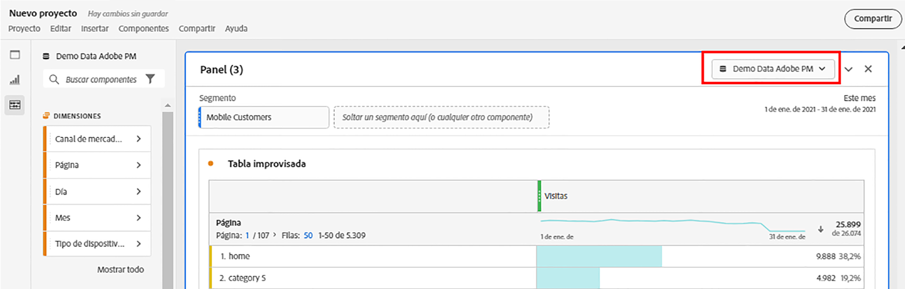

# Resumen de paneles

Un [!UICONTROL panel] es una colección de tablas y visualizaciones. Puede acceder a los paneles desde el icono superior izquierdo de Workspace o desde un [panel en blanco](/help/analysis-workspace/c-panels/blank-panel.md). Los paneles son útiles cuando desea organizar sus proyectos según períodos de tiempo, grupos de informes o casos de uso de análisis. Los siguientes tipos de panel están disponibles en Analysis Workspace:

| Nombre del panel | Descripción |
| --- | --- |
| [Panel en blanco](/help/analysis-workspace/c-panels/blank-panel.md) | Elija entre los paneles y las visualizaciones disponibles para inicio de la análisis. |
| [Panel de información rápida](quickinsight.md) | Cree rápidamente una tabla de forma libre y una visualización complementaria para analizar y descubrir información de manera más rápida. |
| [Panel de Attribution](attribution.md) | Compare y visualice rápidamente cualquier número de modelos de atribución utilizando cualquier dimensión y métrica de conversión. |
| [Panel de forma libre](freeform-panel.md) | Realice comparaciones y desgloses ilimitados y, a continuación, agregue visualizaciones para contar una historia de datos enriquecida. |

[!UICONTROL Quick Insights],   Blankand   Freeformboards son lugares buenos para realizar inicios en la análisis, mientras que  [!UICONTROL Analytics para ]visores simultáneos de Destinatario [!UICONTROL , ]Attribution IQ [!UICONTROL  y ] medios y   SegmentComparisonléelos a análisis más avanzados. Hay un botón `"+"` disponible en los proyectos para que pueda agregar paneles en blanco en cualquier momento.

El panel de inicio predeterminado es el [!UICONTROL panel improvisado], pero también puede convertir el [panel en blanco](/help/analysis-workspace/c-panels/blank-panel.md) en el predeterminado.

## Grupo de informes {#report-suite}

Las tablas y visualizaciones de un panel derivan datos del [!UICONTROL grupo de informes] seleccionado en la parte superior derecha del panel. El grupo de informes también determina qué componentes están disponibles en el carril izquierdo. Dentro de un proyecto, puede utilizar uno o [muchos grupos de informes](https://experienceleague.adobe.com/docs/analytics/analyze/analysis-workspace/build-workspace-project/multiple-report-suites.html?lang=es-ES) según los casos de uso de la análisis. Para aplicar un solo grupo de informes a todos los paneles de un proyecto, **haga clic con el botón secundario en el encabezado del panel > Aplicar grupo de informes a todos los paneles**.

La lista de los grupos de informes se ordena según la relevancia, que Adobe define en función de la frecuencia y la frecuencia con que el usuario actual ha utilizado el grupo y la frecuencia con que se utiliza dentro de la organización.

## Calendario {#calendar}

El calendario del panel controla el intervalo de sistemas de informes de las tablas y visualizaciones dentro de un panel.

Nota: Si se utiliza un componente de intervalo de fechas (púrpura) dentro de una tabla, visualización o panel, se anulará el calendario del panel.

## Dropzone {#dropzone}

La zona desplegable del panel le permite aplicar filtros de segmentos y desplegables a todas las tablas y visualizaciones dentro de un panel. Puede aplicar uno o varios filtros a un panel. El título sobre cada filtro se puede modificar haciendo clic en el lápiz de edición o puede hacer clic con el botón derecho para eliminarlo por completo.

### Filtros de segmentos

Arrastre y suelte cualquier segmento del carril izquierdo en la zona de colocación del panel para empezar a filtrar el panel.

### Filtros de segmentos específicos

Los componentes que no son segmentos también se pueden arrastrar directamente a la zona de colocación para crear segmentos ad-hoc, lo que le ahorra tiempo y esfuerzo al ir al Generador de segmentos. Los segmentos creados de esta manera se definen automáticamente como segmentos de nivel de visita individual. Esta definición se puede modificar haciendo clic en el icono de información (i) al lado del segmento, luego en el icono de edición con forma de lápiz y editándolo en el Generador de segmentos.

Los segmentos específicos son locales del proyecto y no aparecerán en el carril izquierdo a menos que los haga públicos.

### Filtros desplegables {#dropdown-filter}

Además de los filtros de segmento, los filtros desplegables le permiten interactuar con los datos de forma controlada. Por ejemplo, puede agregar un filtro desplegable para los tipos de dispositivos móviles para poder segmentar el panel por Tablet, teléfono móvil o escritorio.

Los filtros desplegables también se pueden utilizar para consolidar muchos proyectos en uno. Por ejemplo, si tiene muchas versiones del mismo proyecto con diferentes segmentos de país aplicados, puede consolidar todas las versiones en un único proyecto y agregar un filtro desplegable de país.

Para crear filtros desplegables:

1. Para crear un filtro desplegable con [!UICONTROL elementos de Dimension], como valores dentro de la dimensión [!UICONTROL Canal de mercadotecnia], haga clic en el icono de flecha derecha junto a la dimensión en el carril izquierdo. Esto mostrará todos los elementos disponibles. Seleccione uno o varios elementos de componente en el carril izquierdo y suéltelos en la zona desplegable del panel **mientras mantiene pulsada la tecla Mayús**. Esto convertirá los componentes en un filtro desplegable, en lugar de en un solo segmento.
1. Para crear un filtro desplegable con otro componente, como métricas, segmentos o intervalos de fechas, seleccione un tipo de componente en el carril izquierdo y coloque en la zona desplegable del panel **mientras mantiene pulsada la tecla Mayús**.
1. Seleccione una de las opciones de la lista desplegable para cambiar los datos en el panel. También puede elegir no filtrar ninguno de los datos del panel seleccionando **[!UICONTROL Sin filtro]**.

[Vea el ](https://docs.adobe.com/content/help/en/analytics-learn/tutorials/analysis-workspace/using-panels/using-panels-to-organize-your-analysis-workspace-projects.html) vídeo para obtener más información sobre cómo agregar filtros desplegables al proyecto.

## Haga clic con el botón derecho en el menú {#right-click}

Para obtener más funcionalidad, haga clic con el botón derecho en el encabezado del panel.

Están disponibles los siguientes ajustes:

| Configuración | Descripción |
| --- | --- |
| Insertar visualización/panel copiado | Permite pegar (&quot;insertar&quot;) un panel o una visualización copiados en otro lugar del proyecto o en un proyecto completamente diferente. |
| Copiar panel | Le permite hacer clic con el botón derecho y copiar un panel, para poder insertarlo en otro lugar del proyecto o en un proyecto completamente diferente. |
| Aplicar grupo de informes a todos los paneles | Permite aplicar el grupo de informes del panel activo a todos los paneles del proyecto. |
| Panel duplicado | Realiza un duplicado exacto del panel actual, que se puede modificar. |
| Contraer/Expandir todos los paneles | Contrae y expande todos los paneles del proyecto. |
| Contraer/Expandir todas las visualizaciones del panel | Contrae y expande todas las visualizaciones del panel actual. |
| Editar descripción | Añada (o edite) una descripción de texto para el panel. |
| Obtener vínculo del panel | Le permite dirigir a los usuarios a un panel concreto de un proyecto. Cuando se hace clic en el vínculo, se requerirá que el destinatario inicie sesión antes de que se le dirija al panel exacto al que está vinculado. |
