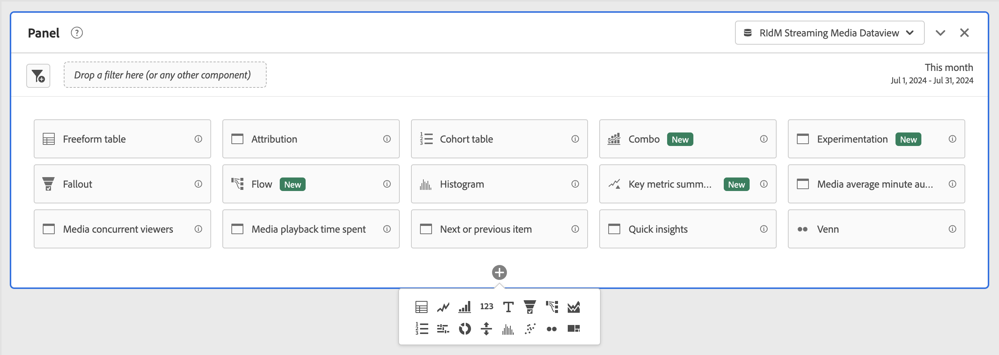
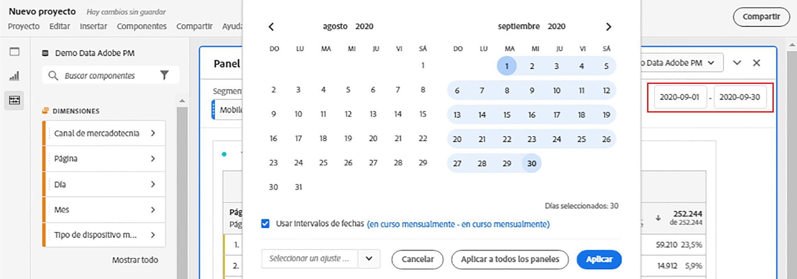
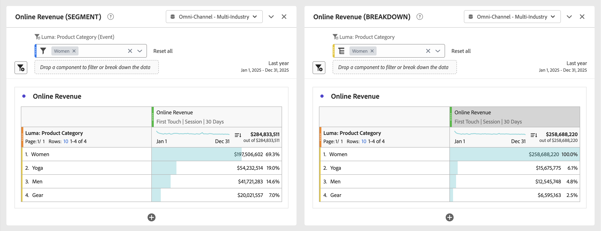
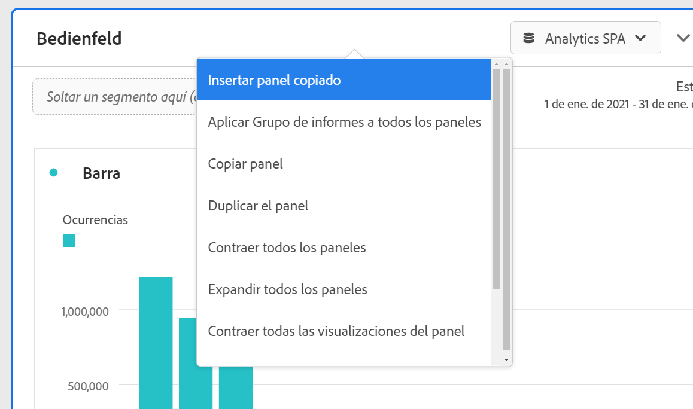

# Información general de los paneles {#panels-overview}

Un [!UICONTROL panel] es una colección de tablas y visualizaciones. Puede acceder a los paneles en el icono de la parte superior izquierda de Workspace o desde un [panel en blanco](/help/analysis-workspace/c-panels/blank-panel.md). Los paneles son útiles cuando desea organizar sus proyectos según períodos de tiempo, vistas de datos o casos de uso de análisis.

## Tipos de panel

Los siguientes tipos de panel están disponibles en Analysis Workspace para [!UICONTROL Customer Journey Analytics]:

| Nombre del panel | Descripción |
| --- | --- |
| [Panel en blanco](/help/analysis-workspace/c-panels/blank-panel.md) | Elija entre los paneles y las visualizaciones disponibles para iniciar el análisis. |
| [Atribución](attribution.md) | Compare y visualice rápidamente los modelos de atribución utilizando cualquier dimensión y métrica de conversión. |
| [Experimentación](experimentation.md) | Compare diferentes variaciones de experiencias de usuario, marketing o mensajería para determinar cuál es la mejor manera de impulsar un resultado específico. |
| [de forma libre](freeform-panel.md) | Realice comparaciones y desgloses ilimitados y, a continuación, añada visualizaciones para contar una historia de datos enriquecida. |
| [Público medio por minuto de medios](average-minute-audience-panel.md) | Analizar público medio por minuto para un fragmento de contenido específico o durante un período de tiempo personalizado. |
| [Espectadores simultáneos de medios &#x200B;](media-concurrent-viewers.md) | Analice los visualizadores simultáneos a lo largo del tiempo, con detalles sobre la frecuencia máxima de acceso y la capacidad de desglosar datos y compararlos. |
| [Tiempo invertido en la reproducción de contenido](/help/analysis-workspace/c-panels/media-playback-time-spent.md) | Analice el tiempo invertido en la reproducción para comprender dónde se produce el pico de concurrencia o dónde se producen los descensos. |
| [Elemento siguiente o anterior](next-previous.md) | Mostrar las páginas siguientes o anteriores a las que se dirigen los usuarios. |
| [Información rápida](quickinsight.md) | Crea rápidamente una tabla de forma libre y una visualización complementaria para analizar y descubrir información de manera más rápida. |

Los paneles [!UICONTROL Información rápida], [!UICONTROL En blanco] y [!UICONTROL Forma libre] son buenos lugares para iniciar el análisis, mientras que[!UICONTROL Atribución] se presta para análisis más avanzados. Hay un  disponible en la parte inferior del lienzo, para que puedas agregar paneles en blanco en cualquier momento.

El panel inicial predeterminado es [!UICONTROL Forma libre], pero también puede convertir el [Panel en blanco](/help/analysis-workspace/c-panels/blank-panel.md) o en [Información rápida](/help/analysis-workspace/c-panels/quickinsight.md) predeterminado. Ver [preferencias de proyectos y análisis](/help/analysis-workspace/user-preferences.md#projects--analyses-preferences).

## Crear un panel

Para crear un panel:

* Arrastra y suelta un panel del panel izquierdo **[!UICONTROL Paneles]** al lienzo.
* Selecciona un panel del [panel en blanco](blank-panel.md).
* Usa el menú **[!UICONTROL Insertar]** en Workspace y selecciona el panel. También puedes usar cualquiera de los [métodos abreviados](../build-workspace-project/fa-shortcut-keys.md) para insertar un panel.

  

Puede realizar lo siguiente:

* Selecciona  **en** cualquier panel para agregar otra visualización. Aparece una ventana emergente que te permite seleccionar una visualización.

  

  | Seleccionar... | Para crear un filtro: |
  |---|---|
  |  | [Tabla de forma libre](/help/analysis-workspace/visualizations/freeform-table/freeform-table.md) |
  |  | [Líneas](/help/analysis-workspace/visualizations/line.md) |
  |  | [Barra](/help/analysis-workspace/visualizations/bar.md) |
  |  | [Número de resumen](/help/analysis-workspace/visualizations/summary-number-change.md) |
  |  | [Texto](/help/analysis-workspace/visualizations/text.md) |
  |  | [Visita en orden previsto](/help/analysis-workspace/visualizations/fallout/fallout-flow.md) |
  |  | [Flujo](/help/analysis-workspace/visualizations/c-flow/flow.md) |
  |  | [Area stacked](/help/analysis-workspace/visualizations/area.md) |
  |  | [Tabla de cohorte](/help/analysis-workspace/visualizations/cohort-table/t-cohort.md) |
  |  | [Bullet](/help/analysis-workspace/visualizations/bullet-graph.md) |
  |  | [Anillo](/help/analysis-workspace/visualizations/donut.md) |
  |  | [Cambio de resumen](/help/analysis-workspace/visualizations/summary-number-change.md) |
  |  | [Histograma](/help/analysis-workspace/visualizations/histogram.md) |
  |  | [Dispersión](/help/analysis-workspace/visualizations/scatterplot.md) |
  |  | [Venn](/help/analysis-workspace/visualizations/venn.md) |
  |  | [Gráfico de rectángulos](/help/analysis-workspace/visualizations/treemap.md) |

* Selecciona  **fuera** del último panel del área de trabajo para agregar otro [panel en blanco](blank-panel.md).

## Administración de un panel

Se administra un panel de las siguientes formas:

* Para contraer un panel, seleccione .
* Para mostrar un panel contraído, seleccione .
* Para eliminar un panel, seleccione . Para deshacer, seleccione **[!UICONTROL Editar]** > **[!UICONTROL Deshacer]** (**[!UICONTROL *cmd+z *]**|**[!UICONTROL * ctrl+z *]**).
* Para mover un panel, arrástrelo y suéltelo siempre que  esté visible (normalmente al pasar el ratón por encima del encabezado).

## Vista de datos

Cada panel está asociado con una [vista de datos](/help/data-views/data-views.md). Puede identificar  **[!UICONTROL *nombre de la vista de datos *]**&#x200B;en el menú desplegable situado en la parte superior derecha del panel.

Al crear un proyecto de Workspace en blanco, la vista de datos predeterminada para el panel inicial es la vista de datos en la que trabajaste por última vez en Customer Journey Analytics.

Al crear un panel nuevo, la vista de datos predeterminada se basa en la vista de datos del panel en el que trabajaste por última vez en el proyecto de Workspace.

>[!IMPORTANT]
>
>La vista de datos seleccionada determina qué dimensiones, métricas y segmentos están disponibles para crear visualizaciones en un panel.
>
>
>Al cambiar una vista de datos de un panel, es posible que algunos de los componentes no estén disponibles en esa nueva vista de datos. Este cambio puede provocar que la visualización no se represente correctamente. Puedes ver advertencias como las siguientes:
>
>* Este panel contiene componentes que no están habilitados en la vista de datos seleccionada. Cambia la vista de datos o habilita los componentes necesarios en la vista de datos.
>* No se puede procesar la visualización: comprueba las columnas y filas para asegurarte de que contienen componentes válidos.
>

## Calendario

El calendario del panel controla el intervalo de la creación de informes de las tablas y visualizaciones de un panel.

>[!NOTE]
>
>Si se utiliza un componente de intervalo de fechas  dentro de una visualización o panel (por ejemplo, como segmento), el componente de intervalo de fechas anula el calendario del panel.
>

1. Selecciona un intervalo de fechas seleccionando primero la fecha de inicio y, a continuación, la fecha de finalización.
También puede seleccionar un **[!UICONTROL ajuste preestablecido]** en el menú desplegable [!UICONTROL *Seleccionar un ajuste preestablecido*].

1. De manera opcional, selecciona **[!UICONTROL Mostrar configuración avanzada]** para:

   * Especifica **[!UICONTROL Hora de inicio]** y **[!UICONTROL Hora de finalización]** distintas de las `12:00 AM` (`0:00`) y `11:59 PM` (`23:59`) predeterminadas. Los tiempos de finalización siempre incluyen 59 segundos. Para un intervalo de fechas que abarca muchos días, la hora de inicio se aplica al primer día del intervalo de fechas y la hora de finalización se aplica al último día del intervalo de fechas. Usa **[!UICONTROL (Restablecer valores de tiempo)]** para restablecer los valores predeterminados de las horas de inicio y finalización.
   * **[!UICONTROL Hacer que los componentes del intervalo de fecha sean relativos al calendario del panel]**. Si está desactivado, los componentes de intervalo de fechas que se utilizan en el panel son relativos a la hora actual. Si está habilitado, los componentes de intervalo de fechas que se utilizan en el panel son relativos al calendario del panel.
   * **[!UICONTROL Usar fechas móviles]**. Si se habilitan, los intervalos de fechas preestablecidos como **[!UICONTROL 7 últimos días completos]** se actualizarán dinámicamente a medida que avanzan la fecha y la hora actuales. Si está desactivado, estos ajustes preestablecidos no se actualizan una vez aplicados.

     

     Puede seleccionar el texto entre corchetes (por ejemplo **[!UICONTROL inicio fijo - desplazamiento diario]**) para ampliar el panel y especificar detalles para **[!UICONTROL Inicio]** y **[!UICONTROL Fin]**.

      1. Selecciona **[!UICONTROL Inicio de]**, **[!UICONTROL Fin de]** o **[!UICONTROL Día fijo]**.
      1. Cuando hayas seleccionado **[!UICONTROL Inicio de]** o **[!UICONTROL Final de]**, puedes generar una expresión completa. Por ejemplo: **[!UICONTROL Fin de]** **[!UICONTROL año actual]** **[!UICONTROL más]** `1` **[!UICONTROL día]**. Elige el valor apropiado para cada parte individual de la expresión.
         * Selecciona valor para actual. Por ejemplo, **[!UICONTROL año actual]**.
         * Selecciona un valor para realizar cálculos adicionales. Por ejemplo, **[!UICONTROL plus]**.
         * Cuando haya especificado un cálculo adicional, especifique un valor. Por ejemplo, `1`.
         * Cuando haya especificado un cálculo adicional, seleccione el período de tiempo que desea utilizar para el cálculo. Por ejemplo, **[!UICONTROL día]**.

     Selecciona **[!UICONTROL Ocultar detalles]** para ocultar los detalles del cálculo de fechas móviles.

1. Selecciona **[!UICONTROL Aplicar]** para aplicar el intervalo de fechas al panel desde el que se invocó el calendario.
Selecciona **[!UICONTROL Aplicar a todos los paneles]** para aplicar el intervalo de fechas a todos los paneles del proyecto de Workspace.

## Zona de colocación {#dropzone}

La zona de colocación del panel, con la etiqueta **[!UICONTROL _Colocar un componente para filtrar o desglosar los datos_]**, le permite filtrar o desglosar los datos del panel. Los segmentos o desgloses que utilice para filtrar o desglosar los datos se aplican a todas las tablas de forma libre y visualizaciones dentro del panel.

Los segmentos y los desgloses permiten interactuar con los datos de forma controlada. Por ejemplo, puede añadir un menú desplegable de segmentos para tipos de dispositivos móviles para poder filtrar el panel seleccionando Tablet, Teléfono móvil o Escritorio.

Los segmentos también se pueden utilizar para consolidar muchos proyectos en uno. Por ejemplo, si tiene distintas versiones del mismo proyecto y se aplica cada una de un segmento de país diferente, puede consolidar todas las versiones en un único proyecto y añadir un menú desplegable de segmento de país.

La ilustración siguiente muestra las diferentes variaciones de segmentos (rápidos) o desgloses que resultan al agregar componentes a la zona de colocación.

### Agregar o reemplazar

Para añadir o reemplazar segmentos (rápidos) o desgloses:

1. Seleccione uno o varios componentes del carril Componentes. Use ⇧+ o ^+ para seleccionar más de un componente.
1. Arrastre la selección a la zona de colocación, con la etiqueta **[!UICONTROL _Suelte un componente para filtrar o desglosar los datos_]** ❶, o sobre un componente existente ya colocado cerca de la zona de colocación.
1. Tiene dos opciones cuando ve  **[!UICONTROL Agregar (presione &quot;Mayús&quot; para crear el menú desplegable)]** o  **[!UICONTROL Reemplazar (presione &quot;Mayús&quot; para agregar el menú desplegable)]**:

   

   * Suelte la selección para crear los siguientes componentes:
      * [Segmento](#segment) para cualquier componente del segmento que suelte ❷.
      * [Segmento rápido](#quick-segment) para cualquier componente que no sea de segmento (intervalos de fechas, métricas, dimensiones, elementos de dimensión) que suelte ❸.
   * Suelte la selección **mientras mantiene** ⇧ (mayús.) para crear los siguientes componentes:
      * Segmento estático [menú desplegable](#drop-down-menu) con elementos que filtrar para los segmentos seleccionados que suelte ❹.
      * Segmento estático [menú desplegable](#drop-down-menu) con elementos que filtrar para los intervalos de fechas seleccionados que suelte ❺.
      * Segmento estático [menú desplegable](#drop-down-menu) con elementos que filtrar para las métricas seleccionadas que suelte ❻.
      * Segmento estático [menú desplegable](#drop-down-menu) o desglose [menú desplegable](#drop-down-menu) con elementos para filtrar o desglosar para la dimensión seleccionada *elementos* que suelte ❼.
      * Segmento dinámico [menú desplegable](#drop-down-menu) o desglose [menú desplegable](#drop-down-menu) con elementos para filtrar o desglosar para las dimensiones seleccionadas en las que suelte ❽.

### Segmento

Cualquier componente del segmento que suelte se utilizará para segmentar el panel. Utilice segmentos para obtener información segmentada sobre los datos y las visualizaciones de su panel.

### Segmento rápido

Cualquier componente que no sea segmento (dimensión, elemento de dimensión, métrica, intervalo de fechas) y que se suelte define un [segmento rápido](#quick-segment) para segmentar el panel. Use cualquier componente que no sea segmento para crear un segmento rápido sin usar el [Generador de segmentos](/help/components/segments/seg-builder.md). Un segmento creado de esta manera se define automáticamente como un segmento de nivel de evento y se etiqueta **[!UICONTROL Segmento rápido]** de manera predeterminada.

También puede usar  para crear un segmento rápido.

Consulte [Segmentos rápidos](/help/components/segments/seg-quick.md) para obtener información sobre cómo crear y administrar segmentos rápidos.

### Menú desplegable

Un menú desplegable que se crea mientras mantiene pulsada ⇧ puede:

* contiene una lista de elementos [static](#static) o [dynamic](#dynamic).
* comportarse para [filtrar un panel](#filter) o para [desglosar un panel](#breakdown).

#### Estático

Se crean menús desplegables estáticos para *elementos* de dimensión, métricas, segmentos e intervalos de fechas seleccionados. Los elementos de un menú desplegable estático se basan en los componentes seleccionados que suelte y los elementos no cambian al agregar o reemplazar componentes.

#### Dinámico

Los menús desplegables dinámicos solo se crean al soltar componentes de dimensiones. Los menús desplegables dinámicos se indican con  como parte de la etiqueta.

Los elementos disponibles en un menú desplegable dinámico se basan en lo siguiente:

* los datos resultantes de los elementos seleccionados en otros menús desplegables, segmentos y segmentos rápidos dentro de la zona de colocación del panel, y
* los datos disponibles dentro del intervalo de informes del panel.

Por ejemplo, puede agregar dos menús desplegables dinámicos utilizando una dimensión de países y una dimensión de ciudades. Cuando selecciona un país en el menú desplegable **[!UICONTROL Países]**, el menú desplegable **[!UICONTROL Ciudades]** se ajusta dinámicamente para mostrar solo las ciudades dentro del país seleccionado. Cuando tiene menús desplegables estáticos adicionales, los elementos seleccionados en esos menús desplegables también afectan a los elementos disponibles en los menús desplegables dinámicos. Los elementos seleccionados en los menús desplegables dinámicos no afectan a los elementos disponibles en los menús desplegables estáticos.

#### Filtrado de un panel

Para cualquier métrica, segmento o componente de intervalo de fechas que suelte **mientras mantiene** ⇧, se crea un menú desplegable de segmentos. Este menú desplegable le permite filtrar el panel en función de los elementos disponibles para el componente colocado.

Para cualquier componente *dimension* que suelte **mientras mantiene** ⇧, se creará el menú desplegable de segmentos. Ese menú desplegable le permite filtrar el panel en función de los elementos disponibles para los elementos de dimensión colocados (menú desplegable de segmentos [static](#static)) o el componente de dimensión (menú desplegable de segmentos [dynamic](#dynamic)). Para configurar el menú desplegable explícitamente para filtrar un panel mediante segmentos:

* Seleccione  y seleccione  **[!UICONTROL Segmento]** | **[!UICONTROL Filtra los datos del panel]** del menú contextual del componente ❾.

#### Desglose de un panel

Para cualquier componente *dimension* que suelte **mientras mantiene** ⇧, se creará un menú desplegable de segmentos. Puede configurar ese menú desplegable para desglosar el panel en función de los elementos disponibles para los elementos de dimensión colocados ([menú desplegable de desglose estático](#static)) o el componente de dimensión ([menú desplegable de desglose dinámico](#dynamic)). Para configurar el menú desplegable explícitamente para desglosar un panel mediante desgloses:

* Seleccione  y seleccione  **[!UICONTROL Desglose]** | **[!UICONTROL Desglose los datos del panel]** del menú contextual del componente ❾.

>[!IMPORTANT]
>
>Desglose solo está disponible para dimensiones y elementos de dimensión que utilice en la zona de colocación.
>

#### Segmentos frente a desgloses

Considere desglosar un panel en lugar de filtrar un panel (mediante segmentos) en los siguientes escenarios:

* Si utiliza métricas habilitadas para atribución en el panel, los segmentos suelen borrar las métricas habilitadas para atribución. Los desgloses se aplican en un punto diferente dentro de la consulta que se ejecuta para recuperar los datos del panel. Como resultado, los desgloses no borran estas métricas habilitadas para atributos.

  Por ejemplo, vea la diferencia entre la métrica **[!UICONTROL Ingresos en línea]** basada en atributos al usar un segmento **[!UICONTROL Luma: Categoría de producto]**  **[!UICONTROL Mujer]** y un segmento **[!UICONTROL Luma: Categoría de producto]**  **[!UICONTROL Mujer]**.

  

* Si utiliza una dimensión de nivel de subevento dentro de un menú desplegable de desglose, los desgloses se ejecutan en ese nivel de subevento. En su lugar, los segmentos de un menú desplegable de segmentos se ejecutan en el nivel de evento.

  Por ejemplo, vea la diferencia entre la métrica **[!UICONTROL Ingresos en línea]** al usar un segmento **[!UICONTROL Luma: Product Subcategory]**  **[!UICONTROL Tops]** y un segmento **[!UICONTROL Luma: Product Subcategory]**  **[!UICONTROL Tops]**. El desglose ejecuta la consulta explícitamente en el nivel de subevento, mientras que el segmento ejecuta la consulta en el nivel de evento.

  

### Administrar

Puede administrar los componentes de la zona de colocación de la siguiente manera:

| Qué hacer en la zona de colocación del panel... | Cómo hacer... |
|---|---|
| Para quitar un segmento o segmento rápido. | Seleccione  dentro del componente. |
| Para quitar un elemento seleccionado de un menú desplegable. | Seleccione  dentro del elemento. |
| Para quitar todos los elementos seleccionados de un menú desplegable. | Seleccione  en el menú desplegable. |
| Para editar la etiqueta de cualquier componente. | Pase el ratón sobre la etiqueta del componente y seleccione . |
| Para eliminar la etiqueta de cualquier componente. | Pase el ratón sobre la etiqueta del componente y seleccione **[!UICONTROL Eliminar etiqueta]** en el menú contextual del componente. |
| Para eliminar el componente de la zona de colocación. | Seleccione **[!UICONTROL Eliminar lista desplegable]** en el menú contextual del componente. |
| Para obtener información sobre un segmento o segmento rápido. | Pase el ratón sobre el componente y seleccione  para abrir el diccionario de datos con información sobre el componente. |
| Para obtener información sobre el componente que define un menú desplegable. | Pase el ratón sobre el menú desplegable y seleccione  para abrir el diccionario de datos con información sobre el componente. |
| Para editar un segmento rápido. | Pase el ratón sobre el segmento rápido y seleccione . Consulte [Segmentos rápidos](/help/components/segments/seg-quick.md) para obtener más información. |
| Para requerir una selección para un menú desplegable. | Seleccione **[!UICONTROL Requerir selección]** en el menú contextual del componente. |
| Para no permitir ningún filtro en un menú desplegable. | Seleccione **[!UICONTROL Permitir sin filtro]** en el menú contextual del componente. |
| Para restablecer todos los componentes y borrar todas las selecciones para los menús desplegables. | Seleccione **[!UICONTROL Restablecer todo]**. |

>[!BEGINSHADEBOX]

Vea  [Uso de filtros en Analysis Workspace](https://experienceleague.adobe.com/es/docs/analytics-learn/tutorials/analysis-workspace/using-panels/using-drop-down-filters){target="_blank"} para ver un vídeo de demostración.

{{videoaa}}

>[!ENDSHADEBOX]

>[!BEGINSHADEBOX]

Consulte  [Filtros desplegables dinámicos](https://experienceleague.adobe.com/es/docs/customer-journey-analytics-learn/tutorials/analysis-workspace/tips-and-tricks/dynamic-drop-downs){target="_blank"} para ver un vídeo de demostración.

>[!ENDSHADEBOX]

## Menú contextual

Para obtener más funcionalidades, haz clic con el botón derecho en el encabezado del panel.

Las opciones disponibles son las siguientes:

| Opción | Descripción |
| --- | --- |
| **[!UICONTROL Insertar panel copiado]** | Permite pegar un panel copiado en otro lugar del proyecto o en otro proyecto. |
| **[!UICONTROL Insertar visualización copiada]** | Pega una visualización copiada en otro lugar dentro del panel, proyecto o en un proyecto diferente. |
| **[!UICONTROL Aplicar el grupo de informes a todos los paneles]** | Aplica la vista de datos de este panel a todos los demás paneles del proyecto. |
| **[!UICONTROL Copiar panel]** | Copia un panel para poder insertarlo en otro lugar del proyecto o en un proyecto completamente diferente. |
| **[!UICONTROL Duplicar panel]** | Crea un duplicado exacto del panel actual que podrá modificar a continuación. |
| **[!UICONTROL Contraer todos los paneles]** | Contraer todos los paneles del proyecto. |
| **[!UICONTROL Ampliar todos los paneles]** | Ampliar todos los paneles del proyecto. |
| **[!UICONTROL Contraer todas las visualizaciones del panel]** | Contraer todas las visualizaciones del panel actual. |
| **[!UICONTROL Ampliar todas las visualizaciones del panel]** | Ampliar todas las visualizaciones del panel actual. |
| **[!UICONTROL Editar descripción]** | Añade (o edita) una descripción de texto para el panel. |
| **[!UICONTROL Obtener vínculo del panel]** | Dirigir a los usuarios a un panel concreto de un proyecto. Al hacer clic en el vínculo, el destinatario deberá iniciar sesión antes de que se le dirija al panel exacto al que está vinculado. |

## Configuración

Algunos paneles (como [!UICONTROL Atribución], [!UICONTROL Experimentación], [!UICONTROL Público medio por minuto de medios] y otros) tienen un cuadro de diálogo de configuración para ayudarte a crear la visualización. Usa  en la parte superior del panel para acceder y cambiar la configuración.

