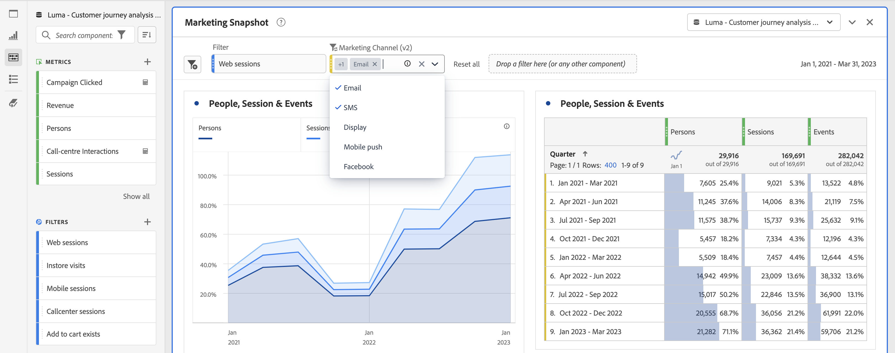

# Resumen de paneles

Un [!UICONTROL panel] es una colección de tablas y visualizaciones. Puede acceder a los paneles desde el icono de la parte superior izquierda de Workspace o desde un [panel en blanco](/help/analysis-workspace/c-panels/blank-panel.md). Los paneles son útiles cuando desea organizar sus proyectos según períodos de tiempo, vistas de datos o casos de uso de análisis. A continuación, se describen los tipos de paneles que están disponibles en Analysis Workspace:

| Nombre del panel | Descripción |
| --- | --- |
| [Panel en blanco](/help/analysis-workspace/c-panels/blank-panel.md) | Elija entre los paneles y las visualizaciones disponibles para iniciar el análisis. |
| [Panel de información rápida](quickinsight.md) | Cree rápidamente una tabla de forma libre y una visualización complementaria para analizar y descubrir información de manera más rápida. |
| [Panel de Attribution](attribution.md) | Compare y visualice rápidamente los modelos de atribución utilizando cualquier dimensión y métrica de conversión. |
| [Panel de forma libre](freeform-panel.md) | Realice comparaciones y desgloses ilimitados y, a continuación, añada visualizaciones para contar una historia de datos enriquecida. |

[!UICONTROL Quick Insights], [!UICONTROL En blanco] y [!UICONTROL Forma libre] los paneles son buenos lugares para iniciar el análisis, mientras que [!UICONTROL Attribution IQ] se presta a análisis más avanzados. Hay un botón `"+"` disponible en los proyectos para que pueda agregar paneles en blanco en cualquier momento.

El panel inicial predeterminado es [!UICONTROL Forma libre], pero también puede convertir el [Panel en blanco](/help/analysis-workspace/c-panels/blank-panel.md) en el panel predeterminado.

## Calendario {#calendar}

El calendario del panel controla el intervalo de la creación de informes de las tablas y visualizaciones de un panel.

Nota: Si se utiliza un componente de intervalo de fechas (púrpura) en una tabla, una visualización o en la zona desplegable de un panel, se anulará el calendario del panel.

Puede aplicar un intervalo de fechas de nivel de minuto bajo la configuración avanzada del calendario del panel. Si realiza informes en un intervalo de fechas que abarca muchos días, la hora de inicio se aplica al primer día y la hora de finalización se aplica al último día del intervalo.

## Zona de colocación {#dropzone}

La zona desplegable del panel le permite aplicar filtros y filtros desplegables a todas las tablas y visualizaciones de un panel. Puede aplicar uno o varios filtros a un panel. El título sobre cada filtro se puede modificar haciendo clic en el lápiz de edición, o bien puede hacer clic con el botón derecho para eliminarlo por completo.

### Filtros

Arrastre y suelte cualquier Filtro del carril izquierdo en la zona de colocación del panel para comenzar a filtrar el panel.

### Filtros específicos

Los componentes que no son de filtro también se pueden arrastrar directamente a la zona de colocación para crear filtros específicos, lo que le ahorra tiempo y esfuerzo al ir al Generador de filtros. Los filtros creados de esta forma se definen automáticamente como filtros de nivel de visita. Esta definición se puede modificar haciendo clic en el icono de información (i) junto al filtro, luego en el icono de edición con forma de lápiz y editándolo en el Generador de filtros.

Los filtros específicos son locales del proyecto y no aparecerán en el carril izquierdo a menos que los haga públicos.

### Filtros desplegables {#dropdown-filter}

Además de los filtros, los filtros desplegables permiten interactuar con los datos de forma controlada. Por ejemplo, puede agregar un filtro desplegable para Tipos de dispositivos móviles, de modo que pueda filtrar el panel por Tablet, Teléfono móvil o Escritorio.

Los filtros desplegables también se pueden utilizar para consolidar muchos proyectos en uno. Por ejemplo, si tiene muchas versiones del mismo proyecto con diferentes filtros de país aplicados, puede consolidar todas las versiones en un solo proyecto y agregar un filtro desplegable de país .

Para crear filtros desplegables:

1. Para crear un filtro desplegable con [!UICONTROL Elementos de dimensión], como, por ejemplo, valores dentro de la dimensión [!UICONTROL Canal de marketing], haga clic en el icono de flecha derecha que se encuentra junto a la dimensión en el carril izquierdo. Esto mostrará todos los elementos disponibles. Seleccione uno o varios elementos de componente del carril izquierdo y suéltelos en la zona desplegable del panel **mientras mantiene pulsada la tecla Mayús**. De este modo, los componentes se convierten en un filtro desplegable, no en un filtro único.
1. Para crear un filtro desplegable utilizando otros componentes como métricas, filtros o intervalos de fechas, seleccione un tipo de componente en el carril izquierdo y suéltelo en la zona desplegable del panel **manteniendo pulsada la tecla Mayús**.
1. Seleccione una de las opciones del menú desplegable para cambiar los datos del panel. También puede optar por no filtrar ninguno de los datos del panel seleccionando **[!UICONTROL Sin filtro]**.

[Vea el vídeo](https://experienceleague.adobe.com/docs/analytics-learn/tutorials/analysis-workspace/using-panels/using-panels-to-organize-your-analysis-workspace-projects.html?lang=es) para obtener más información sobre cómo añadir filtros desplegables al proyecto.

## Haga clic con el botón derecho en el menú {#right-click}

Para obtener más funcionalidades, haga clic con el botón derecho en el encabezado del panel.

Las configuraciones disponibles son las siguientes:

| Configuración | Descripción |
| --- | --- |
| [!UICONTROL Insertar panel copiado/visualización] | Permite pegar (“insertar”) un panel copiado o una visualización en otro lugar del proyecto, o en otro proyecto diferente. |
| [!UICONTROL Copiar panel] | Permite hacer clic con el botón derecho y copiar un panel para poder insertarlo en otro lugar del proyecto o en un proyecto completamente diferente. |
| [!UICONTROL Duplicar panel] | Crea un duplicado exacto del panel actual que podrá modificar a continuación. |
| [!UICONTROL Contraer/expandir todos los paneles] | Contrae y expande todos los paneles del proyecto. |
| [!UICONTROL Contraer/expandir todas las visualizaciones del panel] | Contrae y expande todas las visualizaciones del panel actual. |
| [!UICONTROL Editar descripción] | Añade (o edita) una descripción de texto para el panel. |
| [!UICONTROL Obtener vínculo del panel] | Le permite dirigir a los usuarios a un panel concreto de un proyecto. Al hacer clic en el vínculo, el destinatario deberá iniciar sesión antes de que se le dirija al panel exacto al que está vinculado. |
