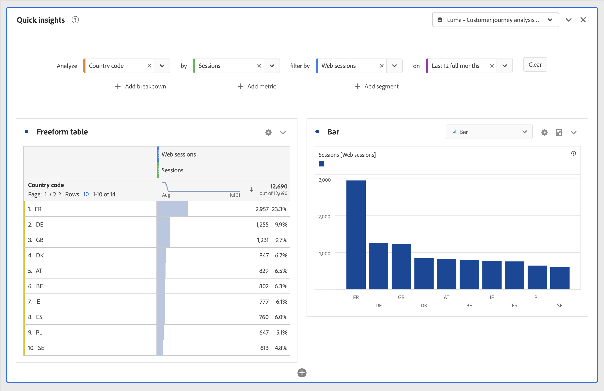
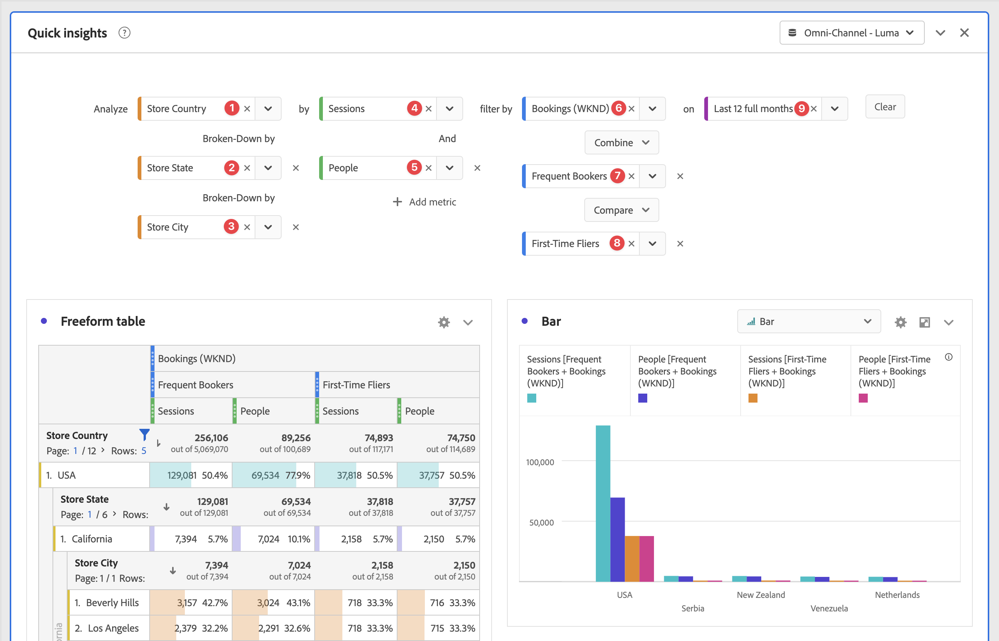

# Panel Información rápida {#quick-insights-panel}

<!-- markdownlint-disable MD034 -->

>[!CONTEXTUALHELP]
>id="cja_workspace_quickinsights_button"
>title="Acceso rápido a información"
>abstract="Crea un panel para crear rápidamente una tabla de forma libre y una visualización adjunta para analizar y descubrir información de manera más rápida."

<!-- markdownlint-enable MD034 -->

[!UICONTROL Información rápida] proporciona una guía a los no analistas y a los nuevos usuarios de [!UICONTROL Analysis Workspace] para aprender a responder preguntas comerciales de forma rápida y sencilla. También es una buena herramienta para usuarios avanzados que desean responder a una pregunta simple rápidamente sin tener que crear una tabla ellos mismos.

La primera vez que empieces a usar este [!UICONTROL Analysis Workspace], es posible que te preguntes:

* qué visualizaciones serían más útiles,
* qué dimensiones y métricas pueden facilitar las perspectivas,
* dónde arrastrar y soltar elementos,
* dónde crear un filtro,
* y más

Para ayudarte con estas preguntas,[!UICONTROL Información rápida] aprovecha un algoritmo que te presenta las dimensiones, métricas, filtros e intervalos de fechas más populares que usa tu compañía. Este algoritmo se basa en el uso que hace tu propia compañía de los componentes de datos en [!UICONTROL Analysis Workspace]. De hecho, verás dimensiones, métricas y filtros etiquetados como [!UICONTROL POPULAR] en la lista desplegable, como se muestra a continuación:

[!UICONTROL Información rápida] le ayudará a lo siguiente:

* Crear correctamente una tabla de datos y una visualización adjunta en [!UICONTROL Analysis Workspace].
* Conocer la terminología y el vocabulario para componentes básicos y partes de [!UICONTROL Analysis Workspace].
* Realizar desgloses simples de dimensiones, añadir varias métricas o comparar filtros es fácil dentro de una [!UICONTROL tabla de forma libre].
* Cambiar o probar varios tipos de visualización para encontrar la herramienta de búsqueda para su análisis de forma rápida e intuitiva.

## Terminología clave básica

A continuación se incluyen algunos de los términos básicos que debes conocer. Cada tabla de datos consta de dos o más bloques de creación (componentes) que se utilizan para crear la historia de tus datos.

| Bloque de creación (componente) | Definición |
|---|---|
| **[!UICONTROL Dimensión]** | Las dimensiones son descripciones o características de datos de métricas que se pueden visualizar, desglosar y comparar en un proyecto. Son valores no numéricos y fechas que se desglosan en elementos de dimensión. Por ejemplo, *explorador* o *página* es una dimensión. |
| **[!UICONTROL Elemento de dimensión]** | Los elementos de dimensión son valores individuales para una dimensión. Por ejemplo, los elementos de dimensión para la dimensión del navegador serían *Chrome*, *Firefox*, *Edge*, u otros. |
| [!UICONTROL Métrica] | Las métricas constituyen información cuantitativa sobre la actividad de la persona, tales como vistas, pulsaciones, recargas, tiempo promedio invertido, unidades, pedidos, ingresos, etc. |
| **[!UICONTROL Visualización]** | Workspace ofrece [varias visualizaciones](/help/analysis-workspace/visualizations/freeform-analysis-visualizations.md) para generar representaciones visuales de tus datos. Como gráficos de barras, gráficos circulares, histogramas, gráficos de líneas, mapas, gráficos de dispersión, etc. |
| **[!UICONTROL Desglose de dimensiones]** | Un desglose de dimensión es una forma de desglosar literalmente una dimensión por otras dimensiones. Por ejemplo, puedes desglosar los estados de EE. UU. por dispositivos móviles para obtener las visitas de los dispositivos móviles por estado. O puedes desglosar Dispositivos móviles por Tipos de dispositivos móviles, por Regiones, por Campañas internas y más. |
| **[!UICONTROL Filtro]** | Los filtros te permiten identificar subconjuntos de personas basándose en sus características o en las interacciones con el sitio web. Por ejemplo, puedes generar filtros de [!UICONTROL Personas] basados en <li>atributos: tipo de explorador, dispositivo, número de visitas, país, sexo o</li><li>interacciones: campañas, búsqueda de palabras clave, motor de búsqueda o</li><li>salidas y entradas: personas de Facebook, una página de aterrizaje definida, un dominio de referencia o</li><li> variables personalizadas: campo de formulario, categorías definidas o ID de cliente. |

## Utiliza

Para usar un panel de **[!UICONTROL Información rápida]**:

1. Crear un panel de **[!UICONTROL Información rápida]**. Para obtener información sobre cómo crear un panel, consulta [Crear un panel](panels.md#create-a-panel).

1. La primera vez que uses un panel de **[!UICONTROL Información rápida]**, quizá quieras ver el breve [!UICONTROL tutorial de introducción] que te enseña algunos de los conceptos básicos. Selecciona  junto al título del panel Quick Insights y selecciona **[!UICONTROL Tutorial introductorio]** en la ventana emergente.

1. Especifica la [entrada](#panel-input) para el panel.

1. Observa la [salida](#panel-output) del panel.

### Entrada de panel

Selecciona tus bloques de creación

* **[!UICONTROL Analizar]**: especifica una dimensión (naranja)
* **[!UICONTROL por]**: especifica una métrica (verde)
* **[!UICONTROL filtrar por]**:especifica un filtro (azul)
* **[!UICONTROL el]** - especifique un intervalo de fecha (púrpura).

Debes seleccionar al menos una dimensión y una métrica para que la visualización funcione correctamente.

Puedes especificar los bloques de creación de tres formas:

* Arrastra y suelta los componentes desde el panel izquierdo.
* Empieza a escribir en uno de los campos de bloque de creación. Cuando se encuentra la entrada, el campo de bloque de creación se rellena automáticamente con los valores posibles.
* Especifica una lista desplegable de bloque de creación (por ejemplo, `Country` en **[!UICONTROL Analizar]**) y busca el valor que deseas usar en la lista de valores posibles (con ) (por ejemplo, **[!UICONTROL Código de país]**).

Selecciona **[!UICONTROL Borrar]** para borrar todos los campos de entrada.

### Salida de panel

1. Cuando haya agregado al menos una dimensión y una métrica, podrás ver los resultados.

   

   * Una tabla de forma libre con la dimensión (código de país) y métrica (sesiones), filtradas por sesiones web durante los últimos 12 meses.

   * Una visualización adjunta, en este caso un [gráfico de barras](/help/analysis-workspace/visualizations/bar.md). La visualización que se genera se basa en el tipo de datos agregados a la tabla. Cualquier dato basado en el tiempo (como [!UICONTROL Sesiones] por día/mes) tiene un [!UICONTROL gráfico de líneas] predeterminado. Cualquier dato no basado en el tiempo (como [!UICONTROL Sesiones] por [!UICONTROL dispositivo]) tiene el valor predeterminado de un [!UICONTROL gráfico de barras]. Puede cambiar el tipo de visualización haciendo clic en la flecha desplegable situada junto al tipo de visualización.

1. Agrega más ajustes tal y como se describe a continuación en [Más sugerencias](#more-tips).

1. Es posible que desees guardar el proyecto usando **[!UICONTROL Proyecto > Guardar]**.

## Más sugerencias

En [!UICONTROL Quick Insights Builder], aparecerán otras sugerencias útiles, algunas de ellas en función de la última acción.

* En primer lugar, quizá desees completar el tutorial **[!UICONTROL Más sugerencias]**. Este tutorial se muestra 24 horas después de crear un proyecto con al menos una dimensión y una métrica. Selecciona  junto al título del panel Quick Insights y selecciona **[!UICONTROL Más sugerencias]** en la ventana emergente.

  

* Puede analizar varias dimensiones y métricas, combinar o comparar filtros y especificar un intervalo de fechas:

  

   * **[!UICONTROL Analizar]** dimensión **[!UICONTROL Desglosar por]**: puedes utilizar hasta tres niveles de desgloses en las dimensiones para profundizar en los datos que realmente necesita. Consulta ➊, ➋ y ➌.

   * Agregar más métricas **[!UICONTROL por]**: puedes agregar hasta dos métricas más. Consulta ➍ y ➎.

   * **[!UICONTROL filtrar por]**: puedes agregar hasta dos filtros más. Por ejemplo, agrega Reservas como filtro y combínalo con los filtros Viajeros frecuentes y Viajeros por primera vez que compares. Consulta ➏, ➐ y ➑.

   * Activado: se puede especificar el intervalo de fechas. Consulta ➒.

## Limitaciones conocidas

Si intentas editar directamente dentro de la tabla, el panel de [!UICONTROL Quick Insights] no estará sincronizado. Selecciona **[!UICONTROL Resincronizar generador]** en la parte superior derecha del panel para restaurarlo a la configuración anterior de [!UICONTROL Quick Insights].

Recibirás una advertencia antes de agregar cualquier cosa directamente a la tabla:

De lo contrario, la creación directa hará que la tabla ahora se comporte como una tabla de forma libre tradicional, sin las funciones útiles para los nuevos usuarios.

>[!MORELIKETHIS]
>
>[Crear un panel](/help/analysis-workspace/c-panels/panels.md#create-a-panel)
>