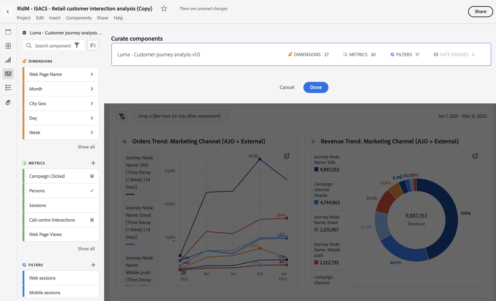

# Depurar proyectos de 

>[!NOTE]
>
>Está viendo la documentación de Analysis Workspace en Customer Journey Analytics. Su conjunto de funciones difiere ligeramente del [Analysis Workspace de la versión tradicional de Adobe Analytics](https://docs.adobe.com/content/help/es-ES/analytics/analyze/analysis-workspace/home.html). [Más información...](/help/getting-started/cja-aa.md)

La depuración permite limitar los componentes (dimensiones, métricas, segmentos e intervalos de fechas) antes de compartir un proyecto. Cuando un destinatario abre el proyecto, verá un conjunto limitado de componentes que ha seleccionado para ellos. La depuración es un paso opcional pero recomendado antes de compartir un proyecto.

>[!NOTE]
> Los perfiles de productos son el mecanismo principal que controla los componentes que puede ver un usuario. Se administran a través de Admin Console en Adobe Experience Cloud. La depuración es un filtro secundario.

## Aplicar depuración de proyecto

1. Haga clic en **[!UICONTROL Compartir]** > **[!UICONTROL Depurar datos del proyecto]**.
Los componentes que se utilizan en el proyecto se añadirán automáticamente.
   **Nota**: Si un proyecto tiene varios grupos de informes, verá un campo de selección para cada grupo de informes en el proyecto.
1. (Opcional) Para agregar más componentes, arrastre los componentes que desee compartir desde el carril izquierdo al campo [!UICONTROL Depurar componentes].
1. Haga clic en **[!UICONTROL Finalizado]**.

La depuración también se puede aplicar desde el menú [!UICONTROL Compartir] haciendo clic en **[!UICONTROL Depurar y Compartir]**. Esta opción depura automáticamente el proyecto en los componentes que se utilizan en el proyecto. Puede agregar componentes adicionales siguiendo los pasos anteriores.

## Vista de un proyecto depurado

Cuando un destinatario abre un proyecto depurado, solo verá el conjunto depurado de componentes que haya definido:

## Eliminar depuración del proyecto

Para eliminar la depuración del proyecto y restaurar el conjunto completo de componentes en el carril izquierdo:
1. Haga clic en **[!UICONTROL Compartir]** > **[!UICONTROL Depurar datos del proyecto]**.
1. Haga clic en **[!UICONTROL Eliminar depuración]**.
1. Haga clic en **[!UICONTROL Finalizado]**.

## Depuración de grupos de informes virtuales (VRS)

Para aplicar la depuración a nivel de grupo de informes, de modo que se aplique a muchos proyectos a la vez, puede [depurar componentes en un grupo de informes virtuales (VRS)](https://docs.adobe.com/content/help/es-ES/analytics/components/virtual-report-suites/vrs-components.html).

>[!NOTE]
> La depuración de grupos de informes virtuales siempre se aplica antes de la depuración de proyectos. Esto significa que, aunque el proyecto depurado incluya determinados componentes, se filtrarán si los grupos de informes virtuales depurados no los incluyen.

## Opción Mostrar todos los componentes

En un proyecto depurado o VRS, el destinatario tendrá la opción de **[!UICONTROL Mostrar todos los componentes]** en el carril izquierdo. [!UICONTROL Mostrar todo] revela diferentes conjuntos de componentes, según:

* Nivel de permiso del usuario (administrador o no administrador)
* Función del proyecto (propietario/editor o no)
* Tipo de depuración aplicada (VRS o proyecto)

| Tipo de depuración | Administradores | Propietario del proyecto no administrador o función de edición | Duplicado no administrador o función de vista |
|---|---|---|---|
| Grupos de informes virtuales depurados | Todos los componentes de grupos de informes virtuales no depurados | Componentes de grupos de informes virtuales no depurados que pertenecen a esta función o que se compartieron con esta función | Componentes de grupos de informes virtuales no depurados que pertenecen a esta función o que se compartieron con esta función |
| Proyecto depurado | Todos los componentes de proyecto no depurados | Todos los componentes de proyecto no depurados | Componentes de proyecto no depurados que pertenecen a esta función o que se compartieron con esta función |
| Proyecto depurado en un grupo de informes virtuales depurado | Todos los componentes no depurados siguientes: **[!UICONTROL Componentes sin depurar]** y **[!UICONTROL Componentes VRS sin depurar]** | Todos los componentes de proyecto sin depurar y los componentes VRS sin depurar de esta función o que se han compartido con ellos | Componentes de proyecto y de grupo de informes virtuales no depurados que pertenecen a esta función o que se compartieron con esta función |
