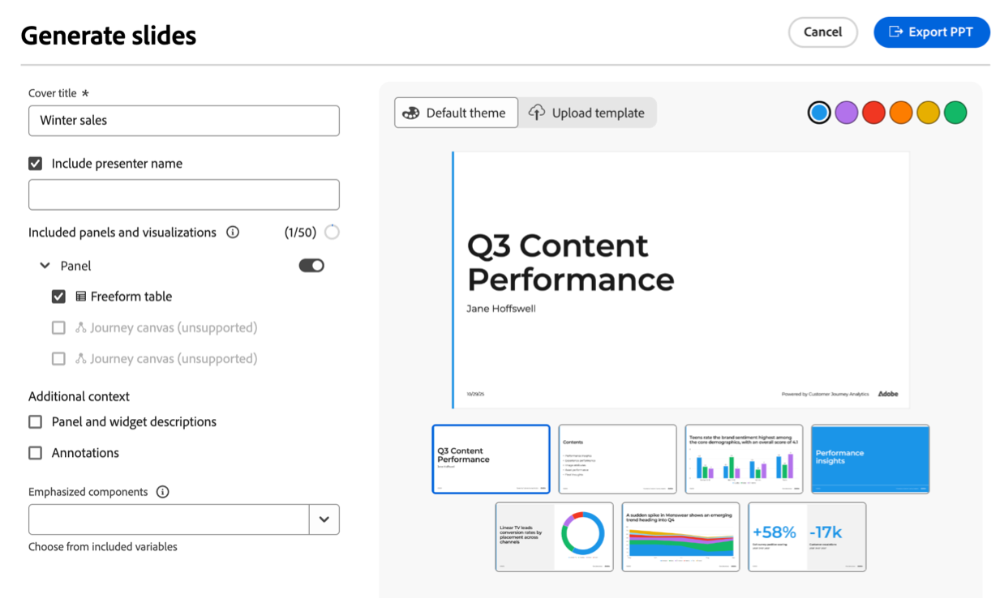
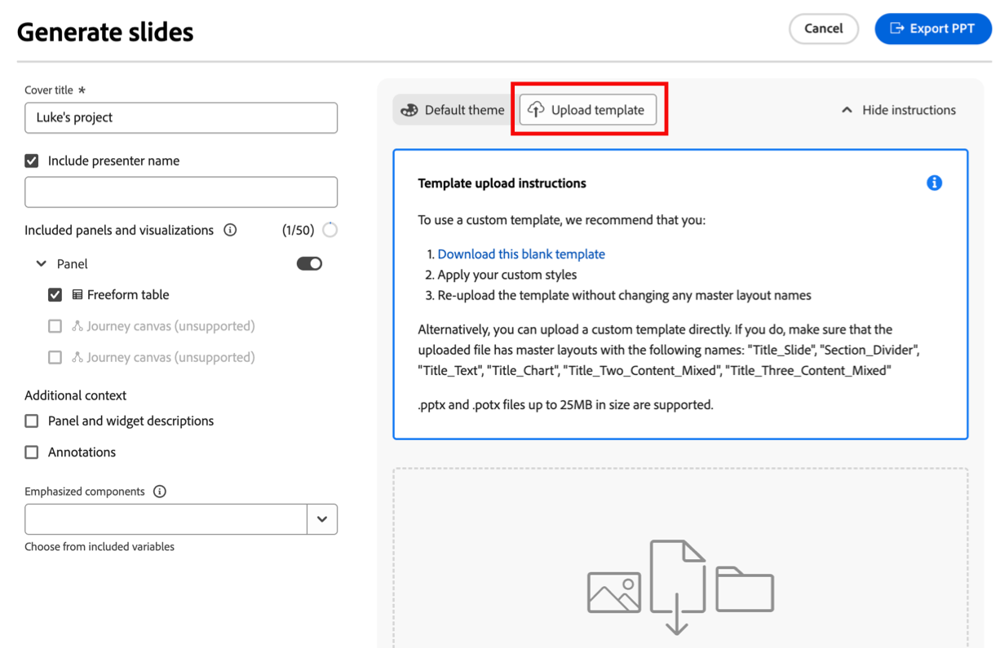
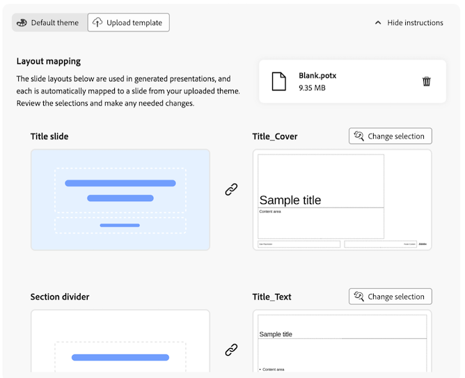
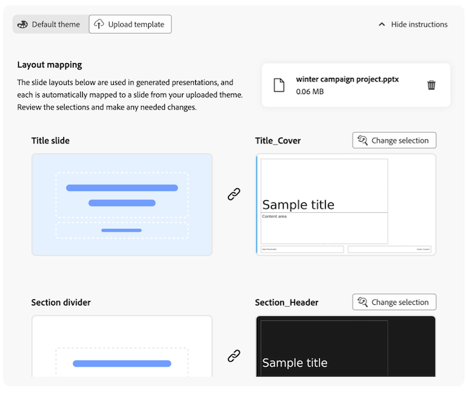

# Narración de datos: Generar presentaciones de diapositivas a partir de informes de Workspace {#generate-powerpoint}

{{release-limited-testing}}

<!-- also remove lmited testing note from: /help/technotes/access-control.md -->

Los usuarios con [los permisos necesarios](#permission-requirements-to-generate-slides) pueden generar automáticamente presentaciones .pptx basadas en proyectos de Analysis Workspace. Al generar estas presentaciones de diapositivas, Customer Journey Analytics crea automáticamente una historia a partir de sus datos identificando perspectivas clave y convirtiéndolas en diapositivas listas para las partes interesadas.

Esta historia de datos generados reduce el tiempo, el esfuerzo y la experiencia necesarios para sacar a la luz los resultados de un proyecto de Workspace. Los analistas pueden centrarse más en la exploración de datos, a la vez que permiten a Customer Journey Analytics crear y dar formato a la narrativa ejecutiva y comunicar el impacto comercial a las partes interesadas.

## Comprender las historias de datos en las presentaciones de diapositivas

Una **historia de datos** es la narrativa que Customer Journey Analytics crea en función de sus datos de Workspace. Con IA generativa, Customer Journey Analytics identifica las temáticas importantes dentro de los paneles y las visualizaciones que decida incluir en la presentación de diapositivas. Genera perspectivas y luego pasa por un proceso de deduplicación y puntuación para identificar un subconjunto de perspectivas que se utilizará para crear la historia de datos.

Las secciones siguientes describen el valor adicional que proporcionan las historias de datos, los elementos necesarios de un proyecto que ayudan a dar forma a la narrativa y los elementos clave que se incluyen en la salida de la presentación .pptx.

### Valor adicional proporcionado por las historias de datos

Las historias de datos proporcionan valor y perspectivas a un proyecto de Workspace al hacer que los datos sean accesibles para los usuarios con menos experiencia en análisis de datos.

Las historias de datos complementan un análisis para un proyecto de Workspace determinado al:

* Proporcionar contexto adicional

* Resaltar perspectivas importantes

* Evaluar si ciertas variables están siendo infravaloradas o sobrevaloradas

* Llamar la atención sobre tendencias ocultas, anomalías y otros factores que contribuyen

* Dar ideas para los pasos siguientes

### Elementos de proyecto que dan forma a historias de datos

Analysis Workspace crea historias de datos teniendo en cuenta los siguientes elementos de proyecto:

* Relaciones entre dimensiones e intermétricas

* Los elementos individuales que forman la base del análisis (dimensiones, métricas, filtros, estructura de tabla de forma libre, visualizaciones y paneles)

* Nombres asignados a los paneles, tablas y visualizaciones

* El orden de las métricas en una tabla de forma libre (para determinar la prioridad)

* El orden de las visualizaciones en un panel (para determinar la prioridad)

* Números y textos de resumen (para determinar las métricas que deben resaltarse en la historia de datos)

### Elementos de presentación de una historia de datos

Los artículos de datos constan de una diapositiva de título, una diapositiva de resumen ejecutivo, diapositivas de detalle y divisores de sección.

**Diapositiva de título:** Muestra el título y el nombre del moderador especificados. La información muestra en las notas del orador que describe el proceso de creación del tema y la narrativa, cuántas perspectivas se generaron y utilizaron y qué paneles se utilizaron.

**Resumen ejecutivo:** da prioridad a las perspectivas de mayor valor y crea una historia global que tiene entre 1 y 5 frases de longitud.

**Diapositivas de detalle:** genera información relacionada con tablas, paneles o visualizaciones de un proyecto de Workspace. Las perspectivas constan de tendencias, estacionalidades, anomalías y correlaciones.

**Divisores de sección:** divide la información con divisores de sección con nombre y colocados correctamente.

## Generar una presentación .pptx basada en un proyecto de Workspace

<!-- markdownlint-disable MD034 -->

>[!CONTEXTUALHELP]
>id="cja-powerpoint-include-visualizations"
>title="Paneles y visualizaciones incluidos"
>abstract="Elija los paneles y las visualizaciones que desee incluir en la presentación. Puede incluir hasta 50 visualizaciones."

<!-- markdownlint-enable MD034 -->

<!-- markdownlint-disable MD034 -->

>[!CONTEXTUALHELP]
>id="cja-presentation-emphasized-components"
>title="Componentes enfatizados"
>abstract="Elija entre las visualizaciones hasta 5 métricas y 5 dimensiones que desee resaltar en la presentación. Las métricas que elija se muestran en cursiva, las dimensiones en negrita y los elementos de dimensión en color distinto."

<!-- markdownlint-enable MD034 -->

1. Vaya al proyecto de Workspace que contiene los datos que desea utilizar como base para la presentación de diapositivas.

1. Seleccione **[!UICONTROL Generar diapositivas]** en la esquina superior derecha de la página.

   Aparece el cuadro de diálogo Generar diapositivas.

   

1. Especifique la siguiente información:

   | Opción | Descripción |
   |---------|----------|
   | **[!UICONTROL Título de portada]** | Especifique un título para la presentación. Este título aparece en la diapositiva de título de la presentación. |
   | **[!UICONTROL Incluir nombre del moderador]** | Especifique el nombre del moderador. Este nombre aparece en la diapositiva de título de la presentación, debajo del título de la portada. |
   | **[!UICONTROL Paneles y visualizaciones que incluir]** | Elija los paneles y la visualización que desee incluir en la presentación. Puede incluir hasta 50 visualizaciones.
Si una visualización está atenuada, va seguida del texto **[!UICONTROL (no compatible)]** o **[!UICONTROL (datos restringidos)]**.
<ul><li>**No compatible**: La mayoría de los paneles y visualizaciones son compatibles. Para obtener información acerca de paneles y visualizaciones no compatibles, vea [Elementos y características de proyecto no compatibles](#unsupported-project-elements-and-features).</li><li>**Datos restringidos**: la visualización contiene un componente que una directiva de control de datos aplicada por su organización no puede exportar. Póngase en contacto con el administrador del sistema para ver qué componentes están restringidos para no exportarse y, a continuación, quite los componentes restringidos antes de generar diapositivas.</li></ul> |
   | **[!UICONTROL Enfatizar componentes]** | Elija las métricas y dimensiones de las visualizaciones que desee resaltar en la presentación. Los componentes que elija se clasifican más alto y se les da más peso cuando se crean los temas y la narrativa general de la historia de datos. 
Cuando no se aplica ningún énfasis, los componentes se muestran en las presentaciones de la siguiente manera:<ul><li>**Métricas y dimensiones:** Cursiva</li><li>**Elementos de Dimension:** Comillas</li></ul>

Cuando se aplica énfasis, los componentes se muestran en las presentaciones de la siguiente manera:
<ul><li>**Métricas y dimensiones:** Cursiva y negrita</li><li>**Elementos de Dimension:** Negrita cuando se enfatiza la dimensión correspondiente
También se aplica un color al elemento de dimensión cuando este se resalta en el gráfico.
</li></ul> |

   <!-- add this later: - **[!UICONTROL Panel and visualization descriptions]** - Choose whether to include panel and visualization descriptions in your generated slide presentation. - 
   - **[!UICONTROL Annotations]** - Choose whether annotations are visible in your generated slide presentation. For more information about annotations, see [Annotations overview](/help/components/annotations/overview.md).  -  -->

1. (Condicional) Seleccione **[!UICONTROL Tema predeterminado]** si desea generar diapositivas en menos pasos y si no se requiere un tema corporativo para la presentación de diapositivas.

   Simplemente elija el tema de color de la presentación seleccionando el color deseado.

   

1. (Condicional) Seleccione **[!UICONTROL Cargar plantilla]** si la presentación de diapositivas debe coincidir con un tema corporativo. Esta opción requiere que cargue una plantilla personalizada y aplique los estilos personalizados.

   La plantilla personalizada más reciente que cargue se almacenará localmente en la caché del explorador y estará disponible al generar futuras presentaciones de diapositivas.

   

   Para cargar una plantilla personalizada, realice una de las acciones siguientes:

   * (Recomendado) Descargar una plantilla en blanco y modificarla.

      1. Descargar [esta plantilla en blanco](https://d30ln29764hddd.cloudfront.net/deploy/builds/data-storytelling.2025-10-20T15:10:19/resources/components/Blank.potx?).

      1. Aplique los estilos personalizados a la plantilla en blanco.

      1. Vuelva a cargar la plantilla sin cambiar los nombres del diseño maestro:

         Desde el sistema de archivos, arrastre la plantilla en blanco que tenga los estilos personalizados aplicados al área de colocación.

         O bien

         Seleccione **[!UICONTROL Examinar]**, luego busque y seleccione la plantilla en blanco que tenga los estilos personalizados aplicados desde el sistema de archivos.

      1. En la sección **[!UICONTROL Asignación de diseños]**, cada diseño de diapositiva que se usa en las presentaciones generadas se asigna automáticamente a una diapositiva del tema cargado. Revise las selecciones para asegurarse de que son correctas.

         

      1. (Condicional) Si el diseño de una diapositiva no está asignado correctamente, seleccione **[!UICONTROL Cambiar selección]** sobre la diapositiva elegida en la presentación cargada y, a continuación, elija la diapositiva que coincida con el diseño.

         Repita este proceso para cada diapositiva asignada incorrectamente.

   * Cargue una plantilla personalizada directamente.

      1. Desde el sistema de archivos, arrastre la plantilla personalizada al área de colocación.

         O bien

         Seleccione **[!UICONTROL Examinar]**, luego busque y seleccione su plantilla personalizada del sistema de archivos.

         Asegúrese de que el archivo cargado tenga diseños de patrón con los siguientes nombres: &quot;Title_Slide&quot;, &quot;Section_Divider&quot;, &quot;Title_Text&quot;, &quot;Title_Chart&quot;, &quot;Title_Two_Content_Mixed&quot;, &quot;Title_Three_Content_Mixed&quot;.

         Se admiten hasta 15 diseños principales.

         Se admiten archivos .pptx y .potx de hasta 25 MB de tamaño.

      1. En la sección **[!UICONTROL Asignación de diseños]**, cada diseño de diapositiva que se usa en las presentaciones generadas se asigna automáticamente a una diapositiva del tema cargado. Revise las selecciones para asegurarse de que son correctas.

         

      1. (Condicional) Si el diseño de una diapositiva no está asignado correctamente, seleccione **[!UICONTROL Cambiar selección]** sobre la diapositiva elegida en la presentación cargada y, a continuación, elija la diapositiva que coincida con el diseño.

         Repita este proceso para cada diapositiva asignada incorrectamente.

1. Seleccione **[!UICONTROL Exportar PPT]**.

   La presentación .pptx se descarga automáticamente en su estación de trabajo.

1. (Recomendado) Abrir la presentación .pptx y revisarla. Realice los cambios necesarios.

## Requisitos de permisos para generar diapositivas

>[!AVAILABILITY]
>
>Si su organización no tiene acceso para generar presentaciones de diapositivas desde un proyecto de Workspace, póngase en contacto con el representante de su cuenta de Adobe para obtener más información sobre las licencias.

La capacidad de generar diapositivas está habilitada de forma predeterminada para todos los usuarios de organizaciones que tienen las licencias requeridas.

Los administradores de perfil de productos cuyas organizaciones tengan licencia para generar diapositivas pueden deshabilitar el acceso si es necesario.

En [!UICONTROL Adobe Admin Console], el permiso de [!UICONTROL herramientas de informes] y **[!UICONTROL narración de datos]** determina el acceso a esta capacidad. Un [administrador de perfil de producto](https://helpx.adobe.com/es/enterprise/using/manage-product-profiles.html?lang=es) debe seguir estos pasos en [!UICONTROL Admin Console] si desea deshabilitar el acceso:
1. Vaya a **[!UICONTROL Admin Console]** > **[!UICONTROL Productos y servicios]** > **[!UICONTROL Customer Journey Analytics]** > **[!UICONTROL Perfiles de productos]**.
1. Seleccione el título del perfil de producto para el que desea proporcionar acceso a [!UICONTROL narración de datos].
1. En el perfil de producto específico, seleccione **[!UICONTROL Permisos]**.
1. Seleccione  para editar **[!UICONTROL Herramientas de creación de informes]**.
1. Seleccione  para quitar **Data storytold** de **[!UICONTROL los elementos de permiso incluidos]**.

   <!--add screenshot of permission in the admin console-->

1. Seleccione **[!UICONTROL Guardar]** para guardar el esquema.

Para obtener más información, consulte [Acceso de nivel de usuario](/help/technotes/access-control.md#user-level-access) en [Control de acceso](/help/technotes/access-control.md#access-control).

## Elementos y características de proyecto no compatibles {#unsupported}

Los siguientes elementos y características de Analysis Workspace utilizados en un proyecto no son compatibles con la generación de diapositivas:

* Panel de atribución

  Este panel se muestra atenuado cuando se muestran las opciones de configuración.

  El resto de paneles se pueden incluir en las diapositivas que se generan a partir de un proyecto de Workspace.

* Algunas visualizaciones

  La mayoría de las visualizaciones se pueden incluir en las diapositivas que se generan a partir de un proyecto de Workspace. Sin embargo, las siguientes visualizaciones no se pueden incluir y se muestran atenuadas cuando se muestran las opciones de configuración:

   * Área

   * Viñeta

   * Tabla de cohortes

   * Combo

   * Visita en orden previsto

   * Flujo

   * Lienzo de recorrido

   * Disperso

   * Mapa de árbol

* Desgloses

  Los datos de los desgloses se incluyen en las presentaciones generadas, pero se muestran en el mismo nivel que los elementos de dimensión.

* Análisis guiados

* Componentes que una directiva de gobernanza de datos ha restringido la exportación

  Para obtener más información, consulte [Solucionar problemas de exportaciones con errores](/help/components/exports/troubleshoot-exports.md).

