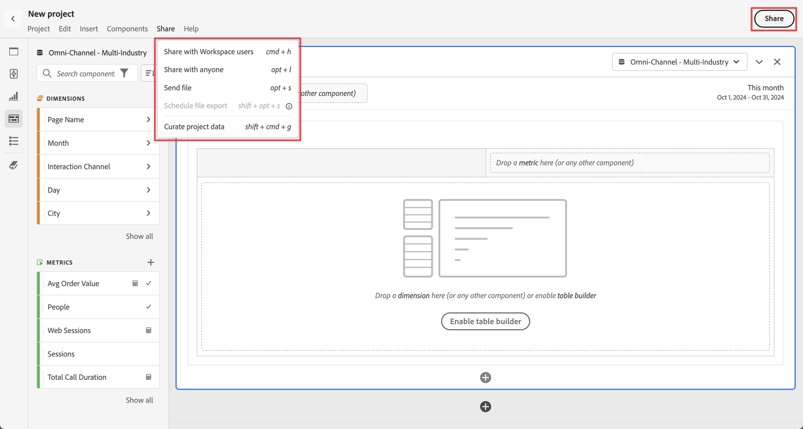

# Compartir información general

Puede depurar, compartir y programar proyectos como archivos de PDF o CSV para destinatarios de su organización o con cualquier otra persona mediante las opciones disponibles en el menú **[!UICONTROL Compartir]** de Analysis Workspace o al seleccionar **[!UICONTROL Compartir]** en la parte superior derecha de la interfaz.

| Opción | Descripción |
|---|---|
| **[!UICONTROL Compartir con usuarios de Workspace]** | Hace que este proyecto esté disponible para otros usuarios de Analysis Workspace de su organización. Comparta contenido con usuarios específicos o cree un vínculo que se pueda compartir para acceder rápidamente a un proyecto. Los usuarios deberán iniciar sesión. [Más información](/help/analysis-workspace/curate-share/share-projects.md) |
| **[!UICONTROL Compartir con cualquiera]** | Conceder acceso de solo lectura a proyectos de Analysis Workspace a personas que no tengan acceso a Customer Journey Analytics. [Más información](/help/analysis-workspace/curate-share/share-projects.md) |
| **[!UICONTROL Exportar archivo]** | Envíe un proyecto como CSV o PDF inmediatamente a destinatarios especificados. [Más información](/help/analysis-workspace/export/t-schedule-report.md) |
| **[!UICONTROL Programar exportación de archivos]** | Envíe un proyecto como CSV o PDF según una programación a destinatarios específicos. [Más información](/help/analysis-workspace/export/t-schedule-report.md) |
| **[!UICONTROL Depurar datos de proyectos]** | Limite los componentes (dimensiones, métricas, filtros e intervalos de fechas) disponibles en un proyecto. [Más información](/help/analysis-workspace/curate-share/curate.md) |
