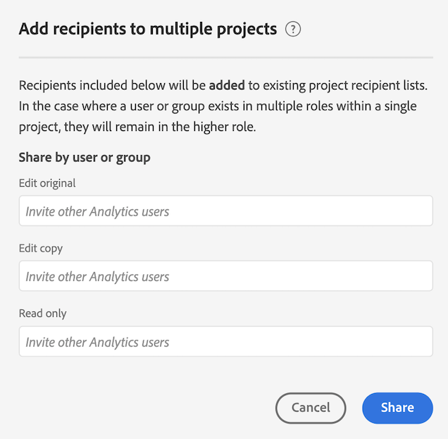

# Compartir proyectos

Puede compartir un proyecto de Analysis Workspace con los siguientes tipos de personas:

* Usuarios y grupos de su organización que tienen acceso a Adobe Customer Journey Analytics

   Puede compartir el acceso de Editar, Duplicar o Ver

* Usuarios y grupos de su organización que no tienen acceso a Customer Journey Analytics

   Los destinatarios tienen acceso de solo lectura

* Personas fuera de la organización

   Los destinatarios tienen acceso de solo lectura

Cualquiera [depuración](curate.md) la solicitud presentada antes del uso compartido se refleja cuando los destinatarios abren el proyecto.

A continuación se muestra un vídeo introductorio del uso compartido de proyectos:

>[!VIDEO](https://video.tv.adobe.com/v/36207/?quality=12)

## Compartir con usuarios y grupos de Customer Journey Analytics de su organización {#Add}

Puede compartir un proyecto con usuarios o grupos de Customer Journey Analytics existentes de su organización. Cuando comparte un proyecto como se describe en esta sección, los usuarios con los que comparte ya deben tener una cuenta de Customer Journey Analytics.

Puede compartir una función específica con usuarios o grupos, o bien compartir un vínculo.

* [Compartir una función de proyecto específica](#share-a-specific-project-role)

* [Compartir un vínculo a un proyecto](#share-a-link-to-a-project)

## Compartir una función de proyecto específica

Cuando comparta una función de proyecto específica con usuarios y grupos de su organización, tenga en cuenta lo siguiente:

* Funciones de proyecto (**[!UICONTROL puede editar]**, **[!UICONTROL puede duplicar]** y **[!UICONTROL puede ver]**) están vinculados al usuario y al ID de proyecto específico. Las funciones de proyecto son independientes de los permisos de usuario administrados en la [Admin Console de Adobe Experience Cloud](https://experienceleague.adobe.com/docs/core-services/interface/manage-users-and-products/admin-getting-started.html?lang=es).

* En Customer Journey Analytics, los grupos se definen mediante perfiles de producto en [Admin Console de Adobe Experience Cloud](https://experienceleague.adobe.com/docs/core-services/interface/manage-users-and-products/admin-getting-started.html?lang=es). Los administradores pueden compartir con cualquier grupo, incluido “Todos”. Los no administradores pueden compartir con los grupos de los que son miembros, excepto con el grupo “Todos”.

* El usuario que desempeña varias funciones siempre obtiene la mayor experiencia. Esto puede ocurrir si se agrega un destinatario como individuo y además, como parte de un grupo. Por ejemplo, si a un destinatario se le asigna la función **[!UICONTROL Puede editar]** como individuo y **[!UICONTROL Puede ver]** como miembro de un grupo, recibirá una experiencia **[!UICONTROL Puede editar]** en el proyecto.

* Los administradores con una función **[!UICONTROL Puede duplicar]** o **[!UICONTROL Puede ver]** recibirán esas experiencias limitadas cuando abran un proyecto. Si lo desea, un administrador puede aumentar su función a **[!UICONTROL Puede editar]** en cualquier momento en **[!UICONTROL Componentes] > [!UICONTROL Proyectos]**.

Para compartir una función de proyecto específica con usuarios o grupos de su organización, haga lo siguiente:

1. Vaya al proyecto que desee compartir y haga clic en **[!UICONTROL Compartir]** > **[!UICONTROL Compartir con usuarios de Workspace]**.
Si hay cambios sin guardar, se le pedirá primero que guarde el proyecto.

   

   Para obtener información sobre cómo compartir varios proyectos simultáneamente, consulte [Compartir proyectos en el administrador de proyectos](#share-projects-in-the-project-manager).

1. Añada destinatarios o grupos de destinatarios en uno de los campos de función proporcionados:

   **Puede editar:** los destinatarios pueden **[!UICONTROL Guardar]** los cambios en un proyecto y en una funcionalidad como copropietarios. Esta función resulta útil si desea administrar un proyecto conjuntamente con otros compañeros. Esto incluye editar, eliminar y modificar listas de destinatario para un proyecto compartido.  Nota: Actualmente, Analysis Workspace no admite la colaboración en tiempo real, por lo que se recomienda que solo un usuario edite un proyecto a la vez. Si los proyectos se guardan al mismo tiempo, se conservará la última versión.

   **Puede duplicar:** los destinatarios pueden **[!UICONTROL Guardar como]** y acceder al carril izquierdo. Las interacciones del proyecto no están limitadas en esta función. Esta función es útil si desea compartir un proyecto con usuarios que comprendan los datos de su organización y cómo usar Analysis Workspace, pero no desea que el proyecto se modifique.

   **Puede ver:** los destinatarios no pueden **[!UICONTROL Guardar]** o **[!UICONTROL Guardar como]** y no tienen acceso al carril izquierdo. Las interacciones del proyecto también están limitadas. Esta función resulta útil si desea compartir un proyecto con usuarios menos familiarizados con la estructura de datos de su organización, con Analysis Workspace o con el Customer Journey Analytics en general. Sin embargo, aún desea que consuman datos y perspectivas en un entorno seguro. Obtenga más información sobre la [la función de proyecto “Puede ver”](/help/analysis-workspace/curate-share/view-only-projects.md).

1. Elija si desea habilitar las siguientes opciones al compartir el proyecto:

   * **Compartir componentes del proyecto incrustados:** comparta segmentos, métricas calculadas e intervalos de fechas con todos los destinatarios. Después de compartirlos, estos componentes aparecerán en el menú desplegable de componentes del espacio de trabajo del destinatario. Esta configuración no se mantiene, se trata de una acción concreta usada al momento de compartir.

   * **Establecer como página de aterrizaje para destinatarios:** establece esta página como página de aterrizaje para destinatarios. Esta configuración no se mantiene, se trata de una acción concreta usada al momento de compartir.

1. Haga clic en **[!UICONTROL Compartir]**. (Si el proyecto ya se ha compartido, haga clic en [!UICONTROL **Actualizar**].)

   o

   Clic **[!UICONTROL Depurar y compartir]** para aplicar la depuración del proyecto automáticamente. (Si el proyecto ya se ha compartido, haga clic en **[!UICONTROL Depurar y actualizar]**.) Obtenga más información sobre la [depuración del proyecto](curate.md).

## Compartir un vínculo a un proyecto

Cuando comparta un vínculo como se describe en esta sección, tenga en cuenta lo siguiente:

* Los destinatarios que utilicen el vínculo deben iniciar sesión en Customer Journey Analytics antes de obtener acceso al proyecto.

* Si a un destinatario no se le asigna una función y recibe un [vínculo](/help/analysis-workspace/curate-share/shareable-links.md) al proyecto (**[!UICONTROL Compartir] > [!UICONTROL Obtener vínculo de proyecto]**), se le asignará una función predeterminada. Los administradores reciben **[!UICONTROL Puede editar]** y los usuarios que no son administradores reciben **[!UICONTROL Se puede duplicar]**.

Para compartir el vínculo del proyecto con los usuarios de su organización, haga lo siguiente:

1. Guarde el proyecto. Si hay cambios sin guardar, se le pedirá que guarde el proyecto antes de compartir un vínculo.

1. Seleccionar **[!UICONTROL Compartir]** > **[!UICONTROL Compartir con usuarios de Workspace]**, luego seleccione **[!UICONTROL Copiar]** junto al **[!UICONTROL Compartir mediante vínculo]** field.

   

1. Comparta el vínculo con los usuarios de su organización. Por ejemplo, puede pegarlo en un correo electrónico, en un sitio web interno, etc.

## Compartir un proyecto con cualquiera (no se requiere inicio de sesión) {#share-public-link}

{{release-limited-testing-section}}

Puede conceder [acceso de solo lectura](/help/analysis-workspace/curate-share/view-only-projects.md) a proyectos de Analysis Workspace para personas que no tienen acceso a Customer Journey Analytics. Esto puede incluir:

* Personas fuera de la organización

* Personas de su organización que no tienen acceso a Customer Journey Analytics

>[!NOTE]
>
>Tenga en cuenta lo siguiente al compartir un proyecto de Analysis Workspace con personas que no tienen acceso a CJA:
>
>* El administrador de CJA puede desactivar la capacidad de compartir un proyecto de esta manera, tal como se describe en [Preferencias](/help/analysis-workspace/user-preferences.md). Si no puede compartir un proyecto como se describe en esta sección, su administrador de CJA ha desactivado esta capacidad.
>
>* Los proyectos con más de 50 visualizaciones expandidas no se pueden compartir con personas que no tengan acceso a CJA.
>
>* Los usuarios con los que comparta pueden ver cualquier filtro que se haya aplicado al proyecto durante [depuración](curate.md).
> 
>* Los usuarios con los que comparte puede cambiar el intervalo de fechas del proyecto. El intervalo de fechas que ha establecido para el proyecto se muestra de forma predeterminada.
>
>* Un proyecto podría resultar inaccesible si muchos usuarios intentan acceder a un vínculo determinado al mismo tiempo. De forma predeterminada, más de 190 personas pueden acceder a un solo vínculo cada 5 minutos. Si su organización alcanza este límite, espere 5 minutos e intente acceder al vínculo de nuevo.
>
>* Si su organización dispone de licencia para Healthcare Shield, solo podrá compartir proyectos con usuarios autenticados mediante el inicio de sesión único (SSO) o Adobe ID; no podrá compartir proyectos con usuarios no autenticados. Es su responsabilidad utilizar esta función de conformidad con las políticas internas de control de datos de su empresa y compartir únicamente los vínculos de proyecto que contengan Información médica personal (PHI) con los usuarios que tengan los permisos adecuados.

Para compartir un proyecto de Analysis Workspace con cualquier persona:

1. Abra el proyecto de Analysis Workspace que desee compartir.

1. Clic **[!UICONTROL Compartir]** > **[!UICONTROL Compartir con cualquiera]**.

   Si hay cambios sin guardar, se le pedirá que guarde el proyecto.

   <!-- Add screen shot of new modal -->

1. Habilite la **[!UICONTROL El vínculo está activo]** opción si aún no está activada.

   Al seleccionar esta opción, se crea un vínculo al proyecto que se puede compartir con cualquier persona. Puede deshabilitar el acceso al proyecto en cualquier momento desactivando esta opción.

   El propietario del proyecto también es el propietario de este vínculo. La propiedad de los vínculos solo se puede transferir a otro usuario cuando se transfiere la propiedad del proyecto, tal como se describe en [Transferir recursos de usuario o establecer caducidades de cuenta](https://experienceleague.adobe.com/docs/analytics/admin/admin-tools/user-product-management/users-assets.html?lang=en) en la guía de administración de Analytics.

1. Elija si desea activar la siguiente opción de seguridad (esta opción puede ser controlada por su administrador de CJA):

   * **[!UICONTROL Requiere autenticación de Experience Cloud]:**

      Cuando esta opción está habilitada, solo los usuarios que pueden iniciar sesión en la organización de Adobe Experience Cloud donde se creó el proyecto que está compartiendo pueden acceder al proyecto.

      Los administradores de CJA pueden configurar esta preferencia para la compañía, tal como se describe en [Preferencias](/help/analysis-workspace/user-preferences.md). Puede encontrar los siguientes escenarios, según la configuración que haya realizado el administrador con esta opción:

      * Si esta opción no está visible, su administrador de CJA no habilitó esta función.

      * Si esta opción está habilitada y no puede deshabilitarla, significa que el administrador de CJA requiere la autenticación de Experience Cloud para cualquiera que acceda a proyectos de Analysis Workspace. Este siempre es el caso de las organizaciones que conceden la licencia a Healthcare Shield.

1. Junto a la **[!UICONTROL Compartir con cualquiera (no se requiere inicio de sesión)]** , haga clic en el **Copiar vínculo** icono ) para copiar el enlace en el portapapeles del sistema.

1. Comparta el vínculo con las personas a las que desee permitir el acceso al proyecto. Por ejemplo, puede pegar el vínculo en un mensaje de correo electrónico.

   Cualquier persona con la que comparta el vínculo puede ver el proyecto de Analysis Workspace.

1. (Opcional) Puede hacer clic en **Generar nuevo vínculo** icono  para eliminar el acceso de los usuarios que anteriormente recibieron un vínculo al proyecto. Se genera un nuevo vínculo que puede compartir con los usuarios que desea que tengan acceso al proyecto.

1. Seleccionar **[!UICONTROL Cerrar]** para cerrar el cuadro de diálogo compartir. Los cambios se guardarán automáticamente.

## Compartir proyectos en el administrador de proyectos {#Manager}

Los proyectos también se pueden compartir desde **[!UICONTROL Componentes] > [!UICONTROL Proyectos]**. Un solo proyecto se puede compartir siguiendo los mismos pasos descritos anteriormente.  Si se seleccionan varios proyectos para compartirlos, se agregarán destinatarios a la lista de destinatarios existente para cada proyecto.

Por ejemplo:

* El proyecto A se comparte con los destinatarios 1, 2 y 3
* El proyecto B se comparte con los destinatarios 4, 5 y 6

Con el proyecto A y B seleccionado, los destinatarios 4 y 7 se agregan a las listas de uso compartido. La nueva lista de uso compartido para cada proyecto ahora es:

* Proyecto A: 1, 2, 3, 4, 7
* Proyecto B: 4, 5, 6, 7

## Uso compartido de componentes incrustados

A continuación se muestra un vídeo sobre este tema:

>[!VIDEO](https://video.tv.adobe.com/v/24713/?quality=12)

## Preguntas frecuentes {#FAQs}

| Pregunta | Respuesta |
|---|---|
| ¿Qué sucede si dos editores guardan un proyecto al mismo tiempo? | Los cambios no se combinan y se conservará la última versión guardada del proyecto. Actualmente, Analysis Workspace no admite la colaboración en tiempo real. |
| Como administrador, ¿qué experiencia de proyecto veré? | Los administradores con una función **[!UICONTROL Puede duplicar]** o **[!UICONTROL Puede ver]** recibirán esas experiencias limitadas cuando abran un proyecto. Si lo desea, un administrador puede aumentar su función a **[!UICONTROL Puede editar]** en cualquier momento mediante **[!UICONTROL Componentes] > [!UICONTROL Proyectos]**. |
| ¿Qué sucede si un destinatario se coloca en una función como individuo y otra como miembro de un grupo? | Si un destinatario se coloca en varias funciones, siempre recibirá la experiencia más alta. Por ejemplo, si a un destinatario se le asigna la función **[!UICONTROL Puede editar]** como individuo y la función **[!UICONTROL Puede ver]** como miembro de un grupo, recibirá una experiencia **[!UICONTROL Puede editar]** en el proyecto. |
| ¿Qué experiencia obtiene un destinatario si abre un vínculo de proyecto? | Los Destinatarios reciben la función que les ha asignado en el modal de uso compartido. Si un destinatario no tiene asignada una función y recibe un vínculo al proyecto (**[!UICONTROL Compartir]** > **[!UICONTROL Compartir con usuarios de Workspace]**, luego seleccione **[!UICONTROL Copiar]** junto al **[!UICONTROL Compartir mediante vínculo]** ), se les asignará una función de forma predeterminada. Los administradores reciben la función **[!UICONTROL Puede editar]**, y los usuarios no administradores reciben la función **[!UICONTROL Puede duplicar]**. |
