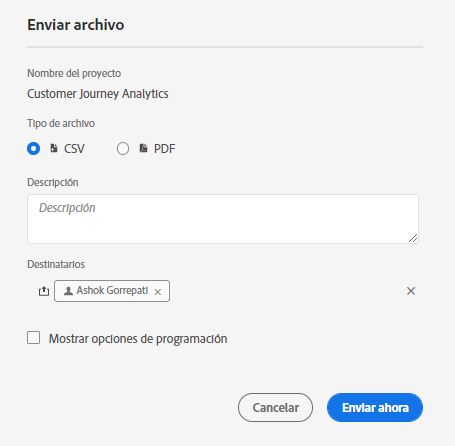
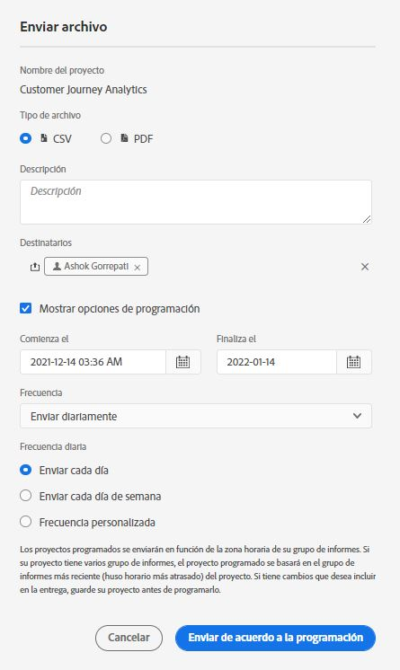

# Programar proyectos

Desde el espacio de trabajo **[!UICONTROL Compartir]** , puede enviar proyectos de Analysis Workspace por correo electrónico a destinatarios seleccionados. Los archivos se pueden enviar en formato CSV o PDF.

## Enviar archivo ahora {#now}

Para enviar un archivo inmediatamente a los destinatarios por correo electrónico:

1. Haga clic en **[!UICONTROL Compartir] > [!UICONTROL Enviar archivo ahora]**.
1. Especifique el tipo de archivo (CSV o PDF).
1. (Opcional) Añada una descripción que se incluirá en el correo electrónico para explicar el archivo que se va a recibir.
1. Añadir destinatarios o grupos. También se pueden introducir direcciones de correo electrónico.
1. (Solo para clientes de Healthcare Shield) Proporcione una contraseña. Consulte la sección Proteger un informe programado con contraseña.
1. Haga clic en **[!UICONTROL Enviar ahora]**.
1. (Opcional) Haga clic en **[!UICONTROL Mostrar opciones de programación]** para especificar una programación de entregas.

## Enviar archivo según lo programado {#schedule}

Para enviar un archivo en una programación recurrente a los destinatarios por correo electrónico:

1. Haga clic en **[!UICONTROL Compartir] > [!UICONTROL Enviar archivo según lo programado]**.
1. Especifique el tipo de archivo (CSV o PDF).
1. (Opcional) Añada una descripción que se incluirá en el correo electrónico para explicar el archivo que se va a recibir.
1. Añadir destinatarios o grupos. También se pueden introducir direcciones de correo electrónico.
1. (Solo para clientes de Healthcare Shield) Proporcione una contraseña. Consulte la sección Proteger un informe programado con contraseña.
1. Especifique el rango en el que debe entregarse la programación mediante la modificación de las entradas Inicio en y Finalización en. La fecha de finalización debe ser de un año a partir del día en el que se crea o modifica la programación.
1. Especifique la frecuencia de entrega. Cada frecuencia permite diferentes personalizaciones.
1. Haga clic en **[!UICONTROL Enviar según lo programado]**.

## Administrador de proyectos programados {#manager}

Los proyectos programados de Analysis Workspace se pueden administrar en **[!UICONTROL Analytics] > [!UICONTROL Componentes] > [!UICONTROL Proyectos programados]**.

En el Administrador de proyectos programados, puede editar y eliminar la programación recurrente de proyectos. Busque una programación en la barra de búsqueda o utilizando las opciones de filtro en el carril izquierdo. Puede filtrar por etiqueta, programaciones aprobadas, propietarios, etc.

| Campo | Descripción |
| --- | --- |
| [!UICONTROL Favoritos] | Al seleccionar el icono de estrella, marca esta programación como favorita. |
| [!UICONTROL ID de programación] | Este ID se utiliza principalmente con fines de depuración. |
| [!UICONTROL Título y descripción] | Título y descripción de este proyecto. |
| [!UICONTROL Propietario] | La persona que creó el proyecto y es de su propiedad. |
| [!UICONTROL Etiquetas] | (opcional) El etiquetado es una buena forma de organizar los proyectos. Todos los usuarios pueden crear etiquetas y aplicar una o más a un proyecto. Sin embargo, solo verá las etiquetas de los proyectos que sean suyos o que se hayan compartido con usted. |
| [!UICONTROL Entregado a] | Los destinatarios de este proyecto programado. |
| [!UICONTROL Fecha de caducidad] | La fecha de caducidad predeterminada depende de la frecuencia de programación. Consulte &quot;Fechas de caducidad programadas del proyecto&quot; a continuación. |
| [!UICONTROL Frecuencia] | La frecuencia con la que desea que este proyecto programado se envíe a los destinatarios. |
| [!UICONTROL Hora de ejecución] | A qué hora del día se envía este proyecto programado. |
| [!UICONTROL Cantidad de consultas] | Número de consultas de este proyecto. |

Las siguientes son acciones comunes en el administrador de proyectos programados:

| Acción | Descripción |
|---|---|
| **[!UICONTROL Editar programación]** | Haga clic en el título de la programación para actualizar su configuración de entrega. |
| **[!UICONTROL Eliminar programación]** | Seleccione el proyecto programado en la lista y, a continuación, haga clic en Eliminar en el menú. Esto eliminará la programación seleccionada para el proyecto; el proyecto en sí no se eliminará. |
| **[!UICONTROL Añadir etiquetas]** | Seleccione el proyecto programado en la lista y, a continuación, elija “Etiqueta” o “Aprobar” para organizar las programaciones y facilitar su búsqueda. |
| **[!UICONTROL Ver las programaciones fallidas]** | Vaya al carril izquierdo > Otros filtros > No se han podido ver las programaciones que han fallado. |
| **[!UICONTROL Ver las programaciones caducadas]** | Vaya al carril izquierdo > Otros filtros > Caducado para ver las programaciones que han caducado. Haga clic en el título de la programación para configurar una nueva programación de entrega. |
| **[!UICONTROL Ver el ID de programación]** | Vaya a las opciones de columna en la parte superior derecha y añada la columna ID de programación a la tabla. El ID de programación suele ser útil para la depuración. |

El Administrador de programación de proyectos muestra los artículos que ha creado un usuario en particular. Si la cuenta del usuario está desactivada en la aplicación, se detienen todos los envíos programados.

## Fechas de caducidad para proyectos programados {#expiration}

Las fechas de caducidad de los proyectos programados dependen de la frecuencia de envío programada:

* Los envíos por hora caducan en una semana.
* Los envíos diarios caducan en un mes.
* Las entregas semanales caducan en 6 meses.
* Los envíos mensuales/anuales caducan en un año.

## Proteger un proyecto programado con contraseña {#password}

>[!NOTE]
>
>La opción de proteger con contraseña un proyecto programado solo aparece para los clientes de CJA que hayan adquirido el complemento [Healthcare Shield](https://business.adobe.com/solutions/experience-cloud-for-healthcare.html).

Adobe utiliza la contraseña para cifrar proyectos programados, independientemente de si se envían en formato .pdf o .csv.

Una vez que su compañía ha adquirido la unidad de almacén de Healthcare Shield y se ha habilitado, aparece el mensaje para crear una contraseña para un proyecto programado en dos circunstancias:

* Cuando alguien crea un nuevo proyecto programado.

* Cuando un proyecto programado existente está a punto de enviarse. El proyecto programado actualmente se deshabilitará hasta que se establezca la protección con contraseña. El propietario del proyecto programado recibirá un correo electrónico con este fin.

### Requisitos de contraseña

Los requisitos de la contraseña cumplen con el estándar de Adobe y requieren un mínimo de 8 caracteres con al menos un número y un carácter especial.

### Proteger con contraseña un proyecto programado nuevo

1. Una vez guardado el proyecto, vaya a **[!UICONTROL Compartir]** > **[!UICONTROL Enviar archivo ahora]** o [!UICONTROL Compartir] > **[!UICONTROL Enviar archivo según lo programado]**.
1. Siga las instrucciones anteriores, en [Enviar archivo ahora](https://experienceleague.adobe.com/docs/analytics-platform/using/cja-workspace/curate-share/t-schedule-report.html?lang=es#now) o [Enviar archivo según lo programado](https://experienceleague.adobe.com/docs/analytics-platform/using/cja-workspace/curate-share/t-schedule-report.html?lang=es#schedule).

### Proteger con contraseña un proyecto programado existente

Antes de la hora en la que se programa un proyecto, el propietario del proyecto recibirá un correo electrónico similar al siguiente:

1. Vuelva a iniciar sesión en el Customer Journey Analytics.
1. Haga clic en **[!UICONTROL Ver proyecto programado]**.
1. En el diálogo **[!UICONTROL Editar proyecto programado]**, introduzca una contraseña y vuelva a introducirla.
1. Informe (solo) a los destinatarios del proyecto programado sobre esta contraseña.

