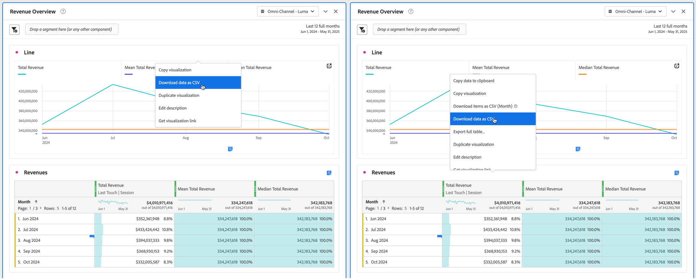

# Descargar proyectos y datos

Puede descargar proyectos y datos de Analysis Workspace en su dispositivo local. Esta descarga puede copiarse en datos, en un archivo CSV (datos de valores separados por comas) o en un documento PDF (formato de documento portátil).

* Seleccione la opción PDF si desea que las visualizaciones se incluyan en el archivo descargado.
* Seleccione las opciones CSV y datos copiados si solo necesita datos de texto sin formato.

En la [descripción general de la exportación](/help/analysis-workspace/export/export-project-overview.md) se describen métodos adicionales para exportar datos de Customer Journey Analytics.

## Descargar un proyecto como archivo PDF o CSV {#download-project}

### Descargar un proyecto como archivo de PDF

Tenga en cuenta lo siguiente al descargar un proyecto como PDF:

* No abandone el proyecto hasta que el proyecto se descargue en la estación de trabajo. La descarga puede tardar varios minutos en ejecutarse de nuevo en los servidores de Adobe para que PDF pueda procesarse. Puede seguir realizando cambios en el proyecto mientras se procesa la descarga. Si un PDF tarda más de 5 minutos en procesarse, se le pedirá que [envíe por correo electrónico el PDF](../curate-share/send-schedule-files.md).
* Las descargas se representan como una sola página sin paginación.
* PDF contiene lo que es visible en la página del explorador en Analysis Workspace. Para evitar que el contenido se trunque, seleccione  para cambiar automáticamente el tamaño de las visualizaciones o paneles de tamaño personalizado.
* Se puede hacer clic en [hipervínculos](/help/analysis-workspace/visualizations/freeform-table/freeform-table-hyperlinks.md) dentro de tablas de forma libre en el PDF descargado.

Para descargar un proyecto como archivo de PDF:

1. Seleccione **[!UICONTROL Proyecto]** > **[!UICONTROL Descargar PDF]**.

   Aparece una barra verde con el siguiente mensaje:  **[!UICONTROL Se ha solicitado su descarga. Espere.]**

1. En cuanto la descarga esté lista, aparecerá una barra verde con el siguiente mensaje:  **[!UICONTROL *El nombre del proyecto *PDF está listo.]**

1. Seleccione **[!UICONTROL Descargar]** en la barra verde.

   Según la configuración del explorador, PDF se descarga automáticamente en la carpeta que configuró anteriormente, o se le pedirá que elija una carpeta en la que se descargará PDF.

   El nombre de archivo está compuesto por *nombre de proyecto* - *nombre del grupo de informes* - *fecha*. Por ejemplo, `Example Project - Omni-Channel - Luma - Jun 30, 2025.pdf`.

### Descarga de un proyecto como archivo CSV

1. Seleccione **[!UICONTROL Proyecto]** > **[!UICONTROL Descargar CSV]**.

   Según la configuración del explorador, el archivo CSV se descarga automáticamente en una carpeta que haya configurado anteriormente, o bien se le pedirá que elija una carpeta en la que se descargará el archivo CSV.

   El nombre de archivo está compuesto por *nombre de proyecto* - *nombre del grupo de informes* - *fecha*. Por ejemplo, `Example Project - Omni-Channel - Luma - Jun 30, 2025.csv`.

## Copiar datos de una visualización en el portapapeles {#copy-data}

La opción **[!UICONTROL Copiar al portapapeles]** del menú contextual le permite copiar rápidamente datos de Analysis Workspace y pegarlos en una herramienta de terceros.

* Si desea que se copien los datos de tabla mostrados, seleccione el encabezado de tabla y seleccione **Copiar datos al portapapeles** en el menú contextual.
* Si desea que se copie un subconjunto de los datos, realice una selección en la tabla y seleccione **Copiar selección al portapapeles** en el menú contextual.

>[!TIP]
>
>Puede usar la tecla de acceso directo **_cmd + c_** (macOS) o **_ctrl + c_** (Windows) para copiar la selección en el portapapeles. A continuación, use **_cmd + v_** (macOS) o **_ctrl + v_** (Windows) para pegar los datos.

{zoomable="yes"}

## Descarga de datos dentro de una visualización como archivo CSV {#download-data}

Las opciones Descargar como CSV del menú contextual le permiten descargar una tabla de datos o la fuente de datos de cualquier visualización como CSV.

Para ello, haga lo siguiente:

* En el encabezado de cualquier tabla o visualización, seleccione **[!UICONTROL Descargar datos como CSV]** en el menú contextual. Esto descarga los datos mostrados en la tabla o la fuente de datos subyacente para una visualización como CSV. 

<!-- Only relevant as soon as CJA supports Map visualization 
  >[!NOTE]
  >
  >  Note: the Map visualization does not support this option.
-->

* En una tabla, seleccione **[!UICONTROL Descargar selección como CSV]** en el menú contextual. Solo la selección se descarga con esta opción, a diferencia de la tabla mostrada completa.

## Descargar elementos como archivo CSV {#download-items}

Si desea analizar más de las 400 filas de datos visibles en una tabla, seleccione **Descargar elementos como CSV (_Dimension name_)** en el menú contextual del encabezado de tabla o de cualquier fila. Esta opción exporta hasta 50 000 elementos de dimensión (según la clasificación de la tabla) para la dimensión seleccionada, con opciones de clasificación y filtros aplicados. Si selecciona esta opción en la parte superior de la tabla, se exporta la primera dimensión de la tabla.

No se aplican límites en la tabla de forma libre. Para garantizar un rendimiento óptimo, se recomienda utilizar esta opción en tablas con menos de 20 columnas.

>[!TIP]
>
> Si la dimensión supera los 50 000 elementos, descargue el archivo con diferentes métricas de ordenación aplicadas o aplique un segmento. Por ejemplo, ordenar de forma descendente por Visitas en una descarga y, a continuación, ascendente por Visitas en una segunda descarga. Esta sugerencia puede ayudarle a recuperar elementos de mayor longitud.

Puede realizar varias tareas dentro del proyecto e incluso desplazarse a un nuevo proyecto de Workspace en la misma pestaña mientras la descarga está en curso. La descarga se detendrá si abre una nueva pestaña del explorador. La descarga se cancelará si deja Workspace por completo o si cierra la pestaña del explorador.

### Archivo de elementos descargados {#items-file}

Las siguientes funciones de una tabla de forma libre se aplican al archivo descargado:

* Todos los segmentos del panel se aplican como filtros.
* Los desgloses **superiores** a la dimensión seleccionada en la tabla se aplican como filtros encima de cada columna.
* Los desgloses **inferiores** a las dimensiones seleccionadas en la tabla se eliminan.

### Descarga de notificaciones {#notifications}

A medida que el archivo se descarga, verá las siguientes notificaciones:

* Se ha solicitado un **[!UICONTROL _nombre de tabla _-_Dimension _.csv azul._x _% completado]**&#x200B;que indica el progreso. Para cancelar la descarga en cualquier momento, selecciona **[!UICONTROL Cancelar descarga]**. Seleccione  si desea cerrar el mensaje, lo que no cancela la descarga.
* Se ha descargado una notificación de finalización verde **[!UICONTROL _Table name _-_Dimension _.csv]**&#x200B;una vez que se haya completado la descarga del archivo. El archivo se descarga en la carpeta de descargas configurada para su explorador.

Si solicita más de una descarga a la vez, recibirá una notificación avisando que cada descarga adicional se pone en cola hasta que finalice la descarga anterior.

## Descarga de datos confidenciales {#sensitive}

Imagine una [política de control de datos](/help/data-views/data-governance.md) que impide la descarga de datos. Y que esta directiva está activada en la vista de datos sobre la que crea informes. Como resultado, cualquier descarga (como cuando envía un correo electrónico o comparte archivos de PDF) de proyectos genera un hash de los campos de datos etiquetados como confidenciales. Puede seguir analizando estos campos en Analysis Workspace. Si intenta enviar un correo electrónico o compartir un proyecto de otro modo, los campos de datos confidenciales aparecen como vacíos en el archivo PDF o CSV.

Si los campos de datos etiquetados como confidenciales se incluyen en la vista de datos, la opción para seleccionar y copiar datos de la pantalla está restringida para todos los datos de la vista de datos.

## Preguntas frecuentes {#faq}

| Pregunta | Respuesta |
| --- | --- |
| ¿Por qué mi PDF descargado consiste en una sola página? | La funcionalidad [Descargar PDF](#download-as-csv-or-pdf) no pagina los archivos PDF descargados. |
| ¿Puedo exportar más de 50 000 elementos con la opción **[!UICONTROL Descargar elementos como CSV]**? | Aunque cada descarga puede contener hasta 50 000 elementos de dimensión, puede cambiar el tipo de tabla para recuperar elementos de cola más largos o aplicar un filtro para descargar elementos más específicos. |
| ¿Qué hace **[!UICONTROL Copiar visualización]**? | A diferencia de [!UICONTROL **Copiar datos al portapapeles**] o [!UICONTROL **Copiar selección al portapapeles**], la opción de menú contextual **[!UICONTROL Copiar visualización]** no es una opción de exportación. Esta opción le permite [copiar una visualización](/help/analysis-workspace/visualizations/freeform-analysis-visualizations.md#context-menu) o [copiar un panel](/help/analysis-workspace/c-panels/panels.md#context-menu) de un lugar de Workspace a otro. Por ejemplo, de un panel a otro en el mismo proyecto o de un proyecto a otro. |
