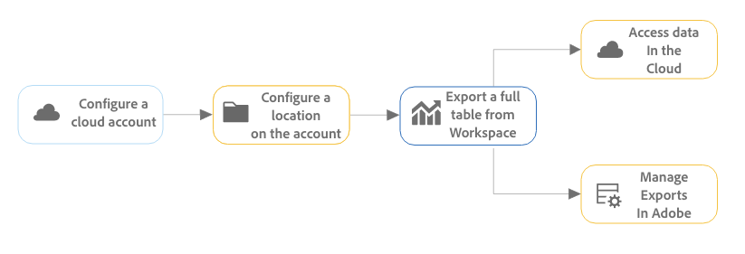
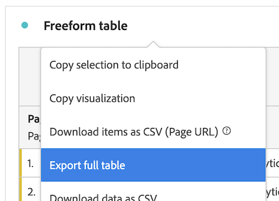
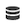

# Exportación de informes de Customer Journey Analytics a la nube {#full-table-export}

<!-- markdownlint-disable MD034 -->

>[!CONTEXTUALHELP]
>id="cja-upgrade-full-table-export"
>title="Crear exportaciones de tablas completas similares a la de Data Warehouse"
>abstract="Las exportaciones de tabla completa están disponibles en cuanto se ven los datos en Analysis Workspace. Puede crear o programar exportaciones de tabla completa según lo permitan las necesidades.  La creación de exportaciones de tablas completas tarda unos minutos en realizarse si ya sabe qué datos incluir en la exportación."

<!-- markdownlint-enable MD034 -->

Puede exportar tablas completas de Workspace desde Customer Journey Analytics y enviar exportaciones a destinos en la nube designados.

También hay disponibles otros métodos para exportar informes de Customer Journey Analytics, como se describe en [Información general sobre la exportación](/help/analysis-workspace/export/export-project-overview.md).

## Información sobre la exportación de tablas completas

Puede exportar tablas completas desde Analysis Workspace a proveedores en la nube como Google, Azure, Amazon y Adobe.

[Las ventajas de exportar tablas completas a la nube](#advantages-of-exporting-to-the-cloud) incluyen la posibilidad de exportar millones de filas, incluir las métricas calculadas, la salida de datos de la estructura en valores concatenados y mucho más.

Al exportar tablas completas, tenga en cuenta lo siguiente:

* Antes de exportar a la nube, asegúrese de que sus tablas, su entorno y sus permisos cumplen los [requisitos de exportación](#export-requirements).

* Algunas [características](#unsupported-features) y [componentes](#unsupported-components) no son compatibles al exportar tablas completas a la nube.

Utilice el siguiente proceso al exportar tablas completas a la nube:

1. [Configure una cuenta en la nube](/help/components/exports/cloud-export-accounts.md)

1. [Configure una ubicación en la cuenta](/help/components/exports/cloud-export-locations.md)

1. [Exporte una tabla completa desde Workspace](#export-full-tables-from-analysis-workspace)

1. [Acceda a datos en la nube](#view-exported-data-and-manifest-file) y [administre exportaciones en Adobe](/help/components/exports/manage-exports.md)

## Exportar de tablas completas desde Analysis Workspace {#export-from-workspace}

<!-- markdownlint-disable MD034 -->

>[!CONTEXTUALHELP]
>id="export-manifest"
>title="Archivo de manifiesto"
>abstract="Cuando se habilita, se incluye un archivo de manifiesto con cualquier envío de exportación correcto. El archivo de manifiesto le permite confirmar que todos los archivos se enviaron correctamente."

<!-- markdownlint-enable MD034 -->

>[!NOTE]
>
>Antes de exportar los datos como se describe en esta sección, obtenga más información sobre la exportación de tabla completa en la anterior sección [Información sobre la exportación de tablas completas](#understand-full-table-export).

Para exportar tablas completas desde Analysis Workspace:

1. Si aún no lo ha hecho, configure una cuenta y una ubicación de exportación, tal como se describe en [Configuración de cuentas de exportación en la nube](/help/components/exports/cloud-export-accounts.md).

1. En Analysis Workspace, haga clic con el botón derecho en la tabla de forma libre que contiene los datos que desea exportar.

1. Seleccione [!UICONTROL **Exportar tabla completa**].

   

1. En el cuadro de diálogo [!UICONTROL **Nueva exportación de tabla completa**], especifique la siguiente información:

   | Nombre de campo | Función |
   |---------|----------|
   | Nombre | Especifique un nombre para la exportación. Este nombre se muestra en la lista de exportaciones. |
   | Etiquetas | Puede aplicar una etiqueta existente a la exportación o crear una nueva y aplicarla. 
Para aplicar una etiqueta existente a la exportación, seleccione cualquier etiqueta en el menú desplegable. Se puede aplicar cualquiera de las etiquetas de su compañía<!-- double-check this -->.
 
Para crear una etiqueta nueva, escriba el nombre de la etiqueta nueva y pulse Entrar.

Tenga en cuenta lo siguiente al aplicar etiquetas a una exportación: <ul><li>Las etiquetas que aplique se pueden filtrar o buscar en la tabla de exportaciones.</li> <li>Las etiquetas aplicadas a un proyecto no se aplican automáticamente al exportar una tabla completa, como se describe en &quot;Configurar columnas en la página de exportaciones&quot; en [Administración de exportaciones](/help/components/exports/manage-exports.md). (Como alternativa, al [programar un proyecto completo para la exportación](/help/analysis-workspace/export/t-schedule-report.md), todas las etiquetas aplicadas al proyecto se aplicarán automáticamente a la exportación). <!-- Right now we don't have a column for them on the exports table, so this isn't true. Jaden is adding the column. --></li></ul> |
   | Descripción | Añada una descripción a la exportación. Puede elegir ver las descripciones como una columna en la [página Exportaciones](/help/components/exports/manage-exports.md) al ver las exportaciones. |
   | Vista de datos | Seleccione la vista de datos que contiene los componentes que desea incluir en la exportación. El menú desplegable Vista de datos se encuentra en la esquina superior izquierda del cuadro de diálogo y se puede identificar mediante el icono de vista de datos.  
**Nota:** Si elige una vista de datos en la que faltan componentes que ya están incluidos en la tabla de datos, se le pedirá que borre la tabla de datos y la vuelva a crear utilizando componentes que estén incluidos en la vista de datos seleccionada. 
 |
   | Ventana de retroactividad | Seleccione el lapso de tiempo de creación de informes que desea incluir en cada archivo de exportación. Las opciones incluyen [!UICONTROL **Hoy**], [!UICONTROL **Ayer**], [!UICONTROL **Últimos 7 días**], [!UICONTROL **Últimos 30 días**], [!UICONTROL **Esta semana**] y [!UICONTROL **Este mes**]. 
Esta opción no se muestra cuando la [!UICONTROL **Frecuencia de exportación**] está establecida en [!UICONTROL **Enviar ahora (una vez)**]. |
   | Tabla de datos | Muestra la tabla de forma libre que está exportando. Puede modificar la tabla de datos arrastrando los componentes del panel izquierdo a la tabla. El proyecto se actualiza dinámicamente a medida que se añade componentes al lienzo.  
Cualquier segmento que se haya aplicado a la tabla completa del proyecto aparecerá en la parte superior de cada columna individual de la tabla.
 |
   | Borrar | Borra el contenido de la tabla de datos. Esto le permite empezar a crear una nueva tabla directamente dentro del cuadro de diálogo Exportación de nueva tabla completa. |
   | Frecuencia de exportación | Establezca la programación de la frecuencia con la que debe realizarse la exportación. 
Puede elegir [!UICONTROL **Enviar ahora (una vez)**] para enviar la exportación solo una vez. Al seleccionar esta opción, la exportación se inicia inmediatamente.
O bien, puede elegir enviar la exportación según una programación definida. Al enviar una programación, las opciones incluyen [!UICONTROL **Diario**], [!UICONTROL **Semanal**], [!UICONTROL **Mensual por día de la semana**], [!UICONTROL **Mensual por día del mes**], [!UICONTROL **Anual por día del mes**] y [!UICONTROL **Anual por fecha específica**]. 

Al seleccionar una frecuencia de exportación, tenga en cuenta lo siguiente:
<ul><li>Las opciones del campo [!UICONTROL **Ventana de retroactividad**] cambian según lo que seleccione aquí.<!-- if they're doing Daily, then we might not let them look back to the last year... --></li><li>Los campos de configuración adicionales se muestran según la opción elegida.</li></ul> |
   | Comienza el  | El día y la hora de inicio de la exportación programada. 
Esta opción solo está disponible cuando se elige una frecuencia de exportación programada.
 |
   | Finaliza el | El día y la hora de caducidad de la exportación programada. La exportación programada ya no se ejecuta después de la fecha y hora establecidas. 
Esta opción solo está disponible cuando se elige una frecuencia de exportación programada.
 |
   | Formato del archivo | Elija si los datos exportados deben estar en formato .csv o .json. |
   | Incluir el archivo de manifiesto | Cuando se habilita, se incluye un archivo de manifiesto con cualquier envío de exportación correcto. El archivo de manifiesto le permite confirmar que todos los archivos se enviaron correctamente. Incluye la siguiente información:<ul><li>Una lista de todos los archivos enviados</li><li>La suma de comprobación MD5 de cada archivo</li></ul>
Los datos exportados están disponibles como un archivo comprimido en el destino en la nube que configuró, tal como se describe en [Configuración de cuentas de exportación en la nube](/help/components/exports/cloud-export-accounts.md) y [Configuración de ubicaciones de exportación en la nube](/help/components/exports/cloud-export-locations.md).

El nombre del archivo comprimido es el siguiente, en función de si eligió CSV o JSON como formato de archivo:
<ul><li>`cja-export-{reportInstanceId}-{idx}.csv.gz`</li><li>`cja-export-{reportInstanceId}-{idx}.json.gz`</li></ul>
Elija el formato de archivo en el campo [!UICONTROL **Formato de archivo**] anterior.
 |
   | Cuenta | Seleccione la cuenta de exportación a la nube a la que desea enviar los datos. 
O bien, si aún no ha configurado una cuenta en la nube que desee utilizar, puede configurar una nueva cuenta:<ol><li>Seleccione [!UICONTROL **Añadir cuenta**] y, a continuación, especifique la siguiente información:<ul><li>[!UICONTROL **Nombre de la cuenta de ubicación**]: especifique un nombre para la cuenta de ubicación. Este nombre aparece al crear una ubicación  </li><li>[!UICONTROL **Descripción de la ubicación de la cuenta**]: proporcione una breve descripción de la cuenta para diferenciarla de otras cuentas del mismo tipo de cuenta.</li><li>[!UICONTROL **Tipo de cuenta**]: seleccione el tipo de cuenta en la nube a la que está exportando. Los tipos de cuenta disponibles son ARN de la función Amazon S3, Google Cloud Platform, Azure SAS, Azure RBAC, Snowflake y Zona de aterrizaje de datos de AEP.</li></ul><li>Para finalizar la configuración de la cuenta, continúe con el vínculo siguiente que corresponde al [!UICONTROL **tipo de cuenta**] que ha seleccionado:<ul><li>[Zona de aterrizaje de datos de AEP](/help/components/exports/cloud-export-accounts.md#aep-data-landing-zone)</li><li>[ARN de la función Amazon S3](/help/components/exports/cloud-export-accounts.md#amazon-s3-role-arn)</li><li>[Google Cloud Platform](/help/components/exports/cloud-export-accounts.md#google-cloud-platform)</li><li>[Azure SAS](/help/components/exports/cloud-export-accounts.md#azure-sas)</li><li>[Azure RBAC](/help/components/exports/cloud-export-accounts.md#azure-rbac)</li><li>[Snowflake](/help/components/exports/cloud-export-accounts.md#snowflake)</li></ul></ol> |
   | Ubicación | Seleccione la ubicación de la cuenta a la que desea enviar los datos de exportación.
O bien, si aún no ha configurado la ubicación que desea utilizar en la cuenta seleccionada, puede configurar una nueva ubicación:<ol><li>Seleccione [!UICONTROL **Añadir ubicación**] y, a continuación, especifique la siguiente información: <ul><li>[!UICONTROL **Nombre**]: nombre de la ubicación.</li><li>[!UICONTROL **Descripción**]: proporcione una breve descripción de la ubicación para diferenciarla de otras ubicaciones del mismo tipo de ubicación.</li><li>[!UICONTROL **Ubicación de la cuenta**]: seleccione la cuenta en la que desea crear la ubicación.</li></ul><li>Para finalizar la configuración de la ubicación, continúe con el vínculo de abajo que corresponde al tipo de cuenta que seleccionó en el campo [!UICONTROL **Cuenta de ubicación**]:<ul><li>[Zona de aterrizaje de datos de AEP](/help/components/exports/cloud-export-locations.md#aep-data-landing-zone).</li><li>[ARN de función de Amazon S3](/help/components/exports/cloud-export-locations.md#amazon-s3-role-arn)</li><li>[Google Cloud Platform](/help/components/exports/cloud-export-locations.md#google-cloud-platform)</li><li>[Azure SAS](/help/components/exports/cloud-export-locations.md#azure-sas)</li><li>[Azure RBAC](/help/components/exports/cloud-export-locations.md#azure-rbac)</li><li>[Snowflake](/help/components/exports/cloud-export-locations.md#snowflake)</li></ul> |

   {style="table-layout:auto"}

1. Seleccione [!UICONTROL **Guardar**] para guardar la exportación.

   Los datos se envían a la cuenta en la nube especificada con la frecuencia especificada.

1. (Opcional) Una vez creada la exportación, tanto si decide enviarla ahora como en una programación definida, puede verla y administrarla en la [página Exportaciones](/help/components/exports/manage-exports.md) y verla en los [Registros de exportación](/help/components/exports/manage-export-logs.md).

## Administración de exportaciones

Una vez exportados los datos desde Analysis Workspace, puede editar, volver a exportar, duplicar, etiquetar o eliminar las exportaciones existentes, tal como se describe en [Administración de exportaciones](/help/components/exports/manage-exports.md).

## Ventajas de exportar a la nube {#advantages}

Exportar los datos de Customer Journey Analytics a la nube le permite:

* Exportar a una ubicación compartida, como Adobe Experience Platform Data Landing Zone, Google Cloud Platform, Microsoft Azure, Amazon S3 o Snowflake.

* Almacenar grandes cantidades de datos históricos.

  Este tipo de datos se puede utilizar para detectar tendencias a largo plazo con el fin de obtener inteligencia empresarial y, en última instancia, obtener una mejor toma de decisiones empresariales.

* Exportar tablas completas que contengan miles o millones de filas (3 millones, 30 millones, 150 millones o 300 millones de filas, según el tipo de licencia). Otros métodos de exportación permiten un máximo de 50 000 filas.

* Incluir métricas calculadas en los datos de Customer Journey Analytics exportados.

* Estructurar la salida de datos como valores concatenados.

* Exportar de una sola vez o según una programación. (También disponible con [otras opciones de exportación](/help/analysis-workspace/export/export-project-overview.md)).

* Exportar archivos en formato CSV o JSON. (También disponible con [otras opciones de exportación](/help/analysis-workspace/export/export-project-overview.md).)

* Exportar tablas que incluyan varias dimensiones.

## Requisitos de exportación {#export-requirements}

### Requisitos mínimos

Asegúrese de que las tablas, el entorno y los permisos cumplan los siguientes requisitos:

* **Tablas:** todas las tablas deben incluir al menos una dimensión en la fila y una métrica en cada columna para ser compatibles con una exportación de tabla completa.

* **Entorno:** asegúrese de que las [direcciones IP](/help/technotes/ip-addresses.md) y los [dominios](/help/technotes/domains.md) utilizados por Customer Journey Analytics tengan permiso para pasar a través del firewall de su organización.

* **Permisos:** en Adobe Admin Console, a los usuarios se les debe asignar un perfil de producto que tenga asignado el permiso [!UICONTROL **Exportación de tabla completa**] para poder exportar tablas completas. Para obtener información sobre cómo asignar un permiso a un perfil de producto en Admin Console, consulte [Permiso de Customer Journey Analytics en Admin Console](/help/technotes/access-control.md).

  >[!NOTE]
  >
  >  Los usuarios que tienen asignada la [función de administrador de productos](/help/technotes/access-control.md#product-admin-role) siempre tienen acceso para exportar tablas completas; no es necesario asignar a estos usuarios el permiso de [!UICONTROL **Exportación de tabla completa**].

### Funciones no compatibles

Las siguientes funciones no son compatibles y se eliminarán automáticamente de las exportaciones de tabla completa:

* Porcentajes
* Totales
* Filtrado de búsqueda
* Filas estáticas
* Alineación de fechas
* Métricas de conjuntos de datos de resumen
* Elementos de dimensión dinámicos

  Los elementos de dimensión dinámicos se crean al soltar una dimensión en el encabezado de una columna en una tabla de forma libre, lo que da como resultado que la columna se filtre dinámicamente por los 5 elementos de dimensión principales. En Analysis Workspace, estos 5 elementos de dimensión principales se actualizan cada vez que se carga el proyecto. En una exportación de tabla completa, estos elementos de dimensión se vuelven estáticos. Para obtener más información, consulte [Elementos de dimensión dinámicos o estáticos en tablas de forma libre](/help/analysis-workspace/visualizations/freeform-table/column-row-settings/manual-vs-dynamic-rows.md).
* Las dimensiones del primer desglose se convierten y añaden como una dimensión secundaria en la fila de la tabla exportada; cualquier otro desglose no se incluye en la tabla
* No es posible ordenar la mayoría de los conjuntos de datos; es posible que los datos se ordenen para conjuntos de datos pequeños

### Componentes no compatibles

Los siguientes componentes no son compatibles y Analysis Workspace le pide que los quite de la tabla cuando realice una exportación de tabla completa:

* Métricas calculadas que utilizan funciones básicas o avanzadas en la definición de la métrica (consulte [Funciones básicas](/help/components/calc-metrics/cm-functions.md) y [Funciones avanzadas](/help/components/calc-metrics/cm-adv-functions.md) para obtener más información)
* Componentes que un administrador ha restringido para que no se exporten (consulte la sección *Segmento sobre políticas de control de datos en vistas de datos* en [Etiquetas y políticas](/help/data-views/data-governance.md) para obtener más información)
* Cualquier dimensión que cumpla todos los criterios siguientes:
   * Se creó a partir de un campo que forma parte de una [matriz de objetos](/help/use-cases/object-arrays.md) (similar a las variables de varios valores en Adobe Analytics)
   * Tiene [habilitada la persistencia](/help/data-views/component-settings/persistence.md)
   * No está usando una [dimensión de enlace](/help/use-cases/data-views/binding-dimensions-metrics.md)
* Varias dimensiones que proceden de campos que hacen referencia a diferentes [matrices de objetos](/help/use-cases/object-arrays.md). (Se permiten varias dimensiones que hagan referencia a la misma matriz de objetos).
* Más de 10 dimensiones y 10 métricas por informe (se admiten hasta 10 dimensiones y 10 métricas)
* En columnas de la tabla:
   * Intervalos de fechas
   * Dimensiones
* En filas de la tabla:
   * Métricas calculadas 
   * Métricas
   * Intervalos de fechas
   * Segmentos 

### Comportamiento de la atribución

La exportación de tabla completa admite métricas calculadas que utilizan un modelo de atribución no predeterminado (como se describe en la sección *Uso de modelos de atribución no predeterminados* en [Configuración de columna](/help/analysis-workspace/visualizations/freeform-table/column-row-settings/column-settings.md)).

Si se utiliza un modelo de atribución no predeterminado en un informe, el modelo de asignación que se utiliza en el informe se ignora o se conserva, en función de si el informe tiene una o varias dimensiones:

* **En el caso de los informes que incluyen la atribución de métricas en una sola dimensión:** [la atribución de métricas](/help/data-views/component-settings/attribution.md) anula el [modelo de asignación](/help/data-views/component-settings/persistence.md) como se hace normalmente cuando se utiliza la atribución de métricas.

  Por ejemplo, una atribución de métrica de &quot;primer contacto&quot; anula una asignación de dimensión &quot;más reciente&quot;.

* **En el caso de los informes que incluyen la atribución de métricas en varias dimensiones al mismo tiempo:** [la atribución de métricas](/help/data-views/component-settings/attribution.md) se aplica además del modelo de asignación de dimensión .

  Por ejemplo, se aplica una atribución de métrica de &quot;primer contacto&quot; además de una asignación de dimensión &quot;más reciente&quot;. Además, la atribución de métricas se aplicará a los pares de elementos de dimensión post-asignados como si fueran elementos de dimensión únicos, en lugar de a cada elemento de dimensión de forma independiente, como se hace normalmente en una tabla de forma libre.

  >[!NOTE]
  >
  >Los informes multidimensionales solo son compatibles cuando se exportan datos a la nube, tal como se describe en este artículo.

## Comparación de la exportación de tablas completas (en Customer Journey Analytics) con Data Warehouse (en Adobe Analytics) {#comparison}

Si anteriormente utilizó Data Warehouse para exportar datos de Adobe Analytics, la siguiente tabla puede ayudarle a comprender las diferencias entre exportar tablas completas en Customer Journey Analytics y exportar datos con Data Warehouse en Adobe Analytics.

| Función | Exportación de tablas completas en Customer Journey Analytics | Data Warehouse en Adobe Analytics |
|---------|----------|---------|
| Crear un informe personalizado | Sí | Sí |
| Métricas calculadas  | Sí | No |
| Segmentos  | Sí | Limitado |
| Dimensiones | Límite de 10 | Ilimitado |
| Métricas | Límite de 10 | Ilimitado |
| Filas de informes | Límite de 3 millones, 30 millones, 150 millones o 300 millones, según el nivel | Ilimitado |
| Número de informes | Ilimitado | Ilimitado |
| Envío ad hoc (único) | Sí | Sí |
| Programar envío recurrente | Sí | Sí |
| Envío de correo electrónico | No | Sí |
| FTP / SFTP | No | Compatibilidad con versiones anteriores |
| Azure | Sí | Sí |
| Amazon S3 | Sí | Sí |
| Google Cloud Platform | Sí | Sí |
| Snowflake | Sí | No |
| Frecuencia de entrega | Diario | Por hora |
