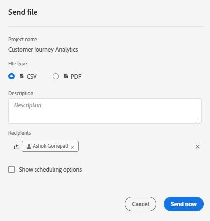
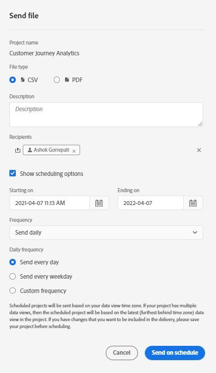
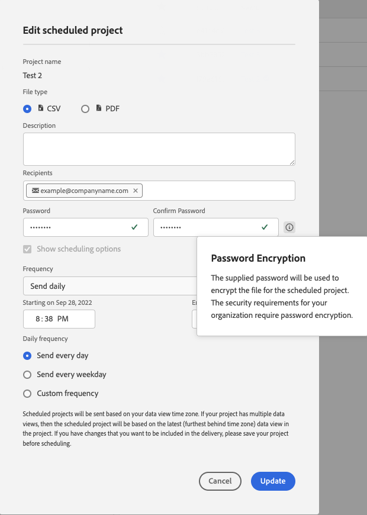
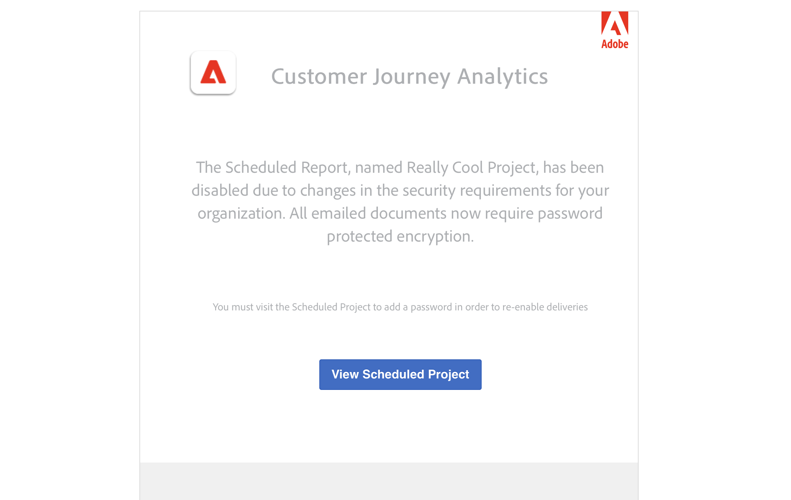

# Enviar datos del Customer Journey Analytics a otras personas por correo electrónico

Puede exportar informes de Customer Journey Analytics enviándolos a destinatarios seleccionados por correo electrónico. Puede enviar archivos ad hoc o configurar los archivos para que se envíen según una programación. Los archivos se pueden enviar en formato CSV o PDF.

Todas las etiquetas aplicadas al proyecto se aplican automáticamente a la exportación.

También están disponibles otros métodos para exportar datos del Customer Journey Analytics, como se describe en [Información general de exportación](/help/analysis-workspace/export/export-project-overview.md).

## Enviar archivo ahora {#now}

Para enviar un archivo inmediatamente a los destinatarios por correo electrónico:

1. Clic **[!UICONTROL Compartir] > [!UICONTROL Exportar archivo]**.
1. Especifique el tipo de archivo:
   * [!UICONTROL **CSV**]: elija esta opción si desea datos de texto sin formato.
   * [!UICONTROL **PDF**]: elija esta opción si desea que el archivo descargado contenga todas las tablas y visualizaciones mostradas (visibles) en el proyecto.
1. (Opcional) Añada una descripción para incluirla en el correo electrónico y explicar el archivo que se va a recibir.
1. Añadir destinatarios o grupos. También se pueden introducir direcciones de correo electrónico.
1. (Solo para clientes de Healthcare Shield) Proporcione una contraseña. Consulte la sección Proteger un informe programado con contraseña.
1. (Opcional) Haga clic en **[!UICONTROL Mostrar opciones de programación]** para especificar una programación de entregas.
1. Haga clic en **[!UICONTROL Enviar ahora]**.

## Enviar archivo según lo programado {#schedule}

Para enviar un archivo en una programación recurrente a los destinatarios por correo electrónico:

1. Clic **[!UICONTROL Compartir] > [!UICONTROL Programar exportación de archivos]**.
1. Especifique el tipo de archivo (CSV o PDF).
1. (Opcional) Añada una descripción que se incluirá en el correo electrónico para explicar el archivo que se va a recibir.
1. Añadir destinatarios o grupos. También se pueden introducir direcciones de correo electrónico.
1. (Solo para clientes de Healthcare Shield) Proporcione una contraseña. Consulte la sección Proteger un informe programado con contraseña.
1. Especifique el rango en el que debe entregarse la programación mediante la modificación de las entradas Inicio en y Finalización en. La fecha de finalización debe ser de un año a partir del día en el que se crea o modifica la programación.
1. Especifique la frecuencia de entrega. Cada frecuencia permite diferentes personalizaciones.
1. Haga clic en **[!UICONTROL Enviar según lo programado]**.

## Administrador de proyectos programados {#manager}

Los proyectos programados de Analysis Workspace se pueden administrar en **[!UICONTROL Analytics] > [!UICONTROL Componentes] > [!UICONTROL Proyectos programados]**.

En el Administrador de proyectos programados, puede editar y eliminar la programación recurrente de proyectos. Busque una programación en la barra de búsqueda o utilizando las opciones de filtro en el carril izquierdo. Puede filtrar por etiqueta, programaciones aprobadas, propietarios, etc.

| Campo | Descripción |
| --- | --- |
| [!UICONTROL Favoritos] | Al seleccionar el icono de estrella, marca esta programación como favorita. |
| [!UICONTROL ID de programación] | Este ID se utiliza principalmente con fines de depuración. |
| [!UICONTROL Título y descripción] | Título y descripción de este proyecto. |
| [!UICONTROL Propietario] | La persona que creó el proyecto y es propietaria de él. |
| [!UICONTROL Etiquetas] | (opcional) El etiquetado es una buena forma de organizar los proyectos. Todos los usuarios pueden crear etiquetas y aplicar una o más a un proyecto. Sin embargo, solo verá las etiquetas de los proyectos que sean suyos o que se hayan compartido con usted. |
| [!UICONTROL Entregado a] | Las personas destinatarias de este proyecto programado. |
| [!UICONTROL Fecha de caducidad] | Puede establecer la fecha de caducidad en un máximo de un año, independientemente de la frecuencia de programación. |
| [!UICONTROL Frecuencia] | La frecuencia con la que desea que este proyecto programado se envíe a las personas destinatarias. |
| [!UICONTROL Hora de ejecución] | A qué hora del día se envía este proyecto programado. |
| [!UICONTROL Cantidad de consultas] | Número de consultas de este proyecto. |

Las siguientes son acciones comunes en el administrador de proyectos programados:

| Acción | Descripción |
|---|---|
| **[!UICONTROL Editar programación]** | Haga clic en el título de la programación para actualizar su configuración de entrega. |
| **[!UICONTROL Eliminar programación]** | Seleccione el proyecto programado en la lista y, a continuación, haga clic en Eliminar en el menú. Esto eliminará la programación seleccionada para el proyecto; el proyecto en sí no se eliminará. |
| **[!UICONTROL Añadir etiquetas]** | Seleccione el proyecto programado en la lista y, a continuación, elija “Etiqueta” o “Aprobar” para organizar las programaciones y facilitar su búsqueda. |
| **[!UICONTROL Ver las programaciones fallidas]** | Vaya al carril izquierdo > Otros filtros > No se han podido ver las programaciones que han fallado. |
| **[!UICONTROL Ver las programaciones caducadas]** | Vaya al carril izquierdo > Otros filtros > Caducado para ver las programaciones que han caducado. Haga clic en el título de la programación para configurar una nueva programación de envío. |
| **[!UICONTROL Ver el ID de programación]** | Vaya a las opciones de columna en la parte superior derecha y añada la columna ID de programación a la tabla. El ID de programación suele ser útil para la depuración. |

El Administrador de programación de proyectos muestra los artículos que ha creado un usuario en particular. Si la cuenta de usuario está desactivada en la aplicación, se detienen todos los envíos programados.
Para obtener más información, consulte [Proyectos programados](/help/components/scheduled-projects-manager.md).

## Proteger un proyecto programado con contraseña {#password}

>[!NOTE]
>
>La opción de proteger con contraseña un proyecto programado solo aparece para los clientes de Customer Journey Analytics que hayan adquirido [Healthcare Shield](https://business.adobe.com/es/solutions/experience-cloud-for-healthcare.html) producto de complemento.

Adobe utiliza la contraseña para cifrar proyectos programados, independientemente de si se envían en formato .pdf o .csv.

Una vez que su empresa ha adquirido el SKU de Healthcare Shield y se ha habilitado, se muestra el mensaje para crear una contraseña para un proyecto programado en las siguientes circunstancias:

* Cuando alguien crea un nuevo proyecto programado.

* Cuando un proyecto programado existente está a punto de enviarse. El proyecto programado actualmente está deshabilitado hasta que se establezca la protección con contraseña. El propietario del proyecto programado recibe un correo electrónico que le informa de este requisito.

### Requisitos de contraseña

Los requisitos de la contraseña cumplen con los estándares de Adobe y requieren un mínimo de 8 caracteres con al menos un número y un carácter especial.

### Proteger con contraseña un proyecto programado nuevo

1. Después de guardar el proyecto, vaya a **[!UICONTROL Compartir]** > **[!UICONTROL Enviar archivo ahora]**, o **[!UICONTROL Compartir]** > **[!UICONTROL Enviar archivo según lo programado]**.
1. Siga las instrucciones anteriores, en [Enviar archivo ahora](https://experienceleague.adobe.com/docs/analytics-platform/using/cja-workspace/curate-share/t-schedule-report.html?lang=es#now) o [Enviar archivo según lo programado](https://experienceleague.adobe.com/docs/analytics-platform/using/cja-workspace/curate-share/t-schedule-report.html?lang=es#schedule).

### Proteger con contraseña un proyecto programado existente

Antes de programar un proyecto, su propietario recibe un correo electrónico similar al siguiente:

1. Inicie sesión en el Customer Journey Analytics.
1. Seleccionar **[!UICONTROL Ver proyecto programado]**.
1. En el diálogo **[!UICONTROL Editar proyecto programado]**, introduzca una contraseña y vuelva a introducirla.
1. Informe a los destinatarios del proyecto programado sobre esta contraseña. No distribuya la contraseña a personas que no sean destinatarios del proyecto programado.
